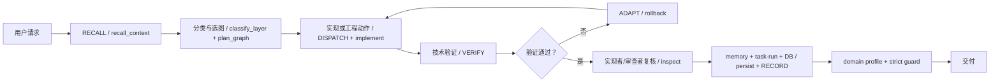

# AI 辅助硬件开发流程全量盘点（删减基线）

> 文档类型：`snapshot`
>
> 状态：`REVIEW_ONLY`。本文件只描述当前工作区实际存在的流程、入口、产物和重复关系，
> 不是新的强制规则。完成删减并形成新的单一真源后，本文件应归档或删除，不能继续成为第二套规范。
>
> 盘点日期：2026-07-31

## 1. 盘点目标与边界

本盘点服务于两个目的：

1. 保留真正保障 RV64 RTL、验证、综合、STA、Power/PPA 和系统事务正确性的技术门。
2. 找出与任务风险不匹配的环境治理动作、重复入口、重复证据和重复存储，供后续逐项删减。

盘点覆盖以下全部操作面：

- 只读问答、源码阅读、状态检查和证据回查；
- 架构设计、RTL 新功能、bug 修复、重构和接口变更；
- lint、编译、elaboration、testbench、断言、负向 RTL 版本、功能回归和 DiffTest；
- CPI/性能、综合、STA、面积、功耗和 Pareto 裁决；
- NEMU、AbstractMachine、am-kernels、NPC、ysyxSoC、Linux/Ubuntu、设备和显示；
- C/C++、Python、Shell、Make、Kconfig、Chisel 和工具链脚本；
- 长时间仿真、系统回放、soak、状态监视和 checker-only replay；
- 文档、记忆、task-run、数据库索引、profile、agent、skill 和 CI；
- 子 agent、独立复核、领域措辞、Git、发布、商业包和工作区清理；
- 外部资料查询、环境安装、回退恢复和破坏性文件操作。

不在本轮范围内：

- 不修改 production RTL、testbench、checker 或 PPA policy；
- 不删除或归档任何现有文件；
- 不改变断言、负向 RTL 版本、覆盖、功能门或 PPA hard gate；
- 不新增 profile、contract、数据库表或自动化脚本。

## 2. 当前流程总图

当前工作区同时维护一套六步调度循环、一套七状态环境 FSM、多套静态图模板和一套 e2e
publication 状态机。它们的主体阶段高度重合。



当前主要重叠：

| 表达 | 阶段 |
| --- | --- |
| 六步调度循环 | `RECALL → PLAN → DISPATCH → VERIFY → ADAPT → RECORD` |
| Agent 环境 FSM | `recall_context → classify_layer → plan_graph → implement → verify → inspect → persist` |
| regression-debug-loop | `reproduce → collect → localize → fix → rerun → record` |
| software-dev-loop | `scope → design → implement → test → smoke → regression → review-record` |
| e2e publication | `refresh → brief → resolve → nodes → report → index → archive → marker → publish` |

这五种表达不是五类独立技术活动，而是对同一开发闭环的不同展开。后续删减时可保留一个风险分级主流程，
专项流程只声明额外技术 gate。

## 3. 操作类型主清单

### 3.1 风险级别

| 级别 | 定义 | 典型操作 |
| --- | --- | --- |
| `R0` | 无工作区写入，结论可立即撤销 | 问答、源码解释、只读状态查看 |
| `R1` | 局部可逆写入，影响单模块或单工具 | 注释、小脚本、局部 RTL/TB、文档校正 |
| `R2` | 跨模块或会改变可执行语义 | 接口/时序/状态 owner、功能回归、工具行为 |
| `R3` | 长时、高成本、发布或难恢复 | 系统长跑、PPA promotion、删除、发布、外部写入 |

风险级别用于后续删减时决定流程强度；它不限制模型的源码探索、实现、反例、断言、覆盖或 PPA 能力。

### 3.2 全操作类型

| ID | 操作类型 | 工作区实例 | 技术最小闭环 | 当前额外治理动作 | 风险 |
| --- | --- | --- | --- | --- | --- |
| O01 | 问答/解释 | 解释 module、signal、pipeline、ISA 行为 | 读取直接相关源码/spec，给出可定位依据 | 全局必读链、DB brief、memory 更新规则可能被触发 | R0 |
| O02 | 只读源码追踪 | producer/consumer、调用链、数据流 | `rg`/源码阅读/必要引用点 | 图节点、task contract、独立复核可能被要求 | R0 |
| O03 | 状态/证据检查 | 查看 run 状态、PC、marker、SHA | 只读读取 canonical status/evidence | DB runs/evidence、trace/state/artifact audit | R0 |
| O04 | 架构/spec 设计 | OoO owner、lane、flush、memory order | 需求、接口、状态、时序、不变量和边界 | task-run、memory、doc lifecycle、review | R1/R2 |
| O05 | RTL 新功能 | 新 module、datapath、FSM、端口 | RTL 推导、实现、lint、focused TB、受影响回归 | 四段式全文、spec §2/§3、task-run、双 memory 更新、profile/guard | R2 |
| O06 | RTL bug 修复 | 修 owner、holder、terminal、recovery | 复现、根因、最小修复、定向反例、回归 | 与 O05 相同，另加 reviewer/negative evidence | R1/R2 |
| O07 | RTL 重构 | 拆 module、改名、移动 filelist | callers 清单、契约保持、编译、consumer 回归 | 文档归档、索引、task-run、profile/guard | R1/R2 |
| O08 | 接口/控制变更 | valid/ready、stall、flush、trap、访存序 | 冻结跨模块协议、同拍优先级、立即断言、负测 | 六类契约表、SPEC-TEMPLATE、contract gate、memory | R2 |
| O09 | RTL 风格/lint | Verilog-2001、可综合边界 | `check-rtl-style`、Verilator lint、Icarus compile | 通常仍被总流程要求 task-run/profile | R1 |
| O10 | focused testbench | 单 module、cycle-exact transaction | baseline、边界 case、返回码和 marker | evidence-index、task-run publication、DB archive | R1/R2 |
| O11 | 断言/负向 RTL 版本 | immediate assertion、compile-success mutation | 证明反例可达并被独立 oracle 检出 | 变异清单、hash binding、review receipt、ledger | R2 |
| O12 | 全量功能回归 | module inventory、official/privileged、AM | 同 design/config 的全量 pass inventory | profile/task-run/DB/strict guard 与业务证据并存 | R2 |
| O13 | DiffTest/reference | NEMU/QEMU reference 与 NPC target | 两侧同源输入、逐提交或明确比较点 | difftest profile 和硬件图记录 | R2 |
| O14 | 性能/CPI | cpu-tests、CoreMark、Dhrystone | 全量正确性、cycles/commits/CPI、代表样本 | completion definition、A/B 重复、task-run、memory | R2 |
| O15 | 逻辑综合 | Yosys/netlist | fresh source/config/filelist、成功日志、netlist SHA | yosys-sta profile、artifact/index/promotion 记录 | R2 |
| O16 | STA | OpenSTA/iSTA、SDC/lib/macro | timing tier、WNS/TNS、约束覆盖、fresh netlist | 双 fresh run、PPA bundle、review、publication | R2/R3 |
| O17 | Area/Power/PPA | logic/macro area、activity、Power、Pareto | 同 design-id、资格口径、hard-gate-first | 完整 cohort、archive/front/promotion checker、strict closure | R3 |
| O18 | NEMU/AM/am-kernels | reference、API、cpu-tests、benchmark | 模块构建、focused test、相关回归 | software-flow + domain profile + task-run | R1/R2 |
| O19 | NPC 仿真后端 | `npc/sim`、single、soc、rv64 | backend/config、lint/build/run、必要 DiffTest | 多级 profile include 和统一 publication | R1/R2 |
| O20 | ysyxSoC/Chisel | CPU ABI、地址图、生成 Verilog | spec、Mill/Chisel/Firtool、wrapper/lint | ysyx-soc + npc-soc + discovery profile 链 | R2 |
| O21 | Linux/Ubuntu bring-up | OpenSBI、kernel、DTB、initramfs/rootfs | QEMU reference、NPC 独立日志、分层 gate | rv64-linux 10 节点闭包、task-run、长跑状态 | R3 |
| O22 | Linux 设备 | UART、CLINT、PLIC、virtio、rootfs | register/queue/IRQ/DTB/driver/guest 证据 | linux-device 在 rv64-linux 上再加一层 profile | R2/R3 |
| O23 | Linux 显示/用户态 | fbcon/SDL、rv64gc/lp64d、动态链接器 | guest 写入、host scanout；或 FP/ABI/linker/shell 阶梯 | display-vga/verilator-tapeout profile 叠加 | R2/R3 |
| O24 | 长时间仿真/soak | Ubuntu/systemd、系统回放、长 benchmark | single-flight、显式 status、marker/hash/cleanup | task-run-status、轮询、全证据 publication、profile | R3 |
| O25 | checker-only replay | 冻结 console/dmesg/JSON 重放 | 保留原 FAIL，绑定输入 SHA，正负例和独立 receipt | 新 task-run、memory、profile/guard | R1/R2 |
| O26 | 软件/工具脚本 | C/C++/Python/Shell/Make/Kconfig | caller/contract、单测、consumer smoke | software-flow、hardware-aware-software-loop、记录 | R1/R2 |
| O27 | 文档/注释 | README、spec、plan、snapshot、index | 直接相关事实校正、引用有效 | 文档类型、状态迁移、归档手续、memory/task-run | R1 |
| O28 | AI 环境规则 | AGENTS、instruction、skill、agent、profile | 唯一真源修改和定向规则测试 | 三层 FSM、20 项 maintain、agent-system 11 节点、strict guard | R2 |
| O29 | 数据库/记忆 | brief、stored memory、task-run archive | 精确读写、避免整体覆盖、可恢复 | update-stored、snapshot、backup、多类 audit | R1/R2 |
| O30 | 子 agent/独立审查 | RTL 实现、验证、PPA、反例复核 | 清晰目标、必要路径、产物、成功条件 | 1,854 行 contract 工具的 create/validate/render、自测、dispatch hash | R1/R2 |
| O31 | 状态监视/等待 | 查看后台仿真、综合、系统回放 | 只读 PID/status/evidence，保持同一工程 lane | heartbeat/轮询记录，不能误判外层 timeout | R0/R3 |
| O32 | 工作区清理 | build、obj_dir、vvp、Xil、raw overlay | 精确目标、保护 tracked/dirty/evidence、可恢复隔离 | 冻结 plan、双角色审查、journal、task-run、全审计 | R3 |
| O33 | Git 操作 | diff、stage、commit、branch、push、PR | 明确变更范围；外部写入需用户授权 | branch-health、clean completion policy、review route | R0-R3 |
| O34 | CI/nightly | agent maintain、profile validation | 可重现环境和失败返回码 | rehydrate、maintain、重复 validate/delivery audit | R2 |
| O35 | 商业包/发布 | `package-ai-dev-env.sh`、delivery audit | 明确发布目标、文件清单、敏感路径检查 | 当前被日常 `agent-maintain --mode check` 无条件执行 | R3 |
| O36 | 外部资料/工具安装 | 官方规范、工具链、依赖安装 | 仅在本地资料不足或用户要求时使用，记录版本 | 当前没有独立轻量分流，容易被并入大图 | R1/R3 |
| O37 | 回退/恢复 | RTL 候选撤回、DB restore、runner cleanup | 保留用户已有改动，恢复精确对象并复验 | DB manifest、state traceback、失败 task-run | R2/R3 |
| O38 | 破坏性或外部状态变更 | 删除、强制 Git、发布、外部写入 | 精确目标、只读预检、显式授权、可恢复优先 | 与普通开发流程应分离，不应默认套到所有任务 | R3 |
| O39 | FPGA/数字逻辑/板级交互 | Vivado implementation/bitstream、NVBoard build/run、板级下载与 I/O 验证 | RTL/约束绑定 → elaboration/synthesis/implementation 或仿真构建 → bitstream/NVBoard/板级观测 → 时序、资源与 I/O 结果归档；失败后按精确产物恢复 | `nvboard`、`digital-logic` profile 与通用 task-run/guard/DB 发布叠加 | R2/R3 |

## 4. 当前治理动作清单

后续删减应优先对治理动作做裁决，而不是删除技术验证能力。

| ID | 当前治理动作 | 触发现状 | 主要产物/成本 | 初步删减方向 |
| --- | --- | --- | --- | --- |
| G01 | 全局必读链 | 几乎所有非平凡任务 | AGENTS、Copilot、project status、known issues、module memory、instructions | 改成任务路由后的最小必读集 |
| G02 | DB bounded brief | 所有非平凡任务优先 | 查询、focus 匹配、2400-token fail-closed | R0/R1 可选；R2/R3 或会话恢复时使用 |
| G03 | 静态图/动态图 | 所有复杂任务 | node/edge/owner/input/output/fallback/evidence | 仅跨模块、长链或并行任务显式建图 |
| G04 | task-run 目录 | 跨模块、图任务、长链；RTL 又额外要求 | report、dispatch、attempt、合同、状态、证据 | 普通局部任务不建；高风险/长跑保留 |
| G05 | project + module memory 双更新 | 当前要求每个任务完成后执行 | 读取大 stored 文档、整体替换、shim 刷新 | 只记录稳定可复用事实；不记录每轮流水账 |
| G06 | DB stored/backup/snapshot | memory/task-run 更新后 | DB、objects/files、三个 manifest、审计 | 批量/定时快照；不在每个开发切片执行 |
| G07 | domain e2e profile | 环境任务与 guard 建议 | 节点日志、report bundle、DB publication | profile 只验证 profile 所属机制变化 |
| G08 | raw evidence index | 每次 e2e report | 每文件 path/size/hash/摘要和大型 evidence-index.md | 改为 manifest + 分层摘要；避免逐文件 Markdown |
| G09 | completion publication | 每个 completed profile | marker、publication、staged DB、事务复核 | 只用于发布/长期基准，不用于普通测试 |
| G10 | 实现者/审查者双角色 | 每个非平凡交付 | 反例清单、冲突处置 | R0/R1 自审；R2/R3 或 promotion 才独立角色 |
| G11 | RTL 子 agent JSON contract | 所有本地 RV64 RTL 子任务 | create/validate/render、JSON、SHA、dispatch | 保留简洁任务边界；删除重复措辞和常规自测 |
| G12 | strict guard | 所有任务收尾 | changed path → profile → fresh published evidence | 默认 task-owned paths；全工作树仅 release/nightly |
| G13 | 文档生命周期全套 | 文档变化及大量 RTL 触发 | 分类、状态迁移、归档表、引用扫描 | 仅删除/改名/快照替换/机制判死时强制 |
| G14 | branch health | maintain 与政策要求 | branch、HEAD、upstream、dirty、矩阵、gate | CI/发布使用；不阻塞 dirty 工作树内局部交付 |
| G15 | commercial package | 当前 maintain check 无条件运行 | 重建 dist package + delivery audit | 从日常 check 移到 release/CI 专用命令 |
| G16 | 全 profile binding validation | maintain、CI 再次执行 | 40 profile 递归展开和函数绑定 | 仅 profile/runner 改动或 CI 执行 |
| G17 | Agent 环境全审计 | `agent-maintain --mode check` | 20 个步骤，含合同三套自测、package、DB/branch/profile | 拆成 targeted 与 release 两档 |
| G18 | 全工作树路径归因 | guard 无显式 path 时 | 扫描 HEAD、index、worktree、untracked | 默认使用本任务精确路径，避免混入他人修改 |
| G19 | scenario runtime isolation | NEMU/NPC profile | 进程扫描、stale 判定 | 只用于真实长跑/资源冲突，不用于纯合同检查 |
| G20 | RV64 专业措辞 | 主/子 agent 技术叙述 | module/signal/transaction/cycle/evidence 格式 | 保留一次正向领域限定；不建关键词黑名单 |
| G21 | fail-closed 长跑状态 | 长仿真/综合/STA/系统回放 | RUNNING/FAIL/PASS、stage/signal/cleanup | 必须保留，仅限长跑 |
| G22 | evidence identity/hash binding | promotion、checker replay、历史缺陷回填 | design-id、source/TB/tool/config/log hash | 保留在承重证据，不泛化到普通问答/小改 |

## 5. 技术流程与治理流程分离

### 5.1 建议始终保留的技术能力

- 先定位 root cause，再在正确抽象层修复；
- RTL 接口、状态 owner、时序、flush/stall/异常序/访存序契约；
- 可综合 RTL 与 simulation-only 代码边界；
- lint、elaboration、focused TB、断言和 compile-success 负向 RTL 版本；
- 修改影响范围内的功能回归、DiffTest 和系统 gate；
- 性能改动的全量正确性、cycles/commits/CPI 和代表 workload；
- PPA promotion 的同 design-id、timing hard gate、Area/Power 资格和 Pareto；
- 长跑的显式 evidence-complete、signal/cleanup fail-closed；
- 破坏性操作的精确目标、保护集、可恢复隔离和用户授权；
- 不篡改历史 FAIL，不用去重逻辑掩盖重复终端事务，不削弱断言。

### 5.2 可按风险降级的治理动作

- DB brief、显式图、task-run、memory 双更新；
- 独立 reviewer、subagent JSON contract；
- domain profile、completion publication、strict guard；
- branch health、商业包、全 profile validation；
- 全量文档生命周期和全环境 audit。

### 5.3 领域措辞的最小充分规则

本地 RV64 任务首句明确以下四项即可：

1. module/signal/transaction 或本地证据文件；
2. cycle/config/elaboration 范围；
3. testbench/仿真/综合/STA 观测；
4. PASS/GAP/inconclusive 边界。

真实 RTL 标识符、PMP、特权级、访问异常、内存保护、权限检查、store/cache probe、ROB、LSQ、
flush、redirect、trap 等术语保持原样。措辞层不使用关键词黑名单，也不删减源码、工具、反例、
负向 RTL 版本、断言、覆盖或 PPA 能力。外部资料访问与本地 RTL 工程动作分开描述；普通本地
RTL 开发默认不需要外部服务。

## 6. 40 个 e2e profile 全量目录

“展开节点”按当前 `@include` 递归关系计算；它反映一次 profile 运行至少会调度多少个节点，
不含 live-index-refresh 和 publication 步骤。

| Profile | 展开节点 | 当前用途 | 重叠/删减观察 |
| --- | ---: | --- | --- |
| `discovery` | 3 | 规则发现、工具、NPC backend 状态 | 多数 profile 都继承，导致局部合同检查也重复环境探测 |
| `agent-system` | 11 | 三层环境、artifact、FSM、review、RTL contract、status、商业包、profile index | 将日常环境检查与商业发布混在一起 |
| `contracts` | 25 | 全模块合同面 | 适合 CI，不适合普通任务收尾 |
| `github-index` | 1 | SQLite 索引能力 | 应只在 DB/index 实现变化时运行 |
| `quick` | 5 | discovery + NEMU config/add smoke | 名为 quick，但与非 NEMU 任务无关 |
| `ysyx-coordinator` | 4 | 总调度合同 | 可并入 agent-system 的定向检查或 CI |
| `hardware-flow` | 4 | 硬件流程合同 | 当前主要验证入口存在，不证明业务功能 |
| `software-flow` | 1 | 软件流程合同 | 合同型轻检查 |
| `abstract-machine` | 4 | discovery + AM 合同 | 合同检查 |
| `am-kernels` | 5 | abstract-machine + tests/benchmark 合同 | 合同检查 |
| `nemu` | 7 | AM 链 + NEMU config/reference/add | 含真实最小 smoke |
| `difftest` | 8 | nemu + DiffTest 合同 | 合同为主 |
| `reference` | 4 | discovery + AM/NEMU reference regression | 真实参考回归 |
| `full` | 4 | discovery + AM/NEMU full regression | 真实完整参考回归 |
| `nemu-ubuntu-focused` | 3 | software-flow + NEMU Ubuntu static/slice | canonical focused 基线 |
| `nemu-dev` | 3 | 仅 include `nemu-ubuntu-focused` | 与 `nemu-ubuntu` 展开相同，兼容 alias 候选 |
| `nemu-ubuntu` | 3 | 仅 include `nemu-ubuntu-focused` | 与 `nemu-dev` 展开相同，旧兼容入口 |
| `nemu-dev-gate` | 4 | nemu-dev + focused guest gate | 与 ubuntu gate 同函数族 |
| `nemu-ubuntu-gate` | 4 | nemu-ubuntu + focused guest gate | alias/兼容候选 |
| `nemu-dev-full-gate` | 4 | nemu-dev + full guest gate | 与 ubuntu full gate 同函数族 |
| `nemu-ubuntu-full-gate` | 4 | nemu-ubuntu + full guest gate | alias/兼容候选 |
| `nemu-dev-full-soak` | 4 | nemu-dev + full soak | 与 ubuntu full soak 同函数族 |
| `nemu-ubuntu-full-soak` | 4 | nemu-ubuntu + full soak | alias/兼容候选 |
| `nemu-ubuntu-profile` | 4 | focused + profile budget run | 专项性能诊断 |
| `nemu-ubuntu-integrated` | 13 | rv64-linux + focused NEMU | 明确跨栈长门 |
| `npc-sim` | 4 | discovery + NPC sim 合同 | 合同检查 |
| `npc-single` | 5 | npc-sim + single 合同 | 合同检查 |
| `npc-soc` | 5 | npc-sim + soc 合同 | 合同检查 |
| `npc` | 7 | AM/test 链 + NPC full cpu-tests | RV32 真实 target 回归 |
| `npc-dev` | 5 | software-flow + sim/single/soc/rv64 合同 | 主要是入口合同，不是 RV64 全功能回归 |
| `ysyx-soc` | 6 | npc-soc + ysyxSoC 合同 | SoC 集成合同 |
| `yosys-sta` | 7 | npc-single + synth/STA 合同与失败传播 | 合同/工具状态，不是每轮 PPA 数据 |
| `rv64-linux` | 10 | discovery + RV64/Linux focused gates | 长链业务 profile |
| `rv64-systemd-contract` | 1 | checker/terminal/rootfs 副本合同 | 精确窄 profile，合理 |
| `linux-device` | 11 | rv64-linux + device 合同 | 继承整个 Linux 闭包，偏重 |
| `display-vga` | 11 | rv64-linux + display 合同 | 继承整个 Linux 闭包，偏重 |
| `verilator-tapeout` | 11 | rv64-linux + realism/PPA 合同 | 合同与完整 Linux 闭包耦合 |
| `nvboard` | 4 | discovery + NVBoard 合同 | 合同检查 |
| `digital-logic` | 5 | nvboard + 数字逻辑合同 | 合同检查 |
| `fceux-am` | 6 | am-kernels + FCEUX 合同 | 合同检查 |

Profile 总结：

- 40 个入口中，大量 profile 只验证文件/入口/合同存在，不验证本轮 RTL 语义。
- `discovery` 被广泛继承，使局部 profile 重复运行工具和 backend 状态探测。
- NEMU 有三组 dev/ubuntu 成对入口，展开或函数族高度重叠。
- `agent-system` 把三层合同、RTL 子任务工具、长跑状态、商业交付和 profile 索引绑定为一次 11 节点运行。
- `linux-device`、`display-vga`、`verilator-tapeout` 为增加一个合同节点而继承完整 10 节点 `rv64-linux`。

## 7. 单次 e2e 运行的固定产物

每次正式 profile 会先刷新 live 索引，再创建新的 task-run。completed run 至少生成：

1. `context-brief.md`
2. `profile-resolve.md`
3. `nodes.tsv`
4. `dispatch-log.md`
5. `task-report.md`
6. `run-manifest.json`
7. `evidence-index.md`
8. `complete.marker`
9. `completion-publication.md`
10. `evidence/context-live-index-refresh.log`
11. 每个展开节点至少一个 `evidence/<node_id>.log`

随后还会执行：

```text
sanitize text
 -> render manifest
 -> index every ordinary evidence file
 -> validate evidence index
 -> validate recall/resolve/bundle
 -> write marker
 -> archive staged Markdown to SQLite
 -> validate staged DB
 -> write publication
 -> validate publication
 -> publish task-run in one SQLite transaction
```

因此 `agent-system` 的 11 个节点，即使全部是环境合同检查，也至少产生 9 个根层文件、
12 个 evidence log 和多轮 DB 读写。该链适合可审计发布，不适合作为每次普通 RTL 修改的默认收尾。

## 8. 数据库操作类型

当前 `github_index_db.py` 对外暴露的操作可归为四组。

### 8.1 读取与召回

- `stat`
- `query/search`
- `summary/compact`
- `ls/tree/show/load`
- `brief/context/context-pack`
- `profiles/profile-catalog/list-profiles`
- `resolve-profile/profile/profile-resolve`
- `runs/task-runs/run-catalog`
- `evidence/evidence-assets/asset-index`
- `usage/used/access-log`
- `api`

### 8.2 索引维护

- `init`
- `rebuild/build/update`
- `doctor`
- `refresh`
- `add`
- `remove/rm`
- `smoke`

### 8.3 retained 文档与证据生命周期

- `promote`
- `update-stored`
- `backup`
- `snapshot-stored`
- `migrate`
- `archive-markdown`
- `publish-task-run`
- `index-evidence/evidence-index/archive-evidence`
- `materialize`
- `restore`
- `rehydrate/import-backup`

### 8.4 审计

- `audit-db-first`
- `audit-markdown-coverage`
- `skill-audit`
- `policy-audit`
- `report-audit`
- `schema-audit`
- `artifact-audit/runtime-artifact-audit`
- `delivery-audit/commercial-delivery-audit`
- `branch-health-report/branch-report/health-dashboard`
- `branch-health-audit/branch-audit`
- `trace-audit/observability-audit`
- `state-audit/state-machine-audit/reviewer-inspector-audit`

当前问题不是缺少能力，而是这些能力被日常任务过度串联。

## 9. `agent-maintain --mode check` 的真实内容

脚本把 `check` 描述为“轻量维护 gate”，但实际串行执行约 20 个步骤：

1. 四个 Shell 脚本语法检查；
2. report、schema、artifact 审计；
3. **商业包构建**；
4. delivery、policy、skill 审计；
5. RTL task contract audit/self-test/CLI self-test；
6. task-run-status fail-closed 单测；
7. trace、state 审计；
8. branch-health report/audit；
9. DB-first、Markdown coverage；
10. profile list、40 个 profile binding validation。

`full` 模式再追加一次 11 节点 `agent-system` profile。

CI 中又在 `agent-maintain --mode check` 后重复执行：

- `scripts/agent-e2e.sh --validate-all-profiles`
- `python3 scripts/github_index_db.py delivery-audit`

这两项已经包含在 maintain check 中，属于明确重复。

## 10. 当前空间与索引规模

以下数字来自 2026-07-31 工作区只读盘点。

| 对象 | 当前规模 | 观察 |
| --- | ---: | --- |
| active AI 环境源码/规则 | 约 36,647 行 | 其中核心 Python/Shell 自动化约 28,224 行 |
| agents/instructions/skills/e2e/ai-env 等 active 文件 | 131 个以上 | 不含业务 RTL/PPA checker |
| e2e profile | 40 个 | 多个 alias 和层层 include |
| `.github/task-runs` 目录 | 2,133 个 | 持续单向增长 |
| `.github/task-runs` 文件 | 111,856 个 | 其中 evidence 89,984 个 |
| `.github/task-runs` 实占 | 约 31 GiB | 表观约 3.2 TiB |
| sparse `rootfs-overlay.raw` | 423 个 | 实占约 7.6 GiB，表观约 3.2 TiB |
| Git tracked task-run 文件 | 21,528 个，约 2.0 GiB | 历史 ignore 规则不能移除已 tracked 生成物 |
| tracked `.vvp` | 902 个，约 1.3 GiB | 编译产物不应长期进入 Git |
| tracked `obj_dir` 文件 | 392 个，约 316 MiB | Verilator 二级产物 |
| tracked task-run `.log` | 6,490 个，约 162 MiB | 与 bounded evidence 目标冲突 |
| ignored task-run 文件 | 89,767 个，约 29 GiB | 留在工作区，仍消耗扫描和备份成本 |
| `.github/cache` | 约 2.2 GiB | SQLite 主库约 1.995 GiB |
| SQLite `files` | 17,813 行 | 其中 task-run 11,621 行 |
| SQLite `file_chunks` | 150,701 行 | FTS/摘要产生额外副本 |
| SQLite `db_documents` | 8,172 行 | task-run 报告/日志占绝大多数 |
| SQLite `db_document_chunks` | 137,136 行 | stored 文档再次切块 |
| SQLite `evidence_assets` | 66,528 行 | 每个 raw evidence 都有摘要字段 |
| SQLite `access_log` / `events` | 34,629 / 18,987 行 | 自身也持续增长 |
| `.github/db-backup` | 约 436 MiB | DB-owned 文档和 manifest 的额外保留层 |

SQLite 中用 `length(text)` 直接计数的文本规模（单位为字符数，不与 UTF-8 文件字节数混用）：

- `file_text.content`：约 2.79 亿字符；
- `file_chunks.text + summary`：约 1.06 亿字符；
- `db_documents.content`：约 0.69 亿字符；
- `db_document_chunks.text + summary`：约 0.99 亿字符；
- `evidence_assets` 摘要/头尾/marker：约 0.69 亿字符。

FTS 结构和重复切块使最终数据库接近 2 GiB。大型 `evidence-index.md` 单文件已达到约
1.9 MB；它们又作为 stored document 被切块和索引。

## 11. 已发现的结构性重复与矛盾

| ID | 现象 | 直接后果 |
| --- | --- | --- |
| X01 | 六步循环、七状态 FSM、静态图、专项 loop 重复表达相同阶段 | 每次任务需要重复记录同一状态 |
| X02 | memory 协议要求每个任务更新 project + module，且“只追加不删除” | 大文档增长、整体替换风险、每轮 DB 写回 |
| X03 | task-run 被定义为天然归档态，但 raw evidence 长期留在 live 工作区 | 31 GiB 空间与 11 万文件扫描面 |
| X04 | policy 声明大产物 externalized，但 task-run 内仍有 423 个 raw overlay | 规则与实际 retention 不一致 |
| X05 | `.gitignore` 已忽略重型产物，但历史 Git 仍 tracked 902 个 `.vvp` 和 obj_dir | clone、status、索引和备份持续负担 |
| X06 | evidence 被逐文件写入 Markdown、SQLite asset、chunk 和 FTS | 同一事实多份表示 |
| X07 | `agent-maintain check` 包含商业包和全 profile validation | 环境维护成本侵入普通 RTL 开发 |
| X08 | CI 在 maintain 后重复 validate-all-profiles 和 delivery-audit | 明确重复运行 |
| X09 | strict guard 默认枚举整个 dirty worktree | 当前任务被无关模块修改要求额外 profile |
| X10 | branch policy 同时允许 dirty iteration 又要求 clean 才能 completion claim | 多任务共享工作树中难以满足 |
| X11 | agent-system 单次运行同时检查三层、RTL contract、长跑 status 和商业发布 | 无法按改动范围做最小验证 |
| X12 | NEMU dev/ubuntu 多组 profile 展开高度重叠 | 入口选择成本和维护漂移 |
| X13 | Linux 专项合同为一个节点，却继承完整 rv64-linux 10 节点闭包 | 小改也可能触发系统级长链 |
| X14 | 只读 reviewer 也可能要求 contract、task-run、review、profile 和 guard | 行政成本可超过技术分析 |
| X15 | 领域措辞在多个入口重复说明 | 正确原则被复制成大量提示文本 |
| X16 | task-run 内保存 memory-staging/record-staging 副本并进入 DB archive | 稳定事实、临时副本和单次证据再次重复 |

## 12. 供删减使用的候选清单

本节只给出删减候选，不表示已经授权执行。

| 优先级 | 候选动作 | 保留能力 | 预期收益 |
| --- | --- | --- | --- |
| P0 | 规定默认轻量、标准、严格三档；R0/R1 不再自动升级到严格闭环 | 所有技术工具和验证能力 | 立即降低每轮流程税 |
| P0 | 普通局部任务不创建 task-run、不更新两份 memory、不跑 profile | 局部 diff + 定向验证 | 减少小任务写放大 |
| P0 | strict guard 默认只消费 task-owned paths | release/nightly 仍可全树扫描 | 消除 mixed-origin 假阻塞 |
| P0 | 从日常 maintain 移出商业包、delivery、branch dashboard、全 profile validation | release/CI 专门运行 | 缩短环境自检 |
| P0 | CI 删除 maintain 已覆盖的两项重复命令 | CI gate 不变 | 直接去重 |
| P1 | task-run 只保留 bounded report、manifest、关键 marker/hash；raw payload 移出 live tree | 可审计指针和内容寻址 | 回收主要空间和扫描成本 |
| P1 | 将 tracked `.vvp`、`obj_dir`、大 log 按普通 Git 迁移计划移出历史 active surface | 保留必要源、摘要、hash | 减少约 2 GiB tracked 负担 |
| P1 | 处理 423 个 sparse overlay：只留模板/输入/output hash 和少量 canonical 样本 | 系统事务可重放性 | 回收量上限约 7.6 GiB 实占；实际值需扣除保留样本 |
| P1 | evidence-index 改成分层汇总，不为每个编译临时文件生成 Markdown 行 | DB evidence table 或压缩 manifest | 显著降低 DB/Markdown 体积 |
| P1 | DB 不全文/FTS 索引历史 task-run staging 副本和超大 evidence-index | memory 与 run catalog 仍可查询 | SQLite 从接近 2 GiB 缩小 |
| P2 | project-status 只保留当前状态/近期里程碑，历史转 immutable archive；module memory 允许压缩 | 稳定事实可发现 | 消除只增不减 |
| P2 | 合并六步循环与七状态 FSM，只保留一套主状态 | 失败回退和完成边界 | 减少重复记录 |
| P2 | 合并 NEMU dev/ubuntu alias profile；为合同检查与真实 gate 分开命名 | 场景隔离能力 | 减少入口和 include 漂移 |
| P2 | 将 discovery 从所有 profile 的强制 include 改为会话/环境变化时缓存一次 | 工具变化时仍可重跑 | 避免每 profile 重复探测 |
| P2 | 将 `agent-system` 拆成 targeted checks 与 release checks | 三层、status、delivery 能力均保留 | 改一层只验一层 |
| P2 | 简化 RTL 子 agent 合同为一个短任务 envelope；仅 R2/R3 写 JSON/SHA | 路径、写权限、产物和成功条件 | 保留能力，减少 create/render 仪式 |
| P2 | R0/R1 使用实现者自审；R2/R3、promotion、删除、发布才用独立 reviewer | 关键反例复核 | 减少普通任务等待 |
| P3 | 合并 AGENTS/Copilot/AI_ENVIRONMENT/skill 中重复段落，shim 只保留链接和真正最低合同 | 自动发现 | 降低上下文和漂移 |
| P3 | doc lifecycle 只对删除、改名、snapshot 替换、机制判死强制；普通小改只校正直接文档 | 引用和归档正确性 | 避免所有改动触发全套手续 |
| P3 | access_log/events 设置 retention/滚动压缩 | 最近使用可观测性 | 阻止 DB 自身无限增长 |

## 13. 建议的新主流程骨架（仅供下一轮裁决）

### 轻量 `R0/R1`

```text
任务相关读取 → 实施或回答 → 一条定向验证/依据 → 自审 → 交付
```

- 不默认建图；
- 不默认 task-run；
- 不默认 memory；
- 不默认 profile/strict guard；
- 不禁止按需使用任何源码、工具、反例或测试。

### 标准 `R1/R2`

```text
相关 recall → root cause/设计边界 → 实施 → focused test → 受影响回归 → 自审/必要 reviewer → 交付
```

- 只有产生稳定可复用事实时更新一份相关 module memory；
- 只有跨模块、长链或需要 handoff 时创建简化 task-run；
- guard 使用本任务精确 changed paths。

### 严格 `R3`

```text
冻结输入/设计身份 → 图/合同 → 实施 → 分层 hard gates → 独立复核
→ 内容寻址证据 → publication/promotion → 全树或 release guard
```

适用于：

- architecture/PPA promotion；
- 完整 Linux/Ubuntu 系统结论；
- 长时间仿真/综合/STA/soak；
- 破坏性清理；
- 数据库 schema/证据 publication 语义变化；
- CI、release、商业包和外部写入。

## 14. 下一轮删减的裁决顺序

建议用户按以下顺序逐项选择，避免同时拆坏技术闭环：

1. 先裁决“哪些任务需要严格档”，其余默认降级。
2. 再裁决 task-run/raw evidence/DB 的保留边界。
3. 再裁决 maintain、CI、commercial delivery 的运行位置。
4. 再合并 profile alias 和重复 include。
5. 再压缩 AGENTS/instructions/skills 中的重复文本。
6. 最后迁移或清理历史 tracked/ignored 生成物。

任何删减都应满足：

- 不削弱 RTL 功能、断言、负向版本、覆盖、DiffTest、综合、STA、Power/PPA 能力；
- 不改写历史 PASS/FAIL/TERM；
- 不把删除治理产物误写成业务 gate 已通过；
- 对删除/迁移先生成精确对象清单和可恢复方案；
- 新流程自身的常规开销应显著小于被服务的技术开发工作。

## 15. 2026-07-31 已选实施方向

本盘点之后采用 `.github/instructions/agent-lightweight-workflow.instructions.md` 与
`scripts/agent-flow.c`：

- 九类任务先分类，read-only review/analysis 默认零门禁；
- 修改路径来自 C 的显式 log，不再用 Git 枚举整个工作树；
- 门禁只在一轮目标达到确定性交付点时运行；流程占用约 40% 作为非阻断复盘目标，不设精确时间门禁；
- gate 以固定 ID 指针管理，stdout/stderr 落 runtime-artifacts，AI 默认只读 summary；
- task-run 不删除，而是分成 none/compact/durable：保留结果、修改目录、验证指针、结构化工程
  决策轨迹和 bounded 日志；
- `agent-maintain` 分成 quick/final/release/full，商业包、branch-health、DB coverage 移到 release；
- CI 的 PR 路径只跑 final，nightly/manual 路径跑 release，不再重复独立 profile validation 和
  delivery audit。

该实施方向只削减 AI 环境治理重复项，不削弱 RTL 功能验证、断言、覆盖、DiffTest、综合、STA 或
PPA hard gate。
