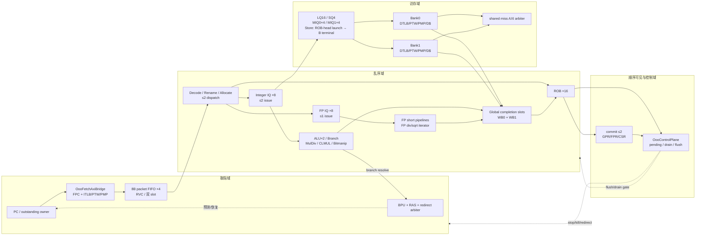

# 第 1 章：全局拓扑与一条指令的一生

## 1.1 从最外层开始：谁包着谁

仿真时的层次是：

```text
NpcSimTop                     仿真壳、DPI PMEM、VirtIO、checker、统计
└── NpcTop                    两主设备 AXI 总线与片上设备
    ├── NpcCoreTop            Core 边界
    │   ├── OooFetchAxiBridge IFU/MMU/FPC
    │   ├── OooDualMemBridgeWrapper
    │   ├── OooLsuAxiLaneAdapter
    │   ├── OooCoreTopGlue    前端/乱序后端/控制/退休
    │   └── CsrFile
    └── NpcAxiBus/AxiXbar     地址译码和设备路由
```

【RTL 事实】当前 `NpcCoreTop` 已启用双数据 bridge。旧 filelist 注释不能覆盖这一实例事实。

## 1.2 Core 的逻辑框图



箭头代表 transaction 或控制依赖，不代表每条线都在一个周期内组合直通。

## 1.3 结构容量

容量真源主要在
[`define.v`](../../../npc/rv64/vsrc/include/define.v)：

| 结构 | 当前默认值 | 意义 |
| --- | ---: | --- |
| XLEN | 64 | GPR、PC、主数据通路宽度 |
| Integer PRF | 64 | 32 个架构寄存器之外提供重命名空间 |
| FP PRF | 64 | 独立 FP 重命名空间 |
| ROB | 16 | 最多 16 个未退休 producer |
| Integer IQ | 8 | 整数/branch/memory uop 等待区 |
| FP IQ | 8 | FP arithmetic 等待区 |
| Fetch packet FIFO | 4 packet | 每 packet 8B，保存最多两条解压后指令 |
| LQ | 16 | retire-resident load 顺序/重放状态 |
| SQ | 4 | store allocate/probe、SQ/ROB-head launch 与 terminal release |
| MIQ | 2 × 4 | 两个 memory bank 的在飞请求队列 |
| RAS | 32 | call/return 预测栈 |

容量不能只改数组深度。ROB index、count、debug 端口、ProducerId、free count 和各类
比较器位宽都必须一致，所以默认值被集中成宏。

容量宏之外还有一个直接改变控制拓扑的产品开关：

| 配置 | 当前产品值 | 当前生效路径 |
| --- | ---: | --- |
| `OOO_CSR_QUEUE_HEAD` | 1 | 合法非 FP head0 CSR 单发进入 ROB，在队头等待 `mem_idle` 后 C0 提交；lane1/FP CSR 与非 CSR SYSTEM/trap 仍走 pending/full-drain |

产品值的真源是
[`configs/product-rtl-defaults.mk`](../../../npc/rv64/configs/product-rtl-defaults.mk)，
[`define.v`](../../../npc/rv64/vsrc/include/define.v) 的 fallback 同步为 `1'b1`。
显式设为 0 只表示比较/恢复配置，不能再用来描述当前默认 Core。这个 split-domain
会在第 7、8 章分别从退休时序与控制 owner 两个角度展开。

## 1.4 普通整数指令的一生

以 `add x5, x1, x2` 为例。

### Cfetch：PC 与 fetch transaction

`OooFetchPcOutstandingSequencer` 保存 `next_fetch_pc` 和最多一个 outstanding fetch。
请求被 `OooFetchAxiBridge` 接收后，先查 fetch packet cache/ITLB/PMP；miss 时可能进入
PTW 或外部 IFU AXI。

### Cpacket：packet 入队

返回的是 8B packet，不是“一条 32 bit 指令”。前端根据 PC 半字位置、RVC 长度和 packet
边界形成 slot0/slot1；结果进入四深度 FIFO。响应到达不代表立即 dispatch，因为后端可能
反压。

### Cdispatch：译码、重命名和分配

两条可见 slot 经过 head classify 和 dispatch gate。对 `add`：

- `x1/x2` 通过 rename map 变成源物理寄存器；
- `x5` 从 free list 分配新物理寄存器；
- RAT 把架构 `x5` 指向新物理寄存器；
- busy table 标记新目的未完成；
- ROB 保存 PC、instruction、目的新旧物理寄存器和异常/控制事实；
- IQ 保存操作类型、源 tag/ready 和 ProducerId。

这些分配必须是原子的：不能 ROB 成功但 free list 没扣，或 lane0 成功而 lane1 仍使用
错误的 edge-old RAT 视图。

### Cissue：oldest-ready 选择

当两个源都 ready，Integer IQ 允许该 uop 竞争两个 issue lane。选择不是简单“低 index
优先”，还要遵守年龄、执行资源、memory bank 和同周期双发射冲突。

### Cexecute：结果产生

源操作数从 PRF/旁路网络取得。普通 ADD 进入 ALU；结果和 ProducerId 在执行级寄存器中
打拍。分支、MulDiv、CLMUL、memory、FP 的延迟不同，所以从这里开始各条指令的周期不再
整齐。

### Ccomplete：完成但尚未退休

结果竞争两个全局 completion slot。获准后：

- 对应 PRF 获得结果；
- busy/wakeup 使依赖 uop 可发射；
- ROB entry 的 done/exception/result facts 更新。

此时软件仍看不到 `x5` 的新值，因为更老指令可能尚未完成。

这里描述的是普通整数 formal completion。整数 `early_wakeup` 只更新 IQ sticky-ready，
不写 PRF/Busy/ROB；FP raw result 也可能先写 FP PRF并进入 done FIFO，之后才 formal-WB
到 ROB。第 3、5、7 章会分别展开这些边界。

### Ccommit：按程序顺序可见

只有当它到达 ROB head 且已完成、没有被更老异常压制时，才退休：

- 架构 GPR `x5` 更新；
- 旧物理寄存器归还 free list；
- `instret` 增加；
- commit trace/DiffTest 获得架构事件。

## 1.5 为什么“乱序完成、顺序退休”

考虑：

```asm
div x5, x1, x2   # 老，长延迟
add x6, x3, x4   # 年轻，短延迟
```

ADD 可以先完成并写物理寄存器，让更年轻的依赖者继续执行；但它不能先更新架构状态。
如果 DIV 最终产生异常或被更老 trap 影响，ROB 必须能取消 ADD 以及所有 younger 事务。

```wavedrom
{
  "signal": [
    {"name": "clk",                    "wave": "p........."},
    {"name": "DIV issue · older",      "wave": "010......."},
    {"name": "ADD issue · younger",    "wave": "0.10......"},
    {"name": "ADD formal-WB · young",  "wave": "0..10....."},
    {"name": "DIV formal-WB · old",    "wave": "0.....10.."},
    {"name": "commit0 · DIV older",    "wave": "0......10."},
    {"name": "commit1 · ADD younger",  "wave": "0......10."}
  ],
  "head": {"text": "程序序 DIV(older) → ADD(younger)：ADD 可先 formal-WB，但只能等 DIV 后以 commit1 同拍退休"},
  "foot": {"text": "commit0 永远携带 older DIV；commit1 只有在 commit0 有效且两项均无阻断异常时才携带 younger ADD"}
}
```

按下面四步读图：

1. **先定程序序。** DIV 比 ADD 老，因此它占 ROB head/commit0；ADD 即使先算完，也只能
   位于 commit1。
2. **再看“完成”。** ADD 的 formal-WB 先把自身 ROB entry 置为 done，并可让依赖者从
   PRF/forwarding 继续执行；这一步没有更新架构 GPR。
3. **等待阻塞者。** 老 DIV 的 formal-WB 到达后，ROB 要到下一周期才能从 edge-old
   `done_q` 看到它已经完成，不存在 WB→commit 同拍旁路。
4. **最后按序双退休。** 下一窗口 commit0 输出 DIV，只有 commit0 合法、两项均无异常且
   control gate 允许时，commit1 才同时输出 ADD。两根 commit 信号同拍为高表示“双退休”，
   不表示 ADD 越过 DIV。

## 1.6 访存为什么多出 LQ/SQ/MIQ

计算指令的结果通常只需“写哪个 PRF”。访存还要回答：

- 地址是否翻译成功；
- PMP/PMA 是否允许；
- load 是否能绕过老 store；
- store 何时才可以对 cache/总线可见；
- request 已离开 IQ 后由谁保存 ProducerId；
- flush 后晚到的 response 是否仍属于活事务；
- 两个 bank 的请求如何并行、冲突时谁更老；
- cache miss、PTW、A/D update、MMIO 是否共享总线。

所以：

- **SQ** 保存 store，执行时形成地址/数据并参与 forwarding；只有到达 SQ head 且匹配
  ROB head、获得 launch-open 后才发物理写，B terminal 后才释放；
- **LQ** 保存 load 的顺序和 replay/retire residency；
- **MIQ** 在 issue 与 bridge 之间保存已选 bank 的在飞请求；
- **bridge station/FSM** 保存翻译、cache 或 AXI transaction；
- **owner tracker/terminal collector** 判断一个 memory producer 是否真的没有任何引用者。

## 1.7 两个控制世界

### 域 A：可投机乱序

普通整数、FP、branch、load/store/AMO 都进入 ROB。branch 在 issue 时解析；错预测由
redirect arbiter 选择恢复点，并通过 ROB walk 取消更年轻 transaction。

### 域 B：串行化 pending

CSR、ECALL、xRET、WFI、SFENCE、FENCE.I、FENCE、IRQ、前端 fault 等不能仅当作普通
ALU uop。它们在前端/ROB head 被捕获为唯一 pending owner，然后：

```text
capture -> stop frontend -> drain ROB/IQ/execute/memory owner
        -> apply CSR/trap/xRET/fence action -> redirect/flush -> clear owner -> restart
```

“drain ROB 为空”还不够：older memory request 可能已经离开 ROB/IQ，仍住在 MIQ、
bridge、SQ drain 或 terminal collector 中。因此 current control plane 使用
`mem_owner_terminalized` 作为 exact terminal 边界。

## 1.8 本章检查点

读完后应能解释：

1. 为什么不能把这颗 Core 简化成固定 N 级流水；
2. completion 和 commit 的区别；
3. ROB、PRF、IQ 分别解决什么问题；
4. 为什么 store 不能在 execute 后立刻写总线；
5. branch recovery 与 SYSTEM/trap drain 为什么不是同一机制；
6. 双 memory bank 为什么不等于双外部 AXI miss 端口。

下一章从 PC 开始，逐拍展开 fetch packet、RVC、预测、FIFO 和 dispatch。
