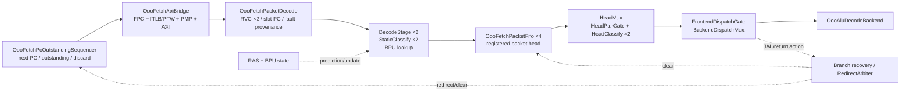

# 第 2 章：前端——取指、预测与双槽派发

## 2.1 本章目标

学完应能沿着真实边沿解释：

```text
PC -> fetch request -> FPC/ITLB/PTW/PMP/AXI
   -> 8B packet response -> RVC/双槽/static facts/BPU
   -> 4-entry packet FIFO -> head-time classify
   -> dual dispatch 或 barrier/pending
```

同时理解 branch/JAL/JALR、RAS、redirect、outstanding 和晚到 response 的关系。

## 2.2 前端真实层次



当前没有 response→dispatch 组合 bypass。packet response 必须在时钟沿写入 FIFO 的
registered head，下一阶段才从 head 分类/派发。

## 2.3 C0：发出 fetch request

`OooFetchFlowControl` 根据：

- FIFO 当前 count；
- outstanding request；
- response 是否会占用 entry；
- stop/redirect/flush；

判断能否发新请求。它使用 `fifo_count + outstanding < depth` 预留 response credit，
避免请求已经在路上、回来时 FIFO 却没有空间。

当：

```text
fetch_req_valid_o && fetch_req_ready_i
```

为真，`OooFetchPcOutstandingSequencer` 记录 outstanding；`OooFetchAxiBridge`
接受 PC 并进入 fetch transaction。

cache hit 的 response 可在下一周期完成 H1；若 FIFO credit 仍在，同一个 H1 边沿还可以
接受 successor request。这个 turnover 不等于 response→dispatch bypass：新 packet 仍在
该边沿写入 registered FIFO head，后续周期才派发。

## 2.4 `OooFetchAxiBridge` 的 fast/slow path

Bridge 内部有：

- `OooFetchPacketCache`；
- `OooSv39Tlb`；
- 多个 `PmpChecker`；
- PTW owner；
- exact 2B instruction frontier；
- A-bit update write transaction；
- response skid/owner；
- IFU AXI channel FSM。

### Fast path

FPC 与 ITLB/PMP 条件允许时，下一拍可形成 cache hit response。fast path 被保守 deny
只意味着回退 exact slow path，不应直接制造 access fault。

### Slow path

TLB miss、FPC miss、跨 packet 半字或权限检查需要通过：

```text
canonical VA -> ITLB/PTW -> final PA -> PMP
             -> 2B AR/R frontier -> packet assemble -> response
```

instruction AXI read 使用 `ARPROT=3'b100` 标记 instruction，`ARSIZE=3'd1` 表示
2 byte。PTW 访问 PTE 则是 data 属性和 8 byte。

逐 2B 读取的意义是：如果 packet 后半段越过 PMEM/PMP/page 边界，fault PC/tval 必须指向
真正失败的 halfword，而不是把整 8B 粗暴当成一个访问。

## 2.5 C1：response packet 怎样形成两个 slot

`OooFetchPacketDecode` 输入 8B data、owner PC 和逐 segment response/fault facts，输出：

- slot0 instruction/PC/length；
- slot1 instruction/PC/length；
- `slot1_valid`；
- next sequential PC；
- branch immediate/target facts；
- 每槽 fault cause/tval/provenance。

它例化两个 `OooRvcDecompressor`。

### RVC 长度组合

一个 packet 可能包含：

| slot0 | slot1 | 典型消耗 |
| --- | --- | --- |
| 16-bit C | 16-bit C | 4 byte |
| 16-bit C | 32-bit | 6 byte |
| 32-bit | 16-bit C | 6 byte |
| 32-bit | 32-bit | 8 byte |

PC 也可能从 packet 中间 halfword 开始，因此 response frontier 不是永远固定取 8B。

如果 slot0 已 fault，slot1 必须被净化/压制，不能让垃圾 instruction 产生 CSR、store、
branch 或 exit side effect。

```wavedrom
{
  "signal": [
    {"name": "clk",          "wave": "p......."},
    {"name": "packet rsp",   "wave": "010....."},
    {"name": "halfword0",    "wave": "x=x.....", "data": ["C.ADDI"]},
    {"name": "halfword1/2",  "wave": "x=x.....", "data": ["32-bit ADD"]},
    {"name": "slot0 valid",  "wave": "010....."},
    {"name": "slot0 len",    "wave": "x=x.....", "data": ["2B"]},
    {"name": "slot1 valid",  "wave": "010....."},
    {"name": "slot1 len",    "wave": "x=x.....", "data": ["4B"]},
    {"name": "next PC",      "wave": "x=x.....", "data": ["PC+6"]}
  ],
  "head": {"text": "RVC packet：16-bit slot0 + 32-bit slot1，共消耗 6B"}
}
```

## 2.6 response-time 静态事实

同一个 response 周期还进行：

- `DecodeStage ×2`：整数/控制预译码；
- `OooFetchStaticClassify ×2`；
- 每个 StaticClassify 内的 `OooFpDecode`；
- `OooBranchDirectionPredictor` lookup；
- branch target helper。

`OooFetchStaticClassify` 只保存不依赖当前特权状态的 18-bit facts，例如 FP 类别、
raw double、是否使用 dynamic rounding、semihost signature。它不读取当前 FS/frm/privilege。

这样 packet 在 FIFO 等待期间，即使 privilege/CSR 状态变化，head 阶段仍会用**当前**
状态重新作合法性判断。

## 2.7 Fetch packet FIFO

`OooFetchPacketFifo` 是 4-entry packet ring。每个 entry 原子保存：

- 两个 slot 的 instruction/PC/length；
- `slot1_valid`；
- response/fault provenance；
- prediction snapshot；
- integer predecode；
- static FP facts。

它不是“8 个独立 instruction slot”。不能从 entry 中只 pop slot0、却不保存 slot1
重组状态；相关选择由 head mux/flow control 统一处理。

### empty enqueue

empty 时 response fire 会在沿上把 packet 写入 `head_packet_q`；没有组合 bypass。

### full backpressure

当前不做 full+pop look-through。FIFO full 的周期即使 head 将 pop，也不会组合地同时允许
一个未预留 response 越过容量规则。

### clear

redirect/flush 清 occupancy、pointer 和 head valid；payload bit 可以保持脏值，但所有
消费者必须由 valid 门控。

```wavedrom
{
  "signal": [
    {"name": "clk",             "wave": "p......."},
    {"name": "response fire",   "wave": "010....."},
    {"name": "FIFO empty",      "wave": "10......"},
    {"name": "head_valid_q",    "wave": "0.1....."},
    {"name": "head packet",     "wave": "x.=.....", "data": ["P"]},
    {"name": "head classify",   "wave": "0.1....."},
    {"name": "dispatch fire",   "wave": "0..10..."}
  ],
  "head": {"text": "response 在沿上写 FIFO，registered head 后续才派发"}
}
```

## 2.8 head-time 分类

`OooFetchPacketHeadMux` 只把 registered FIFO head映射出来，没有 response bypass arm。

`OooFetchHeadPairGate` 例化两个 `OooFetchHeadClassifyGate`，结合：

- 当前 privilege；
- `mstatus.FS/TVM/TW/TSR`；
- 当前 `frm`；
- CSR legality probe；
- fetch fault；
- decoder illegal；
- packet 中保存的 static facts；

形成 head0/head1 的 42-bit facts。

它会处理：

- FS off 的 FP illegal；
- dynamic rm 使用 reserved `frm`；
- `sfence.vma` under TVM；
- `sret` under TSR；
- WFI privilege/TW；
- ECALL/EBREAK/semihost；
- branch/jump/memory/system/FP；
- architectural trap/exit。

response-time facts 与 head-time facts 分层，是 precise state 的关键。

## 2.9 双槽 dispatch 和 barrier

`OooFrontendDispatchGate` 的主要场景：

### 两条普通 uop

两个 backend ready、资源和安全条件满足时双 fire。普通 mandatory pair 采用前缀原子
语义：第二份 ROB/IQ/PRF 资源不足时两条都停；只有明确 optional 的 lane1 才允许 lane0
单独前进。

### lane1 barrier

lane0 普通，lane1 是 SYSTEM/fault/需要 head 处理的指令。先只 dispatch lane0，
lane1 的身份和 payload 由 control pending capture 接管。当前 packet-seed dataplane 已删，
不能假设 FIFO 自动把 lane1 重组为一个新 packet head。

### head0 barrier/fault

lane1 不得越过 head0。

### branch

当前 conditional branch 属于 domain A，作为 uop 送后端 issue resolve；head0 branch
不再无条件压掉 lane1，但 wrong-path lane1 的 `dispatch1_squash` 必须由预测/解析合同处理。

`OooFrontendBackendDispatchMux` 把前端 source 映射到两个 backend port，并把预测 next-PC
随 uop 带下去。历史 pending/prefetch/append 输入大多已 tie 0。

## 2.10 BPU

`OooBranchDirectionPredictor` 包含：

- gshare BHT：1024 entry；
- 10-bit global history；
- local history：256×8；
- local PHT：4096；
- 两级 update pipeline。

未训练 entry 以 branch immediate 符号作 backward-taken fallback。lookup 结果、branch PC、
predicted next-PC 随 packet 进入 FIFO；issue resolve 后通过
`OooBranchBpuUpdateGate` 回训。

同表项连续 update 存在显式放宽的 RAW tradeoff，可能少一次 counter 累加；这是预测精度
取舍，不是架构错误，因为后端 actual resolve 仍保证功能正确。

```wavedrom
{
  "signal": [
    {"name": "clk",          "wave": "p........."},
    {"name": "lookup",       "wave": "010......."},
    {"name": "pred taken",   "wave": "0.10......"},
    {"name": "packet store", "wave": "0.10......"},
    {"name": "branch issue", "wave": "0...10...."},
    {"name": "actual taken", "wave": "0...1....."},
    {"name": "update s1",    "wave": "0....10..."},
    {"name": "update s2",    "wave": "0.....10.."}
  ],
  "head": {"text": "BPU：response-time lookup，issue-resolve 后两级更新"}
}
```

## 2.11 RAS 与 direct control flow

`OooRasStack` 是 32-entry 状态 owner，优先级 clear > pop > push。full push 会覆盖顶项并
把 `reliable` 清零；empty 时 top payload 无意义。

`OooDirectRasCandidateGate` 识别：

- `jal x1/x5,...` 的 call-like push；
- `jalr x0,x1/x5,0` 的 return hint；
- direct return 是否安全。

只有 ROB 空、没有 stop/spec、RAS reliable 且非空时，direct return 才能使用 RAS target。
不安全时保守走后端 JALR 解析。

`OooRasUpdateGate` 生成 clear/pop/push；privilege boundary、untracked recovery 或 unsafe
call 可清可靠性。

## 2.12 Branch/JAL/JALR 和 redirect

### Conditional branch

预测在 response-time 发生，actual 在 issue-time 解析。`OooBranchResolveRecoveryGate`
当前 live path 是：

```text
core_branch_resolve_valid && mispredict
-> untracked recovery
-> OooRedirectArbiter
-> FIFO clear + next_fetch_pc update
```

### Direct JAL / reliable RAS return

dispatch 拍产生 direct frontend flush；旧顺序请求被阻止，redirect PC 在拍尾写入，
下一拍发请求。

### 非返回 JALR

仍需真实源寄存器，前端可能做有限 speculation，但后端必须解析确认。

当前 `OooFetchRequestMux.redirect_fetch_req_valid_o` 恒 0：不存在 redirect 同拍直接发新
fetch，统一为沿上改 PC、下一拍 request。

## 2.13 outstanding 与晚到 response

AXI address 已 handoff 后不能撤销。redirect/MMU flush 时：

- PC 改到新路径；
- FIFO 清旧 packet；
- outstanding old response 标记 discard/drop；
- bridge 仍完成旧 AXI/PTW transaction；
- old response 被吞掉，不能 enqueue；
- owner 清理后再发新路径 request。

Bridge 的 `*_DROP/S_DRAIN` 状态正是用来保证“物理 transaction 完成，但逻辑结果失效”。

## 2.14 当前结构性死路径与产品配置例外

阅读 `OooFrontend` 时会看到大量历史名字。当前默认配置下结构性死或关闭：

- pending branch/jump；
- branch prefetch；
- BTC/JALR BTB；
- return-cont buffer；
- packet seed dataplane；
- response→dispatch bypass；
- branch append；
- direct conditional-branch frontend resolve；
- branch spec tracker capture/direct branch wait capture。

保留端口/组合候选不等于状态可达。判断方法是从 parent 常量、capture fire 和 state reset
追到输出，而不是只看 module 名。

这里必须把 **queue-head CSR** 从旧的死路径清单中移出。当前产品配置
[`product-rtl-defaults.mk`](../../../npc/rv64/configs/product-rtl-defaults.mk) 令
`OOO_CSR_QUEUE_HEAD=1`，而 [`define.v`](../../../npc/rv64/vsrc/include/define.v)
fallback 也是 `1'b1`。合法、非 FP 的 head0 CSR 会单发进入正常 ROB 路；
`head0_csr_inflight` 在它离开 fetch head 后继续拥有 `stop_pending`，直到它被更老
recovery kill，或在 ROB 队头完成 C0 commit。lane1 CSR、`fflags/frm/fcsr` 三个 FP CSR
以及非 CSR SYSTEM/trap 仍保留 pending/full-drain 路。

源码中若仍看到“默认 0 / 恒 0”一类历史注释，应以当前产品配置、宏 fallback 和实际
generate/assign 条件共同裁决；这也是为什么交互 HTML 的 source fingerprint 现在把
产品配置文件纳入输入。

## 2.15 前端逐文件导航

| 文件 | 当前职责与阅读入口 |
| --- | --- |
| [`OooFrontend.v`](../../../npc/rv64/vsrc/frontend/OooFrontend.v) | 前端 wrapper；先看实例清单、tie-off 和唯一少量本地状态 |
| [`OooFetchAxiBridge.v`](../../../npc/rv64/vsrc/frontend/OooFetchAxiBridge.v) | FPC/ITLB/PTW/PMP/2B AXI fetch FSM |
| [`OooFetchPacketDecode.v`](../../../npc/rv64/vsrc/frontend/OooFetchPacketDecode.v) | 8B packet、RVC、slot/fault provenance |
| [`OooFetchPacketFifo.v`](../../../npc/rv64/vsrc/frontend/OooFetchPacketFifo.v) | 4-entry packet ring 与 registered head |
| [`OooFetchPacketHeadMux.v`](../../../npc/rv64/vsrc/frontend/OooFetchPacketHeadMux.v) | FIFO head identity view；无 bypass |
| [`OooFetchPacketSeedMux.v`](../../../npc/rv64/vsrc/frontend/OooFetchPacketSeedMux.v) | 当前主要生成 FIFO clear，seed dataplane 已删 |
| [`OooFetchFlowControl.v`](../../../npc/rv64/vsrc/frontend/OooFetchFlowControl.v) | FIFO/outstanding credit 与 turnover |
| [`OooFetchRequestMux.v`](../../../npc/rv64/vsrc/frontend/OooFetchRequestMux.v) | raw successor/next PC 选择；同拍 redirect request 恒 0 |
| [`OooFetchPcOutstandingSequencer.v`](../../../npc/rv64/vsrc/frontend/OooFetchPcOutstandingSequencer.v) | next PC、outstanding、discard 状态 |
| [`OooFetchStaticClassify.v`](../../../npc/rv64/vsrc/frontend/OooFetchStaticClassify.v) | response-time 18-bit static facts |
| [`OooFetchHeadClassifyGate.v`](../../../npc/rv64/vsrc/frontend/OooFetchHeadClassifyGate.v) | 单槽 head-time privilege/CSR/fault facts |
| [`OooFetchHeadPairGate.v`](../../../npc/rv64/vsrc/frontend/OooFetchHeadPairGate.v) | 双槽可见性、barrier、lane1 抑制 |
| [`OooFrontendDispatchGate.v`](../../../npc/rv64/vsrc/frontend/OooFrontendDispatchGate.v) | 双槽 admission/fire |
| [`OooFrontendBackendDispatchMux.v`](../../../npc/rv64/vsrc/frontend/OooFrontendBackendDispatchMux.v) | backend 两端口 payload/pred_npc |
| [`OooFrontendRunGate.v`](../../../npc/rv64/vsrc/frontend/OooFrontendRunGate.v) | can-run、stop owner、FIFO credit |
| [`OooFrontendActionGate.v`](../../../npc/rv64/vsrc/frontend/OooFrontendActionGate.v) | pop/direct flush/control-stop/trap block |
| [`OooFrontendUopSafety.v`](../../../npc/rv64/vsrc/frontend/OooFrontendUopSafety.v) | 参数化 fast-path 安全白名单 |
| [`OooFetchBranchTarget.v`](../../../npc/rv64/vsrc/frontend/OooFetchBranchTarget.v) | 13-bit B-imm 4KiB page carry target |
| [`OooBranchDirectionPredictor.v`](../../../npc/rv64/vsrc/frontend/OooBranchDirectionPredictor.v) | gshare/local/GHR 和 update pipeline |
| [`OooBranchBpuUpdateGate.v`](../../../npc/rv64/vsrc/frontend/OooBranchBpuUpdateGate.v) | issue-resolve 单源 BPU update |
| [`OooDirectBranchResolveGate.v`](../../../npc/rv64/vsrc/frontend/OooDirectBranchResolveGate.v) | 历史 direct branch gate，核心 resolve 路径默认不可达 |
| [`OooBranchResolveRecoveryGate.v`](../../../npc/rv64/vsrc/frontend/OooBranchResolveRecoveryGate.v) | issue mispredict 到 ROB-walk recovery |
| [`OooBranchSpecTracker.v`](../../../npc/rv64/vsrc/frontend/OooBranchSpecTracker.v) | checkpoint 状态；默认 capture 不可达 |
| [`OooDirectBranchWaitBuffer.v`](../../../npc/rv64/vsrc/frontend/OooDirectBranchWaitBuffer.v) | 历史 direct branch single-entry wait |
| [`OooBranchAppendDispatchGate.v`](../../../npc/rv64/vsrc/frontend/OooBranchAppendDispatchGate.v) | return/fallthrough/prefetch append；默认 enable 0 |
| [`OooDirectRasCandidateGate.v`](../../../npc/rv64/vsrc/frontend/OooDirectRasCandidateGate.v) | call/return hint 与安全候选 |
| [`OooDirectControlFlowGate.v`](../../../npc/rv64/vsrc/frontend/OooDirectControlFlowGate.v) | JAL/return target/link facts |
| [`OooRasUpdateGate.v`](../../../npc/rv64/vsrc/frontend/OooRasUpdateGate.v) | RAS clear/pop/push 组合控制 |
| [`OooRasStack.v`](../../../npc/rv64/vsrc/frontend/OooRasStack.v) | 32-entry RAS 状态 |
| [`OooBackendDrainTracker.v`](../../../npc/rv64/vsrc/frontend/OooBackendDrainTracker.v) | backend empty/dispatch 的一拍 drained owner |

## 2.16 Decode、facts 与 pipeline 文件

| 文件 | 当前职责 |
| --- | --- |
| [`DecodeUnit.v`](../../../npc/rv64/vsrc/decode/DecodeUnit.v) | 整数/M/A/Zb/SYSTEM 51-bit control decode |
| [`ImmGen.v`](../../../npc/rv64/vsrc/decode/ImmGen.v) | I/S/B/U/J RV64 immediate |
| [`DecodeStage.v`](../../../npc/rv64/vsrc/decode/DecodeStage.v) | DecodeUnit + ImmGen 纯组合 wrapper |
| [`OooRvcDecompressor.v`](../../../npc/rv64/vsrc/decode/OooRvcDecompressor.v) | C 指令到 canonical 32-bit |
| [`OooFpDecode.v`](../../../npc/rv64/vsrc/decode/OooFpDecode.v) | FP 类别/格式/寄存器域，非 privilege legality |
| [`OooAluDecodeBackend.v`](../../../npc/rv64/vsrc/decode/OooAluDecodeBackend.v) | 后端双 lane 重新译码并接 `OooIntBackend` |
| [`OooSlotFacts.v`](../../../npc/rv64/vsrc/common/OooSlotFacts.v) | 18/42-bit packed facts ABI |
| [`OooBranchDirectionPredictorFacts.vh`](../../../npc/rv64/vsrc/common/OooBranchDirectionPredictorFacts.vh) | BPU checker observation layout |
| [`OooFetchPacketCacheFacts.vh`](../../../npc/rv64/vsrc/common/OooFetchPacketCacheFacts.vh) | FPC checker observation layout |
| [`OooRedirectMuxFacts.vh`](../../../npc/rv64/vsrc/common/OooRedirectMuxFacts.vh) | redirect winner debug layout |
| [`OooRedirectSeqFacts.vh`](../../../npc/rv64/vsrc/common/OooRedirectSeqFacts.vh) | redirect sequence debug layout |
| [`OooDataWordCacheFacts.vh`](../../../npc/rv64/vsrc/common/OooDataWordCacheFacts.vh) | D-cache checker layout，非 IFU 功能 |
| [`OooFetchPacketCache.v`](../../../npc/rv64/vsrc/cache/OooFetchPacketCache.v) | 4096×199 direct-mapped packet cache |
| [`PipeStageReg.v`](../../../npc/rv64/vsrc/pipeline/PipeStageReg.v) | elastic stage primitive；前端/decode 当前无生产实例 |
| [`pipeline/README.md`](../../../npc/rv64/vsrc/pipeline/README.md) | stage primitive 的管理与断言约定 |

## 2.17 两个必须记住的文档漂移

1. 旧 `pipeline-stage-boundary.md` 曾写 FIFO empty response “0 拍 bypass”；当前
   `OooFetchFlowControl` 和 `OooFetchPacketHeadMux` 已明确删除该旁路。
2. 旧 `vsrc/README.md` 写 `OooFrontend` 含 6 个 DecodeStage；当前是两个生产
   response-time DecodeStage，另两个只在 `OOO_ASSERT` 下作 coherence reference。
   后端另有两个 DecodeStage，但不属于 `OooFrontend`。

## 2.18 本章检查点

1. 为什么 FIFO 的容量单位是 packet，不是 instruction？
2. response-time static facts 为什么不能直接决定 FS/privilege illegal？
3. redirect 后旧 AXI response 怎样被安全处理？
4. conditional branch 和 direct JAL 的恢复路径有什么不同？
5. 如何从 parent tie-off 证明某个“看起来存在”的 prefetch module path 实际不可达？
