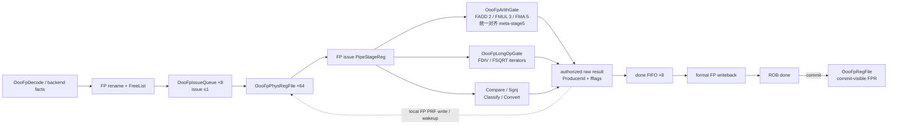

# 第 5 章：浮点乱序执行簇

## 5.1 为什么 FP 不能只是“再加一个 ALU”

浮点指令同时带来：

- 独立的 32 个架构 FPR；
- 单精度/双精度与 NaN-boxing；
- 五种静态 rounding mode 和动态 `frm`；
- 每条指令产生的 `fflags`；
- 加乘流水、FMA 深流水和 div/sqrt 迭代长延迟；
- FP→FP、FP→GPR、GPR→FP、load/store 多种寄存器域交叉。

如果所有 FP 指令都用一个 pending slot 串行执行，功能简单但吞吐很差。当前设计已经拆除
旧 pending-FP 通道，使用独立 FP rename/PRF/IQ 的真实乱序执行簇。

## 5.2 FP 后端内部拓扑



最后两条路径必须分开理解：经过 ProducerId 授权的 raw FP 结果可以先写物理 FP PRF 并
唤醒依赖者，同时进入 8 项 done FIFO；只有 FIFO head 赢得全局 formal-WB 仲裁后，
ROB 才变 done。架构 FPR 最后只在 ROB commit 更新。

## 5.3 独立的 FP rename

FP 使用：

- `OooFpRegFile`：32 个架构 FPR；
- `OooFpPhysRegFile`：64 个物理 FPR；
- FP free list；
- FP speculative map/busy 状态；
- `OooFpIssueQueue`：8 entry。

这与整数 PRF 分离，原因不是只为“类型清晰”，还包括：

- FP 读写端口需求不同；
- NaN-boxed value 和 fflags 语义只属于 FP；
- FP load 的目的在 FP PRF，地址却来自整数 GPR；
- FP compare/classify/convert-to-int 的目的在整数 PRF；
- 两个域必须分别 wakeup，避免错误把 GPR destination 当成 FPR destination。

## 5.4 四种跨域指令

### FP → FP

例如 `fadd.d f3, f1, f2`。源和目的都在 FP RAT/PRF/IQ，结果写 FP PRF，ROB 记录
完成和 fflags，commit 时更新架构 FPR。

### FP → GPR

例如 `feq.d x5, f1, f2`、`fclass.d x6, f3`、`fcvt.w.d x7, f4`。源在 FP PRF，
目的必须走整数 rename/PRF/completion 域。若错误地把 `rd` 标成 FPR busy，后续整数
消费者不会被正确唤醒。

### GPR → FP

例如 `fcvt.d.w f5, x6`、`fmv.d.x f7, x8`。源来自整数 PRF/旁路，目的在 FP PRF。
这要求 dispatch facts 明确源/目的寄存器域。

### FP load/store

`fld/flw` 的地址来自整数 GPR，进入整数 memory issue path；load response 数据写 FP
物理目的。`fsd/fsw` 的地址来自整数 GPR、store data 来自 FP PRF，最终进入 SQ。

因此“FP 指令都在 FP IQ”是错的：**FP 算术**使用 FP IQ，FP memory transaction
复用整数 memory ordering path。

## 5.5 FP decode

`OooFpDecode` 从 opcode/funct7/funct3/rs2 等字段识别：

- add/sub/mul/div/sqrt；
- fused multiply-add 家族；
- sign-injection；
- min/max、compare；
- classify；
- int↔float、single↔double convert；
- move；
- FP load/store 的静态类别；
- 是否携带动态 rounding mode。

前端 `OooFetchStaticClassify` 会把与 head-time 特权状态无关的 FP facts 预先存入
fetch packet；到 FIFO head 后再结合 `mstatus.FS`、illegal 和可见性做最终判断。

## 5.6 NaN-boxing 与 predicates

RV64 中 32-bit FP value 放在 64-bit FPR 时，上半 32 bit 应全 1，这叫 NaN-boxing。
读取单精度操作数时，如果上半部不是全 1，输入应按 canonical NaN 处理。

`OooFpPredicates.v` 集中定义：

- zero、subnormal、normal、infinity；
- quiet/signaling NaN；
- NaN-box 检查；
- sign/exponent/fraction 提取。

把 predicates 集中成 include helper 的价值是：compare、min/max、convert、arith
不能各自发明一套稍有不同的 NaN 判定。

## 5.7 舍入与异常标志

`OooFpRound.v` 提供 leading-zero、normalization、shift-jam 和 rounding helper。
典型流程：

```text
对齐/运算 -> 得到扩展精度 significand
          -> normalize
          -> guard/round/sticky
          -> 根据 rm 决定 increment
          -> 检查 overflow/underflow/inexact
```

`rm=111` 时使用 CSR `frm`；非法 rounding mode 必须在指令可见性阶段形成 illegal。

每条 FP producer 产生：

- NV：invalid；
- DZ：divide by zero；
- OF：overflow；
- UF：underflow；
- NX：inexact。

这些 flags 随 producer 存入 ROB，只有该 producer commit 时才 OR 到架构 `fflags`。
如果在 execute 结束就直接改 CSR，错误路径 FP 指令会污染架构状态。

## 5.8 短流水

当前 `OooFpArithGate` 内部 FADD 约 2 级、FMUL 约 3 级、FMA 约 5 级，但三类结果都
对齐到 metadata stage5 后再离开 gate。教学上可分为：

```text
issue capture
-> unpack/classify
-> align 或 partial product
-> arithmetic
-> normalize/round
-> result/flags completion
```

实际代码为了共享 helper、减少组合长链，级边界不一定一一对应上述名字；判断时以
`always @(posedge clk)` 保存的 valid/payload 为准。

```wavedrom
{
  "signal": [
    {"name": "clk",             "wave": "p........."},
    {"name": "FMA issue",       "wave": "010......."},
    {"name": "stage1 valid",    "wave": "0.10......"},
    {"name": "stage2 valid",    "wave": "0..10....."},
    {"name": "stage3 valid",    "wave": "0...10...."},
    {"name": "stage4 valid",    "wave": "0....10..."},
    {"name": "stage5 valid",    "wave": "0.....10.."},
    {"name": "raw result/wake", "wave": "0......10."},
    {"name": "done FIFO",       "wave": "0.......1."},
    {"name": "formal FPWB",     "wave": "0........1"}
  ],
  "head": {"text": "FMA producer 的身份与 fflags 必须穿过全部流水级"}
}
```

每一级除了 value，还必须带 ProducerId、destination、precision、rounding/flags 等 metadata；
只打拍数据而丢 metadata 会让结果交给错误 ROB entry。

## 5.9 长延迟 FDIV/FSQRT

`OooFpLongOpGate` 装配：

- `OooFpDivIter`；
- `OooFpSqrtIter`；
- 当前 long operation 的 kind/precision；
- start、busy、done、kill 和 result/flags。

ProducerId 与 kill 生命周期主要由父级 `OooFpBackend` 捕获和保存，两个 iterator
本身只知道运算状态。当前 div 与 sqrt 都执行约 56 个迭代 step，同一 long-op 域只保存
一个 owner。

```wavedrom
{
  "signal": [
    {"name": "clk",           "wave": "p.........."},
    {"name": "start",         "wave": "010........"},
    {"name": "busy",          "wave": "0.1.....0.."},
    {"name": "new_long_ready","wave": "1.0.....1.."},
    {"name": "kill",          "wave": "0.........."},
    {"name": "done",          "wave": "0......10.."},
    {"name": "completion",    "wave": "0.......10."}
  ],
  "head": {"text": "FP long-op 单 owner：busy 期间禁止覆盖，done 后再取得 completion 资格"}
}
```

真实迭代长度比示意图长；波形压缩了中间循环。

如果 branch recovery 命中这个 ProducerId，kill 必须让后续 done 失去 completion 资格。
仅清 FP IQ 不够，因为事务已经离开 IQ 并住在 iterator 中。

## 5.10 简单组合 FP gate

### `OooFpSgnjGate`

处理 FSGNJ/FSGNJN/FSGNJX，主要改变 sign bit，通常不产生 fflags。

### `OooFpCompareGate`

处理 FEQ/FLT/FLE 与 FMIN/FMAX。NaN，特别是 signaling NaN，会影响 result 与 NV；
min/max 对 ±0 的符号也有明确规则。

### `OooFpClassifyGate`

输出 FCLASS 的 10-bit 类别到整数 GPR 域。

### `OooFpConvertGate`

处理 int↔float、float precision conversion 和 move 类结果。饱和、越界、NaN、舍入与
signed/unsigned 组合是重点。

这些 gate 是组合函数，但它们的输入资格、结果 destination、completion 和 flush 由
`OooFpBackend` 保存。

## 5.11 raw result、formal completion 与 commit

FP 必须区分三个边界：

### Raw result 获得授权

执行 gate 算出 value/fflags 后，父级先用完整 ProducerId 确认它仍然 live。获授权的结果
可以写 FP PRF（或交给对应整数结果路径）、广播 wake，并进入 FP done FIFO。此时依赖者
可能已经能继续执行，但 ROB 还不一定 done。

### Formal FP writeback

done FIFO head 参加全局 completion 仲裁。只有获得 formal FPWB 后，ROB entry 才在时钟沿
写入 done/value/fflags。仲裁失败时 FIFO 必须继续持有同一个 ProducerId 和 payload。

### Commit

ROB 最早在 formal WB 的下一周期看见 edge-old done，并在程序顺序允许时 commit：

1. 架构 FPR 接收退休 value（若目的为 FPR）；
2. old FP physical 可回收；
3. `fflags` 按程序顺序累积；
4. trace/DiffTest 获得架构 FP 状态。

`OooFpRegFile` 的两个历史端口名看起来像 “load write/result write”，但当前连接实际承载
commit0/commit1；不能根据端口名推断执行来源。也不要把逻辑图里的“全局 WB”误读为
所有数据都经过一个集中寄存器堆端口：全局统一的是 formal completion 资格和 ROB done。

```wavedrom
{
  "signal": [
    {"name": "clk",               "wave": "p.........."},
    {"name": "FP dispatch",       "wave": "10........."},
    {"name": "FP IQ resident",    "wave": "01........."},
    {"name": "issue packet Q",    "wave": "0.1........"},
    {"name": "exec launch",       "wave": "0.10......."},
    {"name": "meta stage1..5",    "wave": "0..=====...", "data": ["1", "2", "3", "4", "5"]},
    {"name": "raw PRF/wakeup",    "wave": "0.....10..."},
    {"name": "done FIFO owner",   "wave": "0......10.."},
    {"name": "formal FPWB",       "wave": "0.......10."},
    {"name": "ROB done/commit",   "wave": "0........1."}
  ],
  "head": {"text": "FP 结果先物理可见，再进入 done FIFO，最后 formal-WB 与按序 commit"}
}
```

图中没有画仲裁等待；若 formal FPWB 端口忙，`done FIFO owner` 会延长，而不是让 raw
结果重复写入。

## 5.12 本章相关文件

| 文件 | 职责 |
| --- | --- |
| [`OooFpDecode.v`](../../../npc/rv64/vsrc/decode/OooFpDecode.v) | FP opcode/funct/rm/寄存器域分类 |
| [`OooFpBackend.v`](../../../npc/rv64/vsrc/execute/OooFpBackend.v) | FP rename/PRF/IQ/execute/completion 装配 |
| [`OooFpArithGate.v`](../../../npc/rv64/vsrc/execute/OooFpArithGate.v) | FADD/FSUB/FMUL/FMA 流水 |
| [`OooFpLongOpGate.v`](../../../npc/rv64/vsrc/execute/OooFpLongOpGate.v) | div/sqrt 单 owner 与迭代器装配 |
| [`OooFpDivIter.v`](../../../npc/rv64/vsrc/execute/OooFpDivIter.v) | 浮点除法迭代状态 |
| [`OooFpSqrtIter.v`](../../../npc/rv64/vsrc/execute/OooFpSqrtIter.v) | 浮点平方根迭代状态 |
| [`OooFpCompareGate.v`](../../../npc/rv64/vsrc/execute/OooFpCompareGate.v) | compare/min/max |
| [`OooFpSgnjGate.v`](../../../npc/rv64/vsrc/execute/OooFpSgnjGate.v) | sign injection |
| [`OooFpClassifyGate.v`](../../../npc/rv64/vsrc/execute/OooFpClassifyGate.v) | FCLASS |
| [`OooFpConvertGate.v`](../../../npc/rv64/vsrc/execute/OooFpConvertGate.v) | FP/int/precision conversion |
| [`OooFpPredicates.v`](../../../npc/rv64/vsrc/execute/OooFpPredicates.v) | NaN/inf/zero/NaN-box shared predicates |
| [`OooFpRound.v`](../../../npc/rv64/vsrc/execute/OooFpRound.v) | normalize、shift-jam、round helper |
| [`OooFpIssueQueue.v`](../../../npc/rv64/vsrc/scheduling/OooFpIssueQueue.v) | 8-entry FP IQ 与 wakeup |
| [`OooFpPhysRegFile.v`](../../../npc/rv64/vsrc/regread_bypass/OooFpPhysRegFile.v) | 64-entry FP PRF |
| [`OooFpRegFile.v`](../../../npc/rv64/vsrc/regread_bypass/OooFpRegFile.v) | 32-entry 架构 FPR |

## 5.13 本章检查点

1. 为什么 `feq.d x5,...` 的目的不是 FP PRF？
2. 为什么 `fld` 进入整数 memory path，却写 FP PRF？
3. FP execute 时直接更新 `fflags` 会产生什么 precise-state 错误？
4. FMA pipeline 被 flush 时，哪几级都需要携带 kill/ProducerId 语义？
5. NaN-boxing 为什么应成为共享 predicate，而不是各 gate 自己判断？
