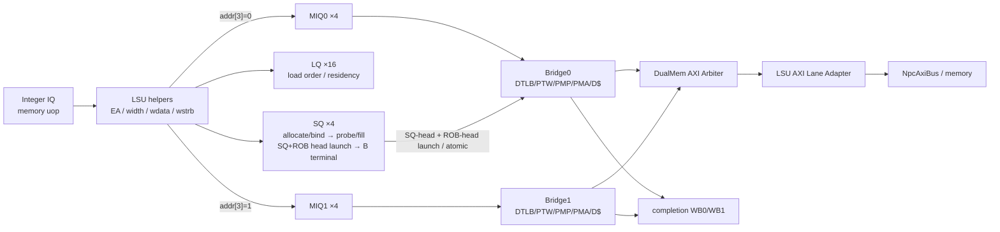

# 第 6 章：访存顺序、MMU、Cache 与 AXI

## 6.1 为什么访存是整颗 Core 最复杂的路径

对 `add`，只要源正确、运算正确、结果交给正确 ProducerId，主要功能就闭合了。
对 load/store，还要同时满足：

- RISC-V 地址、宽度、符号扩展和对齐；
- Sv39 地址翻译与 page fault；
- PMP/PMA 权限与 memory type；
- 老 store 对年轻 load 的顺序约束和前递；
- store 只能在到达 SQ/ROB 精确头部并获得 launch-open 后产生外部副作用；
- branch/trap flush 与晚到 response；
- 两个 memory bank 的并行/冲突；
- D-cache hit、write-through/no-allocate；
- PTW、PTE A/D update、MMIO 和普通 miss 共享 AXI；
- core-private 写数据表达与标准 AXI byte lane 的转换。

因此不能把 LSU 理解成一个 `addr -> memory -> data` 组合模块。

## 6.2 数据侧总拓扑



【结构推导】两个 bank 允许不同 bank 的 hit 并行；它们不是两个完全独立的外部 memory
port，因为 miss/PTW/write 流量会在 `OooDualMemAxiArbiter` 汇合。

## 6.3 地址和 store data 如何形成

`LSUControl` 解释 load/store funct3，给出：

- byte/half/word/dword 宽度；
- load signed/unsigned；
- store byte enable；
- 是否跨自然对齐边界。

`LSUDataPath` 负责：

- `effective_address = rs1 + immediate`；
- store data 根据 width 形成 core-private `wdata/wstrb`；
- load response 按地址低位提取并符号/零扩展。

`LSU` 是两者的包装。`OooIntBackend` 会为两个 issue lane、两个 bank response、AMO write
等场景多次例化这些 helper。多实例不表示有多套 cache，只表示组合转换在不同 transaction
边界复用。

这里的 misaligned fact 不自动等于最终异常：获得授权的普通 PMEM 访问可由
`OooLsuAxiLaneAdapter` 拆成 byte beat；IO、PTE、atomic 或越界访问则不能借用这条
split 路径。

## 6.4 SQ：当前 Store 的真实生命阶段

store 不能在 execute 时直接写 cache。否则一条后来被 branch mispredict 或 exception
取消的 store 已经破坏内存。当前 4-entry `OooStoreQueue` 的主线比传统
“先 ROB retire、再后台 drain”更严格：

### Allocate / bind

dispatch 为 store 分配 SQ entry，并绑定完整 ProducerId。后续地址、PA/memory class、
data 和 byte mask 可以分阶段填入同一个 owner。

### Probe / forwarding

entry 仍是 speculative 时，就要参加 younger load 的顺序查询和 byte-level forwarding。
SQ CAM 是 load ordering 的关键 oracle；地址或数据尚未知时，load 不能凭空假设无冲突。

当前查询网把 4 个 entry 展开为并行年龄/地址差计算，再按 head→tail 合并 byte；较年轻的
older Store 会覆盖更老 Store 提供的同一 byte。仿真构建额外叠加 four-state fail-closed
检查：只要参与查询的 valid/age/address/class/strobe 或真正重叠的数据 byte 含 X/Z，就只能
得到 replay，不能乐观放行 memory access。该 overlay 在 `SYNTHESIS` 下移除，不改变二值硬件
网络；它的作用是让未知状态在验证中暴露，而不是把 X 当作一种硬件 memory class。

### Head launch

只有这个 entry 同时位于 **SQ head**、匹配 **ROB head**，并且
`rob_head_launch_open` 成立时，才允许发出物理写请求。也就是说，外部 Store transaction
可以在 ROB 最终释放之前启动，但只能发生在已经精确到 ROB 头、不会被更老异常越过的边界。

### Terminal / ROB release

AW/W 可以独立握手，真正的写 terminal 要等 B response。terminal 到达后，SQ owner、
memory owner 与 ROB release 才按 exact identity 完成。当前实现不能描述成“ROB 已退休，
以后慢慢等 B”；B 是 Store 精确完成链的一部分。

当前 bridge 对这个末端增加了 **aggregate-B response fusion**。`S_WRITE_RESP` 收到 B 时，
normal/nokill owner 直接用 active `{kind, token, epoch, fault_tval}` 在同拍形成 `mem_rsp`：
若后端 `rsp_ready` 已经为 1，本拍就消费 terminal 并回到 `S_IDLE`；若后端反压，则同一份
payload/error 无条件锁存进既有 `S_RESP`，随后保持到 handshake。READY 只决定“直接 fire
还是落入 skid”，绝不参与 VALID 资格；被 kill、但已经逃逸到 AXI 的写仍走 exact drop
terminal，不能借融合路径取得正常完成资格。

```wavedrom
{
  "signal": [
    {"name": "clk",          "wave": "p........."},
    {"name": "store issue/fill",   "wave": "010......."},
    {"name": "SQ valid",           "wave": "0.1......0"},
    {"name": "SQ and ROB head",    "wave": "0..1......"},
    {"name": "launch_open",        "wave": "0..1......"},
    {"name": "physical req fire",  "wave": "0...10...."},
    {"name": "AW/W accepted",      "wave": "0....1...."},
    {"name": "B terminal",         "wave": "0.....10.."},
    {"name": "backend rsp_ready",  "wave": "1........."},
    {"name": "direct mem_rsp fire", "wave": "0.....10.."},
    {"name": "S_RESP fallback",    "wave": "0........."},
    {"name": "ROB/SQ release",     "wave": "0......10."}
  ],
  "head": {"text": "ready 场景：aggregate B 同拍形成 mem_rsp；反压时才进入 S_RESP 保持"}
}
```

flush 可删除尚未接受物理请求的 strictly-younger entry；已经被 bridge 接受的 transaction
不能从 AXI 撤回，必须继续 drain 到 B，再由 exact identity 决定是否产生架构 terminal。

## 6.5 Store-to-load forwarding

young load 发射时要查询所有比它老的 SQ entry。

典型结果：

1. **没有地址冲突**：可访问 cache；
2. **有一个老 store 完整覆盖 load bytes 且数据已知**：直接前递；
3. **有重叠但不能完整提供 load 数据**：阻止或 replay；
4. **更老 store 地址尚未知**：不能证明无冲突，必须保守等待。

若多个老 store 覆盖同一 byte，应选择年龄上离 load 最近的那个 store，不能简单选 SQ
低 index。

```wavedrom
{
  "signal": [
    {"name": "clk",             "wave": "p......."},
    {"name": "load candidate",  "wave": "010....."},
    {"name": "older SQ match",  "wave": "010....."},
    {"name": "full coverage",   "wave": "010....."},
    {"name": "cache req",       "wave": "0......."},
    {"name": "forward valid",   "wave": "0.10...."},
    {"name": "load completion", "wave": "0..10..."}
  ],
  "head": {"text": "SQ 完整覆盖时 load 从最近的老 store 前递，不访问 cache"}
}
```

前递仍要产生正常 load completion 和 LQ/ROB 状态；它不是绕过乱序完成协议的“特殊写回”。

## 6.6 LQ：为什么 load 完成后仍要驻留

`OooLoadQueue` 当前与 ROB 规模对齐，为 load 保存：

- ProducerId/ROB age；
- 地址/宽度和 ordering facts；
- 是否请求、响应、完成；
- 与 store probe/重放相关的状态；
- flush/retire 所需 owner。

load data 已写 PRF 不代表所有顺序风险消失。若后来发现更老 store 地址与它冲突，必须能
阻止错误结果获得最终资格或触发 replay。因此 LQ 的寿命可延伸到 retire。

当前 LQ 有 16 项，并保存完整 ProducerId。若一个 load 已经 launch 后才被 branch kill，
entry 仍须等待真实 terminal，不能在 flush 当拍释放 owner；否则晚到 R response 会成为
无人认领的 transaction，甚至撞上已复用的 ROB 槽。

还要区分 `terminal_seen_q` 与 `completed_q`：terminal 表示物理 owner 的 exact response
已经发生，completion 表示结果已经取得 formal 完成资格，二者可以在不同边沿出现。
normal terminal 会留下 `terminal_seen_q=1`，同时关闭该 entry 的 issue/query/response
open gate，但 entry 仍可为 retire residency 保持 valid。若此后 recovery 命中它，LQ 会
直接清除，而不是把它改成等待第二个 terminal 的 killed tombstone；任何重复 exact terminal
都会触发 `[V11H-LQ-DUP-TERMINAL]`。双 allocation 则用 two-lowest-free onehot 选择，lane1
仍以前缀依赖 lane0 fire，不改变双 dispatch 的原子语义。

## 6.7 MIQ：IQ 与 bridge 之间的所有权

memory uop 一旦离开 Integer IQ，IQ entry 可以被复用；但 bridge 未必立即 ready。
`OooMemInflightQueue` 保存：

- 完整 ProducerId；
- effective address；
- load/store/atomic kind；
- width/sign；
- destination 域；
- store data/mask 或 load metadata；
- bank identity、kill/retry/terminal 信息。

当前有 `MIQ0×4` 和 `MIQ1×4`。bank 选择由已捕获 effective address 的 `addr[3]`
决定。必须使用 entry 中保存的 bank，不能在后续周期重新读取已变化的组合地址。

每个 MIQ 是 4-entry transport FIFO，当前 kind 包括 LOAD、PROBE、DRAIN 和 LEGACY。
flush 可以杀 LOAD/PROBE，已经承担 Store drain 的 DRAIN owner 必须存活；队列每拍仍只有
一个真实 pop，next-head 只是只读 lookahead。

MIQ 与 bridge 的 assertion 现在都把完整 `{owner_kind, owner_token, mmu_epoch}` 视为身份：
push/pop、resident head、active/station/response/verified holder 只要 tuple 任一位未知就
fail loud；队列没有 push/pop/flush/kill 时，head tuple 还必须逐拍稳定。仅检查 token 已不足以
证明 late response 不会跨 kind 或 epoch 认错 owner。

### 同 bank 与不同 bank

```wavedrom
{
  "signal": [
    {"name": "clk",           "wave": "p......"},
    {"name": "uop A issue",   "wave": "010...."},
    {"name": "A addr[3]",     "wave": "x=x....", "data": ["0"]},
    {"name": "uop B issue",   "wave": "010...."},
    {"name": "B addr[3]",     "wave": "x=x....", "data": ["1"]},
    {"name": "MIQ0 enqueue",  "wave": "010...."},
    {"name": "MIQ1 enqueue",  "wave": "010...."},
    {"name": "bank0 request", "wave": "0.10..."},
    {"name": "bank1 request", "wave": "0.10..."}
  ],
  "head": {"text": "不同 addr[3] 的双 memory uop 可同拍进入两个 bank"}
}
```

若两条都落同一 bank，只能按 edge-old ROB distance 选更老者，另一条留在 IQ/MIQ 等待。

## 6.8 Bank0 与 Bank1 并非完全对称

两个 `OooMemAxiBridge` 都有各自 DTLB、PTW、PMP/PMA 和 D-cache，可处理普通 load。
但当前顶层把需要全局串行的职责集中到 bank0：

- SQ/ROB-head 已授权的 Store launch/drain；
- AMO/LR/SC；
- 某些 singleton/retry owner。

bank1 主要承接普通 load/probe。这样避免两个 bank 同时修改全局原子/store 状态，同时保留
不同 bank load hit 的并行度。

## 6.9 Sv39 TLB 与 PTW

`OooSv39Tlb` 是直接映射 TLB，默认 64 项。entry 概念上保存 VPN、PPN、page level、
权限和 ASID/global 等 facts。

Sv39 地址翻译：

```text
VA canonical check
-> TLB lookup
-> hit: 组合 final PA
-> miss: 三级 page-table walk
-> 检查 PTE V/R/W/X/U/G/A/D 与 reserved 组合
-> superpage 对齐检查
-> PMP/PMA 检查 PTE read/write
-> 必要时更新 A/D
-> refill TLB
-> 重新完成原 transaction
```

IFU 和两个 data bridge 各有自己的 TLB/PTW owner。`satp`、privilege、SUM/MXR、PMP
配置或 SFENCE/FENCE.I 等变化会引发 flush/epoch 边界。

当前 TLB 为 64-entry direct-mapped，并支持 superpage/Svnapot PA 重建。一个值得定向
验证的同拍角落是 `clear_i` 与 `fill_i` 同时有效：讲义不根据静态阅读宣称优先级正确，
应在 focused TB 中确认 fill 是否可能在 clear 后留存。

## 6.10 A/D 位

叶 PTE 的 A=0，或 store 遇 D=0 时，硬件可能执行 PTE read-modify-write。这个写事务
不是 guest 的普通 store，却同样要经过 PMP/PMA/AXI，并且必须与原 request 绑定。

```wavedrom
{
  "signal": [
    {"name": "clk",            "wave": "p.........."},
    {"name": "TLB miss",       "wave": "010........"},
    {"name": "PTE read req",   "wave": "0.10......."},
    {"name": "leaf A/D miss",  "wave": "0..10......"},
    {"name": "PTE write req",  "wave": "0...10....."},
    {"name": "PTE write resp", "wave": "0.....10..."},
    {"name": "TLB refill",     "wave": "0......10.."},
    {"name": "load retry",     "wave": "0.......10."}
  ],
  "head": {"text": "PTW 发现叶 PTE A/D 未置位：先更新 PTE，再重试原访存"}
}
```

如果 PTE 权限非法或 A/D update 不被允许，应产生 page/access fault，而不是填入一个错误
TLB entry。

## 6.11 PMP、PMA 与 typed memory class

### PMP

`PmpChecker` 根据 privilege、R/W/X、地址范围和 `pmpcfg/pmpaddr` 判断访问是否合法。
IFU 检查 execute；LSU 检查 read/write；PTW 的 PTE memory access 也要检查。

### PMA

PMA 描述物理地址固有属性，例如 PMEM、MMIO、cacheable、atomic support。当前真实路径
使用 `OooTypedPmaChecker` 和 `OooTypedMemoryClassifier`，生成：

- cached；
- non-cacheable；
- IO；
- invalid/reserved。

分类必须在 final PA 上进行，不能拿虚拟地址判 PMEM/MMIO。
classifier 还合并页表 PBMT：reserved PBMT、PBMTE 关闭却出现非零 PBMT 等情况，会在
发总线前形成 page-fault/poison，而不是等待 AXI `SLVERR`。

### Catalog-only 叶子

`OooPmaChecker`、`OooPostTranslateMemoryClass` 当前仍在 source catalog，但不在
`NpcTop` 展开层次中；`OooMmuEpochOwner` 也是 catalog-only prototype。学习时要理解其
设计意图，但不能把它们的端口行为写成 current production path。

## 6.12 D-cache

每个 bank 有一份 `OooDataWordCache`：

- 32 KiB；
- 4096 entry；
- 每 line 8 byte；
- 直接映射；
- PIPT；
- write-through；
- write miss no-allocate。

`Sram4096x113` 提供同步 SRAM 行为模型，113 bit payload 用来容纳 data/tag/valid/metadata。
同步读意味着“给 index”和“拿到数据”跨时钟边沿，cache 控制必须把 request metadata
同步打拍。

两个 D-cache 之间有 peer maintenance/invalidation，用于避免一个 bank 的写使另一个
bank 保留旧副本。这不是多核 MESI 一致性协议：这里只有单核两个 bank 的本地维护。
更精确地说，当前只对已授权 Store B、DMA、IFU A/D update 和特定 NC/IO terminal 等
维护事件做 peer/invalidate；它不是能观察任意外部写入的通用 snoop coherence。

## 6.13 双 bridge 与共享 miss fabric

`OooDualMemBridgeWrapper`：

1. 例化 bridge0；
2. 例化 bridge1；
3. 交叉连接 peer cache maintenance；
4. 收集两个 bridge 的 raw AXI request；
5. 通过 `OooDualMemAxiArbiter` 选择共享外部 transaction；
6. 把 response 路由回原 owner。

不同 bank D-cache hit 不需要经过共享 raw AXI，因此可并行；两个 bank 同时 miss 时则需
仲裁。

```wavedrom
{
  "signal": [
    {"name": "clk",          "wave": "p........."},
    {"name": "bank0 miss",   "wave": "010......."},
    {"name": "bank1 miss",   "wave": "010......."},
    {"name": "grant bank0",  "wave": "0.10......"},
    {"name": "raw AXI busy", "wave": "0.1..0...."},
    {"name": "bank0 resp",   "wave": "0...10...."},
    {"name": "grant bank1",  "wave": "0....10..."},
    {"name": "bank1 resp",   "wave": "0......10."}
  ],
  "head": {"text": "双 bank 同时 miss：共享 raw AXI 按 owner 串行服务"}
}
```

仲裁器还必须锁住正在进行的 AXI transaction，不能在 AR/AW/W/B/R 的中间周期切换 owner。
当前 arbiter 在 IDLE 的 C0 锁存 winner，C1 才进入下游地址握手；AW 与 W 分别用 seen
状态记账，terminal 后才释放 owner 并推进 round-robin。

## 6.14 LSU lane adapter

Core-private LSU 请求保持 exact physical address，但 `wdata/wstrb` 从 lane0 开始表示访问
宽度。标准 AXI 则要求数据和 strobe 放在 `addr[2:0]` 对应的 byte lane。

`OooLsuAxiLaneAdapter` 在 Core master 边界：

- 把自然对齐请求旋转到标准 byte lane；
- 保持 AxSIZE；
- 对获得授权的普通 PMEM 非对齐请求按 byte split；
- 聚合多个 R/B response；
- 不允许 MMIO、PTE、越界或 atomic request 偷用 split；
- 保持地址和 response 错误。

例如向 `...03` 写一个 halfword，core-private 可给 `wstrb=00000011`；adapter 对标准 AXI
变成 byte lane 3/4。若访问跨 8B beat，则分成两个 transaction。

## 6.15 AXI 反压

标准 AXI 五个 channel 独立握手。以读地址为例，`ARVALID=1 && ARREADY=0` 时：

- `ARADDR` 必须保持；
- `ARSIZE` 必须保持；
- `ARPROT` 必须保持；
- transaction owner 不能换成另一个 bank；
- 只有 `ARVALID && ARREADY` 才表示 address handoff。

```wavedrom
{
  "signal": [
    {"name": "clk",     "wave": "p......."},
    {"name": "ARVALID", "wave": "01..0..."},
    {"name": "ARREADY", "wave": "0..10..."},
    {"name": "ARADDR",  "wave": "x=..x...", "data": ["PA"]},
    {"name": "ARSIZE",  "wave": "x=..x...", "data": ["3"]},
    {"name": "ARPROT",  "wave": "x=..x...", "data": ["DATA"]},
    {"name": "RVALID",  "wave": "0....10."},
    {"name": "RREADY",  "wave": "0....10."}
  ],
  "head": {"text": "AXI AR 反压期间地址、尺寸、属性和 owner 全部保持"}
}
```

写地址 AW 与写数据 W 也是独立 channel；bridge 必须分别记住它们是否已 handoff，不能
假设二者同拍 ready。

## 6.16 memory owner 的终止

一个 memory producer 可能住在：

- Integer IQ；
- MIQ0/MIQ1；
- bridge station/FSM；
- DTLB/PTW/A-D update；
- D-cache miss；
- response reservation/buffer；
- SQ drain/AMO/LRSC；
- terminal collector pending。

`OooMemOwnerTracker` 维护 live holder census；`OooMemOwnerTerminalCollector` 接受只有
在 kind/epoch/ProducerId 完全匹配、没有 duplicate/pending collision 的 terminal ingress。

当前 tracker 提供 32 个 exact token，identity 包含 kind/token/epoch 与 ProducerId；
collector 汇集多路 terminal，并以 pending bitmap 和两个注册 dequeue slot 在反压下保持。
`fault_tval` 是异常 provenance，不属于 owner key。

serialized SYSTEM/trap/exit 的 drain 只有看到 accepted exact terminal 后才能继续。raw
response 脉冲本身不能证明 owner 已终止。

`OooMemoryRequestGate` 还说明了两类 flush 的相位不同：`core_local_flush` /
`checkpoint_mem_flush` 可直接形成当拍 request flush；`satp`、SFENCE、FENCE.I 的 commit
则先在时钟沿锁存，下一拍才输出 `mmu_flush_q`。画波形时不能把所有 flush 都放在同一拍。

## 6.17 本章相关文件

| 文件 | 职责 |
| --- | --- |
| [`LSUControl.v`](../../../npc/rv64/vsrc/memory/LSUControl.v) | width/sign/alignment 控制 |
| [`LSUDataPath.v`](../../../npc/rv64/vsrc/memory/LSUDataPath.v) | EA、store mask、load extract |
| [`LSU.v`](../../../npc/rv64/vsrc/memory/LSU.v) | LSU helper 包装 |
| [`OooStoreQueue.v`](../../../npc/rv64/vsrc/memory/OooStoreQueue.v) | store allocate/fill、SQ/ROB-head launch、physical-byte forwarding 与 X-safe replay |
| [`OooLoadQueue.v`](../../../npc/rv64/vsrc/memory/OooLoadQueue.v) | load ordering/replay、terminal history 与 retire residency |
| [`OooMemInflightQueue.v`](../../../npc/rv64/vsrc/memory/OooMemInflightQueue.v) | 双 bank request owner queue 与完整 tuple 稳定性 |
| [`OooMemoryAccess.v`](../../../npc/rv64/vsrc/memory/OooMemoryAccess.v) | glue 侧每 bank request/response wrapper |
| [`OooMemoryRequestGate.v`](../../../npc/rv64/vsrc/memory/OooMemoryRequestGate.v) | core/bank request 和 flush gating |
| [`OooMemAxiBridge.v`](../../../npc/rv64/vsrc/memory/OooMemAxiBridge.v) | DTLB/PTW/PMP/PMA/D$/AXI FSM 与 aggregate-B response fusion |
| [`OooDualMemBridgeWrapper.v`](../../../npc/rv64/vsrc/memory/OooDualMemBridgeWrapper.v) | 双 bridge、peer maintenance、共享 miss |
| [`OooDualMemAxiArbiter.v`](../../../npc/rv64/vsrc/memory/OooDualMemAxiArbiter.v) | raw AXI owner lock/response routing |
| [`OooLsuAxiLaneAdapter.v`](../../../npc/rv64/vsrc/memory/OooLsuAxiLaneAdapter.v) | logical window 到标准 byte lane/split |
| [`OooSv39Tlb.v`](../../../npc/rv64/vsrc/memory/OooSv39Tlb.v) | TLB lookup/refill/flush |
| [`PmpChecker.v`](../../../npc/rv64/vsrc/memory/PmpChecker.v) | PMP R/W/X 权限 |
| [`OooTypedPmaChecker.v`](../../../npc/rv64/vsrc/memory/OooTypedPmaChecker.v) | 地址图到 typed PMA |
| [`OooTypedMemoryClassifier.v`](../../../npc/rv64/vsrc/memory/OooTypedMemoryClassifier.v) | final PA memory class |
| [`OooPmaChecker.v`](../../../npc/rv64/vsrc/memory/OooPmaChecker.v) | catalog-only legacy PMA facade |
| [`OooPostTranslateMemoryClass.v`](../../../npc/rv64/vsrc/memory/OooPostTranslateMemoryClass.v) | catalog-only post-translate owner |
| [`OooMmuEpochOwner.v`](../../../npc/rv64/vsrc/memory/OooMmuEpochOwner.v) | catalog-only epoch prototype |
| [`OooMemOwnerTracker.v`](../../../npc/rv64/vsrc/memory/OooMemOwnerTracker.v) | memory holder census |
| [`OooMemOwnerTerminalCollector.v`](../../../npc/rv64/vsrc/memory/OooMemOwnerTerminalCollector.v) | accepted exact terminal |
| [`OooDataWordCache.v`](../../../npc/rv64/vsrc/cache/OooDataWordCache.v) | 32KiB direct-mapped D-cache |
| [`Sram4096x113.v`](../../../npc/rv64/vsrc/sram/Sram4096x113.v) | D-cache 同步 SRAM 模型 |

## 6.18 本章检查点

1. store 为什么需要 allocate/bind、probe/fill、SQ+ROB 双头部 launch 和 B terminal？
2. load 为什么在 PRF 已有结果后还可能留在 LQ？
3. 双 bank 同时 hit 和同时 miss 的并行能力有何不同？
4. PMA 为什么必须使用 final PA？
5. AXI `ARVALID && !ARREADY` 时为什么连 `ARPROT` 也必须保持？
6. ROB empty 为什么不能单独证明 serialized control 可以继续？
