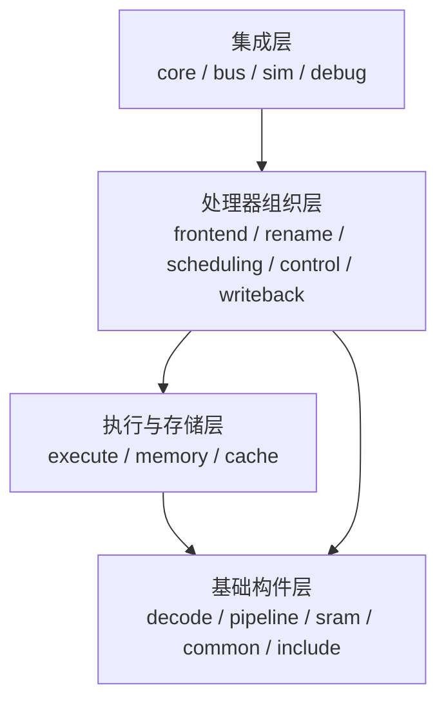

# 11. `vsrc` 逐文件源码地图

这一章解决一个很现实的问题：前面的章节按“功能”组织，但你打开 `npc/rv64/vsrc` 时，面对的是按目录分组的文件。学习者需要一座双向索引：

- 从功能问题出发，知道应该打开哪些文件；
- 从任意文件出发，知道它处在什么层级、由谁实例化、保存什么状态。

本章覆盖当前 `npc/rv64/vsrc` 下的全部文件，包括生产 RTL、仿真顶层、checker、头文件、README 和构建清单。覆盖不代表所有文件都在 `NpcTop` 的生产实例树中；“源码存在”和“当前配置可达”必须分开。

## 11.1 如何读表

每个文件都给出三类信息：

| 列 | 含义 |
| --- | --- |
| 身份 | 生产路径、仿真专用、定向 checker、目录文档、头文件或当前目录中未接入顶层的候选模块 |
| 责任 | 它拥有的状态或组合决策；不是泛泛而谈的模块名翻译 |
| 学习入口 | 最值得追踪的握手、tag、状态机或反例 |

“生产路径”来自当前 `NpcTop` elaboration 实例树；仿真路径则以 `NpcSimTop` 为根。参数化 generate 可能让同一源文件出现多个实例，表中只标文件身份，不用实例个数替代功能解释。

## 11.2 先建立四层心智模型



遇到一个文件时，先判断它属于哪一层，再问：

1. 它是不是时序状态 owner？
2. 它的上游和下游分别是谁？
3. `valid && ready` 在哪个边沿改变状态？
4. flush、异常或反压时，payload 是否保持？
5. 当前顶层是否真的实例化了它？

## 11.3 状态标签

本章使用下列短标签：

- **Top**：当前 `NpcTop` 生产实例树可达；
- **Sim**：只在 `NpcSimTop` 或仿真外设路径可达；
- **Check**：定向 checker / assertion 辅助；
- **Catalog**：源文件存在，但当前两个 elaboration 根都没有实例化；
- **Header**：被 `include` 的定义或观测布局；
- **Doc/Build**：目录说明和构建入口。

这些标签只描述当前源码快照，未来改动后应重新 elaboration，而不是手工沿用。

<!-- FILE_ATLAS_BEGIN -->

### 根目录：说明与构建入口

| 文件 | 身份 | 教学解释与阅读抓手 |
| --- | --- | --- |
| `npc/rv64/vsrc/README.md` | Doc/Build | `vsrc` 的人工总览。适合查目录职责，但其中“双访存桥未实例化”“前端有 6 个 DecodeStage”等描述已经落后于当前实例树；遇到冲突应回到 `NpcCoreTop.v` 和 elaboration。 |
| `npc/rv64/vsrc/filelist.mk` | Doc/Build | Verilator/仿真的源文件编译顺序入口。它证明文件会被编译，却不证明模块会被顶层实例化；必须和 XML hierarchy 配合阅读。 |

### `bus/`：Core 外部的 SoC 地址空间

| 文件 | 身份 | 教学解释与阅读抓手 |
| --- | --- | --- |
| `npc/rv64/vsrc/bus/NpcAxiBus.v` | Top | SoC AXI 总线结构 wrapper；`NpcTop` 把 Core 主口送入这里，再由实例 `u_crossbar : AxiCrossbar` 分发。它本身不拥有一条指令的语义。 |
| `npc/rv64/vsrc/bus/AxiCrossbar.v` | Top | 2-master/16-slave single-outstanding fabric；每 slave round-robin、读写独立，R 先进入 registered response slice，AW/W 分别 capture。生产 filelist 仅保留全称，历史 mutation override 仍由 Makefile 兼容。 |
| `npc/rv64/vsrc/bus/AxiClint.v` | Top | 保存 `msip/mtime/mtimecmp`；`mtime` 分频递增，比较成立后的 `mtip` 出口再打一拍，设备 pending 不等于 Core 已 trap。 |
| `npc/rv64/vsrc/bus/AxiPlic.v` | Top | 保存 priority/pending/in-service、M/S enable/threshold；claim 清 pending 并置 in-service，complete 释放，`external_irq` 注册输出。 |
| `npc/rv64/vsrc/bus/AxiResetSyscon.v` | Top | offset0/32-bit syscon slave；成功 B handshake 后才脉冲平台写事件，不能在 W fire 时重复产生 reset/exit 副作用。 |
| `npc/rv64/vsrc/bus/AxiToUart.v` | Top | 把 AXI transaction 适配成字符设备访问，直接下接 `Uart`；重点是总线握手完成和字符副作用发生不能重复。 |
| `npc/rv64/vsrc/bus/Uart.v` | Top | 16550 教学子集：寄存器、1-byte RX holding、TX pulse 与 IRQ；TX 永远 ready、无真实 TX FIFO，不可外推完整 UART 性能。 |
| `npc/rv64/vsrc/bus/AxiDefaultSlave.v` | Top | 地址洞的默认应答器。它必须生成可结束 transaction 的错误/默认响应，否则错误地址会把总线永久挂住。 |

### `cache/`：两种粒度不同的本地 Cache

| 文件 | 身份 | 教学解释与阅读抓手 |
| --- | --- | --- |
| `npc/rv64/vsrc/cache/OooFetchPacketCache.v` | Top | 4096×199、1RW SRAM 支撑的取指 packet cache；同步读、lookup context、valid、fill/clear/invalidate 是跨拍状态。当前只有 1 个实例，位于 `OooFetchAxiBridge`。 |
| `npc/rv64/vsrc/cache/OooDataWordCache.v` | Top | 两份 32 KiB、4096×8B direct-mapped PIPT、write-through/no-allocate D-cache；同步 lookup，Store B 后做 RMW update，并响应特定 peer/DMA/A-D/NC/IO 失效。 |

### `common/`：跨模块 packed facts ABI

| 文件 | 身份 | 教学解释与阅读抓手 |
| --- | --- | --- |
| `npc/rv64/vsrc/common/OooSlotFacts.v` | Header | 生产 RTL 真正消费的 packed slot facts 位号：response-time static facts 与 head-time facts 在这里形成 ABI。修改位号必须同步所有生产者/消费者。 |
| `npc/rv64/vsrc/common/OooBranchDirectionPredictorFacts.vh` | Header | BPU checker/debug 的观测字段布局；描述“看什么”，不拥有 predictor 表或 GHR 状态。 |
| `npc/rv64/vsrc/common/OooFetchPacketCacheFacts.vh` | Header | 取指 Cache focused checker 的 lookup/accept/hit/fill/invalidate 观测布局；不能用它替代 Cache RTL。 |
| `npc/rv64/vsrc/common/OooDataWordCacheFacts.vh` | Header | D-Cache 观测字段布局。它与取指 Cache 的粒度、失效条件不同，不能混用时序结论。 |
| `npc/rv64/vsrc/common/OooRedirectMuxFacts.vh` | Header | redirect 仲裁结果的调试投影位号；只投影 winner/facts，不保存 redirect transaction。 |
| `npc/rv64/vsrc/common/OooRedirectSeqFacts.vh` | Header | redirect sequencer 的事件投影，并提示 checker 按跨拍关系观察；它不是完整优先级真值表。 |

### `control/`：串行化、异常、trap exit 与全局 flush

| 文件 | 身份 | 教学解释与阅读抓手 |
| --- | --- | --- |
| `npc/rv64/vsrc/control/README.md` | Doc/Build | 控制目录的人工说明和拆分原则。阅读后仍要用 `OooControlPlane.v` 的实例与端口确认当前活路径。 |
| `npc/rv64/vsrc/control/OooControlPlane.v` | Top | 控制面的聚合 owner：接收 head/system/trap/CSR/退休条件，组合多个 gate 和 sequencer，输出 backend block、CSR 请求、flush 与可观察事件。七个时序块说明它不只是组合译码。 |
| `npc/rv64/vsrc/control/OooControlEventApplySequencer.v` | Top | 位于 `OooCoreTopGlue`，把 full-flush request 的 reason/kill-index 锁存一拍后形成 apply；request 与 apply 不能画在同一相位。 |
| `npc/rv64/vsrc/control/OooControlFlushSequencer.v` | Top | 注册 `core_trap_flush`、`trap_redirect_squash`、`checkpoint_mem_flush`，把 raw 控制条件变成明确下一拍脉冲。 |
| `npc/rv64/vsrc/control/OooCoreObservableOutputGate.v` | Top | 纯组合地选择/屏蔽对外可见控制结果；它不拥有 pending，输入无效时 payload 也必须由 valid 掩护。 |
| `npc/rv64/vsrc/control/OooCoreSliceControlGate.v` | Top | 纯组合形成 Core slice 的运行、停止或串行化门控，把控制状态翻译成后端可消费的 allow/block。 |
| `npc/rv64/vsrc/control/OooCsrAccessRequestMux.v` | Top | 在不同 CSR 请求来源之间做组合选择；阅读重点是同拍多源优先级和被拒来源是否仍由上游保存。 |
| `npc/rv64/vsrc/control/OooCsrIllegalProbeGate.v` | Top | 对 CSR 地址、权限和访问类型做非法性探测；它产生判定，不保存异常生命周期。 |
| `npc/rv64/vsrc/control/OooCsrTrapRequestMux.v` | Top | 选择同步异常/中断等 trap 请求事实，并把 cause/tval/PC 绑定到同一 winner。 |
| `npc/rv64/vsrc/control/OooPendingDispatchArbiter.v` | Top | pending 控制项与普通 dispatch 之间的组合仲裁，直接下接 lane1 capture gate；重点验证 lane1 不能脱离 lane0 或 owner 身份单独前进。 |
| `npc/rv64/vsrc/control/OooPendingLane1CaptureGate.v` | Top | 捕获/呈现 barrier 后的 lane1 候选事实；自身无时序块，真正 pending 状态仍在上层 sequencer/plane。 |
| `npc/rv64/vsrc/control/OooPendingDrainResolveGate.v` | Top | 组合计算 drain/resolve：SYSTEM/trap/exit 等 `mem_owner_terminalized`，普通 FENCE 还必须等待完整 `mem_idle`，ROB empty 单独不够。 |
| `npc/rv64/vsrc/control/OooPendingSystemAdmissionCancelGate.v` | Top | 对 system 指令的 admission 与取消做组合门控，防止已被 redirect/异常淘汰的请求进入 pending owner。 |
| `npc/rv64/vsrc/control/OooPendingSystemSequencer.v` | Top | system 操作的跨拍 pending owner；保存身份/参数直到允许执行、提交或取消。 |
| `npc/rv64/vsrc/control/OooPendingTrapExitSequencer.v` | Top | `mret/sret` 等 trap-exit 生命周期 owner；多个时序块保存候选、等待和完成状态，不能当成普通 JAL。 |
| `npc/rv64/vsrc/control/OooStopPendingSequencer.v` | Top | stop/串行化等待状态 owner；负责从“看见 stop 类操作”过渡到“后端已排空、可以处理”。 |
| `npc/rv64/vsrc/control/OooTrapExitEventMux.v` | Top | 纯组合选择 trap exit 事件来源及 payload，winner 必须与 privilege/target PC 同步。 |
| `npc/rv64/vsrc/control/OooTrapExitOutputSequencer.v` | Top | 把 trap-exit 选择结果注册并按下游节奏输出，形成清晰的跨拍边界。 |
| `npc/rv64/vsrc/control/OooRedirectArbiter.v` | Top | 位于 `OooFrontend` 内的纯组合单赢家：先选 ROB 环形年龄更老者，同龄 `trap > branch > direct`；PC/reason/age 必须来自同一 winner。 |

### `core/`：层级装配与 CSR 架构状态

| 文件 | 身份 | 教学解释与阅读抓手 |
| --- | --- | --- |
| `npc/rv64/vsrc/core/NpcTop.v` | Top | SoC 生产顶层：实例化 `NpcCoreTop`、AXI 总线与 CLINT/PLIC/UART/syscon/default slaves。它看见平台中断和 AXI，但不做 OoO 调度。 |
| `npc/rv64/vsrc/core/NpcCoreTop.v` | Top | Core 集成顶层：连接 `OooCoreTopGlue`、`CsrFile`、IFU bridge、双 D-MEM bridge 和 LSU lane adapter；这是核对“当前真的实例化了什么”的首要文件。 |
| `npc/rv64/vsrc/core/OooCoreTopGlue.v` | Top | 前端、执行后端、访存接入、控制面和最终 writeback/commit 的粘合层；保存少量跨子系统边界状态，但具体队列状态归各子模块。 |
| `npc/rv64/vsrc/core/CsrFile.v` | Top | 机器/监管态 CSR、trap entry/exit、计数器等架构状态 owner；当前还对 MPP/SXL/UXL、medeleg/mideleg、delegated sie/sip 视图与 FS=Off FP-CSR legality 做 WARL/权限收敛。 |

### `debug/`：仿真观测与定向 checker

| 文件 | 身份 | 教学解释与阅读抓手 |
| --- | --- | --- |
| `npc/rv64/vsrc/debug/OooAdUpdateChecker.sv` | Sim | `NpcSimTop` 中的 A/D 位更新 checker，共 3 个实例；监测页表项更新 transaction，不能进入综合主链结论。 |
| `npc/rv64/vsrc/debug/OooRedirectMuxChecker.sv` | Sim | 仿真顶层的 redirect winner checker；用 facts 投影检查 mux 选择，与生产 `OooRedirectArbiter` 分离。 |
| `npc/rv64/vsrc/debug/OooRedirectSeqChecker.sv` | Sim | 仿真顶层的 redirect 跨拍序列 checker；重点观察事件在下一拍生效而非同拍凭空改变请求。 |
| `npc/rv64/vsrc/debug/OooBranchDirectionPredictorChecker.sv` | Check | 未由 `NpcSimTop` 默认实例化的 BPU focused checker；只有定向 TB 实例化时才有动态证据。 |
| `npc/rv64/vsrc/debug/OooDataWordCacheChecker.sv` | Check | D-Cache focused checker，覆盖 lookup/fill/invalidate 等事实；源码存在不等于默认回归已经运行它。 |
| `npc/rv64/vsrc/debug/OooFetchPacketCacheChecker.sv` | Check | I-Cache packet focused checker；用于验证同步读/accept/hit/失效关系，不是 Cache 本体。 |

### `decode/`：RVC、整数控制与 FP 静态分类

| 文件 | 身份 | 教学解释与阅读抓手 |
| --- | --- | --- |
| `npc/rv64/vsrc/decode/OooRvcDecompressor.v` | Top | 把 16 位 C 指令组合展开成 canonical 32 位编码；当前把非零立即数、`rd=x0` 的 C.LUI 边界规范化为 NOP，零立即数仍留给非法路径。 |
| `npc/rv64/vsrc/decode/DecodeUnit.v` | Top | 组合产生整数/控制指令的 ctrl、rs1/rs2/rd，默认路径保持 illegal，合法 case 才清除。FP 合法性不是它单独负责。 |
| `npc/rv64/vsrc/decode/ImmGen.v` | Top | 按 I/S/B/U/J 格式组合扩展立即数；重点用负分支和跨页 JAL 检查符号位拼接。 |
| `npc/rv64/vsrc/decode/DecodeStage.v` | Top | `DecodeUnit + ImmGen` 的无状态 wrapper。生产前端有 2 个，后端重译码有 2 个；`OOO_ASSERT` 下还可能多 2 个参考实例。 |
| `npc/rv64/vsrc/decode/OooFpDecode.v` | Top | 组合识别 FP load/store/算术/转换、源/目标寄存器类别和 S/D format；FS/frm/privilege 合法性在 head-time gate 再决定。 |
| `npc/rv64/vsrc/decode/OooAluDecodeBackend.v` | Top | 两个 `DecodeStage` 与 `OooIntBackend` 的组合适配层；Decode→Rename→resource-ready 没有独立流水寄存器，dispatch 沿才写入 RAT/ROB/IQ。 |

### `execute/`：整数、长延迟与浮点后端

| 文件 | 身份 | 教学解释与阅读抓手 |
| --- | --- | --- |
| `npc/rv64/vsrc/execute/OooExecuteBackend.v` | Top | 后端外层结构 wrapper，直接下接 `OooAluCoreSlice`，并保留 compare/pending 接口；名字里的 Execute 不代表它只是一拍 EX。 |
| `npc/rv64/vsrc/execute/OooAluCoreSlice.v` | Top | 聚合 `OooAluDecodeBackend` 与架构 GPR `OooArchRegFile`；把 raw ROB commit、CSR commit-time 数据修正和最终 retire 连接起来。 |
| `npc/rv64/vsrc/execute/OooIntBackend.v` | Top | 整数 OoO 后端的主要汇合点：IQ/PRF、ALU、分支、MulDiv、CLMUL、LSU、FP backend、ProducerId 授权和全局 completion 都在这里相遇。 |
| `npc/rv64/vsrc/execute/ALU.v` | Top | 纯组合整数运算器，共两个物理执行端；只算值，不拥有完成或退休资格。 |
| `npc/rv64/vsrc/execute/CompareUnit.v` | Top | 纯组合比较器，用于 branch/legacy compare；branch resolve 的身份和时序仍由后端寄存 packet 约束。 |
| `npc/rv64/vsrc/execute/OooBitmanipGate.v` | Top | 组合完成 Zba/Zbb/Zbs 等 bitmanip；CLMUL 不在这里，而由独立 64 拍单元执行。 |
| `npc/rv64/vsrc/execute/OooAmoGate.v` | Top | 根据 AMO old value 和源操作数计算返回值/写回内存值；只负责数据变换，原子 transaction owner 在访存路径。 |
| `npc/rv64/vsrc/execute/OooMulDivUnit.v` | Top | Mul/Div FSM owner：请求先进入 buffer，radix-4 迭代或 special 快路，RESP 可反压保持完整 ProducerId。 |
| `npc/rv64/vsrc/execute/OooClmulUnit.v` | Top | carry-less multiply 的固定 64 次迭代状态机；从 capture 到 RESP 一直持有完整 ProducerId，并响应 strictly-younger kill。 |
| `npc/rv64/vsrc/execute/OooFpBackend.v` | Top | FP speculative RAT/Busy/FreeList/IQ/PRF、执行、raw wake、8 项 done FIFO 和 formal FP writeback 的总 owner；FP“算完”和 ROB done 在这里被明确分开。 |
| `npc/rv64/vsrc/execute/OooFpArithGate.v` | Top | FADD/FMUL/FMA 等流水化算术；内部不同计算深度统一对齐到 metadata stage5 输出，父级用 launch/out 而非旧串行 start/done。 |
| `npc/rv64/vsrc/execute/OooFpLongOpGate.v` | Top | FP div/sqrt 的启动、长操作 busy/done 与结果选择；ProducerId/kill 元数据主要由父 `OooFpBackend` 保存。 |
| `npc/rv64/vsrc/execute/OooFpDivIter.v` | Top | 56 次 restoring quotient step 的除法迭代器；`start` 后忙碌，到完成产生单拍 done，flush 可清除。 |
| `npc/rv64/vsrc/execute/OooFpSqrtIter.v` | Top | 56 次 digit-by-digit root step 的平方根迭代器；与除法类似，本身不拥有 ROB 身份。 |
| `npc/rv64/vsrc/execute/OooFpCompareGate.v` | Top | 组合实现 FP compare/min/max 及 fflags，重点是 NaN、sNaN 和 ±0 的规则。 |
| `npc/rv64/vsrc/execute/OooFpClassifyGate.v` | Top | 组合生成 FCLASS mask；未正确 NaN-box 的 single 输入按 qNaN 类处理。 |
| `npc/rv64/vsrc/execute/OooFpSgnjGate.v` | Top | 组合实现 sign-injection，并保持输出 NaN-box 形式；无本地状态。 |
| `npc/rv64/vsrc/execute/OooFpConvertGate.v` | Top | 组合实现 FP↔整数、S↔D 转换与 rounding/fflags；逻辑锥较宽，真正时序边界由父级 pipeline 提供。 |
| `npc/rv64/vsrc/execute/OooFpPredicates.v` | Header | 被 include 的 NaN/boxing/zero/inf helper 函数集合，无 module、无状态。 |
| `npc/rv64/vsrc/execute/OooFpRound.v` | Header | 被 include 的 rounding、shift-right-jam、LZC 和 overflow helper，无 module、无流水线。 |

### `frontend/`：取指 packet、预测、双槽可见性与恢复

| 文件 | 身份 | 教学解释与阅读抓手 |
| --- | --- | --- |
| `npc/rv64/vsrc/frontend/OooFrontend.v` | Top | 前端聚合模块：packet decode/FIFO、BPU/RAS、head-time classify、dispatch gate 和 redirect 接线都在这里；大量 legacy 端口存在并不表示路径仍活。 |
| `npc/rv64/vsrc/frontend/OooFetchAxiBridge.v` | Top | IFU transaction owner：FPC/ITLB/PMP、PTW、A-bit update、exact 2B frontier 和 AXI 状态机都在这里；flush 后旧返回要进入 drop/drain。 |
| `npc/rv64/vsrc/frontend/OooFetchPacketDecode.v` | Top | 把返回 packet 组合拆成最多两个 slot，负责 RVC 长度、跨 segment 拼接、fault provenance、slot PC/next-PC。 |
| `npc/rv64/vsrc/frontend/OooFetchPacketFifo.v` | Top | 4-entry packet ring 与 registered head shadow 的状态 owner；entry 原子携带双槽及预测/异常事实，没有 response→dispatch 组合 bypass。 |
| `npc/rv64/vsrc/frontend/OooFetchPacketHeadMux.v` | Top | 把 registered FIFO head 做 identity view；当前 bypass arm 已删除，不能据旧文档画成 0 拍穿透。 |
| `npc/rv64/vsrc/frontend/OooFetchFlowControl.v` | Top | 组合计算 request/response/FIFO credit；用 `fifo_count + outstanding` 预留空间，允许 response 与 successor request turnover，但不做 full+pop look-through。 |
| `npc/rv64/vsrc/frontend/OooFetchRequestMux.v` | Top | 组合选择下一请求 PC 并阻止不安全请求；当前 `redirect_fetch_req_valid_o` 恒 0，redirect 是写入 sequencer 后下一拍再请求。 |
| `npc/rv64/vsrc/frontend/OooFetchPcOutstandingSequencer.v` | Top | `next_fetch_pc_q`、outstanding、discard-old-response 的状态 owner；redirect 写 PC 在边沿发生，下一周期才形成新请求。 |
| `npc/rv64/vsrc/frontend/OooFetchStaticClassify.v` | Top | response-time 18-bit static facts 生产者，共两个实例；只看指令固有类别，不判断当前 privilege、FS 或动态 frm。 |
| `npc/rv64/vsrc/frontend/OooFetchHeadClassifyGate.v` | Top | head-time 42-bit facts 生产者，共两个实例；把 static facts 与 fault、privilege、mstatus、frm 合并。 |
| `npc/rv64/vsrc/frontend/OooFetchHeadPairGate.v` | Top | 双槽可见性门：slot0 STOP/JUMP 等会压制 lane1，预测未跳转的 branch 可保留 lane1 fault provenance。 |
| `npc/rv64/vsrc/frontend/OooFrontendDispatchGate.v` | Top | 双槽 admission/fire 的前缀门控；mandatory pair 需两端 ready，barrier 场景只让 lane0 前进，arch-trap 不呈现普通 backend。 |
| `npc/rv64/vsrc/frontend/OooFrontendBackendDispatchMux.v` | Top | 将当前 head 与 legacy pending 候选组合成两个 backend payload，并形成预测 NPC；多数 append/prefetch 输入在当前配置 tie-off。 |
| `npc/rv64/vsrc/frontend/OooFrontendRunGate.v` | Top | 组合决定前端能否运行、stop owner/orphan 和 FIFO credit；不要把当前组合 `backend_empty` 当作 `OooBackendDrainTracker` 的上一拍值。 |
| `npc/rv64/vsrc/frontend/OooFrontendActionGate.v` | Top | 组合产生 direct flush、head stop、FIFO pop 和 trap request block；JAL/安全 RAS return 可走 direct 恢复，普通 branch 由 issue resolve。 |
| `npc/rv64/vsrc/frontend/OooDirectRasCandidateGate.v` | Top | 组合识别 x1/x5 call 与 `jalr x0,x1/x5,0` return hint，并只在 ROB 空、RAS reliable 等安全条件下采用 direct return。 |
| `npc/rv64/vsrc/frontend/OooDirectControlFlowGate.v` | Top | 组合形成 JAL/return target、call/link facts；当前 direct conditional-branch fire 为死路径，return-cont 也未形成活 transaction。 |
| `npc/rv64/vsrc/frontend/OooRasUpdateGate.v` | Top | 组合产生 RAS clear/pop/push 请求；最终同拍优先级由 `OooRasStack` 执行。 |
| `npc/rv64/vsrc/frontend/OooRasStack.v` | Top | 32-entry RAS、count 和 reliability 状态 owner；clear > pop > push，full push 会覆盖并降低可靠性。 |
| `npc/rv64/vsrc/frontend/OooDirectBranchResolveGate.v` | Top | 历史 direct branch 组合 gate；当前 domain-A 配置下主要 resolve/fire 臂不可达，应作为“源码存在但逻辑门死”案例学习。 |
| `npc/rv64/vsrc/frontend/OooBranchResolveRecoveryGate.v` | Top | 把 issue-level branch mispredict 转成 ROB-walk/untracked recovery，并受 trap redirect squash；自身不保存恢复队列。 |
| `npc/rv64/vsrc/frontend/OooBranchSpecTracker.v` | Top | branch speculation/checkpoint 状态 owner，但当前 direct branch/checkpoint capture 输入门死，实例可达不等于状态会活动。 |
| `npc/rv64/vsrc/frontend/OooDirectBranchWaitBuffer.v` | Top | legacy direct branch 单 entry pending owner；当前 capture 不可达，适合学习如何识别“实例活、功能臂死”。 |
| `npc/rv64/vsrc/frontend/OooFetchBranchTarget.v` | Top | 组合计算 B-type target 的 page/carry/sign；时钟只服务 assertion/reference，不是额外一拍 target pipeline。 |
| `npc/rv64/vsrc/frontend/OooBranchDirectionPredictor.v` | Top | gshare 1024/GHR10、local history 256×8、local PHT4096 及两级 update pipeline 的状态 owner。 |
| `npc/rv64/vsrc/frontend/OooBranchBpuUpdateGate.v` | Top | 将 BPU 更新收敛到 issue-resolve 单源；旧 direct/pending/commit 更新臂已删。 |
| `npc/rv64/vsrc/frontend/OooBranchAppendDispatchGate.v` | Top | legacy return-cont/fallthrough/prefetch append 组合 gate；当前 enable 为 0，候选 facts 翻转也不会形成 action。 |
| `npc/rv64/vsrc/frontend/OooFetchPacketSeedMux.v` | Top | 当前只编码哪些控制事件清 FIFO，不再提供 packet seed dataplane。 |
| `npc/rv64/vsrc/frontend/OooFrontendUopSafety.v` | Top | 参数化组合白名单，共 3 个实例，用于 direct return/append 等候选的安全性判定；无本地状态。 |
| `npc/rv64/vsrc/frontend/OooBackendDrainTracker.v` | Top | `drained_q` 一拍状态 owner；每沿采样 `backend_empty && !dispatch_fire`，输出不是 backend-empty 的同拍别名。 |

### `include/`：全局配置与控制位号

| 文件 | 身份 | 教学解释与阅读抓手 |
| --- | --- | --- |
| `npc/rv64/vsrc/include/define.v` | Header | XLEN、PRF/ROB/IQ 容量、ProducerId 宽度、ctrl 位号与 feature 宏的 fallback 真源；当前关键值包括 RV64、PRF64、ROB16、ROB-walk/domain-A/SQ 打开，以及 `OOO_CSR_QUEUE_HEAD=1'b1`（合法非 FP head0 CSR 走 ROB 队头，lane1/FP CSR 保留 pending/full-drain）。 |

### `memory/`：Issue 侧 LSU 到双 lane AXI

| 文件 | 身份 | 教学解释与阅读抓手 |
| --- | --- | --- |
| `npc/rv64/vsrc/memory/LSU.v` | Top | 组合 wrapper，共 5 个实例，把 `LSUControl` 与 `LSUDataPath` 合在一起；用于生成访问类型、地址/掩码/数据，不保存 outstanding transaction。 |
| `npc/rv64/vsrc/memory/LSUControl.v` | Top | 组合译码 Load/Store 宽度、符号扩展、mask 等控制；非法组合必须在进入副作用 owner 前被阻断。 |
| `npc/rv64/vsrc/memory/LSUDataPath.v` | Top | 组合完成地址、store data 对齐、load data 提取/扩展；多个实例服务 issue 和回包路径。 |
| `npc/rv64/vsrc/memory/OooStoreQueue.v` | Top | 4-entry 程序序 SQ：allocate/bind 后分阶段填 PA/class/data；physical-byte CAM 由并行地址差与 head→tail byte merge 完成，仿真 overlay 对参与查询的 X/Z fail-closed；只有 SQ/ROB 双头且 launch-open 才发物理写。 |
| `npc/rv64/vsrc/memory/OooLoadQueue.v` | Top | 16-entry retire-resident LQ，保存完整 ProducerId 与 dispatch→SQ query→launch→response→completion→retire 全生命周期；`terminal_seen_q` 阻止重复 terminal，并让 terminal 后 recovery 直接清除而不产生 tombstone。 |
| `npc/rv64/vsrc/memory/OooMemInflightQueue.v` | Top | 两个 4-entry transport FIFO，保存 LOAD/PROBE/DRAIN/LEGACY owner；flush 杀 LOAD/PROBE，DRAIN 存活，每拍只有一个 exact-identity pop；assertion 以完整 kind/token/epoch 检查 knownness 与无事件稳定性。 |
| `npc/rv64/vsrc/memory/OooMemOwnerTracker.v` | Top | 32-token exact allocator，identity 含 kind/token/epoch 与 ProducerId；pre-edge live scan 防止同拍 death/reuse 的 ABA。 |
| `npc/rv64/vsrc/memory/OooMemOwnerTerminalCollector.v` | Top | 校验多路 terminal 的 live kind/token/epoch，用 pending bitmap 与两个注册 dequeue slot 在反压下保持；`fault_tval` 只是 provenance。 |
| `npc/rv64/vsrc/memory/OooMemoryAccess.v` | Top | `OooCoreTopGlue` 中两个访存 lane 的组合接入层，下接 `OooMemoryRequestGate`；把后端请求翻译成 Core 顶层 lane 协议。 |
| `npc/rv64/vsrc/memory/OooMemoryRequestGate.v` | Top | 每 lane 的请求/flush gate；请求主路为组合透传，时序块把 satp/SFENCE/FENCE.I commit 注册成下一拍 `mmu_flush_q`，不要误称为 payload skid。 |
| `npc/rv64/vsrc/memory/OooLsuAxiLaneAdapter.v` | Top | 把 exact byte address/低窗口数据变成标准 AXI lane；普通 PMEM misaligned 可拆 byte beat并聚合 R/B，IO/PTE/atomic 不拆，同拍读写由 write 优先。 |
| `npc/rv64/vsrc/memory/OooDualMemBridgeWrapper.v` | Top | 当前真实可达：实例化两个 `OooMemAxiBridge`、两个 DTLB、两个 D-Cache，并用共享 `OooDualMemAxiArbiter` 合并 AXI；旧 README 的“未实例化”已过期。 |
| `npc/rv64/vsrc/memory/OooDualMemAxiArbiter.v` | Top | 两 bridge 的 single-outstanding AXI 仲裁 owner；C0 在 IDLE 锁 winner、C1 才握手地址，AW/W seen 分开，terminal 后 round-robin。 |
| `npc/rv64/vsrc/memory/OooMemAxiBridge.v` | Top | 两个独立 station/FSM：capture 后依次做 DTLB/PTW、PMP/PMA、SQ query、同步 D-cache 或 NC/IO AXI；normal aggregate B 可同拍融合为 mem_rsp，反压落入 S_RESP，已发总线后 flush 仍只 drain。 |
| `npc/rv64/vsrc/memory/OooSv39Tlb.v` | Top | 3 个 64-entry direct-mapped TLB（1 IFU、2 D-MEM），支持 superpage/Svnapot；`clear+fill` 同拍优先级应由定向 TB 验证。 |
| `npc/rv64/vsrc/memory/PmpChecker.v` | Top | 14 个组合实例，对不同访问候选做 PMP 权限/匹配判断；它给判定，不拥有 fault transaction。 |
| `npc/rv64/vsrc/memory/OooTypedMemoryClassifier.v` | Top | 4 个实例，在 bridge 内对地址/访问类型做带状态的 memory class 判定，服务 cacheable/device/typed 路由。 |
| `npc/rv64/vsrc/memory/OooTypedPmaChecker.v` | Top | 4 个组合实例，把 typed memory class 转成 PMA 许可/属性判定。 |
| `npc/rv64/vsrc/memory/OooMmuEpochOwner.v` | Catalog | 文件存在但当前 `NpcTop/NpcSimTop` 都未实例化；提供独立 MMU epoch owner 的候选实现，不能把它画进当前主链。 |
| `npc/rv64/vsrc/memory/OooPmaChecker.v` | Catalog | 文件存在但未实例化的通用 PMA checker；当前活路径使用 `OooTypedPmaChecker`。 |
| `npc/rv64/vsrc/memory/OooPostTranslateMemoryClass.v` | Catalog | 文件存在但未实例化的 post-translation memory-class 状态模块；当前分类职责由 bridge 内 typed classifier 路径承担。 |

### `pipeline/`：可复用弹性寄存器

| 文件 | 身份 | 教学解释与阅读抓手 |
| --- | --- | --- |
| `npc/rv64/vsrc/pipeline/PipeStageReg.v` | Top | 单 entry elastic register，共 5 个实例；`up_ready = !valid || down_ready`，stall 保持 payload，flush/kill 只清 valid。 |
| `npc/rv64/vsrc/pipeline/README.md` | Doc/Build | `PipeStageReg` 的管理和断言约定；适合先学 valid/ready，再回到 5 个真实实例观察用途。 |

### `regread_bypass/`：物理/架构寄存器读取

| 文件 | 身份 | 教学解释与阅读抓手 |
| --- | --- | --- |
| `npc/rv64/vsrc/regread_bypass/OooPhysRegFile.v` | Top | 整数 PRF 64×5R2W，stored-only 读，p0 恒零；formal WB 才写入，early wake 本身不改 PRF。 |
| `npc/rv64/vsrc/regread_bypass/OooFpPhysRegFile.v` | Top | FP PRF 64×4R2W；authorized raw result/FP load 可先写物理值，flush 时从架构 FPR 恢复低 32 项。 |
| `npc/rv64/vsrc/regread_bypass/OooFpRegFile.v` | Top | 架构 FPR 状态 owner；历史端口名 load/result 现在实际承载 commit0/commit1，不应按执行来源解释。 |
| `npc/rv64/vsrc/regread_bypass/OooPendingOperandReadGate.v` | Top | 从架构 GPR flat bus 组合读取 legacy pending 操作数；当前多数 pending branch/jump 路径 tie-off，需看父级准入。 |

### `rename_allocate/`：版本化名字、资源与 ROB 分配

| 文件 | 身份 | 教学解释与阅读抓手 |
| --- | --- | --- |
| `npc/rv64/vsrc/rename_allocate/OooDispatchBackend.v` | Top | 双发射 rename/allocate 聚合：同一 dispatch 沿写 RAT、FreeList、Busy、ROB、IntIQ，并维护 mandatory/optional pair 与 ProducerId collision fence。 |
| `npc/rv64/vsrc/rename_allocate/OooRenameMap.v` | Top | speculative integer RAT owner；lane1 同拍看到 lane0 新映射，WAW 由年轻 lane1 赢，ROB walk 恢复按反向顺序写回旧映射。 |
| `npc/rv64/vsrc/rename_allocate/OooFreeList.v` | Top | 物理寄存器 free ring owner，整数/FP 各一个实例；双分配是前缀语义，commit/walk 释放值下一拍才能再分配。 |
| `npc/rv64/vsrc/rename_allocate/OooBusyTable.v` | Top | 整数物理寄存器 ready/busy owner；allocation 与 wake 同拍冲突时 allocation 赢，query 可对部分 alloc/wake 做前视。 |

### `scheduling/`：resident IQ 与物理 issue 终端

| 文件 | 身份 | 教学解释与阅读抓手 |
| --- | --- | --- |
| `npc/rv64/vsrc/scheduling/OooIntIssueQueue.v` | Top | 8-entry 压缩整数 IQ；dispatch 无 bypass。selector onehot 直接驱动 PRF 地址与 remove mask，最多双 pop 后用每槽 `d/d+1/d+2` static survivor map 搬运完整 entry；assertion reference 逐槽核对旧 scan 语义。 |
| `npc/rv64/vsrc/scheduling/OooIntIssueSelect8.v` | Top | 无状态选择器，从 resident ready 项选择两个物理 issue 终端；会动态交换，不等同于程序 lane0/lane1。 |
| `npc/rv64/vsrc/scheduling/OooFpIssueQueue.v` | Top | 8-entry FP IQ，双 dispatch、单 issue，按 ROB 环形年龄选择 oldest-ready；f0 是普通 FP 寄存器，不可套用 x0 规则。 |

### `sim/`：仿真顶层与 DPI 外设

| 文件 | 身份 | 教学解释与阅读抓手 |
| --- | --- | --- |
| `npc/rv64/vsrc/sim/NpcSimTop.sv` | Sim | 仿真根：实例化 `NpcTop`、3 个 `AxiDpiSlave`、virtio block 和 3 类 checker，并导出 observation-only XMR/queue/owner 诊断与 focused semantic probes。它不是综合 Core 顶层。 |
| `npc/rv64/vsrc/sim/AxiDpiSlave.sv` | Sim | 3 个 DPI slave：AR fire 沿调用 sized read 后保持 R；AW/W 分别 capture，齐备才写 DPI/B；不是组合零延迟内存。 |
| `npc/rv64/vsrc/sim/AxiVirtioBlk.sv` | Sim | virtio block 模型；QueueNotify 完成 host DMA 后先发注册 D-cache invalidate-all，下一拍才释放 B/IRQ。 |

### `sram/`：Cache 的同步 1RW 存储宏模型

| 文件 | 身份 | 教学解释与阅读抓手 |
| --- | --- | --- |
| `npc/rv64/vsrc/sram/Sram4096x113.v` | Top | D-Cache 的 4096×113 同步 1RW、bit-write-mask SRAM，共两份；内容不 reset，写拍无读结果承诺。 |
| `npc/rv64/vsrc/sram/Sram4096x199.v` | Top | FPC 的 4096×199 同步 1RW、整行写 SRAM；内容不 reset，Cache valid FF 才是合法性 owner。 |
| `npc/rv64/vsrc/sram/README.md` | Doc/Build | SRAM wrapper 的端口和同步读约定；学习时把宏的物理读延迟与 Cache 的语义 accept 分开。 |

### `writeback/`：正式完成、ROB 与最终架构提交

| 文件 | 身份 | 教学解释与阅读抓手 |
| --- | --- | --- |
| `npc/rv64/vsrc/writeback/OooRob.v` | Top | 16-entry ROB、4-bit generation、双 writeback、双 commit 和每拍最多两项反向 walk 的状态 owner；WB 沿只写 done，最早下一周期 commit。 |
| `npc/rv64/vsrc/writeback/OooArchRegFile.v` | Top | 架构 GPR owner；只接受无异常且 rd≠0 的最终 commit，serial write 具有明确同拍优先级。 |
| `npc/rv64/vsrc/writeback/OooControlCommitSequencer.v` | Top | legacy pending jump/system/branch 的 control commit 与 serial flush owner；当前各残留输入是否活跃必须看 `OooCoreTopGlue/OooControlPlane`。 |
| `npc/rv64/vsrc/writeback/OooCommitOutputMux.v` | Top | control commit、synthetic lane1 与 core dual commit 的最终组合 mux；control 可覆盖 lane0 并压掉 lane1，retire count 只数无异常 ISA 事件。 |
| `npc/rv64/vsrc/writeback/OooWriteback.v` | Top | `OooControlCommitSequencer + OooCommitOutputMux` 的结构 wrapper；它不是 PRF/ROB formal-WB 的执行结果仲裁 owner。 |
| `npc/rv64/vsrc/writeback/WBU.v` | Top | 组合选择 ALU、PC+4、立即数或 CSR 返回值；Load arm 已删除，memory completion 从独立回包路径进入正式 WB。 |

<!-- FILE_ATLAS_END -->

## 11.4 怎样从逐文件表进入源码

不要按文件名字母序从头读到尾。更高效的做法是选一条 transaction：

```text
取指请求
  → 前端包
  → 双槽译码
  → 重命名/ROB
  → Issue Queue
  → RegRead
  → Execute 或 LSU
  → Completion
  → Retire
```

每经过一个文件，只记四行：

```text
输入握手：
输出握手：
本地状态：
清理条件：
```

当四行写不出来时，说明你还没有区分“数据经过这里”和“状态归这里所有”。回到 `always_ff`、状态寄存器和实例连接处，而不是继续读更多组合表达式。

## 11.5 地图的边界

本表能证明“当前文件存在、当前 elaboration 是否可达、源码中声明了什么状态和连接”，但不能单独证明：

- 所有动态路径都被测试覆盖；
- 200 MHz 或其他频率目标已经达成；
- 仿真成功等于综合、STA 或形式验证成功；
- 历史 README 的描述仍与当前 RTL 一致；
- Catalog 模块永远无用。

因此，第 11 章是导航图，不是验证报告。动态行为仍要回到第 12 章的实验和真实波形。
