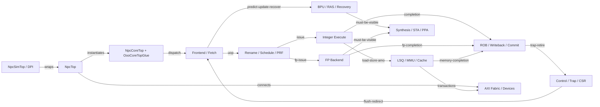
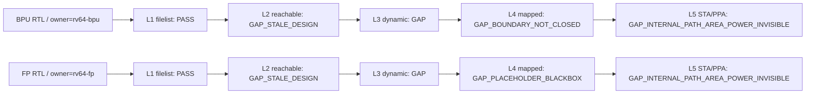

# RV64 Architecture Registry

> 本文件是本地 RV64 架构审阅的**唯一入口**，由
> `npc/rv64/design/arch/rv64-architecture-registry-v1.json` 与当前工程证据自动生成。
> 不要手工编辑；spec/历史 Markdown 只提供语义和证据，不再各自维护“当前状态”。

生成/检查命令：

```bash
python3 npc/rv64/eval/ppa/tools/architecture_registry.py capture-elaboration
python3 npc/rv64/eval/ppa/tools/architecture_registry.py render
python3 npc/rv64/eval/ppa/tools/architecture_registry.py check
```

## 当前快照

- registry 状态：`PASS_WITH_PRODUCT_GAPS`；这表示治理结构一致，但不把已知物理 GAP 写成 PASS。
- snapshot：`sha256:be98750dcc855f84d4e4bb058de9809183ea4438b49f6673aadbd31138cd30ac`
- live design：`sha256:9d8bb6af7534717f6ed4b9f93b14f63aef407f5b2bc57feb43aef37ccbfbef5d`
- 已审阅 vsrc 路径集合：`sha256:26fc817cf30538509d1867436756dd94b6d9635a6d8f2f4a8a1f8068bd5eaf84`（任意新增/删除均 fail-closed）
- Git HEAD：`32109741746d04a847b5db25a22936f8049d00a0`
- 产品：`npc-rv64-npctop-default`，top=`NpcTop`
- 源文件：147；综合清单：134；可达 module：0
- elaboration：`GAP_STALE_DESIGN`；mapped evidence：`GAP_STALE_DESIGN`
- BPU 当前 physical configuration：`mapped-5ns-bpu-local-pht-write-banked-flat-read-view-inline-v1`；source=`development`；measurement=`FAILED_INCOMPLETE`；execution=`FAIL`；verdict=`ROLLBACK`；physical=`GAP`；canonical=`false`；sweep=`BPU_CLOSED_FOR_SWEEP`

状态分两条正交轴：Git 内容状态为 `development → revision → committed`；产品资格为
`cataloged → filelist-bound → elaboration-reachable → dynamic-observed → mapped-visible → physically-closed`。
`committed` 绝不等于已验证，仿真 PASS 也绝不等于 STA/PPA 内部可见。

## 当前必须面对的 GAP

- 动态类别证据尚未给出 BPU lookup/update/recovery 与 FP launch/kill/stage5/commit 每条内部边的非零计数。
- BPU write-banked/flat-read-view source 仍为 development，但 exactly-once mapped attempt 为 FAILED_INCOMPLETE/ROLLBACK/GAP；raw WNS/area 仅是 unbound diagnostic，BPU sweep 已关闭并转向 FP。
- 冻结 B279 mapped execution receipt 为 PASS，但实验裁决为 ROLLBACK、物理状态为 GAP，仅保留为 noncanonical archive。
- 当前 live FP production-child identity 没有 mapped summary 或 architecture_registry_binding；latest BPU f5f2/B279 receipts 均为 stale-design，不能充当 current PPA。
- mapped-5ns-fp-arith-production-children-inline-v1 已登记为 development/UNMEASURED/GAP/noncanonical；本 snapshot 不把配置登记当作测量。
- BPU：当前 mapped configuration 已选择 inline RTL，但 physical closure 仍需同配置 timing/area/power 证据。
- FP：当前 mapped configuration 把 OooFpArithGate 当作 placeholder blackbox；内部 timing/area/power 不可见。
- Mapped STA/PPA 身份未闭合：status=GAP_STALE_DESIGN，evidence=sha256:b279d4bc209013144ea4075aa7102119a28ee2b77f797a98717401bc9272697e，live=sha256:9d8bb6af7534717f6ed4b9f93b14f63aef407f5b2bc57feb43aef37ccbfbef5d。
- Elaboration 收据不是 current：GAP_STALE_DESIGN。

## BPU physical experiment 状态

- live candidate：`mapped-5ns-bpu-local-pht-write-banked-flat-read-view-inline-v1`，design=`sha256:9d8bb6af7534717f6ed4b9f93b14f63aef407f5b2bc57feb43aef37ccbfbef5d`，source=`development`，measurement=`FAILED_INCOMPLETE`，mapped execution receipt=`FAIL`，experiment verdict=`ROLLBACK`，physical=`GAP`，archive=`RETAIN_NONCANONICAL_NEGATIVE_RESULT`，front_accepted=`false`，canonical=`false`，champion=`false`。
- sweep：`BPU_CLOSED_FOR_SWEEP`；唯一 next action：`STOP_BPU_PIVOT_FP`；stop condition：`TRIGGERED`。
- latest failed mapped attempt：`.github/task-runs/2026-08-10-rv64-bpu-flat-read-view-ppa-f5f2-a1/traceable-f5f2-bpu-flat-read-view-a1.status` (`sha256:f923a8ae87f26025bdec54301bf96013c31c323228a3c04f266705cfb5a4fe5e`)；command status=`.github/task-runs/2026-08-10-rv64-bpu-flat-read-view-ppa-f5f2-a1/evidence/traceable-f5f2-bpu-flat-read-view-a1/command-status.txt`；raw diagnostic=`.github/task-runs/2026-08-10-rv64-bpu-flat-read-view-ppa-f5f2-a1/evidence/traceable-f5f2-bpu-flat-read-view-a1/opensta-bpu-negative-slack.tsv` (`UNBOUND_DIAGNOSTIC_ONLY`)。
- f5f2 bound evidence：summary=`None`；architecture_registry_binding=`None`；qualified_measurement=`false`。
- frozen predecessor：`mapped-5ns-bpu-local-pht-banked-child-inline-v1`，design=`sha256:b279d4bc209013144ea4075aa7102119a28ee2b77f797a98717401bc9272697e`，mapped execution receipt=`PASS`，experiment verdict=`ROLLBACK`，physical=`GAP`，archive=`RETAIN_NONCANONICAL`。
- latest successful bound mapped summary / frozen receipt：`.github/task-runs/2026-08-10-rv64-bpu-local-pht-banked-child-ppa-b279-a1/evidence/traceable-b279-bpu-local-pht-banked-child-a1/summary.json` (`sha256:fc752a737d3b05edd8ff9f4fe6c94af4b324357bb2857c6c2ea8f7984b62d802`)。runner PASS 不是物理晋级，且该收据不绑定当前 live candidate。

## 权责源码树

```text
npc/rv64/vsrc
├── bus/  files=8  owner=[rv64-interconnect:8]  lifecycle=[committed:8]
├── cache/  files=2  owner=[rv64-memory:2]  lifecycle=[committed:2]
├── common/  files=1  owner=[rv64-core:1]  lifecycle=[committed:1]
├── control/  files=19  owner=[rv64-control:19]  lifecycle=[committed:16,development:1,revision:2]
├── core/  files=4  owner=[rv64-core:4]  lifecycle=[committed:4]
├── debug/  files=6  owner=[rv64-verification:6]  lifecycle=[committed:6]
├── decode/  files=6  owner=[rv64-decode:5,rv64-fp:1]  lifecycle=[committed:6]
├── execute/  files=25  owner=[rv64-execute:9,rv64-fp:16]  lifecycle=[committed:19,development:5,revision:1]
├── frontend/  files=31  owner=[rv64-bpu:6,rv64-frontend:25]  lifecycle=[committed:29,development:1,revision:1]
├── include/  files=1  owner=[rv64-core:1]  lifecycle=[committed:1]
├── memory/  files=21  owner=[rv64-memory:21]  lifecycle=[committed:21]
├── pipeline/  files=1  owner=[rv64-core:1]  lifecycle=[committed:1]
├── regread_bypass/  files=4  owner=[rv64-fp:2,rv64-rename-schedule:2]  lifecycle=[committed:4]
├── rename_allocate/  files=4  owner=[rv64-rename-schedule:4]  lifecycle=[committed:4]
├── scheduling/  files=3  owner=[rv64-fp:1,rv64-rename-schedule:2]  lifecycle=[committed:3]
├── sim/  files=3  owner=[rv64-verification:3]  lifecycle=[committed:3]
├── sram/  files=2  owner=[rv64-physical:2]  lifecycle=[committed:2]
└── writeback/  files=6  owner=[rv64-writeback:6]  lifecycle=[committed:6]
```

完整到每个 `.v/.sv` 的状态见本文末尾“全量文件账本”。

## 抽象架构图



图节点表达人工确认的架构职责；实例可达性仍只由同一 snapshot 绑定的 Yosys elaboration 收据决定。

## Capability 事务图

### BPU

1024-entry gshare BHT + 10-bit GHR + 256x8 local history + 16×256 write-banked/read-flat-view local PHT；逻辑状态下界 17674 bit；lookup 同周期，update 两级。

```mermaid
flowchart LR
  BPU_fetch["fetch PC / static direction"]
  BPU_lookup["predictor dual lookup"]
  BPU_fifo["fetch packet FIFO metadata"]
  BPU_issue["branch issue / resolve"]
  BPU_update_gate["BPU update gate"]
  BPU_update_s1["update S1: capture + GHR"]
  BPU_update_s2["update S2: BHT/local write"]
  BPU_recovery["redirect / ROB squash"]
  BPU_fetch -->|lookup / 0-cycle| BPU_lookup
  BPU_lookup -->|pred metadata / same fetch transaction| BPU_fifo
  BPU_fifo -->|dispatch/issue / pipeline| BPU_issue
  BPU_issue -->|resolved outcome / resolve cycle| BPU_update_gate
  BPU_update_gate -->|authorized train / stage 1| BPU_update_s1
  BPU_update_s1 -->|counter/history write / stage 2| BPU_update_s2
  BPU_issue -->|mispredict / resolve cycle| BPU_recovery
```



保持的不变量：

- 无效 entry 使用静态方向；lookup 保持双路同周期语义。
- 只有 issue 后真实 resolve 才训练，issue 前被 kill 的 wrong-path 不得训练。
- clear/reset 优先；不得无意改变同 entry 背靠背 update 的既有 RAW 行为。
- local-PHT 固定 bank=index[11:8]=PC[4:1]、row=index[7:0]=local_history；bank 只导出 Q view，wrapper 两路各以完整 index flat read且无仲裁。
- 16 个 bank 是 local-PHT valid/counter 与 counter_train/S2 write 的唯一 owner；wrapper 不得恢复公共 4096-entry write cone。
- mispredict 仍训练 actual outcome，redirect/ROB walk 不 restore predictor。
- 预测错误只影响性能；redirect、ROB walk 与 squash 保持 architectural correctness。

当前 UNKNOWN/GAP：

- lookup/update/mispredict-recovery 逐边非零计数尚未形成同身份证据。
- f5f2 raw timing/area 诊断未获 parser/binding；qualified inline/OOC input-to-output timing、area 与 power 仍未知。

### FP

OooFpArithGate meta wrapper + AddSub S1-S3 / Mul S1+S2-S3 / FMA S1-S3+S4-S5 五 production children；固定 5-cycle execute latency，launch throughput 1/cycle。

```mermaid
flowchart LR
  FP_decode["FP decode"]
  FP_rename["FP rename / busy / free"]
  FP_issue["FP issue queue"]
  FP_issue_stage["u_fp_issue_stage"]
  FP_arith["OooFpArithGate meta/kill/align S1-S5"]
  FP_addsub["OooFpAddSubPipe S1-S3"]
  FP_mul_product["OooFpMulProductPipe S1"]
  FP_mul_norm["OooFpMulNormRoundPipe S2-S3"]
  FP_fma_align["OooFpFmaAlignAddPipe S1-S3"]
  FP_fma_norm["OooFpFmaNormRoundPipe S4-S5"]
  FP_completion["completion arbitration / PRF wakeup"]
  FP_done_fifo["FP done FIFO"]
  FP_rob["WB mux / ROB done + fflags"]
  FP_commit["committed FPR / CSR fflags"]
  FP_decode -->|decoded FP uop / pipeline| FP_rename
  FP_rename -->|renamed producer / queue| FP_issue
  FP_issue -->|issue_fire && op_arith / 1 stage| FP_issue_stage
  FP_issue_stage -->|launch + resident meta / S1| FP_arith
  FP_arith -->|sample add/sub numeric inputs / S1-S3| FP_addsub
  FP_arith -->|sample mul numeric inputs / S1| FP_mul_product
  FP_mul_product -->|direct S1 Q to S2 comb / zero added boundary cycle| FP_mul_norm
  FP_arith -->|sample fused numeric inputs / S1-S3| FP_fma_align
  FP_fma_align -->|full mag/ref/sign/rm/special Q to S4 comb / zero added boundary cycle| FP_fma_norm
  FP_addsub -->|atomic value/fflags align / S4-S5| FP_arith
  FP_mul_norm -->|atomic value/fflags align / S4-S5| FP_arith
  FP_fma_norm -->|fused value/fflags resident mux / S5| FP_arith
  FP_arith -->|value/meta/fflags / stage 5| FP_completion
  FP_completion -->|authorized completion / arbitrated| FP_done_fifo
  FP_done_fifo -->|writeback / pipeline| FP_rob
  FP_rob -->|non-exception commit / retire| FP_commit
```



保持的不变量：

- ProducerId、pdest、kind、double、value 与 fflags 跨五级严格对齐。
- branch kill/flush 同周期阻断 launch，并按 ROB age 清除在途项。
- Wrapper 是 valid/ProducerId/pdest/kind/double/kill/owner 唯一 owner；children 不拥有 valid/ROB/commit。
- Mul S1 Q->S2 comb 与 FMA S3 Q->S4 comb 不增加拍；AddSub/Mul S4-S5 以 69-bit value/fflags 原子 bundle 对齐。
- FMA full mag[127:0] 跨 child 边界，mag[0] jam 不丢且只在 S5 做一次 fused rounding。
- completion 必须受 result_authorized 约束；speculative PRF/wakeup 不等于 architectural visibility。
- FP load/store、div/sqrt、convert 等其它路径不得误归入 OooFpArithGate。

当前 UNKNOWN/GAP：

- launch/kill/stage5/commit 逐边非零计数尚未形成同身份证据。
- production child split 的定量 PPA 收益尚未测量。


## BPU / FP 可见性网络



这里的 L3 只证明相关指令/事务类别在同一 design identity 下非空；BPU lookup/update/recovery 与 FP launch/kill/stage5/commit 的逐边非空计数仍是 GAP。

### 五层能力矩阵

| Capability | Owner | L1 filelist | L2 reachable | L3 dynamic | L4 mapped | L5 STA/PPA | Overall |
|---|---|---|---|---|---|---|---|
| bpu | rv64-bpu | PASS | GAP_STALE_DESIGN | GAP | GAP_BOUNDARY_NOT_CLOSED | GAP_INTERNAL_PATH_AREA_POWER_INVISIBLE | GAP |
| fp | rv64-fp | PASS | GAP_STALE_DESIGN | GAP | GAP_PLACEHOLDER_BLACKBOX | GAP_INTERNAL_PATH_AREA_POWER_INVISIBLE | GAP |

关闭条件：

- **bpu**：OooBranchDirectionPredictor 必须进入真实 stdcell 映射，或提供与 RTL/config 同身份的 signoff OOC Liberty/LEF 与约束；内部面积、功耗和 input-to-output timing 可归因后才能关闭。
- **fp**：OooFpArithGate 必须进入真实 stdcell 映射，或提供与 RTL/config 同身份的 signoff OOC Liberty/LEF 与多周期/流水约束；FP 内部面积、功耗和路径可归因后才能关闭。

当前物理结构裁决：

- **bpu / `production_write_banked_flat_read_view_rollback_archive`**：f5f2 exactly-once 5 ns mapped attempt 已失败且证据不完整；BPU sweep 关闭，保持 live development source 不作物理回退，下一架构动作转向 FP。 回滚/升级边界：f5f2 execution FAIL 已冻结为 ROLLBACK/GAP noncanonical negative result；b279 execution PASS 仍仅为 ROLLBACK/GAP noncanonical archive，二者均不得进入 Pareto front。
- **fp / `production_child_ooc_composite_diagnostic_tool_unmeasured`**：整核全内联在 ABC 5400 秒窗口未完成；下一新 run-id 只允许 mapped-5ns-fp-arith-production-children-ooc-boundary-v1：wrapper inline，五 child 逐个真实 OOC 映射并以 OOC_STA_ABSTRACTION 顺序 Liberty 回接，同一 NpcTop/5.0ns 图核对 child 内部与 top boundary。当前仍不得宣称 PPA。 回滚/升级边界：任一 child cells/area、max/min path class、五条 top boundary、identity/manifest、面积单计或 cleanup 不闭合即回滚该 run；诊断 Liberty 无 power/signoff 模型，不能成为 canonical/champion。

## 物理边界

| Module | RTL / Liberty | Netlist representation | Timing / area / power basis | Capability | State |
|---|---|---|---|---|---|
| Sram4096x199 | `npc/rv64/vsrc/sram/Sram4096x199.v`<br>`npc/rv64/syn/macro-lib/Sram4096x199.lib` | single_blackbox_cell | placeholder_non_signoff_boundary<br>unknown_excluded_from_logic_area_proxy<br>unqualified_fixed_toggle_or_absent | fetch-cache-storage | GAP |
| Sram4096x113 | `npc/rv64/vsrc/sram/Sram4096x113.v`<br>`npc/rv64/syn/macro-lib/Sram4096x113.lib` | single_blackbox_cell | placeholder_non_signoff_boundary<br>unknown_excluded_from_logic_area_proxy<br>unqualified_fixed_toggle_or_absent | data-cache-storage | GAP |
| OooFpArithGate | `npc/rv64/vsrc/execute/OooFpArithGate.v`<br>`npc/rv64/syn/macro-lib/OooFpArithGate.lib` | single_blackbox_cell | placeholder_non_signoff_boundary<br>unknown_excluded_from_logic_area_proxy<br>unqualified_fixed_toggle_or_absent | fp | GAP |
| OooBranchDirectionPredictor | `npc/rv64/vsrc/frontend/OooBranchDirectionPredictor.v`<br>`npc/rv64/syn/macro-lib/OooBranchDirectionPredictor.lib` | single_blackbox_cell | placeholder_missing_real_input_to_output_arcs<br>unknown_excluded_from_logic_area_proxy<br>unqualified_fixed_toggle_or_absent | bpu | GAP |

`runner PASS` 只说明工具流程完成。placeholder Liberty 的零面积、无内部 path 或边界 arc 不能升级为物理闭环。

### FP production-child OOC composite 诊断配置

- Configuration：`mapped-5ns-fp-arith-production-children-ooc-boundary-v1`；profile：`fp-arith-ooc-composite-v1`；abstraction：`OOC_STA_ABSTRACTION`。
- Inline RTL：`OooFpArithGate`。
- Known OOC macros：`OooFpAddSubPipe, OooFpMulProductPipe, OooFpMulNormRoundPipe, OooFpFmaAlignAddPipe, OooFpFmaNormRoundPipe`（各 1 instance）。
- Child source domains：`source_closure` 绑定 define/helper/child RTL/`filelist.mk` 身份；`compile_sources` 是其精确 Verilog 子集且包含 child RTL，只有该列表可送入 child Yosys。
- Unknown placeholders：`Sram4096x199×1, Sram4096x113×2, OooBranchDirectionPredictor×1`。
- Final FMA boundary sink：`u_core/u_ooo_core/u_execute_backend/u_core_slice/u_decode_backend/u_int_backend/u_fp_backend` 的 completion FIFO `df_value_q`/`df_fflags_q` register-D（cardinality 512/40）；`OooFpArithGate.out_value_o/out_fflags_o` 不是 NpcTop ports。
- 该配置只授权一个新 run-id 的 5.0ns diagnostic composite：child max/min/internal、top 五条 boundary、面积单计与 identity receipts 全部闭合后也仍为 GAP/noncanonical/nonchampion；无 OOC power/signoff 模型。

## 显式产品角色例外

这些例外是人工真源中必须审阅的意图；未实例化本身不会自动得到 `catalog_only` 豁免。

| Path | Role | Configuration | Intent | Review expiry |
|---|---|---|---|---|
| `npc/rv64/vsrc/control/OooSerializedMemTerminalPermit.v` | product | product_core | Serialized memory terminal permit 的 live product leaf；当前为开发态并由 OooControlPlane 实例化。 | when-file-enters-committed-lifecycle |
| `npc/rv64/vsrc/debug/OooAdUpdateChecker.sv` | debug_only | sim_top | A/D update assertion checker；仅旁挂 canonical SIM_TOP，不进入 synthesis。 | when-ad-update-observation-contract-changes |
| `npc/rv64/vsrc/debug/OooBranchDirectionPredictorChecker.sv` | debug_only | focused_only | BPU facts checker；当前由 focused TB 使用，不进入 canonical SIM_TOP_SRCS 或 synthesis。 | when-bpu-checker-is-attached-to-sim-top |
| `npc/rv64/vsrc/debug/OooDataWordCacheChecker.sv` | debug_only | focused_only | D-cache facts checker；当前由 focused TB 使用，不进入 canonical SIM_TOP_SRCS 或 synthesis。 | when-cache-checker-is-attached-to-sim-top |
| `npc/rv64/vsrc/debug/OooFetchPacketCacheChecker.sv` | debug_only | focused_only | fetch-cache facts checker；当前由 focused TB 使用，不进入 canonical SIM_TOP_SRCS 或 synthesis。 | when-cache-checker-is-attached-to-sim-top |
| `npc/rv64/vsrc/debug/OooRedirectMuxChecker.sv` | debug_only | sim_top | redirect mux winner assertion checker；仅旁挂 canonical SIM_TOP，不进入 synthesis。 | when-redirect-arbitration-contract-changes |
| `npc/rv64/vsrc/debug/OooRedirectSeqChecker.sv` | debug_only | sim_top | redirect sequence assertion checker；仅旁挂 canonical SIM_TOP，不进入 synthesis。 | when-redirect-sequencing-contract-changes |
| `npc/rv64/vsrc/execute/OooFpAddSubPipe.v` | product | product_core | FP short-arithmetic production child；唯一拥有 single/double AddSub S1-S3 numeric/fflags Q。 | when-fp-arith-child-enters-committed-lifecycle-or-boundary-changes |
| `npc/rv64/vsrc/execute/OooFpFmaAlignAddPipe.v` | product | product_core | FP fused-arithmetic production child；唯一拥有 FMA S1-S3 product/ref/align/add Q，并原样导出 full mag[127:0] jam。 | when-fp-arith-child-enters-committed-lifecycle-or-boundary-changes |
| `npc/rv64/vsrc/execute/OooFpFmaNormRoundPipe.v` | product | product_core | FP fused-arithmetic production child；直接消费完整 S3 Q 并唯一拥有 S4-S5 normalize/single-round/value/fflags Q。 | when-fp-arith-child-enters-committed-lifecycle-or-boundary-changes |
| `npc/rv64/vsrc/execute/OooFpMulNormRoundPipe.v` | product | product_core | FP short-arithmetic production child；直接消费 Mul S1 Q 并唯一拥有 S2-S3 normalize/round/value/fflags Q。 | when-fp-arith-child-enters-committed-lifecycle-or-boundary-changes |
| `npc/rv64/vsrc/execute/OooFpMulProductPipe.v` | product | product_core | FP short-arithmetic production child；唯一拥有 single/double Mul S1 product/special/exp/sign/rm Q。 | when-fp-arith-child-enters-committed-lifecycle-or-boundary-changes |
| `npc/rv64/vsrc/frontend/OooBranchLocalPht.v` | product | product_core | OooBranchDirectionPredictor 的 production local-PHT child；固定 16×256 bank-local state/S1/S2 与 Q 端 flat read view，保持双路 0-cycle 与 read-before-write。 | when-flat-read-view-rtl-is-physically-reverted-or-replaced |
| `npc/rv64/vsrc/memory/OooDualMemAxiArbiter.v` | product | — | Canonical F2 shared miss-fabric leaf；当前 elaboration 路径为 NpcTop.u_core.u_ooo_dual_mem_bridge.u_miss_arbiter。 | — |
| `npc/rv64/vsrc/memory/OooDualMemBridgeWrapper.v` | product | — | Canonical dual-memory wrapper；当前 elaboration 路径为 NpcTop.u_core.u_ooo_dual_mem_bridge。 | — |
| `npc/rv64/vsrc/memory/OooMmuEpochOwner.v` | catalog_only | catalog_compiled | Data-MMU context/epoch owner leaf；当前仅编译与 focused 验证，尚未进入 canonical NpcTop | next-mmu-epoch-integration-slice |
| `npc/rv64/vsrc/memory/OooPmaChecker.v` | catalog_only | catalog_compiled | 旧单输出 PMA checker；live bridge 已迁移到 OooTypedPmaChecker，保留作兼容/focused 对照 | typed-memory-legacy-retirement-review |
| `npc/rv64/vsrc/memory/OooPostTranslateMemoryClass.v` | catalog_only | catalog_compiled | 旧 post-translate classifier；live bridge 已迁移到 OooTypedMemoryClassifier，保留作 focused 对照 | typed-memory-legacy-retirement-review |
| `npc/rv64/vsrc/sim/AxiDpiSlave.sv` | sim_only | sim_top | DPI-backed AXI simulation slave；进入 canonical SIM_TOP_SRCS，不进入 synthesis。 | when-simulation-axi-boundary-changes |
| `npc/rv64/vsrc/sim/AxiVirtioBlk.sv` | sim_only | sim_top | VirtIO block simulation model；进入 canonical SIM_TOP_SRCS，不进入 synthesis。 | when-simulation-virtio-boundary-changes |
| `npc/rv64/vsrc/sim/NpcSimTop.sv` | sim_only | sim_top | NpcTop 的 canonical simulation wrapper；进入 SIM_TOP_SRCS，不进入 synthesis。 | when-product-simulation-topology-changes |

## 全量文件账本

| Path | Owner | Role | Lifecycle | Module(s) / instance path(s) | Filelist | Reachable | Dynamic | Mapped / STA-PPA |
|---|---|---|---|---|---|---|---|---|
| `npc/rv64/vsrc/bus/AxiClint.v` | rv64-interconnect | product | committed | AxiClint<br>— | PASS | GAP_STALE_DESIGN | SYSTEM_BOUND_NO_NODE_COUNTER | GAP_STALE_DESIGN / GAP_STALE_DESIGN |
| `npc/rv64/vsrc/bus/AxiCrossbar.v` | rv64-interconnect | product | committed | AxiCrossbar<br>— | PASS | GAP_STALE_DESIGN | SYSTEM_BOUND_NO_NODE_COUNTER | GAP_STALE_DESIGN / GAP_STALE_DESIGN |
| `npc/rv64/vsrc/bus/AxiDefaultSlave.v` | rv64-interconnect | product | committed | AxiDefaultSlave<br>— | PASS | GAP_STALE_DESIGN | SYSTEM_BOUND_NO_NODE_COUNTER | GAP_STALE_DESIGN / GAP_STALE_DESIGN |
| `npc/rv64/vsrc/bus/AxiPlic.v` | rv64-interconnect | product | committed | AxiPlic<br>— | PASS | GAP_STALE_DESIGN | SYSTEM_BOUND_NO_NODE_COUNTER | GAP_STALE_DESIGN / GAP_STALE_DESIGN |
| `npc/rv64/vsrc/bus/AxiResetSyscon.v` | rv64-interconnect | product | committed | AxiResetSyscon<br>— | PASS | GAP_STALE_DESIGN | SYSTEM_BOUND_NO_NODE_COUNTER | GAP_STALE_DESIGN / GAP_STALE_DESIGN |
| `npc/rv64/vsrc/bus/AxiToUart.v` | rv64-interconnect | product | committed | AxiToUart<br>— | PASS | GAP_STALE_DESIGN | SYSTEM_BOUND_NO_NODE_COUNTER | GAP_STALE_DESIGN / GAP_STALE_DESIGN |
| `npc/rv64/vsrc/bus/NpcAxiBus.v` | rv64-interconnect | product | committed | NpcAxiBus<br>— | PASS | GAP_STALE_DESIGN | SYSTEM_BOUND_NO_NODE_COUNTER | GAP_STALE_DESIGN / GAP_STALE_DESIGN |
| `npc/rv64/vsrc/bus/Uart.v` | rv64-interconnect | product | committed | Uart<br>— | PASS | GAP_STALE_DESIGN | SYSTEM_BOUND_NO_NODE_COUNTER | GAP_STALE_DESIGN / GAP_STALE_DESIGN |
| `npc/rv64/vsrc/cache/OooDataWordCache.v` | rv64-memory | product | committed | OooDataWordCache<br>— | PASS | GAP_STALE_DESIGN | SYSTEM_BOUND_NO_NODE_COUNTER | GAP_STALE_DESIGN / GAP_STALE_DESIGN |
| `npc/rv64/vsrc/cache/OooFetchPacketCache.v` | rv64-memory | product | committed | OooFetchPacketCache<br>— | PASS | GAP_STALE_DESIGN | SYSTEM_BOUND_NO_NODE_COUNTER | GAP_STALE_DESIGN / GAP_STALE_DESIGN |
| `npc/rv64/vsrc/common/OooSlotFacts.v` | rv64-core | source_fragment | committed | —<br>— | SOURCE_FRAGMENT | GAP_STALE_DESIGN | DEPENDENCY_FRAGMENT | N_A / N_A |
| `npc/rv64/vsrc/control/OooControlEventApplySequencer.v` | rv64-control | product | committed | OooControlEventApplySequencer<br>— | PASS | GAP_STALE_DESIGN | SYSTEM_BOUND_NO_NODE_COUNTER | GAP_STALE_DESIGN / GAP_STALE_DESIGN |
| `npc/rv64/vsrc/control/OooControlFlushSequencer.v` | rv64-control | product | committed | OooControlFlushSequencer<br>— | PASS | GAP_STALE_DESIGN | SYSTEM_BOUND_NO_NODE_COUNTER | GAP_STALE_DESIGN / GAP_STALE_DESIGN |
| `npc/rv64/vsrc/control/OooControlPlane.v` | rv64-control | product | revision | OooControlPlane<br>— | PASS | GAP_STALE_DESIGN | SYSTEM_BOUND_NO_NODE_COUNTER | GAP_STALE_DESIGN / GAP_STALE_DESIGN |
| `npc/rv64/vsrc/control/OooCoreObservableOutputGate.v` | rv64-control | product | committed | OooCoreObservableOutputGate<br>— | PASS | GAP_STALE_DESIGN | SYSTEM_BOUND_NO_NODE_COUNTER | GAP_STALE_DESIGN / GAP_STALE_DESIGN |
| `npc/rv64/vsrc/control/OooCoreSliceControlGate.v` | rv64-control | product | committed | OooCoreSliceControlGate<br>— | PASS | GAP_STALE_DESIGN | SYSTEM_BOUND_NO_NODE_COUNTER | GAP_STALE_DESIGN / GAP_STALE_DESIGN |
| `npc/rv64/vsrc/control/OooCsrAccessRequestMux.v` | rv64-control | product | committed | OooCsrAccessRequestMux<br>— | PASS | GAP_STALE_DESIGN | SYSTEM_BOUND_NO_NODE_COUNTER | GAP_STALE_DESIGN / GAP_STALE_DESIGN |
| `npc/rv64/vsrc/control/OooCsrIllegalProbeGate.v` | rv64-control | product | committed | OooCsrIllegalProbeGate<br>— | PASS | GAP_STALE_DESIGN | SYSTEM_BOUND_NO_NODE_COUNTER | GAP_STALE_DESIGN / GAP_STALE_DESIGN |
| `npc/rv64/vsrc/control/OooCsrTrapRequestMux.v` | rv64-control | product | committed | OooCsrTrapRequestMux<br>— | PASS | GAP_STALE_DESIGN | SYSTEM_BOUND_NO_NODE_COUNTER | GAP_STALE_DESIGN / GAP_STALE_DESIGN |
| `npc/rv64/vsrc/control/OooPendingDispatchArbiter.v` | rv64-control | product | committed | OooPendingDispatchArbiter<br>— | PASS | GAP_STALE_DESIGN | SYSTEM_BOUND_NO_NODE_COUNTER | GAP_STALE_DESIGN / GAP_STALE_DESIGN |
| `npc/rv64/vsrc/control/OooPendingDrainResolveGate.v` | rv64-control | product | revision | OooPendingDrainResolveGate<br>— | PASS | GAP_STALE_DESIGN | SYSTEM_BOUND_NO_NODE_COUNTER | GAP_STALE_DESIGN / GAP_STALE_DESIGN |
| `npc/rv64/vsrc/control/OooPendingLane1CaptureGate.v` | rv64-control | product | committed | OooPendingLane1CaptureGate<br>— | PASS | GAP_STALE_DESIGN | SYSTEM_BOUND_NO_NODE_COUNTER | GAP_STALE_DESIGN / GAP_STALE_DESIGN |
| `npc/rv64/vsrc/control/OooPendingSystemAdmissionCancelGate.v` | rv64-control | product | committed | OooPendingSystemAdmissionCancelGate<br>— | PASS | GAP_STALE_DESIGN | SYSTEM_BOUND_NO_NODE_COUNTER | GAP_STALE_DESIGN / GAP_STALE_DESIGN |
| `npc/rv64/vsrc/control/OooPendingSystemSequencer.v` | rv64-control | product | committed | OooPendingSystemSequencer<br>— | PASS | GAP_STALE_DESIGN | SYSTEM_BOUND_NO_NODE_COUNTER | GAP_STALE_DESIGN / GAP_STALE_DESIGN |
| `npc/rv64/vsrc/control/OooPendingTrapExitSequencer.v` | rv64-control | product | committed | OooPendingTrapExitSequencer<br>— | PASS | GAP_STALE_DESIGN | SYSTEM_BOUND_NO_NODE_COUNTER | GAP_STALE_DESIGN / GAP_STALE_DESIGN |
| `npc/rv64/vsrc/control/OooRedirectArbiter.v` | rv64-control | product | committed | OooRedirectArbiter<br>— | PASS | GAP_STALE_DESIGN | SYSTEM_BOUND_NO_NODE_COUNTER | GAP_STALE_DESIGN / GAP_STALE_DESIGN |
| `npc/rv64/vsrc/control/OooSerializedMemTerminalPermit.v` | rv64-control | product | development | OooSerializedMemTerminalPermit<br>— | PASS | GAP_STALE_DESIGN | SYSTEM_BOUND_NO_NODE_COUNTER | GAP_STALE_DESIGN / GAP_STALE_DESIGN |
| `npc/rv64/vsrc/control/OooStopPendingSequencer.v` | rv64-control | product | committed | OooStopPendingSequencer<br>— | PASS | GAP_STALE_DESIGN | SYSTEM_BOUND_NO_NODE_COUNTER | GAP_STALE_DESIGN / GAP_STALE_DESIGN |
| `npc/rv64/vsrc/control/OooTrapExitEventMux.v` | rv64-control | product | committed | OooTrapExitEventMux<br>— | PASS | GAP_STALE_DESIGN | SYSTEM_BOUND_NO_NODE_COUNTER | GAP_STALE_DESIGN / GAP_STALE_DESIGN |
| `npc/rv64/vsrc/control/OooTrapExitOutputSequencer.v` | rv64-control | product | committed | OooTrapExitOutputSequencer<br>— | PASS | GAP_STALE_DESIGN | SYSTEM_BOUND_NO_NODE_COUNTER | GAP_STALE_DESIGN / GAP_STALE_DESIGN |
| `npc/rv64/vsrc/core/CsrFile.v` | rv64-core | product | committed | CsrFile<br>— | PASS | GAP_STALE_DESIGN | SYSTEM_BOUND_NO_NODE_COUNTER | GAP_STALE_DESIGN / GAP_STALE_DESIGN |
| `npc/rv64/vsrc/core/NpcCoreTop.v` | rv64-core | product | committed | NpcCoreTop<br>— | PASS | GAP_STALE_DESIGN | SYSTEM_BOUND_NO_NODE_COUNTER | GAP_STALE_DESIGN / GAP_STALE_DESIGN |
| `npc/rv64/vsrc/core/NpcTop.v` | rv64-core | product | committed | NpcTop<br>— | PASS | GAP_STALE_DESIGN | SYSTEM_BOUND_NO_NODE_COUNTER | GAP_STALE_DESIGN / GAP_STALE_DESIGN |
| `npc/rv64/vsrc/core/OooCoreTopGlue.v` | rv64-core | product | committed | OooCoreTopGlue<br>— | PASS | GAP_STALE_DESIGN | SYSTEM_BOUND_NO_NODE_COUNTER | GAP_STALE_DESIGN / GAP_STALE_DESIGN |
| `npc/rv64/vsrc/debug/OooAdUpdateChecker.sv` | rv64-verification | debug_only | committed | OooAdUpdateChecker<br>— | DEBUG_ONLY | GAP_STALE_DESIGN | N_A | N_A / N_A |
| `npc/rv64/vsrc/debug/OooBranchDirectionPredictorChecker.sv` | rv64-verification | debug_only | committed | OooBranchDirectionPredictorChecker<br>— | DEBUG_ONLY | GAP_STALE_DESIGN | N_A | N_A / N_A |
| `npc/rv64/vsrc/debug/OooDataWordCacheChecker.sv` | rv64-verification | debug_only | committed | OooDataWordCacheChecker<br>— | DEBUG_ONLY | GAP_STALE_DESIGN | N_A | N_A / N_A |
| `npc/rv64/vsrc/debug/OooFetchPacketCacheChecker.sv` | rv64-verification | debug_only | committed | OooFetchPacketCacheChecker<br>— | DEBUG_ONLY | GAP_STALE_DESIGN | N_A | N_A / N_A |
| `npc/rv64/vsrc/debug/OooRedirectMuxChecker.sv` | rv64-verification | debug_only | committed | OooRedirectMuxChecker<br>— | DEBUG_ONLY | GAP_STALE_DESIGN | N_A | N_A / N_A |
| `npc/rv64/vsrc/debug/OooRedirectSeqChecker.sv` | rv64-verification | debug_only | committed | OooRedirectSeqChecker<br>— | DEBUG_ONLY | GAP_STALE_DESIGN | N_A | N_A / N_A |
| `npc/rv64/vsrc/decode/DecodeStage.v` | rv64-decode | product | committed | DecodeStage<br>— | PASS | GAP_STALE_DESIGN | SYSTEM_BOUND_NO_NODE_COUNTER | GAP_STALE_DESIGN / GAP_STALE_DESIGN |
| `npc/rv64/vsrc/decode/DecodeUnit.v` | rv64-decode | product | committed | DecodeUnit<br>— | PASS | GAP_STALE_DESIGN | SYSTEM_BOUND_NO_NODE_COUNTER | GAP_STALE_DESIGN / GAP_STALE_DESIGN |
| `npc/rv64/vsrc/decode/ImmGen.v` | rv64-decode | product | committed | ImmGen<br>— | PASS | GAP_STALE_DESIGN | SYSTEM_BOUND_NO_NODE_COUNTER | GAP_STALE_DESIGN / GAP_STALE_DESIGN |
| `npc/rv64/vsrc/decode/OooAluDecodeBackend.v` | rv64-decode | product | committed | OooAluDecodeBackend<br>— | PASS | GAP_STALE_DESIGN | SYSTEM_BOUND_NO_NODE_COUNTER | GAP_STALE_DESIGN / GAP_STALE_DESIGN |
| `npc/rv64/vsrc/decode/OooFpDecode.v` | rv64-fp | product | committed | OooFpDecode<br>— | PASS | GAP_STALE_DESIGN | SYSTEM_BOUND_NO_NODE_COUNTER | GAP_STALE_DESIGN / GAP_STALE_DESIGN |
| `npc/rv64/vsrc/decode/OooRvcDecompressor.v` | rv64-decode | product | committed | OooRvcDecompressor<br>— | PASS | GAP_STALE_DESIGN | SYSTEM_BOUND_NO_NODE_COUNTER | GAP_STALE_DESIGN / GAP_STALE_DESIGN |
| `npc/rv64/vsrc/execute/ALU.v` | rv64-execute | product | committed | ALU<br>— | PASS | GAP_STALE_DESIGN | SYSTEM_BOUND_NO_NODE_COUNTER | GAP_STALE_DESIGN / GAP_STALE_DESIGN |
| `npc/rv64/vsrc/execute/CompareUnit.v` | rv64-execute | product | committed | CompareUnit<br>— | PASS | GAP_STALE_DESIGN | SYSTEM_BOUND_NO_NODE_COUNTER | GAP_STALE_DESIGN / GAP_STALE_DESIGN |
| `npc/rv64/vsrc/execute/OooAluCoreSlice.v` | rv64-execute | product | committed | OooAluCoreSlice<br>— | PASS | GAP_STALE_DESIGN | SYSTEM_BOUND_NO_NODE_COUNTER | GAP_STALE_DESIGN / GAP_STALE_DESIGN |
| `npc/rv64/vsrc/execute/OooAmoGate.v` | rv64-execute | product | committed | OooAmoGate<br>— | PASS | GAP_STALE_DESIGN | SYSTEM_BOUND_NO_NODE_COUNTER | GAP_STALE_DESIGN / GAP_STALE_DESIGN |
| `npc/rv64/vsrc/execute/OooBitmanipGate.v` | rv64-execute | product | committed | OooBitmanipGate<br>— | PASS | GAP_STALE_DESIGN | SYSTEM_BOUND_NO_NODE_COUNTER | GAP_STALE_DESIGN / GAP_STALE_DESIGN |
| `npc/rv64/vsrc/execute/OooClmulUnit.v` | rv64-execute | product | committed | OooClmulUnit<br>— | PASS | GAP_STALE_DESIGN | SYSTEM_BOUND_NO_NODE_COUNTER | GAP_STALE_DESIGN / GAP_STALE_DESIGN |
| `npc/rv64/vsrc/execute/OooExecuteBackend.v` | rv64-execute | product | committed | OooExecuteBackend<br>— | PASS | GAP_STALE_DESIGN | SYSTEM_BOUND_NO_NODE_COUNTER | GAP_STALE_DESIGN / GAP_STALE_DESIGN |
| `npc/rv64/vsrc/execute/OooFpAddSubPipe.v` | rv64-fp | product | development | OooFpAddSubPipe<br>— | PASS | GAP_STALE_DESIGN | SYSTEM_BOUND_NO_NODE_COUNTER | GAP_STALE_DESIGN / GAP_STALE_DESIGN |
| `npc/rv64/vsrc/execute/OooFpArithGate.v` | rv64-fp | product | revision | OooFpArithGate<br>— | PASS | GAP_STALE_DESIGN | FOCUSED_PASS | GAP_STALE_PLUS_PLACEHOLDER_BLACKBOX / GAP_INTERNAL_PATH_AREA_POWER_INVISIBLE |
| `npc/rv64/vsrc/execute/OooFpBackend.v` | rv64-fp | product | committed | OooFpBackend<br>— | PASS | GAP_STALE_DESIGN | SYSTEM_BOUND_NO_NODE_COUNTER | GAP_STALE_DESIGN / GAP_STALE_DESIGN |
| `npc/rv64/vsrc/execute/OooFpClassifyGate.v` | rv64-fp | product | committed | OooFpClassifyGate<br>— | PASS | GAP_STALE_DESIGN | SYSTEM_BOUND_NO_NODE_COUNTER | GAP_STALE_DESIGN / GAP_STALE_DESIGN |
| `npc/rv64/vsrc/execute/OooFpCompareGate.v` | rv64-fp | product | committed | OooFpCompareGate<br>— | PASS | GAP_STALE_DESIGN | SYSTEM_BOUND_NO_NODE_COUNTER | GAP_STALE_DESIGN / GAP_STALE_DESIGN |
| `npc/rv64/vsrc/execute/OooFpConvertGate.v` | rv64-fp | product | committed | OooFpConvertGate<br>— | PASS | GAP_STALE_DESIGN | SYSTEM_BOUND_NO_NODE_COUNTER | GAP_STALE_DESIGN / GAP_STALE_DESIGN |
| `npc/rv64/vsrc/execute/OooFpDivIter.v` | rv64-fp | product | committed | OooFpDivIter<br>— | PASS | GAP_STALE_DESIGN | SYSTEM_BOUND_NO_NODE_COUNTER | GAP_STALE_DESIGN / GAP_STALE_DESIGN |
| `npc/rv64/vsrc/execute/OooFpFmaAlignAddPipe.v` | rv64-fp | product | development | OooFpFmaAlignAddPipe<br>— | PASS | GAP_STALE_DESIGN | SYSTEM_BOUND_NO_NODE_COUNTER | GAP_STALE_DESIGN / GAP_STALE_DESIGN |
| `npc/rv64/vsrc/execute/OooFpFmaNormRoundPipe.v` | rv64-fp | product | development | OooFpFmaNormRoundPipe<br>— | PASS | GAP_STALE_DESIGN | SYSTEM_BOUND_NO_NODE_COUNTER | GAP_STALE_DESIGN / GAP_STALE_DESIGN |
| `npc/rv64/vsrc/execute/OooFpLongOpGate.v` | rv64-fp | product | committed | OooFpLongOpGate<br>— | PASS | GAP_STALE_DESIGN | SYSTEM_BOUND_NO_NODE_COUNTER | GAP_STALE_DESIGN / GAP_STALE_DESIGN |
| `npc/rv64/vsrc/execute/OooFpMulNormRoundPipe.v` | rv64-fp | product | development | OooFpMulNormRoundPipe<br>— | PASS | GAP_STALE_DESIGN | SYSTEM_BOUND_NO_NODE_COUNTER | GAP_STALE_DESIGN / GAP_STALE_DESIGN |
| `npc/rv64/vsrc/execute/OooFpMulProductPipe.v` | rv64-fp | product | development | OooFpMulProductPipe<br>— | PASS | GAP_STALE_DESIGN | SYSTEM_BOUND_NO_NODE_COUNTER | GAP_STALE_DESIGN / GAP_STALE_DESIGN |
| `npc/rv64/vsrc/execute/OooFpPredicates.v` | rv64-fp | source_fragment | committed | —<br>— | SOURCE_FRAGMENT | GAP_STALE_DESIGN | DEPENDENCY_FRAGMENT | N_A / N_A |
| `npc/rv64/vsrc/execute/OooFpRound.v` | rv64-fp | source_fragment | committed | —<br>— | SOURCE_FRAGMENT | GAP_STALE_DESIGN | DEPENDENCY_FRAGMENT | N_A / N_A |
| `npc/rv64/vsrc/execute/OooFpSgnjGate.v` | rv64-fp | product | committed | OooFpSgnjGate<br>— | PASS | GAP_STALE_DESIGN | SYSTEM_BOUND_NO_NODE_COUNTER | GAP_STALE_DESIGN / GAP_STALE_DESIGN |
| `npc/rv64/vsrc/execute/OooFpSqrtIter.v` | rv64-fp | product | committed | OooFpSqrtIter<br>— | PASS | GAP_STALE_DESIGN | SYSTEM_BOUND_NO_NODE_COUNTER | GAP_STALE_DESIGN / GAP_STALE_DESIGN |
| `npc/rv64/vsrc/execute/OooIntBackend.v` | rv64-execute | product | committed | OooIntBackend<br>— | PASS | GAP_STALE_DESIGN | SYSTEM_BOUND_NO_NODE_COUNTER | GAP_STALE_DESIGN / GAP_STALE_DESIGN |
| `npc/rv64/vsrc/execute/OooMulDivUnit.v` | rv64-execute | product | committed | OooMulDivUnit<br>— | PASS | GAP_STALE_DESIGN | SYSTEM_BOUND_NO_NODE_COUNTER | GAP_STALE_DESIGN / GAP_STALE_DESIGN |
| `npc/rv64/vsrc/frontend/OooBackendDrainTracker.v` | rv64-frontend | product | committed | OooBackendDrainTracker<br>— | PASS | GAP_STALE_DESIGN | SYSTEM_BOUND_NO_NODE_COUNTER | GAP_STALE_DESIGN / GAP_STALE_DESIGN |
| `npc/rv64/vsrc/frontend/OooBranchAppendDispatchGate.v` | rv64-frontend | product | committed | OooBranchAppendDispatchGate<br>— | PASS | GAP_STALE_DESIGN | SYSTEM_BOUND_NO_NODE_COUNTER | GAP_STALE_DESIGN / GAP_STALE_DESIGN |
| `npc/rv64/vsrc/frontend/OooBranchBpuUpdateGate.v` | rv64-bpu | product | committed | OooBranchBpuUpdateGate<br>— | PASS | GAP_STALE_DESIGN | SYSTEM_BOUND_NO_NODE_COUNTER | GAP_STALE_DESIGN / GAP_STALE_DESIGN |
| `npc/rv64/vsrc/frontend/OooBranchDirectionPredictor.v` | rv64-bpu | product | revision | OooBranchDirectionPredictor<br>— | PASS | GAP_STALE_DESIGN | SYSTEM_BOUND_NO_NODE_COUNTER | GAP_STALE_DESIGN / GAP_INTERNAL_PATH_AREA_POWER_INVISIBLE |
| `npc/rv64/vsrc/frontend/OooBranchLocalPht.v` | rv64-bpu | product | development | OooBranchLocalPht, OooBranchLocalPhtBank<br>— | PASS | GAP_STALE_DESIGN | SYSTEM_BOUND_NO_NODE_COUNTER | GAP_STALE_DESIGN / GAP_STALE_DESIGN |
| `npc/rv64/vsrc/frontend/OooBranchResolveRecoveryGate.v` | rv64-frontend | product | committed | OooBranchResolveRecoveryGate<br>— | PASS | GAP_STALE_DESIGN | SYSTEM_BOUND_NO_NODE_COUNTER | GAP_STALE_DESIGN / GAP_STALE_DESIGN |
| `npc/rv64/vsrc/frontend/OooBranchSpecTracker.v` | rv64-bpu | product | committed | OooBranchSpecTracker<br>— | PASS | GAP_STALE_DESIGN | SYSTEM_BOUND_NO_NODE_COUNTER | GAP_STALE_DESIGN / GAP_STALE_DESIGN |
| `npc/rv64/vsrc/frontend/OooDirectBranchResolveGate.v` | rv64-frontend | product | committed | OooDirectBranchResolveGate<br>— | PASS | GAP_STALE_DESIGN | SYSTEM_BOUND_NO_NODE_COUNTER | GAP_STALE_DESIGN / GAP_STALE_DESIGN |
| `npc/rv64/vsrc/frontend/OooDirectBranchWaitBuffer.v` | rv64-frontend | product | committed | OooDirectBranchWaitBuffer<br>— | PASS | GAP_STALE_DESIGN | SYSTEM_BOUND_NO_NODE_COUNTER | GAP_STALE_DESIGN / GAP_STALE_DESIGN |
| `npc/rv64/vsrc/frontend/OooDirectControlFlowGate.v` | rv64-frontend | product | committed | OooDirectControlFlowGate<br>— | PASS | GAP_STALE_DESIGN | SYSTEM_BOUND_NO_NODE_COUNTER | GAP_STALE_DESIGN / GAP_STALE_DESIGN |
| `npc/rv64/vsrc/frontend/OooDirectRasCandidateGate.v` | rv64-frontend | product | committed | OooDirectRasCandidateGate<br>— | PASS | GAP_STALE_DESIGN | SYSTEM_BOUND_NO_NODE_COUNTER | GAP_STALE_DESIGN / GAP_STALE_DESIGN |
| `npc/rv64/vsrc/frontend/OooFetchAxiBridge.v` | rv64-frontend | product | committed | OooFetchAxiBridge<br>— | PASS | GAP_STALE_DESIGN | SYSTEM_BOUND_NO_NODE_COUNTER | GAP_STALE_DESIGN / GAP_STALE_DESIGN |
| `npc/rv64/vsrc/frontend/OooFetchBranchTarget.v` | rv64-frontend | product | committed | OooFetchBranchTarget<br>— | PASS | GAP_STALE_DESIGN | SYSTEM_BOUND_NO_NODE_COUNTER | GAP_STALE_DESIGN / GAP_STALE_DESIGN |
| `npc/rv64/vsrc/frontend/OooFetchFlowControl.v` | rv64-frontend | product | committed | OooFetchFlowControl<br>— | PASS | GAP_STALE_DESIGN | SYSTEM_BOUND_NO_NODE_COUNTER | GAP_STALE_DESIGN / GAP_STALE_DESIGN |
| `npc/rv64/vsrc/frontend/OooFetchHeadClassifyGate.v` | rv64-frontend | product | committed | OooFetchHeadClassifyGate<br>— | PASS | GAP_STALE_DESIGN | SYSTEM_BOUND_NO_NODE_COUNTER | GAP_STALE_DESIGN / GAP_STALE_DESIGN |
| `npc/rv64/vsrc/frontend/OooFetchHeadPairGate.v` | rv64-frontend | product | committed | OooFetchHeadPairGate<br>— | PASS | GAP_STALE_DESIGN | SYSTEM_BOUND_NO_NODE_COUNTER | GAP_STALE_DESIGN / GAP_STALE_DESIGN |
| `npc/rv64/vsrc/frontend/OooFetchPacketDecode.v` | rv64-frontend | product | committed | OooFetchPacketDecode<br>— | PASS | GAP_STALE_DESIGN | SYSTEM_BOUND_NO_NODE_COUNTER | GAP_STALE_DESIGN / GAP_STALE_DESIGN |
| `npc/rv64/vsrc/frontend/OooFetchPacketFifo.v` | rv64-frontend | product | committed | OooFetchPacketFifo<br>— | PASS | GAP_STALE_DESIGN | SYSTEM_BOUND_NO_NODE_COUNTER | GAP_STALE_DESIGN / GAP_STALE_DESIGN |
| `npc/rv64/vsrc/frontend/OooFetchPacketHeadMux.v` | rv64-frontend | product | committed | OooFetchPacketHeadMux<br>— | PASS | GAP_STALE_DESIGN | SYSTEM_BOUND_NO_NODE_COUNTER | GAP_STALE_DESIGN / GAP_STALE_DESIGN |
| `npc/rv64/vsrc/frontend/OooFetchPacketSeedMux.v` | rv64-frontend | product | committed | OooFetchPacketSeedMux<br>— | PASS | GAP_STALE_DESIGN | SYSTEM_BOUND_NO_NODE_COUNTER | GAP_STALE_DESIGN / GAP_STALE_DESIGN |
| `npc/rv64/vsrc/frontend/OooFetchPcOutstandingSequencer.v` | rv64-frontend | product | committed | OooFetchPcOutstandingSequencer<br>— | PASS | GAP_STALE_DESIGN | SYSTEM_BOUND_NO_NODE_COUNTER | GAP_STALE_DESIGN / GAP_STALE_DESIGN |
| `npc/rv64/vsrc/frontend/OooFetchRequestMux.v` | rv64-frontend | product | committed | OooFetchRequestMux<br>— | PASS | GAP_STALE_DESIGN | SYSTEM_BOUND_NO_NODE_COUNTER | GAP_STALE_DESIGN / GAP_STALE_DESIGN |
| `npc/rv64/vsrc/frontend/OooFetchStaticClassify.v` | rv64-frontend | product | committed | OooFetchStaticClassify<br>— | PASS | GAP_STALE_DESIGN | SYSTEM_BOUND_NO_NODE_COUNTER | GAP_STALE_DESIGN / GAP_STALE_DESIGN |
| `npc/rv64/vsrc/frontend/OooFrontend.v` | rv64-frontend | product | committed | OooFrontend<br>— | PASS | GAP_STALE_DESIGN | SYSTEM_BOUND_NO_NODE_COUNTER | GAP_STALE_DESIGN / GAP_STALE_DESIGN |
| `npc/rv64/vsrc/frontend/OooFrontendActionGate.v` | rv64-frontend | product | committed | OooFrontendActionGate<br>— | PASS | GAP_STALE_DESIGN | SYSTEM_BOUND_NO_NODE_COUNTER | GAP_STALE_DESIGN / GAP_STALE_DESIGN |
| `npc/rv64/vsrc/frontend/OooFrontendBackendDispatchMux.v` | rv64-frontend | product | committed | OooFrontendBackendDispatchMux<br>— | PASS | GAP_STALE_DESIGN | SYSTEM_BOUND_NO_NODE_COUNTER | GAP_STALE_DESIGN / GAP_STALE_DESIGN |
| `npc/rv64/vsrc/frontend/OooFrontendDispatchGate.v` | rv64-frontend | product | committed | OooFrontendDispatchGate<br>— | PASS | GAP_STALE_DESIGN | SYSTEM_BOUND_NO_NODE_COUNTER | GAP_STALE_DESIGN / GAP_STALE_DESIGN |
| `npc/rv64/vsrc/frontend/OooFrontendRunGate.v` | rv64-frontend | product | committed | OooFrontendRunGate<br>— | PASS | GAP_STALE_DESIGN | SYSTEM_BOUND_NO_NODE_COUNTER | GAP_STALE_DESIGN / GAP_STALE_DESIGN |
| `npc/rv64/vsrc/frontend/OooFrontendUopSafety.v` | rv64-frontend | product | committed | OooFrontendUopSafety<br>— | PASS | GAP_STALE_DESIGN | SYSTEM_BOUND_NO_NODE_COUNTER | GAP_STALE_DESIGN / GAP_STALE_DESIGN |
| `npc/rv64/vsrc/frontend/OooRasStack.v` | rv64-bpu | product | committed | OooRasStack<br>— | PASS | GAP_STALE_DESIGN | SYSTEM_BOUND_NO_NODE_COUNTER | GAP_STALE_DESIGN / GAP_STALE_DESIGN |
| `npc/rv64/vsrc/frontend/OooRasUpdateGate.v` | rv64-bpu | product | committed | OooRasUpdateGate<br>— | PASS | GAP_STALE_DESIGN | SYSTEM_BOUND_NO_NODE_COUNTER | GAP_STALE_DESIGN / GAP_STALE_DESIGN |
| `npc/rv64/vsrc/include/define.v` | rv64-core | source_fragment | committed | —<br>— | SOURCE_FRAGMENT | GAP_STALE_DESIGN | DEPENDENCY_FRAGMENT | N_A / N_A |
| `npc/rv64/vsrc/memory/LSU.v` | rv64-memory | product | committed | LSU<br>— | PASS | GAP_STALE_DESIGN | SYSTEM_BOUND_NO_NODE_COUNTER | GAP_STALE_DESIGN / GAP_STALE_DESIGN |
| `npc/rv64/vsrc/memory/LSUControl.v` | rv64-memory | product | committed | LSUControl<br>— | PASS | GAP_STALE_DESIGN | SYSTEM_BOUND_NO_NODE_COUNTER | GAP_STALE_DESIGN / GAP_STALE_DESIGN |
| `npc/rv64/vsrc/memory/LSUDataPath.v` | rv64-memory | product | committed | LSUDataPath<br>— | PASS | GAP_STALE_DESIGN | SYSTEM_BOUND_NO_NODE_COUNTER | GAP_STALE_DESIGN / GAP_STALE_DESIGN |
| `npc/rv64/vsrc/memory/OooDualMemAxiArbiter.v` | rv64-memory | product | committed | OooDualMemAxiArbiter<br>— | PASS | GAP_STALE_DESIGN | SYSTEM_BOUND_NO_NODE_COUNTER | GAP_STALE_DESIGN / GAP_STALE_DESIGN |
| `npc/rv64/vsrc/memory/OooDualMemBridgeWrapper.v` | rv64-memory | product | committed | OooDualMemBridgeWrapper<br>— | PASS | GAP_STALE_DESIGN | SYSTEM_BOUND_NO_NODE_COUNTER | GAP_STALE_DESIGN / GAP_STALE_DESIGN |
| `npc/rv64/vsrc/memory/OooLoadQueue.v` | rv64-memory | product | committed | OooLoadQueue<br>— | PASS | GAP_STALE_DESIGN | SYSTEM_BOUND_NO_NODE_COUNTER | GAP_STALE_DESIGN / GAP_STALE_DESIGN |
| `npc/rv64/vsrc/memory/OooLsuAxiLaneAdapter.v` | rv64-memory | product | committed | OooLsuAxiLaneAdapter<br>— | PASS | GAP_STALE_DESIGN | SYSTEM_BOUND_NO_NODE_COUNTER | GAP_STALE_DESIGN / GAP_STALE_DESIGN |
| `npc/rv64/vsrc/memory/OooMemAxiBridge.v` | rv64-memory | product | committed | OooMemAxiBridge<br>— | PASS | GAP_STALE_DESIGN | SYSTEM_BOUND_NO_NODE_COUNTER | GAP_STALE_DESIGN / GAP_STALE_DESIGN |
| `npc/rv64/vsrc/memory/OooMemInflightQueue.v` | rv64-memory | product | committed | OooMemInflightQueue<br>— | PASS | GAP_STALE_DESIGN | SYSTEM_BOUND_NO_NODE_COUNTER | GAP_STALE_DESIGN / GAP_STALE_DESIGN |
| `npc/rv64/vsrc/memory/OooMemOwnerTerminalCollector.v` | rv64-memory | product | committed | OooMemOwnerTerminalCollector<br>— | PASS | GAP_STALE_DESIGN | SYSTEM_BOUND_NO_NODE_COUNTER | GAP_STALE_DESIGN / GAP_STALE_DESIGN |
| `npc/rv64/vsrc/memory/OooMemOwnerTracker.v` | rv64-memory | product | committed | OooMemOwnerTracker<br>— | PASS | GAP_STALE_DESIGN | SYSTEM_BOUND_NO_NODE_COUNTER | GAP_STALE_DESIGN / GAP_STALE_DESIGN |
| `npc/rv64/vsrc/memory/OooMemoryAccess.v` | rv64-memory | product | committed | OooMemoryAccess<br>— | PASS | GAP_STALE_DESIGN | SYSTEM_BOUND_NO_NODE_COUNTER | GAP_STALE_DESIGN / GAP_STALE_DESIGN |
| `npc/rv64/vsrc/memory/OooMemoryRequestGate.v` | rv64-memory | product | committed | OooMemoryRequestGate<br>— | PASS | GAP_STALE_DESIGN | SYSTEM_BOUND_NO_NODE_COUNTER | GAP_STALE_DESIGN / GAP_STALE_DESIGN |
| `npc/rv64/vsrc/memory/OooMmuEpochOwner.v` | rv64-memory | catalog_only | committed | OooMmuEpochOwner<br>— | CATALOG_COMPILED | GAP_STALE_DESIGN | N_A | N_A / N_A |
| `npc/rv64/vsrc/memory/OooPmaChecker.v` | rv64-memory | catalog_only | committed | OooPmaChecker<br>— | CATALOG_COMPILED | GAP_STALE_DESIGN | N_A | N_A / N_A |
| `npc/rv64/vsrc/memory/OooPostTranslateMemoryClass.v` | rv64-memory | catalog_only | committed | OooPostTranslateMemoryClass<br>— | CATALOG_COMPILED | GAP_STALE_DESIGN | N_A | N_A / N_A |
| `npc/rv64/vsrc/memory/OooStoreQueue.v` | rv64-memory | product | committed | OooStoreQueue<br>— | PASS | GAP_STALE_DESIGN | SYSTEM_BOUND_NO_NODE_COUNTER | GAP_STALE_DESIGN / GAP_STALE_DESIGN |
| `npc/rv64/vsrc/memory/OooSv39Tlb.v` | rv64-memory | product | committed | OooSv39Tlb<br>— | PASS | GAP_STALE_DESIGN | SYSTEM_BOUND_NO_NODE_COUNTER | GAP_STALE_DESIGN / GAP_STALE_DESIGN |
| `npc/rv64/vsrc/memory/OooTypedMemoryClassifier.v` | rv64-memory | product | committed | OooTypedMemoryClassifier<br>— | PASS | GAP_STALE_DESIGN | SYSTEM_BOUND_NO_NODE_COUNTER | GAP_STALE_DESIGN / GAP_STALE_DESIGN |
| `npc/rv64/vsrc/memory/OooTypedPmaChecker.v` | rv64-memory | product | committed | OooTypedPmaChecker<br>— | PASS | GAP_STALE_DESIGN | SYSTEM_BOUND_NO_NODE_COUNTER | GAP_STALE_DESIGN / GAP_STALE_DESIGN |
| `npc/rv64/vsrc/memory/PmpChecker.v` | rv64-memory | product | committed | PmpChecker<br>— | PASS | GAP_STALE_DESIGN | SYSTEM_BOUND_NO_NODE_COUNTER | GAP_STALE_DESIGN / GAP_STALE_DESIGN |
| `npc/rv64/vsrc/pipeline/PipeStageReg.v` | rv64-core | product | committed | PipeStageReg<br>— | PASS | GAP_STALE_DESIGN | SYSTEM_BOUND_NO_NODE_COUNTER | GAP_STALE_DESIGN / GAP_STALE_DESIGN |
| `npc/rv64/vsrc/regread_bypass/OooFpPhysRegFile.v` | rv64-fp | product | committed | OooFpPhysRegFile<br>— | PASS | GAP_STALE_DESIGN | SYSTEM_BOUND_NO_NODE_COUNTER | GAP_STALE_DESIGN / GAP_STALE_DESIGN |
| `npc/rv64/vsrc/regread_bypass/OooFpRegFile.v` | rv64-fp | product | committed | OooFpRegFile<br>— | PASS | GAP_STALE_DESIGN | SYSTEM_BOUND_NO_NODE_COUNTER | GAP_STALE_DESIGN / GAP_STALE_DESIGN |
| `npc/rv64/vsrc/regread_bypass/OooPendingOperandReadGate.v` | rv64-rename-schedule | product | committed | OooPendingOperandReadGate<br>— | PASS | GAP_STALE_DESIGN | SYSTEM_BOUND_NO_NODE_COUNTER | GAP_STALE_DESIGN / GAP_STALE_DESIGN |
| `npc/rv64/vsrc/regread_bypass/OooPhysRegFile.v` | rv64-rename-schedule | product | committed | OooPhysRegFile<br>— | PASS | GAP_STALE_DESIGN | SYSTEM_BOUND_NO_NODE_COUNTER | GAP_STALE_DESIGN / GAP_STALE_DESIGN |
| `npc/rv64/vsrc/rename_allocate/OooBusyTable.v` | rv64-rename-schedule | product | committed | OooBusyTable<br>— | PASS | GAP_STALE_DESIGN | SYSTEM_BOUND_NO_NODE_COUNTER | GAP_STALE_DESIGN / GAP_STALE_DESIGN |
| `npc/rv64/vsrc/rename_allocate/OooDispatchBackend.v` | rv64-rename-schedule | product | committed | OooDispatchBackend<br>— | PASS | GAP_STALE_DESIGN | SYSTEM_BOUND_NO_NODE_COUNTER | GAP_STALE_DESIGN / GAP_STALE_DESIGN |
| `npc/rv64/vsrc/rename_allocate/OooFreeList.v` | rv64-rename-schedule | product | committed | OooFreeList<br>— | PASS | GAP_STALE_DESIGN | SYSTEM_BOUND_NO_NODE_COUNTER | GAP_STALE_DESIGN / GAP_STALE_DESIGN |
| `npc/rv64/vsrc/rename_allocate/OooRenameMap.v` | rv64-rename-schedule | product | committed | OooRenameMap<br>— | PASS | GAP_STALE_DESIGN | SYSTEM_BOUND_NO_NODE_COUNTER | GAP_STALE_DESIGN / GAP_STALE_DESIGN |
| `npc/rv64/vsrc/scheduling/OooFpIssueQueue.v` | rv64-fp | product | committed | OooFpIssueQueue<br>— | PASS | GAP_STALE_DESIGN | SYSTEM_BOUND_NO_NODE_COUNTER | GAP_STALE_DESIGN / GAP_STALE_DESIGN |
| `npc/rv64/vsrc/scheduling/OooIntIssueQueue.v` | rv64-rename-schedule | product | committed | OooIntIssueQueue<br>— | PASS | GAP_STALE_DESIGN | SYSTEM_BOUND_NO_NODE_COUNTER | GAP_STALE_DESIGN / GAP_STALE_DESIGN |
| `npc/rv64/vsrc/scheduling/OooIntIssueSelect8.v` | rv64-rename-schedule | product | committed | OooIntIssueSelect8<br>— | PASS | GAP_STALE_DESIGN | SYSTEM_BOUND_NO_NODE_COUNTER | GAP_STALE_DESIGN / GAP_STALE_DESIGN |
| `npc/rv64/vsrc/sim/AxiDpiSlave.sv` | rv64-verification | sim_only | committed | AxiDpiSlave<br>— | SIM_ONLY | GAP_STALE_DESIGN | N_A | N_A / N_A |
| `npc/rv64/vsrc/sim/AxiVirtioBlk.sv` | rv64-verification | sim_only | committed | AxiVirtioBlk<br>— | SIM_ONLY | GAP_STALE_DESIGN | N_A | N_A / N_A |
| `npc/rv64/vsrc/sim/NpcSimTop.sv` | rv64-verification | sim_only | committed | NpcSimTop<br>— | SIM_ONLY | GAP_STALE_DESIGN | N_A | N_A / N_A |
| `npc/rv64/vsrc/sram/Sram4096x113.v` | rv64-physical | product | committed | Sram4096x113<br>— | PASS | GAP_STALE_DESIGN | SYSTEM_BOUND_NO_NODE_COUNTER | GAP_STALE_PLUS_PLACEHOLDER_BLACKBOX / GAP_INTERNAL_PATH_AREA_POWER_INVISIBLE |
| `npc/rv64/vsrc/sram/Sram4096x199.v` | rv64-physical | product | committed | Sram4096x199<br>— | PASS | GAP_STALE_DESIGN | SYSTEM_BOUND_NO_NODE_COUNTER | GAP_STALE_PLUS_PLACEHOLDER_BLACKBOX / GAP_INTERNAL_PATH_AREA_POWER_INVISIBLE |
| `npc/rv64/vsrc/writeback/OooArchRegFile.v` | rv64-writeback | product | committed | OooArchRegFile<br>— | PASS | GAP_STALE_DESIGN | SYSTEM_BOUND_NO_NODE_COUNTER | GAP_STALE_DESIGN / GAP_STALE_DESIGN |
| `npc/rv64/vsrc/writeback/OooCommitOutputMux.v` | rv64-writeback | product | committed | OooCommitOutputMux<br>— | PASS | GAP_STALE_DESIGN | SYSTEM_BOUND_NO_NODE_COUNTER | GAP_STALE_DESIGN / GAP_STALE_DESIGN |
| `npc/rv64/vsrc/writeback/OooControlCommitSequencer.v` | rv64-writeback | product | committed | OooControlCommitSequencer<br>— | PASS | GAP_STALE_DESIGN | SYSTEM_BOUND_NO_NODE_COUNTER | GAP_STALE_DESIGN / GAP_STALE_DESIGN |
| `npc/rv64/vsrc/writeback/OooRob.v` | rv64-writeback | product | committed | OooRob<br>— | PASS | GAP_STALE_DESIGN | SYSTEM_BOUND_NO_NODE_COUNTER | GAP_STALE_DESIGN / GAP_STALE_DESIGN |
| `npc/rv64/vsrc/writeback/OooWriteback.v` | rv64-writeback | product | committed | OooWriteback<br>— | PASS | GAP_STALE_DESIGN | SYSTEM_BOUND_NO_NODE_COUNTER | GAP_STALE_DESIGN / GAP_STALE_DESIGN |
| `npc/rv64/vsrc/writeback/WBU.v` | rv64-writeback | product | committed | WBU<br>— | PASS | GAP_STALE_DESIGN | SYSTEM_BOUND_NO_NODE_COUNTER | GAP_STALE_DESIGN / GAP_STALE_DESIGN |

## 有界查询与审阅

后续 Agent 不需要重扫全部文档。先按任务分类，再从本入口或机器查询读取最小切片：

```bash
python3 npc/rv64/eval/ppa/tools/architecture_registry.py query --capability bpu
python3 npc/rv64/eval/ppa/tools/architecture_registry.py query --capability fp
python3 npc/rv64/eval/ppa/tools/architecture_registry.py query --path npc/rv64/vsrc/frontend/OooBranchDirectionPredictor.v
python3 npc/rv64/eval/ppa/tools/architecture_registry.py emit mapped-blackbox-modules --physical-configuration mapped-5ns-four-placeholder-v1
python3 npc/rv64/eval/ppa/tools/architecture_registry.py emit ooc-composite-contract --physical-configuration mapped-5ns-fp-arith-production-children-ooc-boundary-v1
```

确定性 inventory/schema/hash/elaboration join 默认一次。只有输入变化、工具异常、非确定性测量或正式高风险晋级才追加不同证据或独立审查。

## 证据指针

- Elaboration：`npc/rv64/eval/ppa/evidence/architecture-registry-elaboration-current.json` (`GAP_STALE_DESIGN`)
- Latest successful bound mapped summary：`.github/task-runs/2026-08-10-rv64-bpu-local-pht-banked-child-ppa-b279-a1/evidence/traceable-b279-bpu-local-pht-banked-child-a1/summary.json` (`GAP_STALE_DESIGN`)
- Latest failed mapped attempt：`.github/task-runs/2026-08-10-rv64-bpu-flat-read-view-ppa-f5f2-a1/traceable-f5f2-bpu-flat-read-view-a1.status` (`FAIL`；summary/binding absent；raw diagnostic unbound)
  - mapped binding GAP：mapped binding key set drifted: missing=['mapped_artifact_profile', 'mapped_profile_evidence_sha256'] extra=[]
  - mapped binding GAP：expected RTL design-id differs from the run parameter contract
  - mapped binding GAP：mapped summary artifact profile differs from projection
  - mapped binding GAP：mapped summary input profile differs from projection
  - mapped binding GAP：mapped summary lacks profile evidence
  - mapped binding GAP：production input drifted: /home/lyg/PA/ysyx-workbench/npc/rv64/vsrc/execute/OooFpArithGate.v; expected=913dba0f2b1339aebe9995a4e0a2867acaac2c9c3d89a1e0851597ad7ab95ce0 actual=91a288f6e8c07115e1fd4135ea2b5c4f930e0d4da92d2571ccb31d32cd3cb508
  - mapped binding GAP：production input drifted: /home/lyg/PA/ysyx-workbench/npc/rv64/vsrc/frontend/OooBranchLocalPht.v; expected=1b44443f073dcde9396930e290414efc2cc3b9e4a14db27e98a26eccca0bd225 actual=3ea207a6e61569d10ffc388b989fb1ca75a1c9d31d6267591e2db0453a2f72a9
  - mapped binding GAP：production input drifted: /home/lyg/PA/ysyx-workbench/npc/rv64/vsrc/filelist.mk; expected=60fda45fee0eb5c3c8ae18414200c9f27d1b6c15435a0bd5f31dbd9c630561e1 actual=a43b5390efd575b3718fcf532cfa3f5d04dcb443996693a2ae6fe758f7c8a59c
  - mapped binding GAP：production input drifted: /home/lyg/PA/ysyx-workbench/yosys-sta/scripts/yosys.tcl; expected=bb7308b42395573de167d00b800707dfe2e51fdc05688dad4a139c0249eabfe9 actual=c31e44bf6748a34855ff83fc8c85555b48ac8c116c4893840bf2a8c8355ff397
  - mapped binding GAP：production input drifted: /home/lyg/PA/ysyx-workbench/npc/rv64/eval/ppa/tools/traceable_mapped_sta.py; expected=1ea4c29296091aa8ee1b3d57f637db73c52df8dbf1a4accd356f3d5418910117 actual=3269c7b8171415a83eaf830bf22e7084666c1a5bc5fbbdf870e9875f33034077
  - mapped binding GAP：production input drifted: /home/lyg/PA/ysyx-workbench/npc/rv64/eval/ppa/opensta-traceable-mapped-current.tcl; expected=6d01e52063c85ab2aa64b4307fecbe9978e4dc0f639ee18e6ba0b076cc1fc036 actual=b970c7a9d6811551d842fc1de42c6a863df6671bcf446c9809b43b45a99dcffc
  - mapped binding GAP：production input drifted: /home/lyg/PA/ysyx-workbench/npc/rv64/eval/ppa/tools/architecture_registry.py; expected=b18ebde0c201279d8db257e4c2c9d7646ae85c6bdaef1880b528f3f6edaae4de actual=845856be9292592e6b03bac7643ef611b00898eafdc368fcf516e5bfb171f516
  - mapped binding GAP：production input drifted: /home/lyg/PA/ysyx-workbench/npc/rv64/eval/ppa/run-traceable-mapped-current.sh; expected=67069fb6d63461b215e0f53eb0196cc8eb93d2542e4f37bf0a4086aebae30f6d actual=295a8b13c382989d652502dba42c044a1e05adef1b27ba87588cda250b9e6e7d
- bpu dynamic `GAP`：`.github/task-runs/2026-08-09-rv64-v16b-cancel-cycle-d3f3-l1-a1/evidence/module/result.json`
- bpu dynamic `GAP`：`.github/task-runs/2026-08-09-rv64-v16b-cancel-cycle-d3f3-l3-a1/lightweight-linux/console.log`
- fp dynamic `PASS`：`.github/task-runs/2026-08-09-rv64-bpu-inline-ppa-d3f3-a1/evidence/fp-arith-functional-evidence-closure-v1/module-result.json`
- fp dynamic `GAP`：`.github/task-runs/2026-08-09-rv64-v16b-cancel-cycle-d3f3-l1-a1/evidence/functional/raw/official-run.log`
