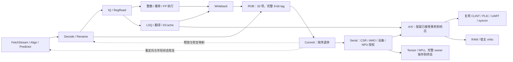

# rebuild 对旧 RV64 核的完整替换

## 目标与实际入口

2026-09-15 用户要求学习旧核架构和实现、扬长避短，使 rebuild 能完全取代旧核；
并明确恢复 Linux 与 NPU 的完整替换范围。此前“OS 不运行、NPU 暂缓”的任务范围不再适用于本任务。
实际 worktree 为 /home/lyg/PA/ysyx-workbench，保留已有未提交修改。

当前 CPU 为 vsrc/rebuild/core/R64CoreTop.v，系统为 R64SystemTop，
真实协处理器系统为 R64TensorSystemTop。默认 filelist 来自 vsrc/rebuild/filelist.mk。
旧核入口是 vsrc/core/NpcCoreTop.v → OooCoreTopGlue，旧系统为 NpcTop/NpcSimTop。
默认构建已切换并不等于全部消费者已完成迁移。

## 对旧实现的取舍

| 方面 | 旧实现可继承的经验 | 新实现的落点与取舍 |
| --- | --- | --- |
| 取指与恢复 | RVC 边界、跨 packet 拼接、预测训练必须与指令归属一致 | 保留 FetchStream/Align/PacketParse/Predictor；固定 owner 与完整 tag 排空；不搬回前端多层 mux 和重复 pending 状态 |
| 派发与执行 | 保留真实双发射/双退休；流水乘法与迭代除法独立占用 | ROB/Rename/IQ/LSQ 原子分配；RegRead 明确端口预算；Multiply/Divide/Clmul 各自保持结果与取消状态 |
| 提交与异常 | CSR、store、AMO、设备和协处理器副作用必须有精确授权 | Commit/Serial 统一退休边界；年轻恢复不得撤销已接受的外部事务 |
| 访存 | PMP、PMA、Sv39、A/D 更新、物理别名和真实总线错误语义 | 翻译、保护、LSU、DCache、AXI 分开保存事务状态；不能提前发布 speculative store 换吞吐 |
| AXI | AW/W 独立保持，B/R 有真实归属，读写等待可重叠 | 原生 AXI4 包含 RID/BID/RLAST；保留完整响应身份 |
| 平台 | CLINT、PLIC、UART、syscon 的设备协议和地址图是兼容资产 | 复用真实设备 RTL；补齐旧 UART 的 8250 寄存器/FIFO/中断语义，保留独立 M/S 外部中断 |
| DiffTest | NEMU 独立 ISA/架构参考；系统事件与 ISA 行为分层 | 默认逐退休检查 PC/GPR/FPR/CSR；外部输入送到独立设备模型，不恢复整份寄存器掩盖差异 |
| NPU | 命令/描述符、terminal、DMA 和缓存失效的生命周期完整 | 真实 TensorNpuCoprocessor 经 R64TensorLink/R64TensorMemory；runtime/standalone 经 R64NpuCpuSim 使用原生系统；保留完整 9-bit owner 到终态 |
| 性能与时序 | 理想 IPC=2 不能代表实际程序；局部优化不能相加为整核收益 | 保留当前 1 ns 约束；结合实际 CPI 与同源整机 STA 取舍；扩大队列必须有收益证据 |

### 已核对的具体接口差异

- 旧 [NpcCoreTop](../../vsrc/core/NpcCoreTop.v) 分别连接 OooFetchAxiBridge、
  OooDualMemBridgeWrapper 和 OooCoreTopGlue；该顶层的两个响应入口没有 RID/BID/RLAST 输入。
  新 [R64CoreTop](../../vsrc/rebuild/core/R64CoreTop.v) 经
  [R64AxiRead](../../vsrc/rebuild/bus/R64AxiRead.v) 与
  [R64AxiWrite](../../vsrc/rebuild/bus/R64AxiWrite.v) 保存每个 client 的总线归属，
  检查响应 ID、读拍数、RLAST，以及 B 到达前 AW/W 是否均已完成。
  替换适配不能丢弃新接口的响应身份，也不能凭等待周期数推断事务已完成。
- R64AxiWrite 的 B_BYPASS 只缩短内部空响应队列的等待；物理 AXI 的 VALID 保持边界仍在。
  这类局部旁路须保持真实握手与背压，不以组合透传跨越外部协议边界。
- 旧 NPU 使用 8-bit producer 接口，新核采用 9-bit ROB tag。
  [R64NpuCpuSim](../../vsrc/sim/R64NpuCpuSim.sv) 在命令握手时保存完整 tag，
  与旧 NPU 交互时使用低 8 位，核对 terminal 后恢复完整 tag；同一时刻只保留一个命令。
  原生 [R64TensorLink](../../vsrc/rebuild/platform/R64TensorLink.v) 则全程使用 9 位，
  等待实际 DMA 排空、必要的缓存失效和 terminal 握手。
- 旧 NPU testbench 将异常 completion 也纳入 command lifecycle 观察。
  新适配器保留这项观察，成功退休与异常分别接入各自事件；错误完成经过真实新核异常流水，
  没有为了沿用旧周期常量伪造一次成功退休。

### Linux 长测发现的旧 UART 缺口

首次 L3 all 在 70,542,850 周期、23,111,581 次退休处失败：
Linux `mem_serial_in` 的 MSR 读取返回 DUT=0、REF=0xb0。
短程序在第 73 周期复现同一差异，定位为复用 UART 的寄存器缺失：
旧偏移 4 是固定兼容状态值，偏移 6/7 没有 MSR/SCR 状态。

修复在 [Uart.v](../../vsrc/bus/Uart.v) 的设备状态层完成：

- 实现 MCR、MSR、SCR、内部回环、MSR delta 的读清除；
- 实现 16 字节接收 FIFO、触发级别、清空、回环溢出和错误读清除；
- 实现 THRE 中断确认、重新使能和 RX/error/modem 的优先级；
- [AxiToUart.v](../../vsrc/bus/AxiToUart.v) 随 AR 捕获 ARSIZE，
  只对 CPU 实际读取的字节产生副作用；R 背压不会重复确认中断。

参考模型中 RI 两个边沿都置 TERI 的行为也得到纠正。
依据 [TI TL16C550C 数据手册 §7.7.10](https://www.ti.com/lit/ds/symlink/tl16c550c.pdf)，
TERI 对应 RI 状态撤销；独立参考单元测试和真实 CPU 字节访问序列分别验证该边沿。
没有通过跳过 DiffTest 或修改参考期望值来绕过原始 MSR 缺失。

这是完整字符接口上的 UART；没有新增串行位线和波特率时间模型。
非空 FIFO 低于触发级别时用 CTI 表达待处理字符，与现有 untimed reference 一致。
原有 UART/AXI 测试、满 FIFO 同拍出入、平台复位、系统 I/O、四个 AM UART/PLIC/SBI
软件测试均已通过。新增 8250 guest 普通/背压均通过，共 317 次退休，
分别为 2,679/2,714 周期。修复后的 L2 all 已通过全部阶段和严格日志顺序检查，退休数/周期数与修复前一致；L3 all 已越过原 MSR 故障点并完整通过，最终自然关机。

### 新核的数据流与状态归属

这里最重要的取舍是：CPU 内部可以恢复年轻投机状态，但已被外部接受的事务仍有明确 owner，
必须等待其终态。重命名/队列分配、执行结果、总线响应和退休各自维护自己的有效性，
不把旧 wrapper 的重复 pending 标志搬回所有流水级。设备协议和成熟数值实现可以复用，
其可见副作用仍由新核提交边界授权。

### ISA 和特权能力

新核源码已有 RV64IMAFDC、Zicsr/Zifencei、Zba/Zbb/Zbc/Zbs、M/S/U、PMP×16、
Sv39、Svnapot、Svpbmt 和 Svinval 路径，以及 Sdtrig 地址触发器。
源码存在与完整验证是不同结论；以适用软件、特权定向和系统运行共同判断。

新核和 reference 的能力配置必须一致。例如新核只接受 Bare/Sv39，
不能让 NEMU 更宽的 Sv48/Sv57 能力使 OpenSBI 探测得到不同结果；
也不能把不支持的 RTL 功能合法化为 no-op 来取得 PASS。

## 可观察验收

| 范围 | 判据 | 当前状态 |
| --- | --- | --- |
| 构建与核心正确性 | 默认 CoreTop/SystemTop 严格 lint、定向对拍、适用模块及软件回归 | 严格 lint、20 次定向运行通过；official 177/177、ACT4 101/101；AM 72 项首轮通过，CLINT 超时和 syscon host 问题修复后其余 2 项定向通过；make test 已完成（131 项模块目标及相关矩阵/负向检查，含未变化目标的增量复用） |
| 理想吞吐 | 真实整核 7 个热区，各 768 条/384 拍 | 本轮通过，CPI=0.5 |
| 系统加载 | boot + 按物理地址加载的多个 image；范围/重叠/ELF 检查 | 已实现并通过 raw/ELF/BSS、GNU 文件头前缀、额外镜像、重叠/越界/溢出/坏头拒绝测试；真实 GNU ELF 系统 I/O 与块设备程序通过 |
| 系统终态 | OS 的 EBREAK 正常陷入；真实 syscon 与独立参考执行相符后完成 | 短程序含 EBREAK、额外镜像、UART RX、背压、自然 poweroff 通过 |
| L2 | 原 OpenSBI + S/U mini-system all：特权切换、Sv39、timer、PLIC/UART、原子/MMIO、关机 | 完整 all 通过：6,063,076 次退休、13,751,803 周期、486 次陷入、一次自然 syscon 关机；完整 DiffTest；UART 修复后按当前严格日志判据重新通过 |
| L3 | 原 Linux 6.6 + PID1 all：COW/process、timer、tmpfs、atomic、UART IRQ、关机 | 完整 all 通过：23,863,944 次退休、75,766,731 周期、1,115 次陷入；COW/process、时间、tmpfs、atomic、两次 UART IRQ 均通过；一次自然 syscon 关机、退出 0，完整 DiffTest |
| Tensor 系统 | 真实 NPU、CPU 命令、DMA、结果与背压，错误/取消/恢复 | tensor-unit、F32 ADD 普通/背压对拍通过；完整 standalone 与三个 runtime/compiled 目标均通过 |
| 旧消费者迁移 | Linux/Makefile、NPU standalone/runtime 不再实例化旧 Ooo* CPU | Linux 主入口、22 项 ISA/特权工具测试、DTB/块设备工具、NPU standalone/runtime 已切换原生系统；历史 PPA 分层 runner 仍绑定旧证据格式，原生验收使用 make l2-test/l3-test |
| 完整 Ubuntu/磁盘 | 保留旧机 virtio-blk/rootfs 接入能力；Ubuntu 单独表达范围 | 已接入 virtio-mmio/块镜像/IRQ2/DMA；热缓存 sector-read、真实 PLIC IRQ2、错误恢复均在普通/背压下通过；不等同于 Linux mount-rootfs/Ubuntu 通过 |
| PPA | 同源正确性、实际 CPI、1 ns setup/hold 与实际面积 | 历史反馈版整机 setup 仍负；本轮尚未重新综合，不宣称 1 GHz |

## 已完成的集成

1. 原生宿主支持 4 KiB..1 GiB RAM、多镜像、ELF/BSS、真实 UART RX/stdin、
   正常 EBREAK 陷入和 syscon 终态。退出须等待独立参考执行相同 MMIO store，
   并完成 PC/GPR/FPR/CSR 和 UART 字节比较。缺失期望输出会失败。
   支持 GNU ld 将只读 ELF 文件头和零填充放在 RAM 前一对齐页的常规布局；
   该兼容例外不允许裁剪真实代码、数据、可写段或已分配段。
2. Linux/Makefile 默认构建并运行原生 R64SystemTop，不再改写旧 OoO Kconfig。
   主启动命令保留完整 DiffTest，并为每次 rootfs 运行创建独立可写副本。
   Linux 默认仿真使用独立 build/rebuild/linux-system 目录和两个 Verilator 模型线程；
   Makefile 将线程数与编译选项纳入构建依赖，防止配置变化后误用旧二进制。
   22 项原 Linux/tools ISA/特权测试与 DTB、块设备测试已在原生入口通过。
   Linux 主启动命令另经短系统程序检查：成功关机返回 0；缺少期望输出返回非零；
   两条路径均核对磁盘模板前后不变。该检查不替代 Linux guest 验收。
   --uart-stdin 使用无缓冲 stdout，避免 tee/管道及无换行提示阻塞交互。
   管道实测先等待提示可见再输入 Z：修复前提示不可见，修复后对拍并自然关机通过。
3. NPU standalone 和 runtime 的 NpcTensorNpuSystemTop 现在实例化 R64NpuCpuSim。
   保留旧公开 8-bit command identity 接口；桥接保存完整 9-bit CPU tag，
   只允许一个不可撤销命令在途，在真正终态才释放 owner。
   DMA 在正常/错误终态都完成缓存失效。故障的旧 completion 观察与真实成功退休分别输出。
4. 块设备使用工作区已有的 virtio transport/block 模型作为宿主外设：
   DUT 实例与指令参考使用独立 ELF namespace、设备状态、RAM 和磁盘文件。
   DUT 外设不执行 CPU 指令，只处理真实 AXI 请求和物理 DMA；
   参考正常执行相同指令及其设备操作，未安装 DUT DMA 回调。
   不使用旧宿主设备中的 skip-ref，不同步整份架构状态。
   make device-test 的完整六组合已通过；普通/背压都覆盖读取、IRQ2、错误恢复。
5. 新增 make l2-test/l3-test，复用原有 OpenSBI/payload/Linux/PID1 源码及阶段定义。
   检查选择的完整 case、阶段顺序/唯一性、UART 输入顺序与基数、真实进程退出、
   以及恰好一次自然 poweroff。仅 all 表示对应层完整覆盖。
   原有层级判据中的 RTL assertion、HIT BAD TRAP，以及 L3 的 Oops/Call Trace/
   panic/BUG 检查均保留；Linux power-down 必须出现在最终 guest 阶段之后、syscon 之前。
   它不生成旧架构/PPA promotion 身份，也不把旧 runner 的 PASS 标签套到新核。

## 本轮已取得的 NPU 结果

- Standalone：95 个 terminal，96 个 GMEM 请求（48 read + 48 write），
  exact-once、身份隔离、背压、非法 launch、inflight reset、故障恢复通过。
- 新 CPU 正常 terminal→成功退休为 3 个有效 CPU 时钟；
  错误 terminal→异常 completion 观察为 5 个有效 CPU 时钟。
  测试保留旧核时序分支，原生分支检查新核的实际流水边界。
- Host runtime：两个 generation、四条 command、两个 publication，一次模型构造和一次 boot。
- Compiled bundle：五个接受的 generation，覆盖成功、零基数、stale reject、
  recoverable fault、fatal fault 及 fatal reuse reject。
- Compiled backend：90 项检查、两个整 bundle 执行，CPU fallback 为 0。
- UART 补全后，Host runtime、compiled bundle、compiled backend 三个系统目标已重新构建并通过；上述计数保持一致。
- 旧 OoO 内部 PMU 不属于新核接口，不再将其缺省零值当作新核性能证据。
  原生构建明确拒绝请求该内部 observer；报告真实命令/终态/退休事件。

## 本次结果与边界

本次确认的功能替换范围已有真实结果：核心与软件回归、平台/加载/仿真接口、
L2 all、L3 all 和 NPU 主工作流均通过。默认 Linux 与 NPU 消费者使用原生新核，
完整 PC/GPR/FPR/CSR 对拍、设备终态、负向检查和 RTL 断言持续保留。

- WSL 曾发生服务连接超时，经用户授权重启后重新运行；中断日志不计为 PASS。
- L2 all 在 UART 修复后重新通过，退休数/周期数与修复前一致，并通过当前严格日志顺序检查。
- L3 all 在修复前因缺失 MSR 失败；修复后实际 Linux 6.6 + PID1 all 完整通过。
  两次 IRQ 输入分别收到 0x41/0x42，Linux 发出 reboot: Power down 后执行一次 syscon 关机。
- 长测运行模型和参考库的固定副本。运行期间后续仅增加 --uart-stdin 的提示刷新；
  L2/L3 未启用此选项，交互路径另以“先看到提示，再输入，再自然关机”的管道实测验证。
- 历史 eval/ppa 分层 runner 仍使用旧源身份和 trace 格式；
  正式 Architecture/PPA promotion 需要继续迁移这些合同。原生功能验收入口是 make l2-test/l3-test。
- virtio 块设备接入、读写隔离、DMA/IRQ2 和错误恢复已经验证；
  目前没有 Linux /dev/vda mount-rootfs 或完整 Ubuntu/systemd PASS。
- 当前源码包含 09-08 拓扑反馈版。历史整机 1 ns setup 仍为负；
  本轮没有重新综合/STA，不宣称达到 1 GHz 或完成 PPA promotion。

### 本次工作区的主要验证记录

记录目录为 `tmp/rv64-replacement-20260915/`：

| 结果 | 记录 |
| --- | --- |
| L2 all，当前 UART 与日志判据 | `l2-all-uart-fixed/summary.json`、`console.log` |
| L3 all，Linux + PID1 + 自然关机 | `l3-all-uart-fixed/summary.json`、`console.log` |
| UART、平台复位与系统 I/O | `uart-integration.log` |
| UART/PLIC/SBI 原软件兼容 | `uart-am-compatibility.log` |
| 无换行提示与 stdin 交互 | `interactive-uart-results.json`、`interactive-uart-after.log` |
| NPU 当前 UART 修改后的三个系统目标 | `npu-uart-compatibility.log` |
| NPU standalone exact-once、恢复和背压 | `npu-standalone-exact.log` |
| 完整块设备六组合 | `device-entry-fixed.log` |
| 模块/软件回归 | `module-regression.log`、`isa-test.log`、`core-final.log` |
| 累计任务改动（相对修改前快照） | `replacement-changes.patch` |

本文件记录本次功能替换及其证据范围；完整 Ubuntu、频率和 PPA 结论仍以各自真实验证为准。
