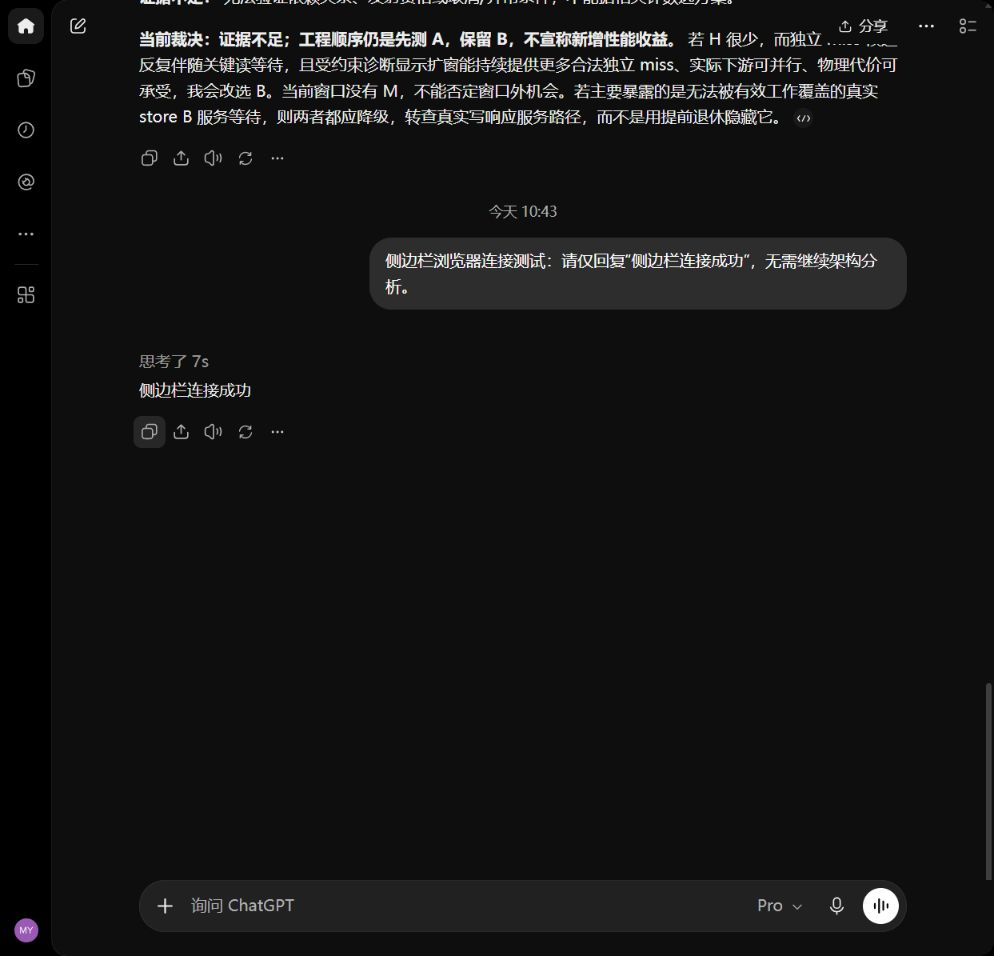

# Codex 侧边栏浏览器收发测试

日期：2026-10-08（Asia/Shanghai）。结果：**PASS**。

## 实际验证

- 使用 Codex 侧边栏内置浏览器，在用户完成登录后接续原咨询会话。
- [会话链接](https://chatgpt.com/c/6ac6309d-96a4-83e8-bbce-538e0ec038ed)中的历史问题与完整架构回答已加载。
- 模型菜单可见 `GPT-6` 为选中项，思考强度为 `Pro，第 5 项，共 5 项`。
- 只发送下面一条连接消息，页面实际显示新用户消息；等待期间未重复提交。
- 最终页面显示回复全文、“回答已完成”和重新生成按钮；输入区恢复可用。
- 本轮没有重新发起架构分析，也没有修改 RTL 或运行新的性能测试。

## 实际消息

发送（北京时间 10:43:41 观察到提交）：

> 侧边栏浏览器连接测试：请仅回复“侧边栏连接成功”，无需继续架构分析。

收到的完整回复：

> 侧边栏连接成功

页面显示“思考了 7s”；它是页面的思考时长，不是含网络加载、轮询和保存的端到端耗时。

## 本次遇到的兼容细节

- 登录后短暂出现“无法加载你的账户”。按页面提示重新加载一次，随后根据用户说明等待网络，
  页面恢复；没有据此判定内置浏览器不支持工作流。
- 点击回复的“复制”后 UI 显示“已复制”，但浏览器剪贴板接口返回空字符串。
  随后直接读取页面渲染的回复正文，成功取得上面的完整文本。
  后续长回答也应核实完成状态和全文，不能把空剪贴板内容当成功。
- 已保留当前浏览器会话，后续按 [工作流](../../README.md) 优先使用内置浏览器。
  2026-10-07 的 Edge 测试是独立历史记录，本次只证明侧边栏中的实际收发和读取可用。

