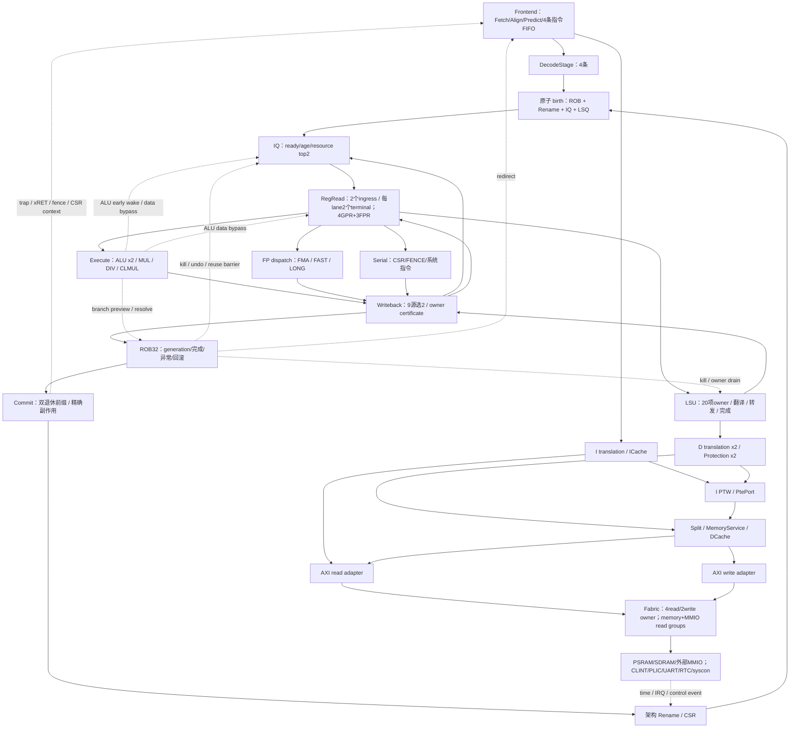
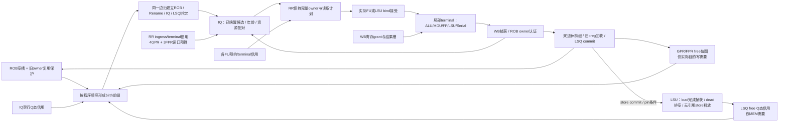
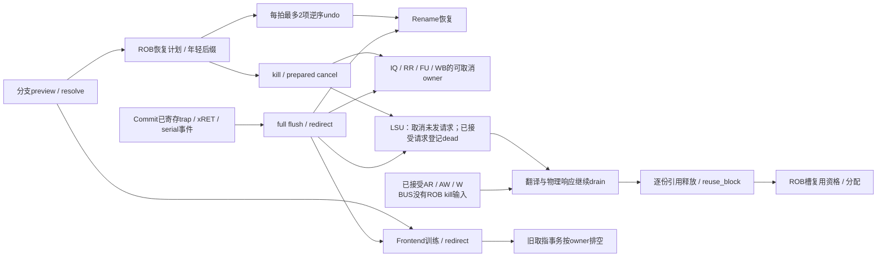
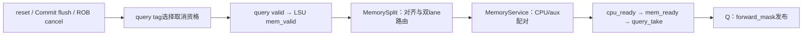

# 承岳64全核拓扑与本轮优化入口

范围为实际 R64CoreTop 与包含 Fabric/设备的 R64SystemTop。以 BUS 第四批为基线；面积只记录，优先比较正确性、时序和 CPI。不能把文件列表等同于实际实例：通用参考 helper 和可选 Tensor 数据通路需与生产 elaboration 区分。

请求、返回、信用与取消是四张相互约束的网络。图中实线为主要请求/结果，虚线为提前唤醒、恢复、上下文与事件。ROB tag、LSQ slot/token、Fabric事务槽和 AXI ID 属于不同命名空间；只在明确接收边沿建立对应关系。

| 模块域 | 详细拓扑 | 本轮处理与判据 |
|---|---|---|
| 前端 | [Frontend](frontend/TOPOLOGY.md) | 空槽准备、部分消费指针、RAS并行转发；先要求相同 CPI/恢复计数。 |
| 后端 | [Backend](backend/TOPOLOGY.md) | 双空项前缀、IQ空行数据准备、静态年龄矩阵；IQ32 单独试验。 |
| 整数/浮点执行 | [Arithmetic/FP](fp/TOPOLOGY.md) | 保持拍数的公共 carry finish；FP四源选择与数据捕获。 |
| 提交控制 | [Control](control/TOPOLOGY.md) | 保留精确事件边界和现有 CSR 快路径；基准未显示扩大串行快路径的收益依据。 |
| 翻译/保护/缓存 | [Memory](memory/TOPOLOGY.md) | TLB空项、PTE空闲数据、ICache查询准备；最终按STA优化DCache物理写口。 |
| LSU | [LSU](lsu/TOPOLOGY.md) | 保留 pin/排空契约；STA反馈轮将宽转发数据提前至驻留query阶段准备，并移除物理发出时的重复 MEMORY 状态写入。 |
| BUS/平台 | [BUS](bus/TOPOLOGY.md) | 保留四批结构；与Core一同综合，确认全核路径而非只测孤立Fabric。 |

基线事实：CoreMark 9,573,233 cycles / 3,218,524 retired，CPI 2.974417155；Dhrystone 15,259,347 / 4,260,670，CPI 3.581443059。26项观察计数有重叠，不能直接求和为总停顿。

完整 SystemTop 基线在1ns/0.05ns uncertainty、icsprout55 TT1.2V25C下，setup=-2.803282499ns，hold=-0.036660694ns，真实状态为 FAIL。最差链已定位至 DCache bank 写数据；不是所有模块频率都由这一个数代表。后续所有结论以同源测量为准，不能把数据路径优化直接换算为已实现的硅后Fmax。

对应结果：[全拓扑迭代目录](../../../tmp/rv64-whole-topology-20260908/PLAN.md)。每阶段保存源码差异、配置、功能/CPI结果、STA路径与RTL对应，再清除综合网表及可再生构建产物。

## 分配、执行与完成信用的完整连接

下图是主数据流之外的资源网络。箭头表示资格或可用空间的传递，不代表组合穿透，也不能把队列深度相加作为独立指令容量。

birth受阻的IQ、ROB、PRF、LSQ观察计数可能同时为真；它们不能相加成为总停顿。IQ变大可能只让指令更早进入ROB，从而把信用压力移到ROB。完成也有两层选择：FP/LSU先在本地形成结果，再参与全核9选2。局部结果已算完，不等于已唤醒消费者或可退休。

## 恢复和不可取消事务的连接

ROB tag、LSQ slot、Service source/token、AXI ID与Fabric事务槽属于不同标识空间。取消指令可以撤销其结果发布资格，但不能把已经接受的外部事务当作未发生，也不能在旧引用释放前复用其身份。

整合版DCache的pending write属于已接受的缓存更新，不是新发出的一条CPU指令或新的外部store。满足驻留命中且未poison/invalidate条件的成功B，以及可分配refill的真实R，产生缓存逻辑写事件；待写状态按byte向lookup转发，下一拍落阵列。它不受ROB分支kill撤销；invalidate清除tag valid，迟到的阵列写不能重新安装valid。LSU源store在无引用后释放时，后续物理查询仍能观察到一致的缓存数据。

整机综合反馈按 DCache 高扇出写数据 → LSU query_take 控制宽转发快照 / 冗余状态更新推进。各轮测量保留在结果目录；对外请求发布、pin释放、已发owner及完成资格维持原拍数，详细边界见 LSU 图。

## 最终 STA 暴露的跨模块路径

DCache和LSU宽数据优化后，完整SystemTop最差setup=-2.261837959ns，端点为LSU forward_mask_q[19][6]。这条路径实际经过query取消资格、MemorySplit和MemoryService，再返回LSU。它是有效性与接收信用的组合往返，图中的末端寄存器承接路径，不代表组合环。

这说明后续应把mask/descriptor的准备与可见性、以及Split/Service的寄存信用作为独立实验。不能为缩短路径撤销真实取消检查，或让尚未接收的请求提前成为已发owner。本轮完整结果、IQ16/32取舍及后续验证问题见[最终评估](../../../tmp/rv64-whole-topology-20260908/REPORT.md)。
