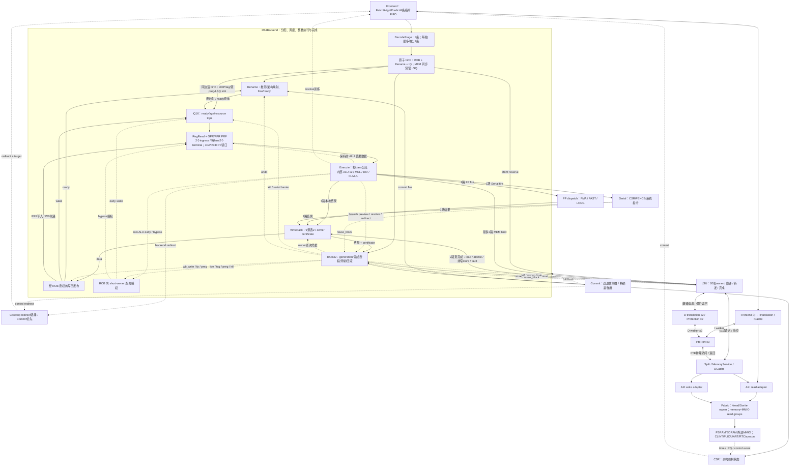
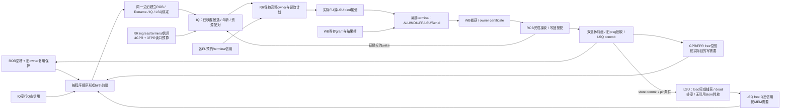
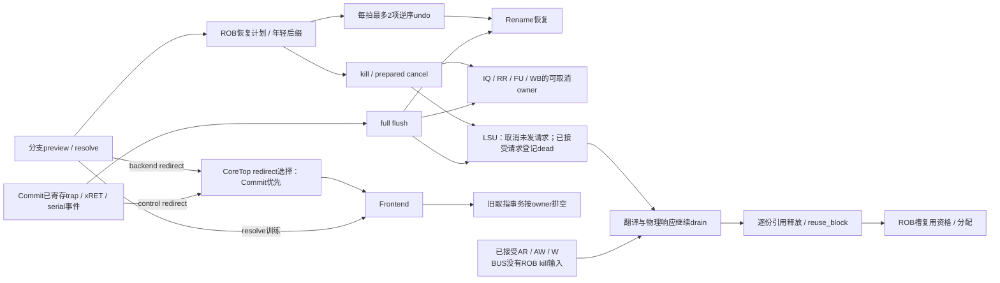
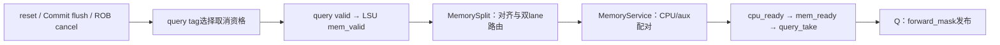

# 承岳64全核拓扑与可量化设计边界

范围为实际 R64CoreTop 与包含 Fabric/设备的 R64SystemTop。结构以当前 RTL 的实例化和参数为准；下面标有 2026-09 的实验说明保留历史含义，不是当前优化计划。不能把文件列表等同于实际实例：通用参考 helper 和可选 Tensor 数据通路需与生产 elaboration 区分。


## 2026-10-09 全核职责重审与等行为重构

本轮目标是让每个模块围绕完整职责和事务生命周期组织，减少不必要的内部协议外泄。
容量、仲裁、寄存边沿、取消优先级和外部 ABI 保持原设计；文件变短不单独作为验收依据。

| 域 | 源码重审结论 | 本轮处理与保留边界 |
| --- | --- | --- |
| CoreTop / Control | 顶层直接中转 CSR 查询/准备/退休、IRQ 判定及原始 PMP，了解过多控制域细节 | 新增 [R64Control](control/R64Control.v)，内部保留 Serial、CSR、Commit 三个状态 owner 和组合 PMP 译码；对外只保留执行、退休、恢复、上下文、失效与 Tensor 合同 |
| Frontend | 取指访问 holder/翻译/Cache 与预测、对齐及指令 FIFO 同属一个实现体 | 新增 [R64FetchAccess](frontend/R64FetchAccess.v)，收拢请求上下文、poison、翻译与 ICache；Frontend 通过顺序 req/rsp 服务连接，继续拥有流调度和预测入队 |
| Backend | birth、完成授权、恢复及 ready/bypass 依赖多，但对应共同指令身份 | 保留 ROB/Rename/IQ/LSQ 同边沿原子 birth，以及 ROB 对 WB/early wake 的权威授权；不为十几行组合逻辑添加 Admission/Wakeup 转接壳 |
| FP | 数值单元和本地完成 owner 边界合理，入口却接收整条后端 UOP | [FpExecute](fp/R64FpExecute.v) 改为 command32；调用者从 UOP 投影。FMA/Fast/Long、动态 rounding、完成和取消周期保持 |
| LSU | canonical row/年龄/effect/pin 应协同持有；翻译返回账本可独立 | 新增 [R64LsuTranslationOwners](lsu/R64LsuTranslationOwners.v)，封闭两路各4项已接受翻译的 slot/protection、指针、计数和信用；canonical LSQ 仍由 LSU 持有 |
| 翻译/保护 | Memory/LoadStore 主要负责装配；ITLB/DTLB/PTE 的 owner 已各自明确 | 保留双数据翻译、三 PTE 端口、共享 PMP 事实和权限检查；ProtectionPrepare 仍在 CoreTop，使用同一翻译结果的 PA/privilege |
| DCache / 物理服务 | refill、store-B、pending write、LR/SC 与物理 bank 强相关 | 保留 Split/Service/DCache 边界和普通 store 专用终端；不导出整张 LSQ 数组来拆物理响应逻辑 |
| AXI / 平台 | ID、beat、Fabric slot 和设备副作用各有 owner，与 ROB kill 解耦正确 | 保留原模块；已接受 AR/AW/W 必须排空，平台地址图和可选 Tensor GMEM 接口不变 |

新的实际子树：

```text
R64CoreTop
├─ frontend : R64Frontend
│  └─ access : R64FetchAccess
│     ├─ u_translation : R64FetchTranslation
│     └─ u_cache : R64ICache
├─ backend : R64Backend
│  └─ Decode / Rename / ROB / Issue / RegRead / Execute / Writeback
├─ fp : R64FpExecute                 ← command32 / tag / operands
├─ control : R64Control
│  ├─ serial : R64Serial
│  ├─ csr : R64Csr
│  ├─ commit : R64Commit
│  └─ pmp_decode : R64PmpDecode
├─ memory : R64Memory
│  └─ unit : R64LoadStore
│     ├─ lsu : R64Lsu
│     │  └─ translation_owners : R64LsuTranslationOwners
│     └─ split / service / cache
└─ read_bus / write_bus
```

可量化的结构结果：

- Control 隐藏26个 CSR/return/退休反馈/IRQ准备/原始 PMP 私有命名网络；trap/trace 格式化也归入控制域。
  Serial、CSR、Commit 的原状态 owner 没有合并或复制，Control 自身没有新增寄存器。
- FetchAccess 收拢原有136-bit请求 payload与valid/poison共138 bit直接状态，Translation/ICache 子实例随其归属迁移。
  空 holder 仍直通，阻塞时才保存；不向 Access 增加 run 冻结条件。
- TranslationOwners 收拢原有8项 slot/protection 加两路指针/计数，生产 INDEX_W=5 时共86 bit。
  信用仍只来自当前 count，满队列不能借同拍 pop 接新请求；无 flush/kill 清空接口。
- FP command 输入由218 bit缩至32 bit，去掉186 bit无关 UOP 字段；这衡量协议依赖，并不代表节省186个物理单元。

必要的耦合保持显式：`birth` 同时建立 ROB/Rename/IQ/LSQ，`full_flush` 不能代替选择性 kill，
`reuse_block` 不能由完成 valid 推导；CSR/失效副作用仍等同 tag 真实退休，
已接受的翻译、PTE、AXI 和 Tensor 事务继续排空。Serial 的 memory_idle 仍接 Memory.drain_idle，
不接仅表示 LSQ owner 为空的 idle。

后续可独立评估的职责边界包括：Issue+RegRead/PRF 的完整操作数分派域；Frontend 的
Bundle→Token→Result→admission；LSU 已选元组后的完成仲裁/格式化域。
这些是进一步维护性的候选，不是本轮已经完成的拆分。物理响应若直接导出20项 LSQ metadata 会增加耦合，
因此保留 canonical row、转发 pin 和精确 effect 共同归属。

### 本轮验证结果

- `make -C npc/rv64 lint` 和 `make -C npc/rv64/sim tensor-lint` 通过，保留全部生产断言和既有真实 lint 诊断。
- 27项累计定向测试通过，覆盖 Frontend ingress/恢复/保护、7项 FP、LSU reserve/bind/返回/进展，以及 CSR/Serial/Commit/trap。
  [测试清单](../build/cohesion-20261009/module-summary.txt)和[执行日志](../build/cohesion-20261009/modules.log)保存了本次范围。
- LSU 独立补充的 owner-bypass 与 descriptor-payload 两项通过，覆盖别名/部分转发/LR/AMO/IO/A-D/kill/满队列/双响应。
- 从修改前源码独立构建 SystemTestTop 基线，与本轮 SystemTestTop 在相同镜像、参考库、单宿主线程和确定性停顿条件下比较。
  6个程序×plain/stalls，共12组、24次执行，均通过 NEMU GPR/FPR/CSR 差分；
  每条退休和 trap 的内容、顺序、发生周期逐行相同，最终周期/双退/读写计数也相同。
- 静态复核确认 Control 的152个子模块命名连接及19个trace/trap赋值保持原映射，CoreTop公开参数/端口不变。
  新模块进入生产filelist，仿真CSR快照和CPI观察跟随实际层级；`git diff --check`通过。

| 程序 | 退休指令数（两模式相同） | plain 周期（A=B） | stalls 周期（A=B） | 逐事件轨迹 |
| --- | ---: | ---: | ---: | --- |
| program | 125 | 1074 | 1133 | 一致 |
| sv39 | 56 | 993 | 1079 | 一致 |
| sdtrig | 302 | 4075 | 4207 | 一致 |
| lsu_contention | 4133 | 29426 | 36006 | 一致 |
| backend_network | 722 | 4354 | 4439 | 一致 |
| throughput | 8232 | 5736 | 7068 | 一致 |

A/B 原始结果见[执行摘要](../build/cohesion-20261009/ab.log)与[逐组数据](../build/cohesion-20261009/ab/summary.json)；
构建产物在 `build/cohesion-20261009/{baseline-system,candidate-system}`。
这些是本轮已运行程序的行为与周期证据，不是穷尽等价证明。
本轮未运行完整软件回归、Linux/Ubuntu、Tensor动态系统验证或新的综合/STA/PPA，历史性能表仍保持原测量范围。


## 2026-10-09 源码核对与读图规则

当前源码保留第一轮普通 RAM load response bypass 基线 B；第二轮取消前仲裁 + 固定物理 CQ、
第三轮同拍取消发布 + CQ 确值旁路的联合候选均已撤回。生产 CQ 仍是 front/skid 两 lane、总四条，
当前不存在第三轮的 CQ → IQ/RR 确值旁路。源码连接核对入口为
[CoreTop](core/R64CoreTop.v) 与 [Backend](backend/R64Backend.v)，后端内部职责、接收边沿和完成授权见
[Backend 拓扑](backend/TOPOLOGY.md)。其它域也已按同一方式整理生产配置、文件职责、实例层级、
接收/取消边界及验证入口，见[RTL 目录导航](README.md)；可选 Tensor 的独立 GMEM 接入见
[平台说明](platform/README.md)。

候选裁决分别见 [第二轮结果](../ai/tests/2026-10-08-round2-architecture/RESULT.md)、
[第三轮结果](../ai/tests/2026-10-08-round3-cq-value/RESULT.md)；
下表保留 2026-10-08 基线 B 的既有测量，路径诊断见
[输入/输出及 Q 起点 STA](../results/ai-cq-timing-20261008/PHYSICAL-COMPARISON.md)。

| 2026-10-08 保留基线 B 的既有测量 | 数值 / 限定 |
|---|---|
| CoreMark 10 完整执行 | 8,968,518 cycles / 3,218,537 retired；CPI 2.786520087 |
| Dhrystone 10000 完整执行 | 14,267,505 / 4,260,670；CPI 3.348652911 |
| 布局前完整 SystemTop STA | icsprout55 TT/1.2V/25C；1 ns；uncertainty 0.05 ns；setup WNS −2.119304419 ns；hold WNS −0.036660694 ns；FAIL |
| 最差输入路径 | rst_i → Commit full_flush → ROB kill_mask[18] → LSU event_select → event_before_q[0] |
| 已有内部 Q 起点违例 | Commit event_trap_q → CQ payload：−1.892150521 ns；→ raw response control：−1.749530077 ns |
| 相邻限制 | effect_q[1] slack −2.109362364 ns；CQ payload 最差 −2.111715555 ns；不能只追一个端点 |
| 正常合资格 load 的已测完成延迟 | load_chain 的真实 response → CQ 捕获 0 拍，response → WB 接受 2 拍；不是完整 load-to-use 延迟 |

表中数据来自既有冻结 RTL 测量，本次拓扑更新没有运行新基准或 STA。旧结果与当前结构说明分开阅读。

全核优化的设计单元以“状态由谁持有、在哪个边沿接收、接收前后允许做什么”为边界，不以一个 Verilog 文件为单位。
各域当前表使用 FE / BE / FP / CTL / MEM / LSU / BUS 稳定 ID。它们是定位和测量的坐标，允许网页设计者
提出合并、拆分、重定时、预测或信用变更；不是限制架构搜索只能在单模块内进行。
[设计单元与输出约定](../ai/topology-contract.md) 定义需要记录的可量化属性及 UNKNOWN 表达。

- **数据网络**：值和完整 tag/owner 从哪里来，何时可被使用。
- **资格/信用网络**：valid/ready/grant/credit 是旧 Q 态、本拍组合还是已登记预约；图中一条箭头不自动等于一拍。
- **取消/恢复网络**：reset、全清、选择性 kill、undo 与 owner 复用是不同条件。
- **副作用网络**：store/CSR/AXI 在哪个真实接收边沿不可撤销；晚到响应由哪个状态排空。

reset 是同步状态清除，并用于组合接口静默。运行时 full_flush 为
`!rst_i && event_valid_q && (!event_trap_q || event_prepared_q)`；普通分支另走选择性恢复。
reset 出现在 STA 起点不证明所有路径是假路径，也不证明复位初值要经过仲裁才能产生。
CQ 宽 payload 已无清零 reset，仍可能通过保持/写使能依赖 reset、flush、kill 与 ready。


```mermaid
flowchart TB
  F["Frontend：Fetch/Align/Predict/4条指令FIFO"] --> DE
  subgraph BE["R64Backend：分配、调度、整数执行与完成"]
    DE["DecodeStage：4条；每拍最多输出2条"] --> B["原子 birth：ROB + Rename + IQ；MEM 同步预留 LSQ"]
    B --> RN["Rename：推测/架构映射、free/ready"]
    B --> ROB["ROB32：generation/完成授权/异常/回滚"]
    B -->|"同边沿 birth：UOP/tag/源preg/LSQ slot"| IQ["IQ16：ready/age/resource top2"]
    RN -->|"源映射 / ready查询"| IQ
    IQ --> RR["RegRead + GPR/FPR PRF<br/>2个ingress / 每lane2个terminal；4GPR+3FPR读口"]
    RR --> EX["Execute：按class分流<br/>内部 ALU x2 / MUL / DIV / CLMUL"]
    EX -->|"5路本地结果"| WB["Writeback：9源选2 / owner certificate"]
    WB -->|"结果 + certificate"| ROB
    ROB -. "owner查询凭据" .-> WB
    WB -->|"data"| WP["经 ROB 授权的写回发布"]
    ROB -. "wb_write / fp / preg" .-> WP
    WP -->|"ready"| RN
    WP -->|"wake"| IQ
    WP -->|"PRF写入 / WB前递"| RR
    EX -. "raw ALU early / bypass" .-> SO["ROB 内 short-owner 查询授权"]
    ROB -. "live / tag / preg / kill" .-> SO
    SO -. "early wake" .-> IQ
    EX -. "保持的 ALU 结果数据" .-> RR
    SO -. "bypass授权" .-> RR
    EX -. "branch preview / resolve / redirect" .-> ROB
    ROB -. "kill / serial barrier" .-> IQ
    ROB -. "undo" .-> RN
  end
  B -->|"MEM reserve"| LS["LSU：20项owner / 翻译 / 转发 / 完成"]
  EX -->|"最多2路 MEM bind"| LS
  EX -->|"1路 FP fire"| FP["FP dispatch：FMA / FAST / LONG"]
  EX -->|"1路 Serial fire"| SE["Serial：CSR/FENCE/系统指令"]
  FP -->|"1路结果"| WB
  LS -->|"2路宽完成：load / atomic / 非窄store / fault"| WB
  LS -->|"store_done：独立terminal"| ROB
  SE -->|"1路结果"| WB
  ROB --> CM["Commit：双退休前缀 / 精确副作用"]
  CM -->|"commit fire"| RN
  CM --> CSR["CSR：架构控制状态"]
  ROB -. "kill / owner drain" .-> LS
  LS -. "reuse_block" .-> ROB
  SE -. "reuse_block" .-> ROB
  EX -. "backend redirect" .-> RD["CoreTop redirect选择：Commit优先"]
  CM -. "control redirect" .-> RD
  RD -. "redirect + target" .-> F
  EX -. "resolve训练" .-> F
  CM -. "full flush" .-> BE
  CSR -. "context" .-> F
  F --> IT["Frontend 内：I translation / ICache"]
  LS <-->|"翻译请求 / 保护返回"| DT["D translation x2 / Protection x2"]
  LS <-->|"物理请求 / 响应"| MS["Split / MemoryService / DCache"]
  IT <-->|"I walker"| PP["PtePort x3"]
  DT <-->|"D walker x2"| PP
  PP <-->|"PTE物理访问 / 返回"| MS
  IT --> AX["AXI read adapter"]
  MS --> AX
  MS --> AW["AXI write adapter"]
  AX --> FA["Fabric：4read/2write owner；memory+MMIO read groups"]
  AW --> FA
  FA --> DEV["PSRAM/SDRAM/外部MMIO；CLINT/PLIC/UART/RTC/syscon"]
  DEV -. "time / IRQ / control event" .-> CSR
```

请求、返回、信用与取消是四张相互约束的网络。图中实线为主要请求/结果，虚线为提前唤醒、恢复、上下文与事件。ROB tag、LSQ slot/token、Fabric事务槽和 AXI ID 属于不同命名空间；只在明确接收边沿建立对应关系。

Backend 边界内包含 DecodeStage、Rename、ROB、IQ、RegRead/PRF、Execute 和 Writeback；
FP 与 Control 是 CoreTop 的同级域；Serial、Commit、CSR 与 PMP 译码封闭在 `CoreTop.control`。
LSU 位于 `CoreTop.memory.unit.lsu`，翻译返回归属由其 `translation_owners` 子模块持有；
I translation / ICache 位于 `Frontend.access` 内。数据翻译与保护先返回 LSU，再由 LSU 发物理请求至 Split/Service，
不能把 Translation 画成直接驱动 DCache 的流水级。图中的“写回发布”和“short-owner 查询授权”
是接口逻辑视图，不是额外流水级或模块。WB 提供结果数据，ROB 授权后才更新 PRF、Rename ready 和 IQ；
ALU 的 early wake / bypass 也先通过 ROB 的完整身份与目的寄存器检查，不设置 ROB done；
旁路的 64-bit 结果由 Execute 保持并送往 RegRead，ROB 只提供授权。

分支 redirect 源于 Execute，经 Backend 输出至 CoreTop；ROB 消费同一分支事实，负责取消与逆序 undo。
CoreTop 对前端的 redirect target 选择为 Commit 优先，再取 Backend；分支 resolve 另用于前端预测器训练。
LSQ reserve 发生在 birth，后续 Execute MEM bind 只补齐已有 slot/tag 的操作数，不再分配新的访存 owner。

## 2026-09 全拓扑迭代历史记录

下表与紧随其后的基线数字属于 2026-09 迭代；保留可复核出处，不作为本轮首选方案。

| 模块域 | 详细拓扑 | 当时处理与判据 |
|---|---|---|
| 前端 | [Frontend](frontend/TOPOLOGY.md) | 空槽准备、部分消费指针、RAS并行转发；先要求相同 CPI/恢复计数。 |
| 后端 | [Backend](backend/TOPOLOGY.md) | 双空项前缀、IQ空行数据准备、静态年龄矩阵；IQ32 单独试验。 |
| 整数/浮点执行 | [Arithmetic/FP](fp/TOPOLOGY.md) | 保持拍数的公共 carry finish；FP四源选择与数据捕获。 |
| 提交控制 | [Control](control/TOPOLOGY.md) | 保留精确事件边界和现有 CSR 快路径；基准未显示扩大串行快路径的收益依据。 |
| 翻译/保护/缓存 | [Memory](memory/TOPOLOGY.md) | TLB空项、PTE空闲数据、ICache查询准备；最终按STA优化DCache物理写口。 |
| LSU | [LSU](lsu/TOPOLOGY.md) | 保留 pin/排空契约；STA反馈轮将宽转发数据提前至驻留query阶段准备，并移除物理发出时的重复 MEMORY 状态写入。 |
| BUS/平台 | [BUS](bus/TOPOLOGY.md) | 保留四批结构；与Core一同综合，确认全核路径而非只测孤立Fabric。 |

2026-09 基线事实：CoreMark 9,573,233 cycles / 3,218,524 retired，CPI 2.974417155；Dhrystone 15,259,347 / 4,260,670，CPI 3.581443059。26项观察计数有重叠，不能直接求和为总停顿。

完整 SystemTop 基线在1ns/0.05ns uncertainty、icsprout55 TT1.2V25C下，setup=-2.803282499ns，hold=-0.036660694ns，真实状态为 FAIL。最差链已定位至 DCache bank 写数据；不是所有模块频率都由这一个数代表。后续所有结论以同源测量为准，不能把数据路径优化直接换算为已实现的硅后Fmax。

原全拓扑迭代计划路径为 `tmp/rv64-whole-topology-20260908/PLAN.md`，原临时报告现不在工作区。
当时每阶段记录源码差异、配置、功能/CPI结果、STA路径与RTL对应，再清除综合网表及可再生构建产物；
此处保留历史数字与路径，不表示本次重新获取了原报告。

## 分配、执行与完成信用的完整连接

下图是主数据流之外的资源网络。箭头表示资格或可用空间的传递，不代表组合穿透，也不能把队列深度相加作为独立指令容量。


```mermaid
flowchart LR
  RF["ROB空槽 + 旧owner复用保护"] --> B["按程序顺序形成birth前缀"]
  PF["GPR/FPR free位图<br/>仅实际目的写需要"] --> B
  IF["IQ空行Q态信用"] --> B
  LF["LSQ free Q态信用<br/>仅MEM需要"] --> B
  B --> OWN["同一边沿建立ROB / Rename / IQ / LSQ绑定"]
  OWN --> IQ["IQ：已唤醒候选 / 年龄 / 资源配对"]
  RP["RR ingress/terminal信用<br/>4GPR + 3FPR读口预算"] --> IQ
  IQ --> RR["RR保持完整owner与读取计划"]
  FU["各FU预约/terminal信用"] --> RR
  RR --> EXEC["实际FU或LSU bind接受"]
  EXEC --> T["局部terminal：ALU/MDU/FP/LSU/Serial"]
  WC["WB寄存grant与结果槽"] --> T
  T --> WB["WB捕获 / owner certificate"]
  WB --> AUTH["ROB完成接收 / 写回授权"]
  AUTH -->|"获授权的wake"| IQ
  RET --> RF
  RET["双退休前缀 / 旧preg回收 / LSQ commit"] --> PF
  RET -->|"store commit / pin条件"| LREL["LSU：load完成捕获 / dead排空 / 无引用store释放"]
  LREL --> LF
  AUTH --> RET
```

birth受阻的IQ、ROB、PRF、LSQ观察计数可能同时为真；它们不能相加成为总停顿。IQ变大可能只让指令更早进入ROB，从而把信用压力移到ROB。完成也有两层选择：FP/LSU先在本地形成结果，再参与全核9选2。局部结果已算完，不等于已唤醒消费者或可退休。

## 恢复和不可取消事务的连接


```mermaid
flowchart LR
  BR["分支preview / resolve"] --> RP["ROB恢复计划 / 年轻后缀"]
  RP --> K["kill / prepared cancel"]
  RP --> UN["每拍最多2项逆序undo"] --> RN["Rename恢复"]
  CM["Commit已寄存trap / xRET / serial事件"] --> FL["full flush"]
  FL --> RN
  K --> LOCAL["IQ / RR / FU / WB的可取消owner"]
  FL --> LOCAL
  K --> LS["LSU：取消未发请求；已接受请求登记dead"]
  FL --> LS
  LS --> DR["翻译与物理响应继续drain"]
  DR --> RE["逐份引用释放 / reuse_block"] --> RA["ROB槽复用资格 / 分配"]
  BR -->|"backend redirect"| RD["CoreTop redirect选择：Commit优先"]
  CM -->|"control redirect"| RD
  RD --> FE["Frontend"]
  BR -->|"resolve训练"| FE
  FE --> FD["旧取指事务按owner排空"]
  AX["已接受AR / AW / W<br/>BUS没有ROB kill输入"] --> DR
```

ROB tag、LSQ slot、Service source/token、AXI ID与Fabric事务槽属于不同标识空间。取消指令可以撤销其结果发布资格，但不能把已经接受的外部事务当作未发生，也不能在旧引用释放前复用其身份。

整合版DCache的pending write属于已接受的缓存更新，不是新发出的一条CPU指令或新的外部store。满足驻留命中且未poison/invalidate条件的成功B，以及可分配refill的真实R，产生缓存逻辑写事件；待写状态按byte向lookup转发，下一拍落阵列。它不受ROB分支kill撤销；invalidate清除tag valid，迟到的阵列写不能重新安装valid。LSU源store在无引用后释放时，后续物理查询仍能观察到一致的缓存数据。

整机综合反馈按 DCache 高扇出写数据 → LSU query_take 控制宽转发快照 / 冗余状态更新推进。各轮测量保留在结果目录；对外请求发布、pin释放、已发owner及完成资格维持原拍数，详细边界见 LSU 图。

## 2026-09 迭代末次 STA 暴露的跨模块路径

DCache和LSU宽数据优化后，完整SystemTop最差setup=-2.261837959ns，端点为LSU forward_mask_q[19][6]。这条路径实际经过query取消资格、MemorySplit和MemoryService，再返回LSU。它是有效性与接收信用的组合往返，图中的末端寄存器承接路径，不代表组合环。


```mermaid
flowchart LR
  C["reset / Commit flush / ROB cancel"] --> Q["query tag选择取消资格"]
  Q --> V["query valid → LSU mem_valid"]
  V --> SP["MemorySplit：对齐与双lane路由"]
  SP --> SV["MemoryService：CPU/aux配对"]
  SV --> R["cpu_ready → mem_ready → query_take"]
  R --> M["Q：forward_mask发布"]
```

当时报告据此提出检查 mask/descriptor 的准备与可见性、以及 Split/Service 的寄存信用；这是历史建议，当前方案由新的完整事实和实测决定。不能为缩短路径撤销真实取消检查，或让尚未接收的请求提前成为已发owner。当时的完整结果、IQ16/32取舍及后续验证问题曾记录于 `tmp/rv64-whole-topology-20260908/REPORT.md`；原临时报告现不在工作区。
