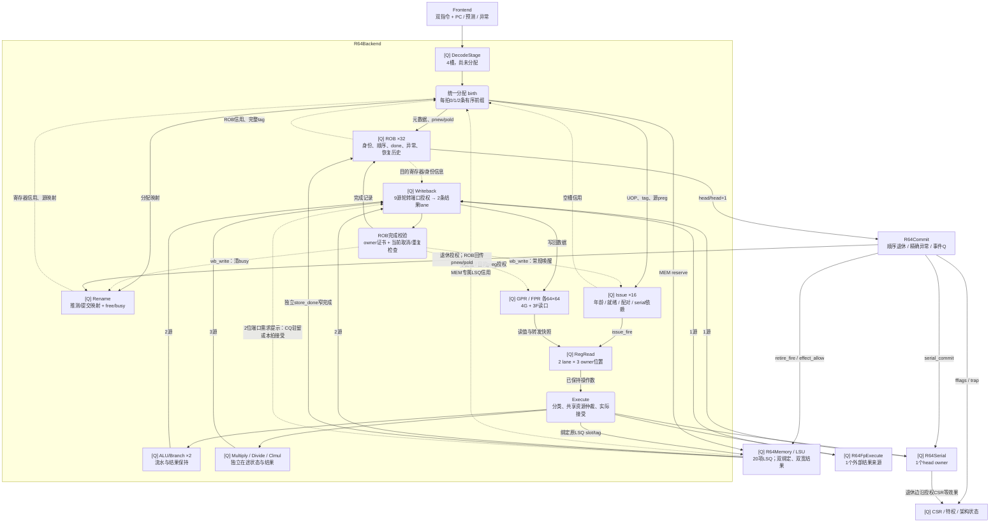
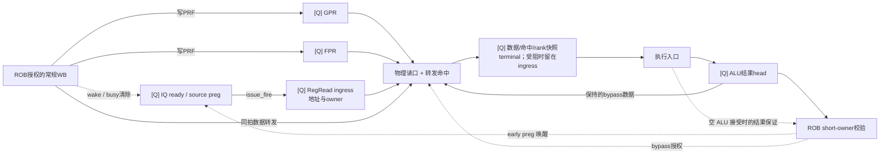
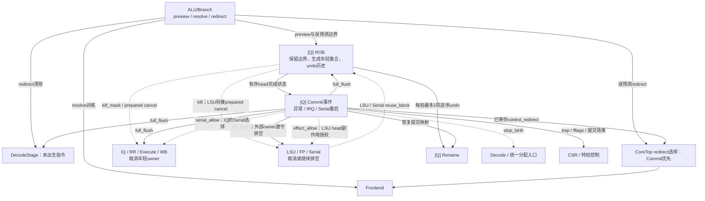

# 当前 Backend 结构与网络拓扑

依据 **2026-10-09 工作区生产 RTL** 核对，入口为 [R64CoreTop.backend](../core/R64CoreTop.v)。
本文整理现有实现的模块职责、实例层级、数据流、接收边沿、信用与恢复关系；本次仅更新文档。
[全核拓扑](../TOPOLOGY.md)负责系统连接，[模块清单](../MODULES.md)列文件中的声明，
本文负责后端实际连接；模块数和队列容量不表示固定流水延迟。

当前实现保留第一轮基线 B 的 LSU 普通 RAM load-response bypass。第二轮固定槽 CQ、
第三轮 CQ 确值早唤醒/供值与同拍取消发布的联合候选均已撤回，不能据候选快照添加当前连线；
当前专用提前唤醒与执行结果旁路仍来自 ALU，常规 WB 唤醒与数据转发保持原有路径。历史实验与测量入口见文末。

Backend 围绕 ROB 保存的指令身份与顺序，连接五个网络：统一分配、依赖调度与操作数、执行分流、结果回流、提交与恢复。

## 1. 实际边界与配置

R64Backend 内部包含 DecodeStage、Rename、ROB、Issue、RegRead、Execute、Writeback。
R64Memory/LSU、R64FpExecute、R64Serial、R64Commit、R64Csr 是 R64CoreTop 下的同级实例；它们参与完整后端网络，但不在 backend 实例内部。

| 项目 | 当前核心配置 / 含义 |
| --- | --- |
| 前端输入、分配、发射、常规写回、普通退休 | 每拍最多 2 条；各边界有自己的接受条件 |
| DecodeStage | 4 个指令槽，尚未分配 ROB / 物理目的寄存器 |
| ROB | 32 项；tag=4-bit generation + 5-bit slot，共9 bit |
| Rename | GPR/FPR 各32项推测映射与提交映射；独立 free/busy 状态 |
| 物理寄存器 | GPR、FPR 各64×64 bit；GPR p0为零寄存器；初始各32个物理寄存器处于已映射集合 |
| IQ | 共享16项固定槽，2条选择输出；保存 older、compatible、serial_dependency 关系 |
| RegRead | 每lane 1个 ingress + 2个 terminal，共6个指令保持位置 |
| PRF读端口 | 4个GPR、3个FPR；每条指令最多3个逻辑源 |
| PRF写入 | 两条统一授权写回 lane，分别按GPR/FPR目的类型路由；不是各自额外两条完成通道 |
| ALU/Branch | 两个 R64AluLane，每lane 4份owner信用及4个结果槽；信用覆盖在途操作的预留 |
| 长整数执行 | Multiply、Divide、Clmul 各一个独立实例，各自保持结果 |
| 外部结果入口 | LSU0、LSU1、FP、Serial，共4路 |
| Backend 写回 | 本地5路 + 外部4路 = 9源，汇聚为2条寄存完成lane |
| LSU资源 | 当前20项；MEM在统一分配时先占LSQ，后续只绑定操作数 |
| FP入口 | 当前启用2槽 Q信用入口；内部算术与fault来源归并为1个Backend结果来源 |
| Serial | 1个ROB-head owner，结果交付与真正退休副作用分开 |
| 数据格式 | UOP218 bit、退休META204 bit、RESULT140 bit；完整tag另带 |

### 1.1 生产实例参数

| 配置所在边界 | 当前取值 | 对拓扑的影响 |
| --- | --- | --- |
| CoreTop → Backend | `PREDECODED=1`、`PREPARED_NPC=1`、`PRECONTROLLED=1` | Frontend 提供 canonical、顺序 NPC 和静态控制，DecodeStage 继续格式化 UOP/META 并保持未分配指令 |
| CoreTop → Backend | `DIRECT_MEM_BIND=1`、`ISSUE_SLOTS=16`（默认） | RR 物理 lane 对应 LSU bind lane；IQ 容量可配置，当前图按 16 项 |
| CoreTop → Backend → Writeback | `WB_REQUEST_HINTS=1`、`WB_DEFER_REQUEST=0` | 当前来源 valid 与 LSU 需求提示产生下一拍 grant；通用 Backend 默认 `WB_REQUEST_HINTS=0` |
| Backend → Execute / RegRead | `EARLY_ALU_WAKE=1`、`RR_ALU_BYPASS=1`（Backend 默认） | ALU 受限接受时唤醒；RR 允许两个 terminal 中的受限 ALU 绕行 |
| Backend → Issue | `DEFER_READY=1`、`MDU_RESOURCE_PAIR=1` | birth 后初始化源就绪；按 MUL/DIV/CLMUL 独立资源配对 |
| Backend → RegRead | `PREQUALIFIED_ISSUE=1`、`Q_ONLY_TERMINAL=1`、`COMPACT_FP=1`、`RAW_FP_ALLOCATION=1`、`UNIQUE_SERIAL=1` | IQ fire 建立 ingress；terminal 使用 Q 信用，FPR 按压紧计划分配地址/rank，Serial owner 唯一 |
| Backend → Issue / RegRead / Execute | `PREPARED_CANCEL=1` | 消费 ROB 的 candidates/active 与独立 full flush，减少重复控制串联 |
| Backend → Execute | `RAW_MEM=1`、`RAW_FP=1`、`RAW_SERIAL=1` | 提前准备候选数据，最终 live/ready/fire 仍控制真实接收 |
| Backend → ROB / Writeback | `OWNER_CERTIFICATE=1` | WB 捕获窄 owner 证书，ROB 在完成时再处理当前取消/重复资格 |
| Backend → ROB | `SERIAL_PAYLOAD=1`、`HEAD_SERIAL_CACHE=1`、`LOCAL_KILL_FREEZE=1` | Serial 退休元数据、head 摘要与本地恢复冻结路径 |
| CoreTop → FP / Commit | `Q_CREDIT_INGRESS=1` / `SCRATCH_READ_RESUME=1` | FP 两槽入口；限定 scratch 只读 Serial 可退休后继续 |

这些生产参数决定图中实际存在的路径；模块默认模式不能代替当前核心配置。

来源：[CoreTop](../core/R64CoreTop.v)、[Backend](R64Backend.v)、[字段定义](R64Uop.vh)。

### 1.2 文件职责与实际使用方

`backend/` 是源码组织域，`R64CoreTop.backend` 是实例域，两者不同。建议沿下表阅读；
具体实例见第 3 节，状态与容量对应第 9 节的 BE-01～BE-09。

| 职责 | 源码 | 实际使用方 / 边界 |
| --- | --- | --- |
| 统一连接与分配 | [R64Backend.v](R64Backend.v)、[R64Uop.vh](R64Uop.vh) | 连接七个主要子模块，形成 birth，接入外部结果与提交控制；UOP/META/RESULT 为公共格式 |
| 译码与未出生队列 | [R64DecodeStage.v](R64DecodeStage.v)、[R64Decode.v](R64Decode.v)、[R64DecodeControl.v](R64DecodeControl.v) | DecodeStage 内两路 Decode；生产静态控制由 Frontend 的 `gen_encoding_control[].prepare` 提前提供，Decode 内保留通用参数分支 |
| 寄存器身份、完成与恢复 | [R64Rename.v](R64Rename.v)、[R64Rob.v](R64Rob.v) | Rename 持有映射/free/busy；ROB 持有指令顺序、目的身份、完成状态与 undo 历史 |
| 空项与发射选择 | [R64FreeSelect.v](R64FreeSelect.v)、[R64Issue.v](R64Issue.v) | Rename 的 GPR/FPR 和 IQ 复用 FreeSelect；IQ 年龄选择使用 LSU 目录的 R64LsuOrderSelect |
| 操作数读取与保持 | [R64RegRead.v](R64RegRead.v)、[R64FpReadPlan.v](R64FpReadPlan.v) | RegRead 持有 GPR/FPR 数据及 ingress/terminal；IQ 每槽生成 Compact 计划，RegRead Join 为三 FPR 端口分配地址/rank |
| 执行分流、短整数与分支 | [R64Execute.v](R64Execute.v)、[R64Alu.v](R64Alu.v) | Execute 内两个 R64AluLane；生产算术使用 R64AluDatapath，ALU 控制提前在 RR 准备 |
| 长整数执行 | [R64Multiply.v](R64Multiply.v)、[R64Divide.v](R64Divide.v)、[R64Clmul.v](R64Clmul.v) | Execute 内三个独立实例，各自维护接受、在途状态与结果 |
| 公共算术与数值 owner | [R64CarryStages.v](R64CarryStages.v)、[R64ProductTree.v](R64ProductTree.v)、[R64WideAdd.v](R64WideAdd.v)、[R64NumericOwner.v](R64NumericOwner.v) | carry 由整数/FP 复用；ProductTree 用于 FP product，WideAdd 用于 FP Long/LSU，NumericOwner 用于 `fp.fma.owner`；目录位置不表示位于 Backend 实例内 |
| 完成调度与捕获 | [R64Writeback.v](R64Writeback.v) | 五路本地加四路外部完成汇聚为两条 WB lane，owner 证书查询回 ROB |

R64AgeSelect、R64Alu、R64AluPipe 等声明不等于当前生产路径上的实例；参数未启用的
helper 与 `R64_ASSERT` 中的检查实例也不应算作新增硬件服务通道。

## 2. 高级数据网络

[Q] 表示寄存状态；圆角判断节点表示组合选择/接受逻辑。实线表示指令或数据传递，虚线表示信用、授权、唤醒或源引用关系。



图中的 ACCEPT 是 ROB 内部逻辑，不是新增模块或队列。ROB→Writeback 的窄 owner 查询与证书，在结果捕获边界保存身份/目的寄存器信息；结果实际被接收时仍服从当前取消规则。PRF的数据直接来自WB结果总线，ROB提供写权限与目的preg；图中接受逻辑不额外增加一级宽数据寄存。

普通对齐、非原子、非 device store 还有一条独立窄通道：
**Dcache 真实 B 响应（含错误）→ LSU store_done Q → ROB head 完成**。它不经过上述9源宽结果选择。分支 resolve/redirect 也有独立控制通道，不等待宽写回退休。

## 3. 实际实例层级

```text
R64CoreTop
├─ frontend : R64Frontend
│  └─ gen_encoding_control[0..1].prepare : R64DecodeControl
├─ backend : R64Backend
│  ├─ decode_stage : R64DecodeStage
│  │  └─ gen_decode[0..1].decode : R64Decode
│  ├─ rename : R64Rename
│  │  ├─ g_free : R64FreeSelect
│  │  └─ f_free : R64FreeSelect
│  ├─ rob : R64Rob
│  ├─ issue : R64Issue
│  │  ├─ free_select : R64FreeSelect
│  │  ├─ select0 / fallback_select : R64LsuOrderSelect
│  │  ├─ gen_pair_select[0..15].second_select : R64LsuOrderSelect
│  │  └─ g_fp_row[0..15].compact : R64FpReadCompact
│  ├─ registers : R64RegRead
│  │  ├─ g_compact_fp.fp_join : R64FpReadJoin
│  │  └─ gen_lane[0..1].alu_predecode.decoder : R64AluControl
│  ├─ execute : R64Execute
│  │  ├─ gen_alu[0..1].lane : R64AluLane
│  │  │  ├─ alu : R64AluDatapath
│  │  │  │  └─ add_prepare / add_finish : R64CarryPrepare / R64CarryFinish
│  │  │  └─ sequential_prepare / sequential_finish : R64CarryPrepare / R64CarryFinish
│  │  ├─ multiply : R64Multiply
│  │  │  └─ prepare / finish : R64CarryPrepare / R64CarryFinish
│  │  ├─ divide : R64Divide
│  │  │  └─ arithmetic[0..2].prepare / finish : R64CarryPrepare / R64CarryFinish
│  │  └─ clmul : R64Clmul
│  └─ writeback : R64Writeback
├─ memory : R64Memory
│  └─ unit : R64LoadStore → LSU / Split / Service / Dcache
├─ fp : R64FpExecute
│  ├─ fma : R64FpFma
│  │  ├─ owner : R64NumericOwner
│  │  └─ product : R64FpProductPipe
│  │     └─ partial[0..13].tree : R64ProductTree
│  ├─ longop : R64FpLong
│  └─ fast : R64FpFast
├─ serial : R64Serial
├─ commit : R64Commit
└─ csr : R64Csr
```

这里的 R64LsuOrderSelect 是可复用的选择器，实例化在 IQ 内不代表 IQ 通过 LSU 调度。
R64AgeSelect 虽定义在 R64Issue.v 中，当前 IQ 路径采用上面的 older 矩阵与 R64LsuOrderSelect，不应按文件内模块定义误画实例。
GPR/FPR 阵列、两个 ingress 和四个 terminal 都是 `registers` 内的寄存状态，不是子模块；
数据网络图单独画 PRF 只是为了区分数据阵列与操作数保持。层级图省略 CSA 递归树、CSR 子块和
前端/总线外围。生产 Decode 已接收前端预解码/预控制，不再实例化通用 RVC/DecodeControl 支路；
FP 的本地 fault 合并仍包含在一个外部结果来源内。

### 3.1 关键接收边界

表中“前缀”表示 lane1 必须与同拍 lane0 一起接受；“独立”表示可只有 lane1 成功。
这些都是事务的接收规则，不表示图上每条连线都增加一拍。

| 源 → 目标 | 接收事件 / 宽度 | owner 或信用含义 |
| --- | --- | --- |
| Frontend → DecodeStage | `fetch_valid_i & fetch_ready_o`，最多 2 条密集输入 | 4 槽 Decode Q 与 room Q 持有未出生指令；接受时还没有 ROB tag/preg |
| DecodeStage → Rename/ROB/IQ；MEM 另到 LSU | `birth_w`，最多 2 条有序前缀；MEM 用 `lsu_reserve_fire_o` | 同一边沿共同建立 tag、pnew/pold、IQ 行和 LSQ slot；raw reserve want 只查容量 |
| IQ → RegRead ingress | `issue_fire_w`，最多 2 条、lane 独立 | 消耗 RR ingress 信用，携带源 preg、FP 计划、tag 与原 LSQ slot |
| RegRead ingress → terminal | `transfer_w`，每 lane 最多 1 条 | 下一个读边沿形成操作数/转发快照；若 terminal 无 Q 信用则先保持在 ingress |
| RegRead terminal → Execute / FU | `read_valid_w & execute_ready_w`，最多 2 条、lane 独立 | RR 候选可重选；真正 fire 才转交下游 owner，不能把未接受候选视为 held offer |
| Execute → LSU / FP / Serial | `lsu_fire_o[1:0]` / `fp_fire_o` / `serial_fire_o` | MEM 为已存在 LSQ owner 绑定操作数；FP/Serial 各一个入口，包含实际 ready 与存活判定 |
| 本地/外部结果 → Writeback | 当前 source valid 与 grant Q/取消资格，最多 2 条 | ready 由 grant Q 给出，捕获宽结果与证书；端口 grant 本身不绑定某个 tag |
| Writeback → ROB / PRF / Rename / IQ | `wb_accept_w` 接收完成，`wb_write_w` 授权目的写入 | 完成包含异常/无目的指令；只有允许写目的的完成才写 PRF、清 busy、常规唤醒 |
| LSU store terminal → ROB | `store_done_valid_i && store_done_ready_o`，最多 1 条 | head store 的独立窄完成，保留 full tag、error、tval |
| ROB → Commit → Rename/外部 owner | `commit_valid_o & commit_ready_i`，最多 2 条有序前缀 | Commit 授权退休；Serial 独占，异常和副作用服从精确顺序 |

## 4. 分配与调度网络

**统一分配是资源一致性边界。**

DecodeStage持有已解码但尚未分配的指令。第0条需同时满足 ROB、Rename、IQ 信用；若为MEM，还需LSQ信用。第1条还要求第0条本拍实际分配，并满足第二份资源信用。ROB tag、物理目的寄存器、IQ槽与MEM的LSQ槽由同一个 birth 事件创建。

双分配内部处理同拍 RAW/WAW：第二条依赖第一条目的寄存器时使用第一条新preg；同一架构目的的旧映射也遵循两条指令的顺序。

Rename 的 GPR/FPR 空项与 IQ 空行复用 R64FreeSelect 选择第一/第二 free one-hot。
IQ 直接使用其容量输出；Rename 另以独立 `gen_capacity` 汇总树产生 0/1/2 信用，
使容量判断不依赖选中哪个物理寄存器。DecodeStage 与 IQ 允许向 Q 状态空槽预写不可变 payload，
但只有真实输入握手或 birth 才改变有效性、年龄与 owner；数据预写不等于分配。

**IQ既选择就绪指令，也选择能够配对的指令。**

每项保存源preg、源类型、ready，以及入队时确定的 older、compatible 和更老Serial依赖。生产 DEFER_READY 在分配后查询 busy/旁路状态初始化就绪，常规写回与ALU提前事件继续唤醒已有项。
IQ 年龄矩阵按固定行更新：重用列先清除，新 lane0 行取当前 live，lane1 行再包括本拍 lane0。
当前默认 ISSUE_SLOTS=16；调大容量不增加每拍发射宽度、FPR 读口或 WB 端口。

选择第0条最老合法候选，同时为每种第0条候选并行求兼容的第二条，再用第0条选择结果合并。RegRead lane0无信用、lane1有信用时还有fallback选择，发射不要求双lane有序前缀。

当前同一新发射组合的约束为：

- ALU+ALU、MEM+MEM允许；MUL、DIV、CLMUL 在 birth 时登记不同资源类型，异种 MDU 可以成对，同种 MDU 仍冲突。BRANCH、FP、SERIAL 同类不能成对。
- 不同类仍需满足两条指令的有效FPR源需求总和不超过3。
- Serial需自身位于ROB head并获得serial_allow；更老Serial依赖尚未释放的指令不能越过。
- MEM的地址/数据就绪后可以乱序绑定，访存年龄与未知属性约束由已预留所有owner的LSU负责。
- IQ当前不直接使用每个FU的实时ready：fu_allow为全1，输入资源限制首先来自RegRead的Q信用。不同时间进入RR的请求会在Execute再次竞争共享执行入口。

来源：[DecodeStage](R64DecodeStage.v)、[Rename](R64Rename.v)、[Issue](R64Issue.v)。

## 5. 操作数与提前唤醒网络



ALU early 事件与数据旁路不同：结果没有更老预留、且接受的是非分支、非异常、非零目的 preg 的短 ALU 时，可在接受边沿提前唤醒。这个受限条件保证结果在被唤醒消费者的 RR 读边沿前成为旁路 head，即使 WB 受阻也会保持。其它情况继续使用原有成为 head 的唤醒；完成时的唤醒脉冲也保留，覆盖恰在接受脉冲同拍 birth、下一拍才初始化 ready 的消费者。

接受时的 early tag/preg 从原始驻留 ALU 候选与空结果预留状态产生，不经过最终 fire/kill 选择；最终 ROB short-owner 校验才授权有效唤醒。其 live-qualified 事件用逐拍断言与真实接受比较，防止把没有被接受的有效 owner 错误唤醒。

实际数据仍由保持的 ALU 结果 head 提供。early 和 bypass 均经过 ROB short-owner 身份校验；提前唤醒不把 ROB 标成完成、不写 PRF，也不构成退休。

常规写回完成资格由ROB确认；授权事件更新PRF、Rename busy以及IQ唤醒。不存在另一个独立维护架构寄存器数据的Rename阵列，数据本体位于RegRead的物理寄存器阵列。

RegRead在地址接受后的下一个读边界采样数据。输出受阻时，读结果可保存在ingress，随后不再占用读口。每lane的两个terminal采用Q信用；Execute ready不直接穿透成“本拍释放即可借用”的terminal信用。所有槽深都描述容量，不表示每条指令必须经过同样的等待拍数。

生产模式下，每个 terminal lane 有两个独立驻留槽：正常优先选择原 head；当 head 为无入口信用的 MDU/FP、另一槽为可接受 ALU 时，允许后者先被 Execute 接受。Execute 返回六个与 RR 候选无关的容量位（ALU0/1、MUL、DIV、CLMUL、FP）。非 head 释放后保留老 head，并将被释放位置设为下一写槽。

此模式的 RR→Execute 输出是可重新选择的候选，尚未 fire 的候选不构成下游 owner。Execute 仅在 fire 时向 FU、LSU、FP、Serial 发布；数据、tag、操作数快照、rank、预译码和 LSQ slot 始终来自同一驻留槽。不能把这个接口当成要求 blocked payload 不变的 held valid/ready；模块默认 ALU_TERMINAL_BYPASS=0 的通用模式仍保持原 FIFO 契约。MEM、Serial、分支 head 不参与绕行。

来源：[RegRead](R64RegRead.v)、[Backend中的short-owner连接](R64Backend.v)、[AluLane](R64Execute.v)。

## 6. 执行和结果回流网络

| Writeback来源编号 | 实际来源 | 本地/外部 |
| --- | --- | --- |
| 0、1 | ALU/Branch lane0、lane1 | Execute内部 |
| 2 | Multiply | Execute内部 |
| 3 | Divide | Execute内部 |
| 4 | Clmul | Execute内部 |
| 5、6 | LSU result0、result1 | R64Memory |
| 7 | FP结果 | R64FpExecute |
| 8 | Serial结果 | R64Serial |

Execute对RR保持的两个owner进行分类与年龄仲裁。ALU与Branch使用两个AluLane；branch控制发布限制单个胜出者。Multiply/Divide/Clmul各自有内部状态，不是一个共享数值执行器。FP只有一个外部发出接口，Serial也只有一个。生产DIRECT_MEM_BIND直接保持RR物理lane至LSU lane的slot/tag/payload映射，实际fire独立验证存活与ready。

FP内部的FMA、Long、Fast和本地fault先竞争一个结果出口，再作为Backend的一个来源参与9选2。LSU同样先进行自身的多源完成选择，再提供两条外部宽结果。这是嵌套的完成仲裁，不是所有算术结果直接各占一条全核写回口。

长整数单元的状态不能合并成一个“MDU 队列”：

| 单元 | 数值 / owner 边界 | 结果与反压 |
| --- | --- | --- |
| MUL | 6 个固定推进数值阶段：Booth recode → 部分积/correction → CSA 压缩 → sum/carry → carry prepare → finish/高低半选择；token/dead/tag 同步推进 | 8 份预约覆盖在途与 terminal 等待，WB 反压不冻结数值级；两份 front cache 是 terminal 副本，不能另加为容量 |
| DIV | 一个迭代 owner；radix-4 的 digit 计算分 PREP/FINISH，带特殊值/结束判定 | RESPONSE 保持同一个 owner 的结果，直到接收或取消；不是额外并发 owner |
| CLMUL | 一个迭代 owner；每个 RUN 处理 4 位，最多 16 次，允许剩余乘数为零时提前结束 | RESPONSE 保持 tag/value；迭代完成后仍可能等待 WB |

`R64NumericOwner` 管理的固定流水预约在当前 `fp.fma.owner`：19 个 stage、22 份总预约、
69-bit 数值结果；它与整数 MUL 的自有 token/terminal 状态是两个独立实现。完整 FP 边界见
[浮点拓扑](../fp/TOPOLOGY.md)。

生产 Writeback 使用当前来源 VALID 和 LSU 的提前端口需求提示形成下一拍寄存 grant，省去 request_q 的重复需求采样；DEFER_REQUEST=1 的通用配置保留原路径。CoreTop 显式启用 Backend.WB_REQUEST_HINTS=1，仅外部来源5/6连接 LSU 提示，FP/Serial 和本地来源提示为0。通用 Backend/Writeback 默认禁用提示，维持原接入行为。grant 和两条宽结果 lane 都仍为寄存边界。来源 VALID 可能包含局部控制资格，因此它到 grant 的路径仍须真实 STA 验证，不能视为已经全部改成原始 Q 摘要。

LSU 提示在 CQ 接受结果的边沿就能申请端口，使冷启动结果进入 CQ 后第一拍可被捕获。它也允许驻留/已取消来源产生空授权，空授权不能生成完成。所有结果、tag、owner certificate 和最终 VALID 接受边沿保持原路径；这项改动缩短的是端口等待，不是绕过 CQ 或 ROB 校验。 LSU 的需求数量与具体来源选择并行计算，避免先等本地 winner 选择再进行全核端口调度。实现与同约束 A/B 见 [2026-09-16报告](../../results/rv64-cpi-timing-20260916/REPORT.md)。

grant 属于来源端口，不是某条指令的 owner；真实当前 VALID/READY 及取消条件才决定捕获。来源 ready 只由 grant Q 产生；宽数据仍按 grant Q 选择，公平轮转保留。持续来源保持每拍服务，新来源少一个需求采样边沿；不能把整个写回画成无状态的组合 9 选 2。

被取消或过期结果不能凭“进入WB”更新架构状态。ROB的owner证书和当前接受规则确认完成；目的preg、写权限、异常等共同决定PRF写入。两条WB lane独立接受，可以只有lane1有效，且不要求ROB年龄有序。

窄 store_done 只接受完整 tag 匹配、尚未完成、无目的寄存器且非 Serial 的 ordinary head store。
真实 B 错误也经此通道进入 ROB（store access fault，cause=7）。翻译、保护和 trigger fault 经
LSU faults → completion CQ → 宽 WB；load forwarding 同样走宽完成，不能画到 store_done。

来源：[Execute](R64Execute.v)、[Writeback](R64Writeback.v)、[ROB](R64Rob.v)、[FP入口](../fp/R64FpExecute.v)、[LSU拓扑](../lsu/TOPOLOGY.md)。

## 7. 提交、分支恢复与外部排空



分支预测更新实际由CoreTop把resolve信息接到Frontend；DecodeStage只接清除与新输入，不消费预测训练信息。

**分支误预测：**保留边界指令及更老指令，取消年轻后缀；ROB每拍最多输出两项逆序undo给Rename。恢复期间暂停分配和退休，合法更老完成仍可接受。另一个更老redirect可以扩展恢复范围。已接受外部事务按各owner协议继续排空。

ROB 发布取消集合时，用 raw redirect_pending 与已验证 plan 组成局部 partial-kill 谓词，再合并 full_flush；实际恢复状态转换仍使用 canonical redirect。这样移除了 full_flush 先进入分支 valid 再绕回 kill 的串联。逐拍断言与原 canonical 表达式比较完整取消集合，并未延迟取消生效。

**完整flush：**由Commit已经保存的异常、中断或Serial退休事件产生。Rename恢复提交映射，ROB及可取消执行状态清除。CoreTop合并前端redirect时，control_redirect优先于backend_redirect。当前只有明确白名单的 scratch 只读操作可以退休后继续执行：mscratch/sscratch 的 CSRRS/CSRRC 或立即数形式，且 rs1/zimm=0。它们仍在 ROB head 执行、独占退休并验证权限/异常；完成后释放 Serial 依赖，不生成 restart。其它 CSR、FENCE/FENCE.I/SFENCE、WFI、xRET 等保持原重启策略。

**顺序退休：**ROB仅从head/head+1提供已完成指令，第1条受第0条接受、异常及commit1_allow约束。Serial单独退休。Commit才授权提交映射、旧preg回收、LSU退休通知、Serial的CSR/TLB/cache等效果和fflags更新。

**跨模块owner：**MEM从birth起携带LSQ slot和完整tag，进入物理系统后仍需真实响应。LSU及Serial的reuse_block返回ROB，防止仍在排空的事务碰到复用槽。LSU 的共享 R64LsuRequestQueue 每个持有位置同时保存 ROB slot one-hot；reuse 输出只把有效槽的位图相或，不再从 tag 现场译码。实际覆盖 request_queue、translation_queue、forward_query、response_queue、forwarding_results、faults 六个实例。完整 tag 仍用于 owner 比较；LSQ、physical_hold、store_done 等其它持有域仍分别贡献保护，同槽多引用不会因一次 pop 提前释放。FP及本地FU则使用各自可取消状态和完整tag；不能把所有模块的kill都画成瞬间释放外部请求。

### 7.1 CoreTop 控制与外部 owner 接口

| 连接 | 真实消费者 / 语义 |
| --- | --- |
| Commit `stop_birth` | Frontend 的 run 与 Backend 的 stop；阻止新输入/出生，已有执行、完成与外部排空继续按各自协议推进 |
| Commit `full_flush` | Backend、Memory、FP、Serial；这是已寄存提交事件发布的完整清除，普通分支另走选择性恢复 |
| ROB `kill_mask` | Backend 内 WB/执行单元及 CoreTop 的 Memory、FP、Serial；取消当前指令结果资格 |
| ROB `cancel_candidates/cancel_active` | Backend 内 Issue/RegRead/Execute 与外部 Memory 使用 prepared cancel；FP/Serial 没有这组接口，仅接 kill_mask |
| Memory/Serial `reuse_block` | CoreTop 将 `lsu_reuse` 与 `serial_reuse` 按位或送回 ROB；不是全部 FU 的统一 busy 汇总 |
| Commit `serial_allow` / `effect_allow` | 前者允许 IQ 选择 head Serial；后者允许 LSU head 副作用服务。分支 recover 停退休，但不直接撤销已持有请求的 head 服务授权 |
| Commit `retire_fire` + ROB `rob_tag` / Commit `serial_commit/tag` | 通知 LSU 退休 / 授权匹配 Serial owner 在退休边沿产生 CSR、TLB、cache 等效果 |
| Memory `drain_idle_o` → Serial | 等待已绑定或在途内存事务排空；不同于包含全部未绑定 reservation 的 idle，避免 younger LSQ 预留阻塞 head Serial |
| Execute branch resolve / redirect → CoreTop | resolve 接 Frontend 训练并更新 ROB NPC；redirect 与 Commit control_redirect 合并，Commit 优先，再送 Frontend |

stop_birth、部分恢复、完整清除和外部 drain 是不同机制；图中共享一根控制箭头不表示相同清除集合。
`trace_ready_i` 还可经 Commit 反压退休，完成和可退休之间仍有独立边界。

来源：[ROB](R64Rob.v)、[Rename](R64Rename.v)、[Commit](../control/R64Commit.v)、[Serial](../control/R64Serial.v)、[CoreTop](../core/R64CoreTop.v)。

## 8. 从拓扑可确定的共享点

| 共享点 | 可能表现出的等待 | 后续应测量的量 |
| --- | --- | --- |
| birth资源交集 | IQ/PRF/ROB/LSQ任一不足使分配前缀停止 | 分配受阻的逐资源原因 |
| IQ年龄与配对 | 有ready项但无法利用第二lane | ready候选数、类别/FPR预算/serial依赖限制 |
| RR独立lane保持 | 某lane的FU背压挡住其后其它类别 | 每lane入口/terminal占用及队头类别 |
| 4G+3F读口 | 双发射配对受实际源需求限制 | 读口预算导致的单发射次数 |
| 嵌套完成仲裁 | LSU/FP局部结果已就绪，仍等待本地出口或全核WB | 分层结果等待，而非只看全核WB占用 |
| 九源两写回 | 多个FU并行完成时排队 | 每来源等待、授权利用率、空授权周期 |
| ALU early与旁路head | 后排ALU结果已计算，但尚不可供依赖读取 | 结果就绪到成为bypass head的时间 |
| ROB head与恢复 | 完成不等于可退休；恢复期间停分配/退休 | head等待原因、undo长度、外部drain持有 |
| 全局取消/复位/发布 | 窄控制可能扇出至多个宽数据边界 | 当前网表端点分组与实际STA |

这些是由连接确定的分析入口，并非已确认的性能瓶颈。实现收益需要由相同程序、配置与约束下的性能和映射结果判断；具体测量见 [优化分析及实施记录](OPTIMIZATION.md)。


## 9. 当前设计单元与状态 owner

本节与上述连接共同核对于 2026-10-09：2-wide、ROB32、IQ16、LSQ20、GPR/FPR各64。
以下 ID 按状态 owner 和可修改接口划分，
不是新增模块，也不表示每条指令固定经历同样拍数。所有状态宽度是 RTL 声明，不是面积估算。

| ID / 状态 owner、源码 | 当前寄存边界 / 容量 / 宽度 | 组合与跨拍数据、valid/ready/credit 关系 | 取消 / 完成责任 |
| --- | --- | --- | --- |
| BE-01 DecodeStage，[R64DecodeStage.v](R64DecodeStage.v) | 4 槽 Q，每槽 `UOP218+META204+33=455 bit`，另 count/head/tail、2-bit room Q；尚无 ROB/preg owner | FE指令→组合格式化→payload Q；输入 ready 来自 room Q 加 reset/clear/stop。Q occupancy 提供未过滤资源查询；真正 out_valid 仍受 clear/reset 抑制 | redirect/full flush 清未出生指令；不能凭 raw query 创建 ROB/LSQ owner |
| BE-02 原子分配；[R64Backend.v](R64Backend.v) 的 `birth_w` + [R64Rename.v](R64Rename.v) | birth 本身是组合事件；它在同一边沿更新 Rename、ROB、IQ，MEM另占 LSQ。Rename为G/F各32×6 bit speculative/committed map，G/F各64-bit free/busy | lane0 同时需要 ROB/Rename/IQ 与条件性 LSQ信用；lane1还需真实lane0 birth。映射/空项选择/同拍RAW/WAW旁路均组合，最终共同 birth 建立各处 Q 状态 | stop/recover/redirect/fullflush 禁止出生；partial恢复使用pnew/pold undo，fullflush恢复 committed map；WB经ROB授权才清busy |
| BE-03 ROB身份、完成、退休窗口；[R64Rob.v](R64Rob.v) | 32 槽；tag=slot5+generation4；每槽META204、value64、tval64、cause6、fflags5、pnew/pold各6、rd_arch5、各状态bit；head/tail/count Q，另有head/head+1 Serial类别缓存投影 | 分配进入槽Q；2路WB完成校验通过后设置done/异常；head/head+1 Q组合产生可退休候选，真正退休由Commit授权。窄 store_done 是额外head完成通道，不占9源宽WB | full tag/存活/当前kill/重复完成检查决定结果接收；head优先且异常精确。LSU/Serial reuse_block 约束槽复用，不能因取消立即复用仍有外部响应的身份 |
| BE-04 IQ就绪与选择；[R64Issue.v](R64Issue.v) | 16固定槽Q；每槽UOP218、tag9、LSQslot5、3×preg6、3-bit source used/fp/ready；older/compatible各16×16 bit；serial_dependency各槽32 bit，另有resource_q和DEFER_READY初始化Q | birth后DEFER_READY查询初始化ready；2常规WB+2 ALU early事件唤醒。年龄/兼容/FPR预算组合选择，`issue_fire`按RR信用真实接受；入口最多2、出口最多2。`fu_allow=all1`，FU实时ready不直接过滤IQ | prepared cancel/fullflush清年轻owner；Serial head授权及更老Serial依赖限制可发射集合；取消不能形成有效issue |
| BE-05 PRF读与RR保持；[R64RegRead.v](R64RegRead.v) | GPR/FPR各64×64 bit；4G+3F物理读口；2 lane各1 ingress+2 terminal=6 owner；terminal每槽UOP218+tag9+operand snapshot320，另rank、forward hit/data、预控制/LSQslot等 | IQ接受时锁存源地址/owner；下一读边界采样PRF和WB/ALU转发，阻塞读可存ingress。terminal信用由Q占用产生，不借本拍Execute释放。RR候选operand输出3×64 bit；head不可接收MDU/FP时，可重新选同lane另一ALU | 槽有dead/owner状态；RR→EX的未fire候选可重选，不是承诺payload保持不变的下游owner。最终EX再次检查存活；flush不得写出错误PRF结果 |
| BE-06 分流与短ALU；[R64Execute.v](R64Execute.v) | Execute仲裁是组合；2个AluLane各有实际token/算术Q与4槽结果Q、4份预约信用；结果每槽140 bit+tag9+preg6及控制 | RR→分类/共享FU竞争→真实FU接受；DIRECT_MEM_BIND保留物理lane→LSQslot绑定。ALU结果head经ROB short-owner校验后供RR旁路；受限early接受唤醒不等于数据已写PRF或ROB done | 分支resolve/redirect有独立Q与预告/发布链；非分支、非异常、有效非零目的preg及空预约等条件约束提前唤醒。当前取消仍由最终接收者检查 |
| BE-07 长整数执行；[R64Multiply.v](R64Multiply.v)、[R64Divide.v](R64Divide.v)、[R64Clmul.v](R64Clmul.v) | MUL固定6个数值阶段、8份预约/terminal容量；DIV、CLMUL各独立迭代owner及保持结果；每条返回value64+tag9，包装RESULT140 | 每种FU各1入口，可与其它不同FU并行；接受条件来自各自Q信用/状态，不是一个共享MDU。MUL信用覆盖在途和已完成等待；迭代拍数不能从源文件数推断 | 固定数值流水partial kill携带dead状态；消费者拒绝同拍kill。各自fullflush/状态清理规则以源码为准；不承担AXI等不可取消外部owner |
| BE-08 WB调度与捕获；[R64Writeback.v](R64Writeback.v) | 9源→2 lane；2×9-bit grant Q；2×149-bit(tag9+RESULT140)结果Q；每lane9源×4 ROB bank的accepted Q；各bank owner证书9 bit | 当前`DEFER_REQUEST=0`：source VALID和LSU提示→组合双轮转→下一拍grant Q；source READY只由grant Q。grant Q→宽数据选择→结果Q；本拍真实VALID/kill资格创建accepted Q，owner证书随捕获保存；不新增PRF数据寄存级 | grant不是事务owner，空/取消grant不能制造完成；flush清accepted/grant；最终ROB确认后才写PRF/清busy/唤醒。WB两lane独立可接受，不要求年龄或lane0前缀 |
| BE-09 恢复与取消发布；[R64Rob.v](R64Rob.v) 联接 Rename / IQ / RR / EX / LSU / FP | ROB有plan_valid、plan_younger[31:0]、plan_tag9、plan_keep6以及undo pointer/count Q；每拍最多2项逆序undo | 已验证branch plan与pending控制组合生成取消资格，fullflush并入；recover期间暂停birth和退休，更老合法结果继续完成。Commit事件是另一个已有Q边界，详见[控制拓扑](../control/TOPOLOGY.md) | 保留分支及更老指令，取消年轻后缀；更老redirect可扩大范围。外部事务由LSU/Serial排空，不能把kill_mask描述成全核瞬间资源释放 |

源码定位优先使用上述文件链接及稳定符号：`birth_w`、`issue_fire_w`、`ready_query_complete_w`、
`short_accept_o`、`transfer_w`、`terminal_select_w`、`grant0_q/grant1_q`、`wb_accept_o`、
`plan_younger_q`。行号会随 RTL 整理变化，不作为接口身份。

## 10. 观测入口与验证范围

| 单元 / 量化问题 | 已有观测及其边界 | 当前 UNKNOWN |
| --- | --- | --- |
| BE-01/02 分配空转 | `CPI_PROFILE`有decode_empty、birth_zero/two、decode_rob/iq/prf/lsq_block；直接观测资源不足谓词 | 多个谓词可同拍为真；互斥根因、释放信用到再次birth的等待分布未测 |
| BE-04/05 发射与操作数等待 | 有issue_zero/two；真实issue tag/class/src及RR owner/credit信号可定位 | ready候选数量、配对/FPR预算/Serial阻塞、每FU导致RR等待、生产者完成→消费者实际issue的逐tag分解 |
| BE-03/09 head与恢复 | 有recover、branch_redirect、head_serial、rob_nonempty_notdone；另有LOAD_PROFILE的head_notdone_unfrozen | head_notdone不能直接归因为load；head PC/指令类/等待状态、undo长度与外部drain贡献尚无完整互斥计数 |
| BE-08 完成网络 | 有wb_backpressure，统计本地或外部任一有效来源未ready的周期；LOAD_PROFILE有部分正常load响应→CQ→ROB接收的延迟直方图 | 9个来源各自等待、空grant占比、各源到PRF/消费者的尾延迟；总backpressure不等于退休损失 |
| 各单元时序 | 已有SystemTop映射STA能定位具体起点/端点；2026-10-08报告与候选标签保留于results/ai-cq-timing-20261008 | 单元自身面积/关键路径并非自动从全局WNS可得；本次不新增综合、STA或仿真结论 |

观察实现见 [R64CpiProfile.svh](../../sim/vsrc/R64CpiProfile.svh) 与
[R64LoadCompletionProfile.svh](../../sim/vsrc/R64LoadCompletionProfile.svh)。此前数值仍按对应日期/配置阅读，
本表的 UNKNOWN 不表示没有RTL信号，而表示没有足以填写该定量结论的当前测量。


与本文边界直接相关的已有定向用例：

| 边界 | 用例入口 | 覆盖用途 |
| --- | --- | --- |
| 原子 birth / 恢复 | [tb_r64_dispatch_wants](../../testbench/chengyue64/modules/tb_r64_dispatch_wants.sv)、[tb_r64_rob_rename](../../testbench/chengyue64/modules/tb_r64_rob_rename.sv)、[tb_r64_recovery_plan](../../testbench/chengyue64/modules/tb_r64_recovery_plan.sv) | 原始容量查询与实际出生、映射与 ROB undo、分支恢复计划 |
| 发射 / RR | [tb_r64_issue_mdu_pair](../../testbench/chengyue64/modules/tb_r64_issue_mdu_pair.sv)、[tb_r64_rr_raw_fp_pair](../../testbench/chengyue64/modules/tb_r64_rr_raw_fp_pair.sv)、[tb_r64_rr_bypass](../../testbench/chengyue64/modules/tb_r64_rr_bypass.sv) | 异种 MDU 配对、FPR 读口预算/取消、terminal 受限绕行 |
| 早唤醒 / 写回 | [tb_r64_early_wakeup](../../testbench/chengyue64/modules/tb_r64_early_wakeup.sv)、[tb_r64_writeback_demand](../../testbench/chengyue64/modules/tb_r64_writeback_demand.sv)、[tb_r64_writeback_lanes](../../testbench/chengyue64/modules/tb_r64_writeback_lanes.sv) | ALU 数据保证与身份、请求/grant 调度、两条 WB lane |
| 外部完成 / Serial | [tb_r64_store_done](../../testbench/chengyue64/modules/tb_r64_store_done.sv)、[tb_r64_scratch_resume](../../testbench/chengyue64/modules/tb_r64_scratch_resume.sv)、[tb_r64_backend_fp](../../testbench/chengyue64/modules/tb_r64_backend_fp.sv) | 窄 store 完成、scratch 白名单继续执行、FP 后端接入 |
| 后端到整核 | [tb_r64_backend](../../testbench/chengyue64/modules/tb_r64_backend.sv)、[backend_network 程序](../../testbench/chengyue64/programs/r64_core_backend_network.S) | 后端组合激励与整核执行网络定向程序 |

运行方法和结果边界见[验证平台](../../testbench/chengyue64/README.md)。
此表是现有测试导航；本次文档整理未重跑 RTL 回归、CPI 或综合/STA，不增加性能或时序通过结论。

## 11. 历史实现与测量

- [2026-09-07 优化分析及实施记录](OPTIMIZATION.md)保存 T1/T2/C1～C5 与 C6 组合的历史测量，
  其中分析时的“当前”只指当时基线。
- 2026-09-08 保留了双空项前缀、IQ 空行预写及静态年龄矩阵。当时 CoreMark 的
  decode_iq_block=3,985,961，Dhrystone 的 decode_rob_block=9,445,748，由此建立 IQ16→32 对照。
  IQ32 的历史 CoreMark/Dhrystone
  CPI 改善为 0.090241%/0.310911%；当轮采用 SystemTop setup 更好的 IQ16 反馈版，
  不是当前图中存在 32 项 IQ。上述数值沿用本文原有的历史记录；原临时报告
  `tmp/rv64-whole-topology-20260908/REPORT.md` 当前不在工作区，不能作为可打开的验证入口。
- [2026-09-16 CPI/时序报告](../../results/rv64-cpi-timing-20260916/REPORT.md)记录 LSU 提前 WB 端口需求。
- [2026-10-08 第一轮结果](../../ai/tests/2026-10-08-load-response-bypass/RESULT.md)记录保留的 LSU load-response bypass；
  [第二轮结果](../../ai/tests/2026-10-08-round2-architecture/RESULT.md)与
  [第三轮结果](../../ai/tests/2026-10-08-round3-cq-value/RESULT.md)记录已撤回候选。
  这些结果按各自源码、配置和测量范围阅读，不能把 CQ 候选早唤醒当作当前 ALU 旁路的扩展。
