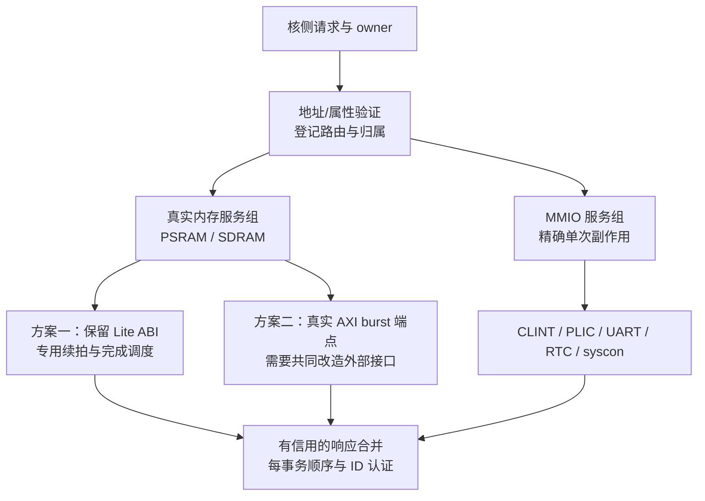

# BUS 优化与架构重组分析

实施更新（2026-09-08）：下文保留优化前的四批分析。四批 RTL 已按此范围落实，实际网络见 [TOPOLOGY.md](TOPOLOGY.md)，逐批验证、CPI、综合/STA 与中间产物清理见 [实施结果](../../../../tmp/rv64-bus-four-batches-20260908/REPORT.md)。性能假设以测量结果修正；不把原建议视作已经证明的收益。

日期：2026-09-08。基于当前 [BUS 拓扑](TOPOLOGY.md)、实际 RTL 调用链和上一轮 C6 的系统基准日志。本轮是分析：不修改 RTL，不重新运行综合或大规模测试。

## 1. 工作负载会改变拓扑候选的优先级

| C6 系统基准 | 总周期 | 外部单拍读计数 | 外部写计数 |
|---|---:|---:|---:|
| CoreMark，10 iterations | 9,708,334 | 2,408 | 148,105 |
| Dhrystone，10,000 runs | 16,083,167 | 1,191 | 601,192 |

计数来自系统 harness 的四个外部 Endpoint：reads 在 Lite AR 握手时增加，writes 在该目标 AW/W 配对执行时增加；不包含 D-cache hit，也不是 load/store 指令数或片上所有外设访问数。它们证明这两个基准的外部流量偏向写，尚不能证明 B 等待占了多少停顿。

因此，近期若以 CoreMark/Dhrystone CPI 为目标，优先级应调整为：普通 store 期间的缓存可用性、单拍写完成延迟 → 读补行循环 → 按流量分区的总线架构 → 更多 outstanding。读 burst 服务仍是流式访存、大工作集和冷启动的重要方向。

证据：[CoreMark 日志](../../../../tmp/rv64-backend-network-opt-20260907/c6/benchmarks/coremark-runner.log)、[Dhrystone 日志](../../../../tmp/rv64-backend-network-opt-20260907/c6/benchmarks/dhrystone-runner.log)；[计数实现的当前源码位置](../../sim/src/r64_sim_main.cpp)。结果命令明确使用 C6 的 VR64SystemTestTop。

## 2. 第一批：不增加外部 store 数量的两项实验

### A. 普通 cached store 等待 B 时允许独立 load 查缓存

当前 R64Dcache 的 read_overlap_w 仅对 READ/REFILL 中的普通 cached load 成立；WRITE/BRESP 不开放重叠。special_wait_w 又将所有 op!=0 的 resident owner 归成阻塞其他请求的特殊事务，因此不能只给 read_overlap_w 多加一个状态。

建议首先只开放以下边界：

- owner 是普通、自然对齐的 cached store；首版仅在 BRESP 阶段开放，暂不扩展到尚未完成 AW/W 交付的阶段。
- 候选是已经通过 LSU 顺序与转发检查的普通 cached load，位于另一个 bank、不同 set。
- store 的地址、数据、token、错误和最终 B 归属保持；store 仍在真实 B 完成后交付 ROB。
- load hit 可完成；load miss 暂留它自己的 bank 槽，等现有慢 owner 释放后再发外部读。首版不创建第二个 miss owner。
- B 成功只更新 store 所在 bank 的对应字节；B 错误不安装新值；invalidate/flush、输出背压和 held miss 的重读规则继续生效。

必要修改点包括 special_wait_w 的分类、req_ready_o、hit_complete_w、input_lane_w、lookup_set/index 选择，以及 store 完成后对另一个未完成槽的重新 lookup。不能仅放宽 ready 而让地址/数据选择仍采用旧状态条件。

上游具有可利用的入口：R64Lsu 的 barrier_w 不会永久屏蔽所有已知、已完成属性检查的普通 store；不相关 load 可经既有转发/顺序认证继续进入请求队列。MemoryService 已有独立 token 和缓存响应分发。最终收益仍需确认当时是否有可执行 load，及服务队头是否挡住它。

这一方案改变的是等待写完成时的缓存利用率。即使 B 往返周期不变，也可能减少后续 load 与其依赖链的停顿。它不提前提交 store，不增加不可撤销写事务。

涉及：[R64Dcache.v](../lsu/R64Dcache.v) 第 55–99、217–230、325–339 行；[R64Lsu.v](../lsu/R64Lsu.v) 第 374–390、495–512 行；[R64MemoryService.v](../lsu/R64MemoryService.v) 第 112–142 行。

### B. 为普通单拍 store 缩短窄完成通路

当前关键链为：真实目标 B → Fabric 注册 B 输出 → R64AxiWrite 的 B FIFO → D-cache 接受完成 → LSU store_done 寄存器 → ROB 头部完成。Fabric 已支持最终子 B 到 terminal/B 输出的同边沿处理；ROB 已有专用 store_done 入口，这两项不能再次算作新优化。

可试验在 R64AxiWrite 的 B FIFO 为空时，给已认证的当前 B 一个直接交付内部消费者的分支；消费者未准备好时仍捕获到原 FIFO，旧 FIFO 头部永远优先。物理 BREADY 继续由可靠的缓冲容量产生，不让下游 ROB/kill/ready 组合穿透到外部 AXI。

这最多首先针对一个重复的完成寄存边界，实际是否省掉端到端周期要由波形证明。也可探索在原生集成边界共享一份已预留的窄 terminal holder；通用接口的 owner 保持规则仍须成立。

必须保留 BID 范围、live owner、AW 已完成、最后 W 已完成、重复 B 检查；错误 B 与成功 B 使用同一归属规则。client busy 只能在内部消费者真正接受时释放，不能仅因总线 B 已到达而释放。

主要风险是 STA：外部 BVALID/BRESP 经 owner 验证，可能进入 D-cache 字节写使能和 LSU store_done 更新。预备 owner/tag/payload、只让晚到事件选择窄控制有助于缩短组合锥，但不能代替真实综合比较。不建议一次串穿 Fabric、适配器、LSU、ROB 的所有边界。

涉及：[R64AxiWrite.v](R64AxiWrite.v) 第 66–78、97–100、140–146 行；[R64Dcache.v](../lsu/R64Dcache.v) 第 119–145 行；[R64Lsu.v](../lsu/R64Lsu.v) 第 226–232、1196–1207 行；[R64Rob.v](../backend/R64Rob.v) 第 274–285 行。

## 3. 第二批：缩短读 burst 的逐拍控制循环

当前每拍返回后释放目标 busy，再依次经过 eligible → plan → launch；返回选择又先等待 rwaiting_q，再登记 return owner。

可以拆成两个独立候选：

1. **下一拍预备。** 在当前拍未完成时预先计算 next address、next count、固定 target/ID。真实非末拍 R 接受后，在没有更早已发布 offer、没有同目标竞争者且有返回信用时，直接把后续拍送入已注册 launch，减少重复的空槽选择和调度。不能在旧 R 未真正接收时让同一 Lite 目标挂第二拍。
2. **返回 owner 提前登记。** 当物理 AR 真正握手、返回选择位置空闲且不压过已有候选时，同边沿登记这个目标的 return owner。RREADY 仍来自注册 mask 和 FIFO 容量，可减少“先等 waiting_Q 再选 return”的等待。

第一版遇到同目标竞争者就回到既有轮询；或者显式设定有限 beat 配额。不能为提高单条补行速度而长期占住目标，恶化另一条 I/D 读流。已发布 VALID/payload 在反压下必须稳定，非法描述符不能走物理访问捷径。

这两项不改变外部端点 ABI。仍须保留真实的所有 R 拍、RID/RLAST、逐拍错误、4KiB/地址窗检查、FIXED/INCR 区别及 reset/取消排空。

涉及：[R64AxiFabric.v](../platform/R64AxiFabric.v) 第 199–246、407–465 行。对当前小工作集基准，外部读次数较少，应先用冷补行/交错目标的定向测试验证价值，再评估全程序。

## 4. 中期架构：按目标服务类型分区

第一步可以只把内存与 MMIO 分成两个服务组：每组一份 launch/return holder，共享或分层译码。这样一个 MMIO 的 ARREADY 等待不必占住内存的唯一 launch；返回宽 mux 也可按分组切开，减少全局控制扇出。代价是新增少量 holder、分组仲裁和出口合并，面积/频率需测量。

不能按 MEMORY 属性位直接绕过通用路径：当前该位图还标记了 MROM/flash/chiplink 等尚未实现的错误端点。快速路径必须只覆盖真正实现且验证过的目标，并且经过原有合法性检查。

若再升级 full-AXI 内存，必须同步改变 R64SystemTop 的外部端口、内存控制器或可综合端点，以及系统测试模型。上游 ARLEN=7 不代表下游单拍端点可以自动流式返回八拍；MMIO 仍应维持其合法单次访问和副作用时序。

这项重组主要解决服务隔离与连续传输能力，不自动消除 D-cache 单慢 owner 的限制。

## 5. 更大重组：读慢 owner 与 store owner 分离

在 A 的 load-hit 重叠验证后，可进一步把“读 miss 与 refill owner”和“等待写完成的 store owner”分离。第一版仍只允许一笔外部 store，读写使用独立 R/B 终结状态；互不冲突的普通 RAM load miss 可在 store 等待 B 时推进。

收益目标是延迟隐藏。关键难点包括：同 line/set 的读写顺序、refill 与 B 成功 cache 更新竞争真实 bank 写端口、失效/flush、held lookup 的刷新、页表 A/D 更新和 AMO/LRSC 排他、完成 token 的独立存活。尤其不能让一个读 beat 和 store 更新在同拍写同一单写端口而丢弃其中一个。

要么对冲突读施加有保证的背压/缓存，要么预留写完成缓冲；不能依赖“通常不会碰到”。初版可保持另一 bank/不同 set 限制，之后再按测量放宽。

**两笔 store 同时外发是另一项更大的架构变更。** 当前 R64Lsu 只在 ROB head/effect_allow 下允许物理副作用，R64Rob 的 store_done 也只接受匹配头部的完成。前一个 store 等待可报错的 B 时，后一个 store 还没有获得同等不可撤销授权。仅启用写 client 1、加 AW 队列或给 store 早退休，都不能保持当前精确错误语义。

若将来引入 committed store buffer 或 write-back cache，需要先确定在迟到 B 错误下的架构报告方式、内存服务保证、FENCE/AMO/页表/DMA 的顺序规则；本次不把它当成低风险 CPI 优化。

## 6. 不宜优先做或容易误判的方向

- **直接扩大 Fabric 槽/ID/FIFO。** 当前核只有两个读 client、一个有效写 client，D-cache 仍单慢 owner。必须先有可利用的独立请求。
- **先拆所有共享 R/B FIFO。** 它们有通用队头阻塞可能，但当前 cache fill 接收一般持续 ready；应先看到实际 head-block/full 计数。若采用按 ID 分隔队列，仍需全局接收缓冲或预留信用，不能让 RID 组合驱动外部 RREADY 而破坏既有接口隔离。
- **只把首拍 W 提前一拍。** 既有单拍定向测试相对 cmd 的时刻为 AW=1、W=2、目标 AW/W 配对=3、目标 B=4、AXI B=5、client B=6。即使 W 从 2 提前到 1，目标仍可能等待 AW 译码/路由到第 3 拍，因此局部省拍未必降低最终 store 延迟。
- **把 MMIO 完成当普通 RAM 完成提前。** PLIC claim、UART 接收 FIFO、RTC 快照和 syscon B 后事件各有自己的副作用边沿。
- **把 critical-word early restart 直接加入首轮。** 当前 refill 会累计整行后续拍错误；若数据先交付甚至退休，后面拍报错时如何撤销/归属就会变化。需要单独设计错误语义，不能仅把目标 beat 转发出去。
- **让 PTW 绕过 D-cache 直接读 AXI。** 会改变 PTE 与普通 store 的一致性及 A/D compare-or 的序关系；即使未来给 PTW 单独队列或 ID，仍需维持同一一致性边界。

## 7. 推荐实施顺序与可观察验收

| 顺序 | 独立变更 | 首要观测 | 必须保留的语义 |
|---|---|---|---|
| 1A | 普通 store BRESP 期间允许另一 bank/不同 set 的 cached load | 被阻塞 load 的 hit 完成周期、可发射候选数、store 等待窗口利用率 | store 真实 B 完成；错误/失效/AMO 与 load 顺序 |
| 1B | 单拍写窄完成通路减少一层等待 | 目标 B → client B → store_done → ROB/retire 的逐段周期 | ID、完整 owner、错误码、背压与不重复完成 |
| 2 | 读续拍预备和返回 owner 提前登记，分别实验 | 相邻物理 AR/R 间隔、8 拍末拍延迟、I/D 公平性 | 每拍真实响应和目标唯一占用 |
| 3 | 内存/MMIO 两组服务 | 慢目标是否挡住其他目标、返回 mux 的局部 STA | 路由检查、持有 offer、设备副作用 |
| 4 | 读 miss/store 双 owner，仍一笔 store | miss-under-store 的实际重叠、bank 写端口冲突 | 精确完成、数据一致性和各 owner 独立排空 |

本轮直接复用已有日志和源码证据，不重复运行上一轮已通过的 BUS 测试。真正实施时，每项先用覆盖其触发条件的定向测试与错误/反压反例，再比较相同程序和外部模型下的 CPI、综合面积与 STA。完成等待计数可能重叠，不能简单相加为可减少的总周期。
