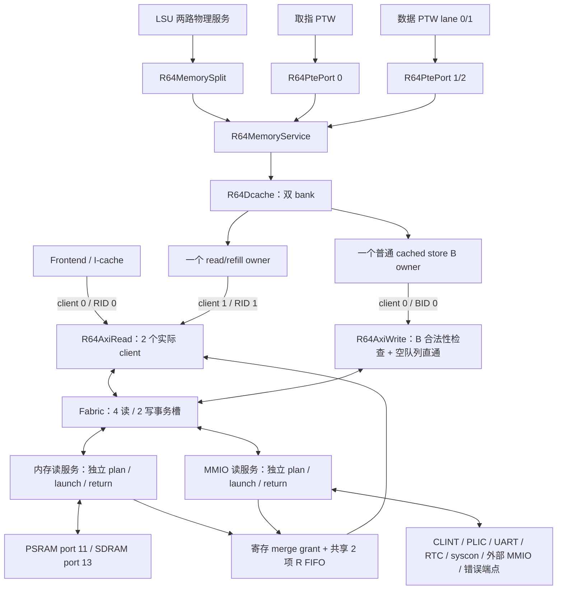
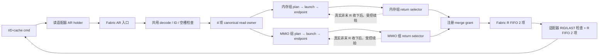

# 当前 BUS 与平台结构及事务拓扑

依据 **2026-10-09 生产 RTL** 核对，范围是 `R64SystemTop.core` 的读写适配器与
`R64SystemTop.platform` 的 Fabric、端点及中断事件。本文是这两个目录共享的事务拓扑入口；
[platform/README](../platform/README.md)补充系统装配与可选 Tensor 接入，
[全核拓扑](../TOPOLOGY.md)连接 CPU 请求、完成和恢复。
本次仅整理文档；历史优化与测量独立列于文末。

## 1. 实际边界、配置与职责

`bus/` 保存核侧适配器和复用外设；`platform/` 保存系统装配、Fabric、RTC 桥和可选
Tensor 系统。文件所在目录不代表相同父实例，AXI ID、Fabric 槽和 ROB/LSQ 身份也不相同。

| 生产实例 / 配置 | 当前值 | 影响 |
| --- | --- | --- |
| CoreTop.read_bus | `CLIENTS=2`、`CLIENT_W=1`、`ID_W=4` | client0=I-cache，client1=Memory/D-cache；通用默认四 client 未用于当前核 |
| CoreTop.write_bus | `CLIENTS=2`、`CLIENT_W=1`、`ID_W=4`、`B_BYPASS=1` | 仅 client0 接 Memory，client1 valid 固定0；生产 AWLEN=0，单外部写 owner |
| Platform.fabric | `SLAVES=16`、`SLAVE_W=4`；读4槽/写2槽 | 4-bit AXI ID 与 2-bit 读槽索引分离；系统实际并发还受核侧 client 限制 |
| Platform.fabric | `READ_CONTINUE=1`、`EARLY_RETURN=1` | 已接收的非末 R 可受控续拍；真实 AR 可提前登记返回选择 |
| Platform.fabric | `READ_MEMORY_MASK=16'h2800`；`MEMORY=EXECUTABLE=16'h6a80` | 读服务仅把 PSRAM/SDRAM 分到内存组；memory 属性窗可仍接错误端点 |
| Platform.clint / plic | 地址/数据64 bit、strb8；mtime divisor10；source数32、priority3 bit | 时间中断与 M/S 外部中断独立于 R/B 数据返回 |
| Platform.rtc | `CLOCK_NS=2`（默认） | RTL 时间计数步长；不表示全核 STA 已达到2 ns |
| 外部端点 | 4组单拍接口，地址/数据64 bit | ext 顺序固定为 PSRAM、SDRAM、legacy MMIO、virtio；不是四个 AXI master |

### 1.1 文件职责

| 源码 | 实际职责 / 使用方 |
| --- | --- |
| [R64AxiRead.v](R64AxiRead.v) | 核侧读 ID 占用、AR holder、R FIFO、RID/RLAST 检查；client 保留自己的架构 owner |
| [R64AxiWrite.v](R64AxiWrite.v) | 核侧 AW 描述符、W 次序与数据寄存、B 归属校验和内部空 FIFO 直通 |
| [R64AxiFabric.v](../platform/R64AxiFabric.v) | AXI burst 描述符检查、canonical owner、AW/W 配对和共享返回；不把上游 burst 伪装成一个单拍完成 |
| [R64AxiReadService.v](../platform/R64AxiReadService.v) | 两个读服务组的 plan/launch/return；共享 Fabric 的四个 owner |
| [R64AxiPlatform.v](../platform/R64AxiPlatform.v)、[R64PlatformMap.vh](../platform/R64PlatformMap.vh) | 实例化 Fabric/真实设备/错误端点，保持 ext 映射；汇聚 time/IRQ/syscon |
| [AxiClint.v](AxiClint.v)、[AxiPlic.v](AxiPlic.v) | 独立寄存器接口与 mtime/msip/mtimecmp、优先级/gateway/context 状态 |
| [AxiToUart.v](AxiToUart.v)、[Uart.v](Uart.v) | AXI 单拍访问转 UART 寄存器、RX FIFO、字节收发与 IRQ |
| [AxiResetSyscon.v](AxiResetSyscon.v)、[AxiDefaultSlave.v](AxiDefaultSlave.v) | 本地 B 接受后发布 syscon 事件 / 未实现合法窗口的错误响应 |
| [R64AxiRtc.v](../platform/R64AxiRtc.v)、[R64AxiRegisterPort.v](../platform/R64AxiRegisterPort.v) | Goldfish RTC 时间/闹钟与独立读、AW、W 捕获桥；该桥当前只供 RTC 使用 |
| [R64SystemTop.v](../platform/R64SystemTop.v) | 连接 CoreTop 与 Platform；可选 Tensor 模块的归属见[平台说明](../platform/README.md) |

### 1.2 实际实例层级

```text
R64SystemTop
├─ core : R64CoreTop
│  ├─ read_bus : R64AxiRead
│  └─ write_bus : R64AxiWrite
└─ platform : R64AxiPlatform
   ├─ fabric : R64AxiFabric
   │  └─ gen_read_service[0..1].group : R64AxiReadService
   ├─ clint : AxiClint
   ├─ plic : AxiPlic
   ├─ syscon : AxiResetSyscon
   ├─ uart : AxiToUart
   │  └─ u_uart : Uart
   ├─ rtc : R64AxiRtc
   │  └─ port : R64AxiRegisterPort
   ├─ g_external[0..3]：常量端点映射接线，无子模块
   └─ g_unimplemented[6,7,8,9,10,14,15].g_error.error : AxiDefaultSlave
```

此树省略 CPU 内部层次和设备组合选择树。生产没有 `NpcAxiBus`、`AxiCrossbar`、
`AxiDpiSlave` 实例，系统回归的外部端点由仿真宿主响应；DPI/宿主实现不能画入可综合平台。

## 2. 高级数据网络



写通道继续使用共同的 AW/W 顺序与 B owner 网络，图中的服务分组针对物理读服务。MMIO 副作用和外部四组单拍接口没有改变。端口号、AXI ID、ROB/LSU token 是不同的标识。

关键源码：[R64CoreTop.v](../core/R64CoreTop.v)、[R64Memory.v](../memory/R64Memory.v)、[R64LoadStore.v](../lsu/R64LoadStore.v)、[R64AxiFabric.v](../platform/R64AxiFabric.v)、[R64AxiReadService.v](../platform/R64AxiReadService.v)。

## 3. 实际容量、接收与占用释放

| 边界 | 生产能力 | 释放占用的事件 |
|---|---|---|
| R64AxiRead | I-cache / D-cache 各一个 live ID；共享 2 项 R FIFO | 对应缓存消费最后一拍 R |
| R64AxiWrite | 2 项 AW、2 项 W owner、2 项 B FIFO；实际只启用 client 0，AWLEN=0 | 客户端真正消费 B，包含合法直通 |
| Fabric 读 owner | 4 槽；当前核最多两个读 ID | 最后 R 被上游适配器接受 |
| Fabric 写 owner | 2 槽；当前核只有一个写 ID | B 被上游适配器接受 |
| 每个读服务组 | 2 项 plan、1 个 launch、1 个 return selector | plan→launch、真实 AR、真实 R 各自推进 |
| 每个目标 | 最多一个真实在途 Lite 读拍；读写 busy 独立 | 读 R 被收下；续拍可保留同一目标预约 |
| D-cache | 1 个 read/refill owner + 1 个普通 cached store B owner | 读独立交付；store 在真实 B/完成信用允许时交付 |

| 接收边界 | 真实事件 | 反压与所有权 |
| --- | --- | --- |
| I/D cache → Read adapter | `cmd_valid_i & cmd_ready_o`，最多1条/拍 | 占用 client ID 与 AR holder；client 在末拍交付前不可复用 |
| Read adapter → Fabric | `ARVALID && ARREADY` | Fabric 先持有描述符，再译码/分配 canonical owner；下游尚未访问 |
| Fabric group → endpoint | 该目标 `ARVALID && ARREADY` | 一个真实单拍读 owner；未 ready 时保持 launch payload |
| endpoint → Fabric → Read adapter | 各层独立 `RVALID && RREADY` | endpoint、Fabric slot、adapter client 分别在自己的边界释放，不能用同一个 done 代替 |
| Memory → Write adapter | command fire / data take 各自握手 | command 同时登记 AW 与 W 次序；W data stage 继续保留最终 WLAST owner |
| Fabric → endpoint write | AW、W 独立接受，设备配对后执行一次访问 | AW fire 或 W fire 单独发生不代表设备写完；目标 B 汇总错误 |
| Write adapter → Memory | `rsp_valid_o & rsp_ready_i` | 合法 B 直通或旧 FIFO 头交付才释放 client；空 FIFO 不是未授权 B 的通行条件 |
| 设备 → IRQ/syscon | 设备特定的寄存状态/本地完成事件 | IRQ 不走 AXI 返回；syscon 等本地 B 接受后发布，不能据 CPU 退休反推设备首次副作用 |

四个读事务槽由两个服务组共享；分组没有增加事务槽数。D-cache 分离的是普通 cached store 的等待 B 阶段。其 bank stage 保留地址、token、字节掩码；way、resident hit、数据和 invalidate poison 单独保存，不能被新 refill owner 覆盖。

新的 cached load 首先限定为**另一个 bank、不同 set**。AMO、LR/SC、PTE A/D CAS、非缓存和未对齐序列仍采用原先的独占/排空约束；没有增加第二个外部 store，没有把 store 的架构完成提前到 B 之前。满足条件时，I-cache 读、D-cache 读和一个 D-cache store 可以重叠，不能据此宣称当前核具备通用 6-owner 并发。

I-cache 补行 8×8 B，uncached fetch 2×8 B；D-cache 可分配 load miss 为 8×8 B，其他读单拍；当前写均为 write-through 单拍。通用适配器的 burst 测试能力不等于当前核会发出多拍 writeback。

## 4. 读网络与续拍



共用 owner 表保存 ID、地址、剩余拍、目标、SIZE、PROT、bad/fixed、waiting/terminal。每组只保存物理服务所需的预约和选择状态。目标 mask 是常量分区，RDATA/RRESP 在组内先选择，再进入两个组的最终合并。

续拍在上一拍真实 R 被接受后生效。下一地址和计数在等待期间准备；无更早的已发布 plan/launch、无同目标竞争者且响应容量足够时，下一拍直接装入寄存 launch。否则回到原轮询路径。没有提前发第二个 Lite 拍；4 KiB、FIXED、LAST 和逐拍错误检查继续有效。

实际 AR 握手可在没有更老返回候选时直接登记 return owner/mask。RREADY 仍由寄存选择和寄存 FIFO 容量产生。两组最多同拍发出两个目标 AR，但最终 R FIFO 只有一个写入口，寄存 merge grant 每拍只允许一组消费 R；另一组保留在端点/return holder。选择中的端点不提供 RVALID 时，可以把服务让给另一组。

资源释放分三层：目标 R 被收下后释放或续约目标预约；末拍入 Fabric FIFO 后标记 terminal，末拍出 FIFO 后释放 Fabric owner；缓存消费末拍后才释放适配器 client ID。

`READ_MEMORY_MASK=0` 保留单组行为；生产平台使用 `16'h2800`，只包括 PSRAM 与 SDRAM。不能用 `MEMORY=16'h6a80` 替代真实服务分组，因为 MROM/flash/chiplink memory 当前仍是错误端点。

## 5. 写完成与缓存物理端口

AW 描述符和 W owner 按命令同时登记，W 数据按接受顺序发送；AW/W 独立反压。最后一拍装入适配器 W 寄存器时可释放 W 队列项，但 `wstage_client_q` 继续持有真实 WLAST 握手的 owner。Fabric 通过 AW 顺序队列为无 ID 的 W 归属，所有子 B 错误最终汇总为一个 B。

生产 `R64AxiWrite.B_BYPASS=1`：B FIFO 非空时总是交付旧头；为空时，当前 B 通过 BID/live/AW/final-W/重复响应检查后可直接送给内部客户端。客户端不接收时写入原 FIFO，payload 与 ID 保持。物理 BREADY 只依赖寄存 FIFO 容量，不能依赖客户端 ready、kill 或旁路结果。通用默认参数仍为 0。

普通 store 的 AW/W 命令与数据交付后，D-cache 可保留独立 B owner，让 read/refill 状态机处理独立 miss。成功 B 更新 resident cache bytes；失败 B 保留原缓存字节并精确返回错误。fast-store 完成仍经过 LSU 的 `store_done_q` 与 ROB 的 owner/tag 检查。

缓存仍然每个 bank/way 一份数据数组、每个物理 bank 一个字节写端口。两个独立 bank 可以同时回填和更新 store；如果两者同 bank，store 完成使用该写口，RREADY 暂停，R beat 留在读适配器中。回填计数、错误累计、install、数据写入均只在真实 R handshake 推进。不能只压低 ready 而仍按 RVALID 写数据或递增计数。

当前 D-cache 在该仲裁之后保留每 bank 一拍待写状态与每32行一组的 payload 寄存器。
逻辑写入发生在原来的真实R/B边沿，下一拍落入原数据阵列；同址lookup按byte转发待写数据。
B完成、R接收、refill install与请求响应拍数保持。该结构缩小了最终R/B选择信号直接驱动的大阵列范围，
同时保留等待 B 时的独立 load 进展。具体写口/失效边界见[LSU/Cache 拓扑](../lsu/TOPOLOGY.md)；历史 STA 另列文末。


## 6. 当前地址分发与平台支路

以下是 `define.v` 默认宏与 `R64PlatformMap.vh` 组合得到的地址窗。覆盖这些宏的其他构建需重新核对。

| Fabric port | 默认地址窗（含末地址） | 实际端点 / 外部槽 |
|---|---|---|
| 0 | 0x02000000–0x0200FFFF | AxiClint |
| 1 | 0x0C000000–0x0FFFFFFF | AxiPlic |
| 2 | 0x00100000–0x00100FFF | AxiResetSyscon |
| 3 | 0x10000000–0x10000FFF | AxiToUart → Uart |
| 4 | 0x10001000–0x10001FFF | virtio 外部端口 ext[3] |
| 5 | 0x10003000–0x10003FFF | R64AxiRtc → R64AxiRegisterPort；已替换旧 GPIO 槽 |
| 6 | 0x10011000–0x10011007 | PS2 窗，AxiDefaultSlave |
| 7 | 0x20000000–0x20000FFF | MROM 窗，AxiDefaultSlave |
| 8 | 0x21000000–0x211FFFFF | VGA 窗，AxiDefaultSlave |
| 9 | 0x30000000–0x3FFFFFFF | flash 窗，AxiDefaultSlave |
| 10 | 0x40000000–0x7FFFFFFF | chiplink MMIO 窗，AxiDefaultSlave |
| 11 | 0x80000000–0x9FFFFFFF | PSRAM 外部端口 ext[0] |
| 12 | 0x12000000–0x13FFFFFF | legacy MMIO 外部端口 ext[2] |
| 13 | 0xA0000000–0xBFFFFFFF | SDRAM 外部端口 ext[1] |
| 14 | 0xC0000000–0xFFFFFFFF | chiplink memory 窗，AxiDefaultSlave |
| 15 | MASK=0，无匹配窗口 | 保留 default 槽；未命中直接由 Fabric 生成 DECERR |

窗口命中按第一个非零 MASK 的匹配项优先。属性位 `MEMORY=EXECUTABLE=16'h6a80` 标记端口 7、9、11、13、14；其中有的仍连接错误 slave，属性为 memory 不证明设备已实现。合法命中未实现窗口由 slave 返回 SLVERR；非法描述符或地址未命中由 Fabric 内部生成 DECERR。

`R64SystemTop` 只导出这四组单拍外部接口。当前 `R64SystemTestTop.sv` 的系统回归由 `sim/src/r64_sim_main.cpp` 的四个 C++ Endpoint 模型响应，不是实例化旧 `AxiDpiSlave.sv`。每个模型保存一项 R、独立 AW/W 和一项 B；不能把 core-only harness 的 full-AXI 内存行为混入这条系统链。

IRQ/事件有独立的旁路拓扑：CLINT → time、软件/定时器 IRQ；UART IRQ 位 1、RTC IRQ 位 4 与外部 IRQ 源汇入 PLIC，PLIC → M/S 外部 IRQ；syscon 发布系统控制事件。这些信号不经过 AXI R/B 数据返回。

RTC 的统一寄存器桥只用于 RTC。CLINT、PLIC、UART、syscon 各自持有请求和响应状态；AW/W 分别捕获后才执行写入。PLIC claim 先捕获选择结果，再在本地完成边沿更新 gateway；UART 读可有 FIFO 副作用，RTC TIME_LOW 读取快照高位。syscon 的发布事件等待其本地 B 握手。优化返回延迟时必须分别核对这些副作用边沿。

Tensor 扩展的 gmem 请求使用独立接口，并通过 dma_invalidate 与核心维护一致性；它不是本 Fabric 的额外 AXI master。外部 virtio 端口也不能凭名称推断为本 Fabric 的 DMA 主端。

依据：[R64AxiPlatform.v](../platform/R64AxiPlatform.v) 的 `fabric`、`EXTERNAL_SLAVE_MAP`、`g_external`、`sources`；[R64PlatformMap.vh](../platform/R64PlatformMap.vh)；[define.v](../include/define.v) 的 `NPC_AXI_*` 地址宏；[仿真宿主](../../sim/src/r64_sim_main.cpp)。

## 7. 背压、取消与时序边界

缓存/LSU 暂不接收时，返回数据保留在相应 holder/FIFO。共享 FIFO 的队头阻塞仍可能存在；分组解决的是物理读 launch/return 服务之间的阻塞，并没有把所有返回队列都拆成 per-ID。

Fabric AR/AW 入口仍各一项，ready 依据当前寄存占用；适配器的内部 cmd/data 信用可以依赖 ARREADY/WREADY。外部 AXI 管脚由寄存状态投影，不能把外部接口隔离等同于所有核内 ready 链都被切断。B 直通和同 bank R/B 写口仲裁都必须纳入真实 STA。

BUS 没有 ROB kill/branch flush 输入。已经接受的 AR/AW/W 继续 drain，上游 LSU/Frontend 决定是否交付或丢弃。invalidate 会 poison 相应 read/store cache 状态，不能撤销外部事务；reservation_clear 清除 reservation，不能当成 BUS reset。系统 reset 使用原同步清除和外部 VALID 抑制边界。

## 8. 当前设计单元与状态 owner

以下依据 2026-10-09 当前生产连接核对，保留 BUS-01～05 稳定 ID；容量和状态宽度是 RTL 声明，不是映射面积。
AXI ID、Fabric owner槽、LSU slot/tag与aux source属于不同命名空间。容量不能跨层相加当成不同访存数。

| ID / 源码 | 状态 owner、真实容量与字段 | 同拍/跨拍与取消、副作用 | 已知量与 UNKNOWN |
| --- | --- | --- | --- |
| BUS-01 核读适配器；[R64AxiRead.v](R64AxiRead.v) | 生产CLIENTS=2/CLIENT_W=1/AXI ID4；每I/D client至多1 live ID；AR holder1项（addr64,len8,size/prot各3等），共享R FIFO2项（data64,resp2,last1,client1）。 | client命令真实接受登记busy；外部AR/R由owner与寄存状态管理；缓存消费最后一拍才释放client。RREADY取寄存FIFO余量；ROB flush无端口，已发布请求继续drain。 | 最多2 live读ID、每拍最多1个R beat进共享FIFO；平均/尾延迟、R队头阻塞及读请求利用率 UNKNOWN。 |
| BUS-02 核写适配器；[R64AxiWrite.v](R64AxiWrite.v) | 通用2client但生产只有client0使用；AW2项、W owner2项、W data stage1项(data64/strb8/last1)、B FIFO2项(resp2/client1)。 | AW/W独立握手，final-W owner不能在装入W stage时丢失。B_BYPASS=1已存在：合法B且FIFO空可同拍交给client，否则入FIFO。外部BREADY仅取Q容量；真正消费B才释放busy。 | 当前core单外部store/BID；写等待B分布、旁路命中率、AW/W独立背压损失 UNKNOWN。 |
| BUS-03 Fabric canonical owner与返回；[R64AxiFabric.v](../platform/R64AxiFabric.v) | AR/AW入口各1项；读owner4槽，写owner2槽；共享R FIFO2项(data64/resp2/last/owner2)，写顺序与W数据各2项，B返回holder。read保存addr64/ID4/剩余8/size3/prot3/target4及状态。 | decode/ID/空槽检查后建立owner；真实末R/B被上游适配器接受才释放Fabric事务槽。每目标read/write忙状态分别管理，非法地址/属性错误仍有终端。无ROB取消端口。 | 4读/2写是Fabric容量，上游实际不足以全部占满；各owner寿命、入口与共享返回FIFO阻塞 UNKNOWN。 |
| BUS-04 两组读服务；[R64AxiReadService.v](../platform/R64AxiReadService.v) | 2个服务组共享BUS-03 owner；每组plan2项（owner2）、launch1项（addr64,size/prot3、owner2、target mask16）、return selector1项；每target最多1真实Lite读拍。 | 组合选plan→寄存launch→真实AR→寄存return→注册merge→共享R FIFO。续拍只在先前真实R接受后发布；merge每拍最多消费1组R，另组必须保持。分组不增加canonical槽。 | memory mask为0x2800（PSRAM/SDRAM）；两个目标AR可同拍，返回合并峰值1beat/拍。组间重叠利用率、续拍成功率、公平等待尾部 UNKNOWN。 |
| BUS-05 平台端点与中断事件；[R64AxiPlatform.v](../platform/R64AxiPlatform.v)及相应slave | 16个decode端口，4个外部单拍接口；各slave独立AW/W捕获及响应状态，不能套用同一读副作用边沿；系统TB四C++ Endpoint各保存1R、AW/W、1B。 | PLIC claim、UART FIFO读、RTC低读快照高位、syscon本地B发布事件各有其不可逆边沿。IRQ从设备旁路至CSR，不经R/B FIFO。BUS reset同步清状态/抑制VALID不等于runtime事务取消。 | 地址图已列于第6节；每设备访问频度/服务延迟分布及对CPU阻塞归因 UNKNOWN。MROM/flash/chiplink memory属性不证明端点实现。 |

跨层 drain 链为：目标响应被读服务收下 → Fabric terminal/FIFO → 核适配器FIFO → cache原owner →
LSU/Frontend原owner交付或丢弃。不同层的释放边沿不能用一个“总线已空”替代。
普通store路径中真实B错误必须返回LSU精确终端；不能通过只测AW/W或缓存hit就证明store已经架构完成。
Dcache独立store B owner、每bank pending write及B空队列直通均已存在，见 [LSU-09/12](../lsu/TOPOLOGY.md)。

本次为文档复核，没有新BUS benchmark或综合。布局前全核WNS、TNS、面积没有分离BUS-01～05的代价，
旧模块测试的局部拍数改善也不是当前程序CPI的可加分解。需要量化某项改法时应以相同workload、配置和
事务端到端起止事件取数，并同时观察其可能把背压传回的上游单元。


## 9. 验证入口与量化边界

| 机制 | 已有定向入口 | 验证范围 |
| --- | --- | --- |
| 核侧 ID / beat / B owner | [tb_r64_axi_read](../../testbench/chengyue64/modules/tb_r64_axi_read.sv)、[tb_r64_axi_write](../../testbench/chengyue64/modules/tb_r64_axi_write.sv) | 读写 client、背压、响应归属；Makefile 另提供错误 ID/提前 B 负向测试 |
| B 直通 | [tb_r64_axi_write](../../testbench/chengyue64/modules/tb_r64_axi_write.sv) 的 `B_BYPASS=1` 配置（Makefile 入口 `tb_r64_axi_write_bypass`） | 空 B FIFO 直通与受阻回退，保留 owner 校验 |
| Fabric 协议 / 隔离 | [tb_r64_fabric](../../testbench/chengyue64/modules/tb_r64_fabric.sv)、[tb_r64_fabric_reset](../../testbench/chengyue64/modules/tb_r64_fabric_reset.sv) | burst/ID/错误/反压及 reset，含 bad-last 负向入口 |
| 分组 / 续拍 | [tb_r64_fabric_groups](../../testbench/chengyue64/modules/tb_r64_fabric_groups.sv)、[tb_r64_fabric_read_continue](../../testbench/chengyue64/modules/tb_r64_fabric_read_continue.sv)、[tb_r64_fabric_latency](../../testbench/chengyue64/modules/tb_r64_fabric_latency.sv) | 慢 MMIO 与内存服务隔离、同目标竞争、逐拍进展 |
| 真实设备 / 平台 | [tb_r64_fabric_devices](../../testbench/chengyue64/modules/tb_r64_fabric_devices.sv)、[tb_r64_platform_reset](../../testbench/chengyue64/modules/tb_r64_platform_reset.sv)、[tb_r64_rtc](../../testbench/chengyue64/modules/tb_r64_rtc.sv) | 设备访问与副作用、复位发布边界、RTC |
| store 与缓存重叠 | [tb_r64_dcache_store_overlap](../../testbench/chengyue64/modules/tb_r64_dcache_store_overlap.sv)、[tb_r64_dcache_write_buffer](../../testbench/chengyue64/modules/tb_r64_dcache_write_buffer.sv) | 独立 store B owner、bank 写口冲突、pending write / invalidate |

运行范围见[验证平台](../../testbench/chengyue64/README.md)。本次仅文档整理，未重跑这些用例、
系统基准或综合/STA；表中的测试名称不构成一次新 PASS。端到端延迟应分别观察 cmd/AR、
每个目标 R、Fabric/adapter 交付、cache 完成与 LSU/Frontend 消费。

完整 AXI burst 外部内存端点、多外部 store、store 提前退休、per-ID 返回 FIFO 均不是当前图中
已经实现的结构。局部周期改善不能直接相加为整核 CPI 收益。

## 10. 历史实现与测量

- [2026-09-08 优化分析](OPTIMIZATION.md)保留当时四批实验的动机：cached store 等待 B 时的
  load 进展、内部 B 直通、逐拍续接/早返回、两读服务组及独立 read/store owner。
  当前正文只描述保留后的结构。
- 原四批结果路径 `tmp/rv64-bus-four-batches-20260908/REPORT.md` 当前不在工作区；
  原记录包括定向测试、系统 NEMU、固定基准、真实映射与布局前 STA，不能据该路径声称本次复验。
- 2026-09-09 整合记录涉及 D-cache 每 bank pending write 与宽 payload 写口。
  原 `tmp/rv64-whole-topology-20260908/REPORT.md` 当前不在工作区；已保留的历史全核数字见
  [全核拓扑](../TOPOLOGY.md)，按标注日期阅读。1 ns 下既有负 slack 未被改为时序通过。
