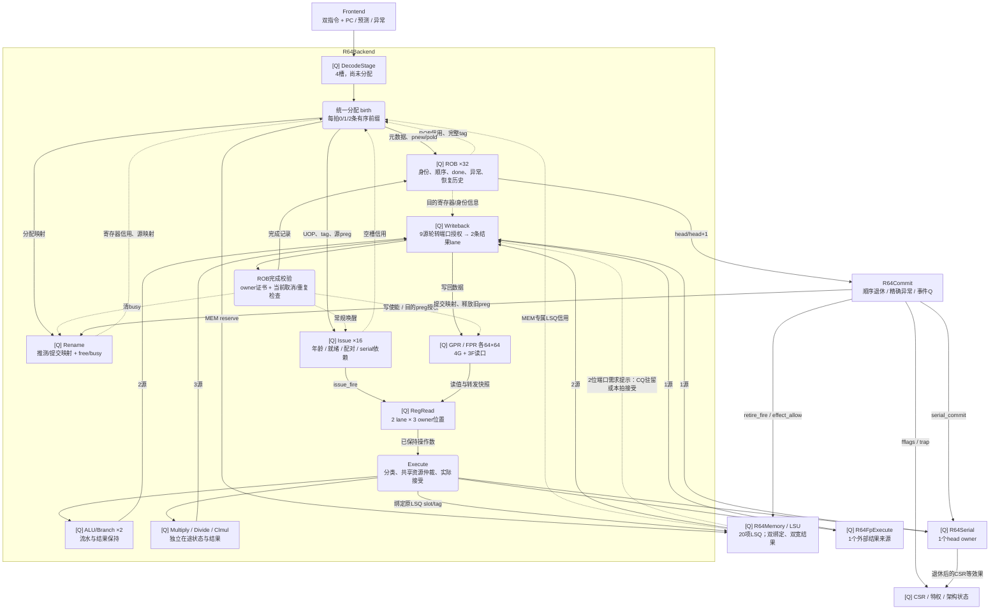
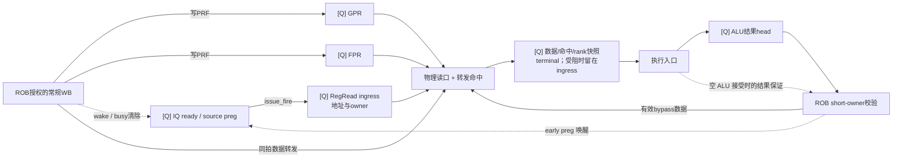
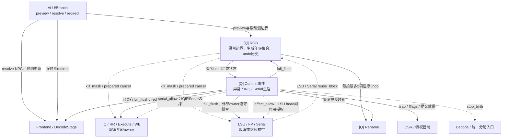

# 当前 Backend 高级网络拓扑

依据 2026-09-16 工作区当前生产 RTL 整理，入口为 R64CoreTop.backend。本文描述实际实例、数据流、寄存边界、信用与指令身份，不将模块数或队列容量解释成固定流水延迟。已更新到本轮 Backend 网络优化实现；对应变更与验证见 [优化分析及实施记录](OPTIMIZATION.md)。

Backend 围绕 ROB 保存的指令身份与顺序，连接五个网络：统一分配、依赖调度与操作数、执行分流、结果回流、提交与恢复。

## 1. 实际边界与配置

R64Backend 内部包含 DecodeStage、Rename、ROB、Issue、RegRead、Execute、Writeback。
R64Memory/LSU、R64FpExecute、R64Serial、R64Commit、R64Csr 是 R64CoreTop 下的同级实例；它们参与完整后端网络，但不在 backend 实例内部。

| 项目 | 当前核心配置 / 含义 |
| --- | --- |
| 前端输入、分配、发射、常规写回、普通退休 | 每拍最多 2 条；各边界有自己的接受条件 |
| DecodeStage | 4 个指令槽，尚未分配 ROB / 物理目的寄存器 |
| ROB | 32 项；tag=4-bit generation + 5-bit slot，共9 bit |
| Rename | GPR/FPR 各32项推测映射与提交映射；独立 free/busy 状态 |
| 物理寄存器 | GPR、FPR 各64×64 bit；GPR p0为零寄存器；初始各32个物理寄存器处于已映射集合 |
| IQ | 共享16项固定槽，2条选择输出；保存 older、compatible、serial_dependency 关系 |
| RegRead | 每lane 1个 ingress + 2个 terminal，共6个指令保持位置 |
| PRF读端口 | 4个GPR、3个FPR；每条指令最多3个逻辑源 |
| PRF写入 | 两条统一授权写回 lane，分别按GPR/FPR目的类型路由；不是各自额外两条完成通道 |
| ALU/Branch | 两个 R64AluLane，每lane 4份owner信用及4个结果槽；信用覆盖在途操作的预留 |
| 长整数执行 | Multiply、Divide、Clmul 各一个独立实例，各自保持结果 |
| 外部结果入口 | LSU0、LSU1、FP、Serial，共4路 |
| Backend 写回 | 本地5路 + 外部4路 = 9源，汇聚为2条寄存完成lane |
| LSU资源 | 当前20项；MEM在统一分配时先占LSQ，后续只绑定操作数 |
| FP入口 | 当前启用2槽 Q信用入口；内部算术与fault来源归并为1个Backend结果来源 |
| Serial | 1个ROB-head owner，结果交付与真正退休副作用分开 |
| 数据格式 | UOP218 bit、退休META204 bit、RESULT140 bit；完整tag另带 |

CoreTop 启用 PREDECODED=1、PREPARED_NPC=1、PRECONTROLLED=1、DIRECT_MEM_BIND=1。
Backend 启用 EARLY_ALU_WAKE=1、WB_DEFER_REQUEST=0、WB_REQUEST_HINTS=1、RR_ALU_BYPASS=1；IQ 启用 DEFER_READY/MDU_RESOURCE_PAIR，RegRead 启用 Q_ONLY_TERMINAL/COMPACT_FP/RAW_FP_ALLOCATION，ROB/Writeback 启用 OWNER_CERTIFICATE。CoreTop 的 Commit 启用 SCRATCH_READ_RESUME=1。
这些生产参数决定图中实际存在的路径；模块默认模式不能代替当前核心配置。

来源：[CoreTop](../core/R64CoreTop.v)、[Backend](R64Backend.v)、[字段定义](R64Uop.vh)。

## 2. 高级数据网络

[Q] 表示寄存状态；圆角判断节点表示组合选择/接受逻辑。实线表示指令或数据传递，虚线表示信用、授权、唤醒或源引用关系。



图中的 ACCEPT 是 ROB 内部逻辑，不是新增模块或队列。ROB→Writeback 的窄 owner 查询与证书，在结果捕获边界保存身份/目的寄存器信息；结果实际被接收时仍服从当前取消规则。PRF的数据直接来自WB结果总线，ROB提供写权限与目的preg；图中接受逻辑不额外增加一级宽数据寄存。

普通对齐 store 还有一条独立窄通道：**Dcache真实B完成 → LSU store_done → ROB head完成**。它不经过上述9源宽结果选择。分支 resolve/redirect 也有独立控制通道，不等待宽写回退休。

## 3. 实际实例层级

```text
R64CoreTop
├─ frontend : R64Frontend
├─ backend : R64Backend
│  ├─ decode_stage : R64DecodeStage
│  │  └─ R64Decode ×2（当前已预解码输入）
│  ├─ rename : R64Rename
│  ├─ rob : R64Rob
│  ├─ issue : R64Issue
│  │  ├─ select0 / fallback_select : R64LsuOrderSelect
│  │  ├─ gen_pair_select[0..15].second_select : R64LsuOrderSelect
│  │  └─ R64FpReadCompact ×16
│  ├─ registers : R64RegRead
│  │  ├─ GPR/FPR 阵列（模块内寄存状态）
│  │  ├─ ingress ×2、terminal ×4
│  │  ├─ R64FpReadJoin
│  │  └─ R64AluControl ×2（预计算ALU控制）
│  ├─ execute : R64Execute
│  │  ├─ gen_alu[0..1].lane : R64AluLane
│  │  │  └─ ALU datapath、分支/顺序NPC、结果保持
│  │  ├─ multiply : R64Multiply
│  │  ├─ divide : R64Divide
│  │  └─ clmul : R64Clmul
│  └─ writeback : R64Writeback
├─ memory : R64Memory
│  └─ unit : R64LoadStore → LSU / Split / Service / Dcache
├─ fp : R64FpExecute → FMA / Long / Fast / 本地fault
├─ serial : R64Serial
├─ commit : R64Commit
└─ csr : R64Csr
```

这里的 R64LsuOrderSelect 是可复用的选择器，实例化在 IQ 内不代表 IQ 通过 LSU 调度。
R64AgeSelect 虽定义在 R64Issue.v 中，当前 IQ 路径采用上面的 older 矩阵与 R64LsuOrderSelect，不应按文件内模块定义误画实例。
层级图省略算术子树、CSR 子块和前端/总线外围，不省略主要共享资源。

## 4. 分配与调度网络

**统一分配是资源一致性边界。**

DecodeStage持有已解码但尚未分配的指令。第0条需同时满足 ROB、Rename、IQ 信用；若为MEM，还需LSQ信用。第1条还要求第0条本拍实际分配，并满足第二份资源信用。ROB tag、物理目的寄存器、IQ槽与MEM的LSQ槽由同一个 birth 事件创建。

双分配内部处理同拍 RAW/WAW：第二条依赖第一条目的寄存器时使用第一条新preg；同一架构目的的旧映射也遵循两条指令的顺序。

**IQ既选择就绪指令，也选择能够配对的指令。**

每项保存源preg、源类型、ready，以及入队时确定的 older、compatible 和更老Serial依赖。生产 DEFER_READY 在分配后查询 busy/旁路状态初始化就绪，常规写回与ALU提前事件继续唤醒已有项。

选择第0条最老合法候选，同时为每种第0条候选并行求兼容的第二条，再用第0条选择结果合并。RegRead lane0无信用、lane1有信用时还有fallback选择，发射不要求双lane有序前缀。

当前同一新发射组合的约束为：

- ALU+ALU、MEM+MEM允许；MUL、DIV、CLMUL 在 birth 时登记不同资源类型，异种 MDU 可以成对，同种 MDU 仍冲突。BRANCH、FP、SERIAL 同类不能成对。
- 不同类仍需满足两条指令的有效FPR源需求总和不超过3。
- Serial需自身位于ROB head并获得serial_allow；更老Serial依赖尚未释放的指令不能越过。
- MEM的地址/数据就绪后可以乱序绑定，访存年龄与未知属性约束由已预留所有owner的LSU负责。
- IQ当前不直接使用每个FU的实时ready：fu_allow为全1，输入资源限制首先来自RegRead的Q信用。不同时间进入RR的请求会在Execute再次竞争共享执行入口。

来源：[DecodeStage](R64DecodeStage.v)、[Rename](R64Rename.v)、[Issue](R64Issue.v)。

## 5. 操作数与提前唤醒网络



ALU early 事件与数据旁路不同：结果没有更老预留、且接受的是非分支、非异常、非零目的 preg 的短 ALU 时，可在接受边沿提前唤醒。这个受限条件保证结果在被唤醒消费者的 RR 读边沿前成为旁路 head，即使 WB 受阻也会保持。其它情况继续使用原有成为 head 的唤醒；完成时的唤醒脉冲也保留，覆盖恰在接受脉冲同拍 birth、下一拍才初始化 ready 的消费者。

接受时的 early tag/preg 从原始驻留 ALU 候选与空结果预留状态产生，不经过最终 fire/kill 选择；最终 ROB short-owner 校验才授权有效唤醒。其 live-qualified 事件用逐拍断言与真实接受比较，防止把没有被接受的有效 owner 错误唤醒。

实际数据仍由保持的 ALU 结果 head 提供。early 和 bypass 均经过 ROB short-owner 身份校验；提前唤醒不把 ROB 标成完成、不写 PRF，也不构成退休。

常规写回完成资格由ROB确认；授权事件更新PRF、Rename busy以及IQ唤醒。不存在另一个独立维护架构寄存器数据的Rename阵列，数据本体位于RegRead的物理寄存器阵列。

RegRead在地址接受后的下一个读边界采样数据。输出受阻时，读结果可保存在ingress，随后不再占用读口。每lane的两个terminal采用Q信用；Execute ready不直接穿透成“本拍释放即可借用”的terminal信用。所有槽深都描述容量，不表示每条指令必须经过同样的等待拍数。

生产模式下，每个 terminal lane 有两个独立驻留槽：正常优先选择原 head；当 head 为无入口信用的 MDU/FP、另一槽为可接受 ALU 时，允许后者先被 Execute 接受。Execute 返回六个与 RR 候选无关的容量位（ALU0/1、MUL、DIV、CLMUL、FP）。非 head 释放后保留老 head，并将被释放位置设为下一写槽。

此模式的 RR→Execute 输出是可重新选择的候选，尚未 fire 的候选不构成下游 owner。Execute 仅在 fire 时向 FU、LSU、FP、Serial 发布；数据、tag、操作数快照、rank、预译码和 LSQ slot 始终来自同一驻留槽。不能把这个接口当成要求 blocked payload 不变的 held valid/ready；模块默认 ALU_TERMINAL_BYPASS=0 的通用模式仍保持原 FIFO 契约。MEM、Serial、分支 head 不参与绕行。

来源：[RegRead](R64RegRead.v)、[Backend中的short-owner连接](R64Backend.v)、[AluLane](R64Execute.v)。

## 6. 执行和结果回流网络

| Writeback来源编号 | 实际来源 | 本地/外部 |
| --- | --- | --- |
| 0、1 | ALU/Branch lane0、lane1 | Execute内部 |
| 2 | Multiply | Execute内部 |
| 3 | Divide | Execute内部 |
| 4 | Clmul | Execute内部 |
| 5、6 | LSU result0、result1 | R64Memory |
| 7 | FP结果 | R64FpExecute |
| 8 | Serial结果 | R64Serial |

Execute对RR保持的两个owner进行分类与年龄仲裁。ALU与Branch使用两个AluLane；branch控制发布限制单个胜出者。Multiply/Divide/Clmul各自有内部状态，不是一个共享数值执行器。FP只有一个外部发出接口，Serial也只有一个。生产DIRECT_MEM_BIND直接保持RR物理lane至LSU lane的slot/tag/payload映射，实际fire独立验证存活与ready。

FP内部的FMA、Long、Fast和本地fault先竞争一个结果出口，再作为Backend的一个来源参与9选2。LSU同样先进行自身的多源完成选择，再提供两条外部宽结果。这是嵌套的完成仲裁，不是所有算术结果直接各占一条全核写回口。

生产 Writeback 使用当前来源 VALID 和 LSU 的提前端口需求提示形成下一拍寄存 grant，省去 request_q 的重复需求采样；DEFER_REQUEST=1 的通用配置保留原路径。CoreTop 显式启用 Backend.WB_REQUEST_HINTS=1，仅外部来源5/6连接 LSU 提示，FP/Serial 和本地来源提示为0。通用 Backend/Writeback 默认禁用提示，维持原接入行为。grant 和两条宽结果 lane 都仍为寄存边界。来源 VALID 可能包含局部控制资格，因此它到 grant 的路径仍须真实 STA 验证，不能视为已经全部改成原始 Q 摘要。

LSU 提示在 CQ 接受结果的边沿就能申请端口，使冷启动结果进入 CQ 后第一拍可被捕获。它也允许驻留/已取消来源产生空授权，空授权不能生成完成。所有结果、tag、owner certificate 和最终 VALID 接受边沿保持原路径；这项改动缩短的是端口等待，不是绕过 CQ 或 ROB 校验。 LSU 的需求数量与具体来源选择并行计算，避免先等本地 winner 选择再进行全核端口调度。实现与同约束 A/B 见 [2026-09-16报告](../../../../../tmp/rv64-cpi-timing-20260916/REPORT.md)。

grant 属于来源端口，不是某条指令的 owner；真实当前 VALID/READY 及取消条件才决定捕获。来源 ready 只由 grant Q 产生；宽数据仍按 grant Q 选择，公平轮转保留。持续来源保持每拍服务，新来源少一个需求采样边沿；不能把整个写回画成无状态的组合 9 选 2。

被取消或过期结果不能凭“进入WB”更新架构状态。ROB的owner证书和当前接受规则确认完成；目的preg、写权限、异常等共同决定PRF写入。两条WB lane独立接受，可以只有lane1有效，且不要求ROB年龄有序。

窄store_done仅服务有真实完成依据的head store，并与ROB完成接受协调；常规load、FP/整数结果仍走宽完成网络。

来源：[Execute](R64Execute.v)、[Writeback](R64Writeback.v)、[ROB](R64Rob.v)、[FP入口](../fp/R64FpExecute.v)、[LSU拓扑](../lsu/TOPOLOGY.md)。

## 7. 提交、分支恢复与外部排空



分支预测更新实际由CoreTop把resolve信息接到Frontend；DecodeStage只接清除与新输入，不消费预测训练信息。

**分支误预测：**保留边界指令及更老指令，取消年轻后缀；ROB每拍最多输出两项逆序undo给Rename。恢复期间暂停分配和退休，合法更老完成仍可接受。另一个更老redirect可以扩展恢复范围。已接受外部事务按各owner协议继续排空。

ROB 发布取消集合时，用 raw redirect_pending 与已验证 plan 组成局部 partial-kill 谓词，再合并 full_flush；实际恢复状态转换仍使用 canonical redirect。这样移除了 full_flush 先进入分支 valid 再绕回 kill 的串联。逐拍断言与原 canonical 表达式比较完整取消集合，并未延迟取消生效。

**完整flush：**由Commit已经保存的异常、中断或Serial退休事件产生。Rename恢复提交映射，ROB及可取消执行状态清除。CoreTop合并前端redirect时，control_redirect优先于backend_redirect。当前只有明确白名单的 scratch 只读操作可以退休后继续执行：mscratch/sscratch 的 CSRRS/CSRRC 或立即数形式，且 rs1/zimm=0。它们仍在 ROB head 执行、独占退休并验证权限/异常；完成后释放 Serial 依赖，不生成 restart。其它 CSR、FENCE/FENCE.I/SFENCE、WFI、xRET 等保持原重启策略。

**顺序退休：**ROB仅从head/head+1提供已完成指令，第1条受第0条接受、异常及commit1_allow约束。Serial单独退休。Commit才授权提交映射、旧preg回收、LSU退休通知、Serial的CSR/TLB/cache等效果和fflags更新。

**跨模块owner：**MEM从birth起携带LSQ slot和完整tag，进入物理系统后仍需真实响应。LSU及Serial的reuse_block返回ROB，防止仍在排空的事务碰到复用槽。LSU 的共享 R64LsuRequestQueue 每个持有位置同时保存 ROB slot one-hot；reuse 输出只把有效槽的位图相或，不再从 tag 现场译码。实际覆盖 request_queue、translation_queue、forward_query、response_queue、forwarding_results、faults 六个实例。完整 tag 仍用于 owner 比较；LSQ、physical_hold、store_done 等其它持有域仍分别贡献保护，同槽多引用不会因一次 pop 提前释放。FP及本地FU则使用各自可取消状态和完整tag；不能把所有模块的kill都画成瞬间释放外部请求。

来源：[ROB](R64Rob.v)、[Rename](R64Rename.v)、[Commit](../control/R64Commit.v)、[Serial](../control/R64Serial.v)、[CoreTop](../core/R64CoreTop.v)。

## 8. 从拓扑可确定的共享点

| 共享点 | 可能表现出的等待 | 后续应测量的量 |
| --- | --- | --- |
| birth资源交集 | IQ/PRF/ROB/LSQ任一不足使分配前缀停止 | 分配受阻的逐资源原因 |
| IQ年龄与配对 | 有ready项但无法利用第二lane | ready候选数、类别/FPR预算/serial依赖限制 |
| RR独立lane保持 | 某lane的FU背压挡住其后其它类别 | 每lane入口/terminal占用及队头类别 |
| 4G+3F读口 | 双发射配对受实际源需求限制 | 读口预算导致的单发射次数 |
| 嵌套完成仲裁 | LSU/FP局部结果已就绪，仍等待本地出口或全核WB | 分层结果等待，而非只看全核WB占用 |
| 九源两写回 | 多个FU并行完成时排队 | 每来源等待、授权利用率、空授权周期 |
| ALU early与旁路head | 后排ALU结果已计算，但尚不可供依赖读取 | 结果就绪到成为bypass head的时间 |
| ROB head与恢复 | 完成不等于可退休；恢复期间停分配/退休 | head等待原因、undo长度、外部drain持有 |
| 全局取消/复位/发布 | 窄控制可能扇出至多个宽数据边界 | 当前网表端点分组与实际STA |

这些是由连接确定的分析入口，并非已确认的性能瓶颈。实现收益需要由相同程序、配置与约束下的性能和映射结果判断；具体测量见 [优化分析及实施记录](OPTIMIZATION.md)。


## 2026-09-08 全拓扑迭代补充

本轮在上述生产连接上进一步处理以下三项；实测状态见全拓扑结果目录，不能把实验配置当作已接受结论。

- Rename 的 GPR/FPR 空项与 IQ 空行共用 R64FreeSelect：并行前缀同时给出第一/第二 free one-hot 和0/1/2信用，避免串行两次优先级选择。
- IQ 的空行预写不可变 payload/metadata，真实 birth 仍原子分配 ROB、Rename、IQ 和 LSQ；ready、serial 依赖与年龄关系仍由真实出生更新。
- IQ 年龄矩阵改为静态行：重用列先清除，新 lane0 行取当前 live，lane1 再包括本拍 lane0。与原赋值优先级一致，支持 ISSUE_SLOTS 配置。

基线 CoreMark 的 decode_iq_block=3,985,961；Dhrystone 的主要信用压力为 ROB，decode_rob_block=9,445,748。因此建立 IQ16→32 的独立实验。后端与CoreTop最终默认保持16，CoreTop暴露ISSUE_SLOTS以保留容量对照。已测IQ32的CoreMark/Dhrystone CPI分别改善0.090241%/0.310911%，但本轮IQ16反馈版的SystemTop setup更好，因此采用该IQ16配置。面积未作为取舍门槛。窗口增大不会增加每拍发射、FPR物理端口或 WB 端口；serial、MEM 和 MDU 的资源限制不变。

ROB、RegRead、Writeback 已有 owner certificate、预解析 FP read plan、Q-only terminal、ALU bypass 和9选2捕获层。本轮先保留这些事务边界；依实际关键路径再决定是否切分，而不继续扩散 ready/kill 跨模块组合链。
