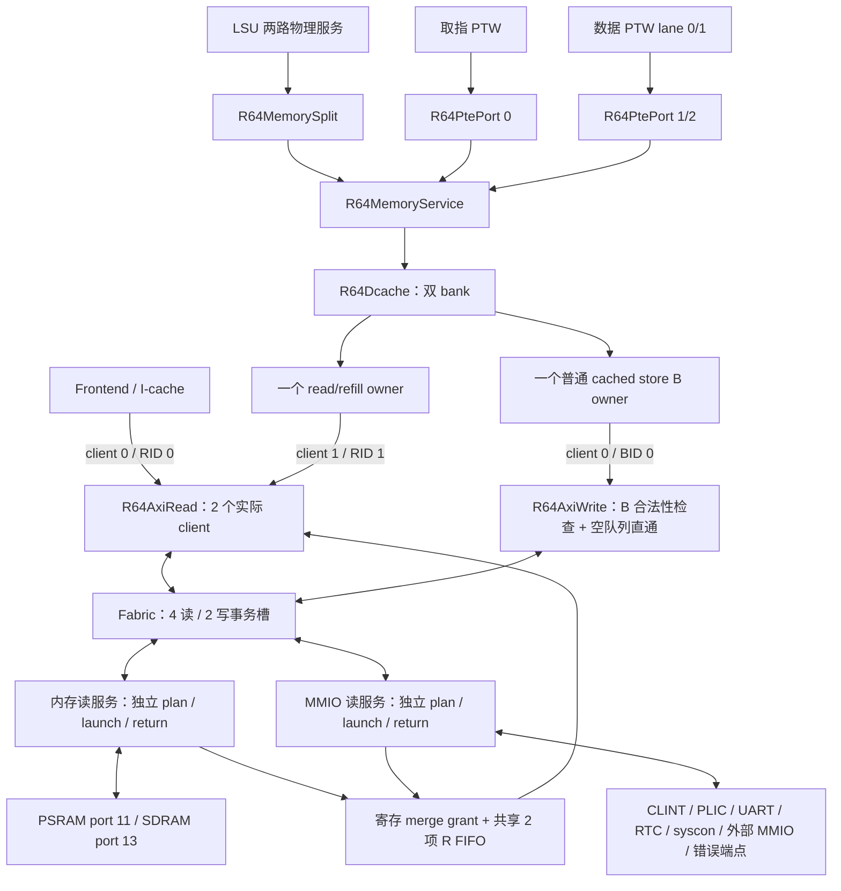
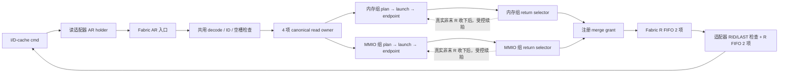

# Rebuild BUS 拓扑与事务生命周期

日期：2026-09-08。范围：生产连接 `R64CoreTop → R64SystemTop → R64AxiPlatform`。本文已按四批优化后的 RTL 更新；逐批 CPI、综合/STA、验证和产物清理记录见 [本轮结果](../../../../../tmp/rv64-bus-four-batches-20260908/REPORT.md)。优化前的分析保留在 [OPTIMIZATION.md](OPTIMIZATION.md)。

## 1. 高级网络

写通道继续使用共同的 AW/W 顺序与 B owner 网络，图中的服务分组针对物理读服务。MMIO 副作用和外部四组单拍接口没有改变。端口号、AXI ID、ROB/LSU token 是不同的标识。

关键源码：[R64CoreTop.v](../core/R64CoreTop.v)、[R64Memory.v](../memory/R64Memory.v)、[R64LoadStore.v](../lsu/R64LoadStore.v)、[R64AxiFabric.v](../platform/R64AxiFabric.v)、[R64AxiReadService.v](../platform/R64AxiReadService.v)。

## 2. 实际容量与占用释放

| 边界 | 生产能力 | 释放占用的事件 |
|---|---|---|
| R64AxiRead | I-cache / D-cache 各一个 live ID；共享 2 项 R FIFO | 对应缓存消费最后一拍 R |
| R64AxiWrite | 2 项 AW、2 项 W owner、2 项 B FIFO；实际只启用 client 0，AWLEN=0 | 客户端真正消费 B，包含合法直通 |
| Fabric 读 owner | 4 槽；当前核最多两个读 ID | 最后 R 被上游适配器接受 |
| Fabric 写 owner | 2 槽；当前核只有一个写 ID | B 被上游适配器接受 |
| 每个读服务组 | 2 项 plan、1 个 launch、1 个 return selector | plan→launch、真实 AR、真实 R 各自推进 |
| 每个目标 | 最多一个真实在途 Lite 读拍；读写 busy 独立 | 读 R 被收下；续拍可保留同一目标预约 |
| D-cache | 1 个 read/refill owner + 1 个普通 cached store B owner | 读独立交付；store 在真实 B/完成信用允许时交付 |

四个读事务槽由两个服务组共享；分组没有增加事务槽数。D-cache 分离的是普通 cached store 的等待 B 阶段。其 bank stage 保留地址、token、字节掩码；way、resident hit、数据和 invalidate poison 单独保存，不能被新 refill owner 覆盖。

新的 cached load 首先限定为**另一个 bank、不同 set**。AMO、LR/SC、PTE A/D CAS、非缓存和未对齐序列仍采用原先的独占/排空约束；没有增加第二个外部 store，没有把 store 的架构完成提前到 B 之前。满足条件时，I-cache 读、D-cache 读和一个 D-cache store 可以重叠，不能据此宣称当前核具备通用 6-owner 并发。

I-cache 补行 8×8 B，uncached fetch 2×8 B；D-cache 可分配 load miss 为 8×8 B，其他读单拍；当前写均为 write-through 单拍。通用适配器的 burst 测试能力不等于当前核会发出多拍 writeback。

## 3. 读网络与续拍

共用 owner 表保存 ID、地址、剩余拍、目标、SIZE、PROT、bad/fixed、waiting/terminal。每组只保存物理服务所需的预约和选择状态。目标 mask 是常量分区，RDATA/RRESP 在组内先选择，再进入两个组的最终合并。

续拍在上一拍真实 R 被接受后生效。下一地址和计数在等待期间准备；无更早的已发布 plan/launch、无同目标竞争者且响应容量足够时，下一拍直接装入寄存 launch。否则回到原轮询路径。没有提前发第二个 Lite 拍；4 KiB、FIXED、LAST 和逐拍错误检查继续有效。

实际 AR 握手可在没有更老返回候选时直接登记 return owner/mask。RREADY 仍由寄存选择和寄存 FIFO 容量产生。两组最多同拍发出两个目标 AR，但最终 R FIFO 只有一个写入口，寄存 merge grant 每拍只允许一组消费 R；另一组保留在端点/return holder。选择中的端点不提供 RVALID 时，可以把服务让给另一组。

资源释放分三层：目标 R 被收下后释放或续约目标预约；末拍入 Fabric FIFO 后标记 terminal，末拍出 FIFO 后释放 Fabric owner；缓存消费末拍后才释放适配器 client ID。

`READ_MEMORY_MASK=0` 保留单组行为；生产平台使用 `16'h2800`，只包括 PSRAM 与 SDRAM。不能用 `MEMORY=16'h6a80` 替代真实服务分组，因为 MROM/flash/chiplink memory 当前仍是错误端点。

## 4. 写完成与缓存物理端口

AW 描述符和 W owner 按命令同时登记，W 数据按接受顺序发送；AW/W 独立反压。最后一拍装入适配器 W 寄存器时可释放 W 队列项，但 `wstage_client_q` 继续持有真实 WLAST 握手的 owner。Fabric 通过 AW 顺序队列为无 ID 的 W 归属，所有子 B 错误最终汇总为一个 B。

生产 `R64AxiWrite.B_BYPASS=1`：B FIFO 非空时总是交付旧头；为空时，当前 B 通过 BID/live/AW/final-W/重复响应检查后可直接送给内部客户端。客户端不接收时写入原 FIFO，payload 与 ID 保持。物理 BREADY 只依赖寄存 FIFO 容量，不能依赖客户端 ready、kill 或旁路结果。通用默认参数仍为 0。

普通 store 的 AW/W 命令与数据交付后，D-cache 可保留独立 B owner，让 read/refill 状态机处理独立 miss。成功 B 更新 resident cache bytes；失败 B 保留原缓存字节并精确返回错误。fast-store 完成仍经过 LSU 的 `store_done_q` 与 ROB 的 owner/tag 检查。

缓存仍然每个 bank/way 一份数据数组、每个物理 bank 一个字节写端口。两个独立 bank 可以同时回填和更新 store；如果两者同 bank，store 完成使用该写口，RREADY 暂停，R beat 留在读适配器中。回填计数、错误累计、install、数据写入均只在真实 R handshake 推进。不能只压低 ready 而仍按 RVALID 写数据或递增计数。

2026-09-09 全核整合版在该仲裁之后增加每bank一拍待写状态与每32行一组的payload寄存器。
逻辑写入发生在原来的真实R/B边沿，下一拍落入原数据阵列；同址lookup按byte转发待写数据。
B完成、R接收、refill install与请求响应拍数保持。该结构缩小了最终R/B选择信号直接驱动的大阵列范围，
同时保留等待B时的独立load进展。全核拓扑及本轮STA反馈见
[全核拓扑](../TOPOLOGY.md) 和 [整合评估](../../../../../tmp/rv64-whole-topology-20260908/REPORT.md)。

## 5. 当前地址分发与平台支路

以下是 `define.v` 默认宏与 `R64PlatformMap.vh` 组合得到的地址窗。覆盖这些宏的其他构建需重新核对。

| Fabric port | 默认地址窗（含末地址） | 实际端点 / 外部槽 |
|---|---|---|
| 0 | 0x02000000–0x0200FFFF | AxiClint |
| 1 | 0x0C000000–0x0FFFFFFF | AxiPlic |
| 2 | 0x00100000–0x00100FFF | AxiResetSyscon |
| 3 | 0x10000000–0x10000FFF | AxiToUart → Uart |
| 4 | 0x10001000–0x10001FFF | virtio 外部端口 ext[3] |
| 5 | 0x10003000–0x10003FFF | R64AxiRtc → R64AxiRegisterPort；已替换旧 GPIO 槽 |
| 6 | 0x10011000–0x10011007 | PS2 窗，AxiDefaultSlave |
| 7 | 0x20000000–0x20000FFF | MROM 窗，AxiDefaultSlave |
| 8 | 0x21000000–0x211FFFFF | VGA 窗，AxiDefaultSlave |
| 9 | 0x30000000–0x3FFFFFFF | flash 窗，AxiDefaultSlave |
| 10 | 0x40000000–0x7FFFFFFF | chiplink MMIO 窗，AxiDefaultSlave |
| 11 | 0x80000000–0x9FFFFFFF | PSRAM 外部端口 ext[0] |
| 12 | 0x12000000–0x13FFFFFF | legacy MMIO 外部端口 ext[2] |
| 13 | 0xA0000000–0xBFFFFFFF | SDRAM 外部端口 ext[1] |
| 14 | 0xC0000000–0xFFFFFFFF | chiplink memory 窗，AxiDefaultSlave |
| 15 | MASK=0，无匹配窗口 | 保留 default 槽；未命中直接由 Fabric 生成 DECERR |

窗口命中按第一个非零 MASK 的匹配项优先。属性位 `MEMORY=EXECUTABLE=16'h6a80` 标记端口 7、9、11、13、14；其中有的仍连接错误 slave，属性为 memory 不证明设备已实现。合法命中未实现窗口由 slave 返回 SLVERR；非法描述符或地址未命中由 Fabric 内部生成 DECERR。

`R64SystemTop` 只导出这四组单拍外部接口。当前 `R64SystemTestTop.sv` 的系统回归由 `r64_core_test.cpp` 的四个 C++ Endpoint 模型响应，不是实例化旧 `AxiDpiSlave.sv`。每个模型保存一项 R、独立 AW/W 和一项 B；不能把 core-only harness 的 full-AXI 内存行为混入这条系统链。

IRQ/事件有独立的旁路拓扑：CLINT → time、软件/定时器 IRQ；UART IRQ 位 1、RTC IRQ 位 4 与外部 IRQ 源汇入 PLIC，PLIC → M/S 外部 IRQ；syscon 发布系统控制事件。这些信号不经过 AXI R/B 数据返回。

RTC 的统一寄存器桥只用于 RTC。CLINT、PLIC、UART、syscon 各自持有请求和响应状态；AW/W 分别捕获后才执行写入。PLIC claim 先捕获选择结果，再在本地完成边沿更新 gateway；UART 读可有 FIFO 副作用，RTC TIME_LOW 读取快照高位。syscon 的发布事件等待其本地 B 握手。优化返回延迟时必须分别核对这些副作用边沿。

Tensor 扩展的 gmem 请求使用独立接口，并通过 dma_invalidate 与核心维护一致性；它不是本 Fabric 的额外 AXI master。外部 virtio 端口也不能凭名称推断为本 Fabric 的 DMA 主端。

依据：[R64AxiPlatform.v](../platform/R64AxiPlatform.v) 第 50–55、110–269 行；[R64PlatformMap.vh](../platform/R64PlatformMap.vh)；[define.v](../../include/define.v) 第 169–281 行；[r64_core_test.cpp](../../../testbench/rebuild/r64_core_test.cpp) 第 309–400 行。

## 6. 背压、取消与时序边界

缓存/LSU 暂不接收时，返回数据保留在相应 holder/FIFO。共享 FIFO 的队头阻塞仍可能存在；分组解决的是物理读 launch/return 服务之间的阻塞，并没有把所有返回队列都拆成 per-ID。

Fabric AR/AW 入口仍各一项，ready 依据当前寄存占用；适配器的内部 cmd/data 信用可以依赖 ARREADY/WREADY。外部 AXI 管脚由寄存状态投影，不能把外部接口隔离等同于所有核内 ready 链都被切断。B 直通和同 bank R/B 写口仲裁都必须纳入真实 STA。

BUS 没有 ROB kill/branch flush 输入。已经接受的 AR/AW/W 继续 drain，上游 LSU/Frontend 决定是否交付或丢弃。invalidate 会 poison 相应 read/store cache 状态，不能撤销外部事务；reservation_clear 清除 reservation，不能当成 BUS reset。系统 reset 使用原同步清除和外部 VALID 抑制边界。

## 7. 验证范围与剩余边界

四批的固定 RTL、命令、原始 PASS/FAIL、CPI/面积/时序和清理清单汇总在 [本轮结果](../../../../../tmp/rv64-bus-four-batches-20260908/REPORT.md)。综合为真实单元库映射和布局前 STA；没有把已存在的 1 ns setup/hold 失败改成 PASS。

直接机制覆盖包括：B 直通与 FIFO 回退；延迟/错误 B 下 hit；四种续拍/早返回配置；同目标公平性；慢 MMIO 与 RAM 的单组/双组对照；R FIFO 背压；两 bank 的 R/B 写口冲突、成功/失败字节写读回、invalidate、reservation clear；完整系统 NEMU 对照和固定软件基准。

完整 AXI burst 内存端点、多外部 store、store 提前退休、per-ID 返回 FIFO 属于后续可选架构，当前实现没有加入。实际 CPI 以系统基准为准，模块测试的周期收益不直接折算成整核 CPI；面积和时序代价同样保留。
