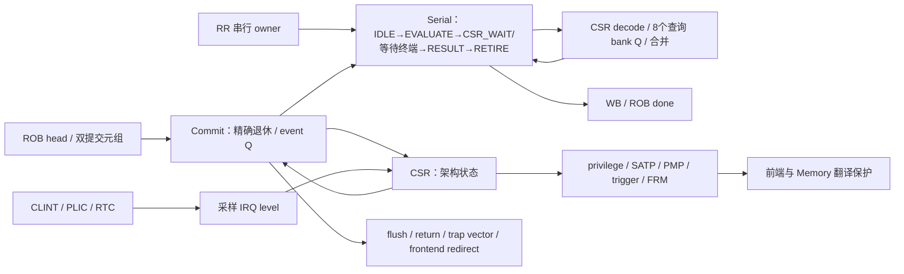

# 提交、串行与 CSR 网络

| 模块 | 关键契约与本轮决策 |
|---|---|
| R64Commit | 退休是一致的 dense prefix；head 异常/串行决定后续出生和副作用。保留现有事件寄存阶段和 scratch 只读 resume 白名单。 |
| R64Serial | CSR query 先快照，真正写入仍在同 tag 提交；FENCE 等内存排空；Tensor 已发布命令必须等真实终端。保留。 |
| R64CsrDecode | 地址独立 one-hot 预解码随串行 owner 寄存。保留。 |
| R64Csr | 8 个查询 bank、write snapshot、CSR/Trap/xRET 精确优先级；硬件中断源先采样，资格使用当前架构状态。保留。 |
| R64TrapVector | 高位预加、低位短加；Stage 版本在已有 prepare 边界寄存。保留。 |
| R64Counter、R64CounterNear | 字节局部增量与提前缓存的近回绕条件；支持软件写入与0–3增量，无新增架构拍。保留。 |
| R64Trigger | privilege/中断使能/委托共同决定触发资格，比较地址归属于原虚拟访问。保留。 |

基准 head_serial 仅30拍，缺少在本轮扩大 CSR 快速通道的 CPI 依据。Satp/PMP/FS/trigger 类状态更改不能沿用 scratch 的保留前端规则。全核时序若定位到控制广播，将优先减少无效 payload 的控制负载，不能延后取消或放松提交资格。
