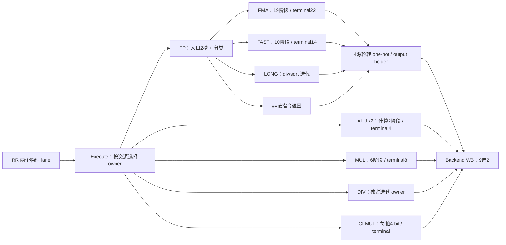

# 整数公共算术与浮点网络

| 文件组 | 数据计算与本轮决策 |
|---|---|
| backend/R64CarryStages.v、R64WideAdd.v | Prepare 生成块 base/propagate/generate，Finish 做全局前缀。末端 base 加 carry 改为 bit XOR 与块内全1前缀，保持所有拍数。服务 ALU、乘除、FP、预测地址。 |
| backend/R64Alu.v、R64Execute.v | ALU 控制在 RR 前解码，比较分 byte，分支 resolve 有预告与真实生效两层。已有独立 terminal 和 ALU 旁路，保留拍数和唤醒契约。 |
| backend/R64Multiply.v、R64ProductTree.v | Booth/CSA 归约后共享 CarryFinish；取消不提前释放已预约 terminal。保留6阶段，公共进位优化自动覆盖。 |
| backend/R64Divide.v、R64Clmul.v | DIV radix4 分 prepare/finish；CLMUL 迭代4 bit。缩拍会把宽算术重新组合，缺少关键路径证据时保留。 |
| R64FpOperand.v、R64FpUnpack.v | format/classification 与规格化；NaN boxing、subnormal 与特殊数语义保留。 |
| R64FpProductPipe.v | 53x53 tiled product，5 个数值阶段，owner 由 FMA 统一提供。 |
| R64FpFma.v | decomposition→normalize→product5→scale/order/align3→carry2→normalize2→round5。ADD/MUL 复用，单次 rounding。 |
| R64FpFast.v | move、compare、class、转换走固定10阶段，terminal14。 |
| R64FpLong.v | div/sqrt 独立单 owner；最终5阶段 rounding。 |
| R64FpRoundStages.v、R64FpRound.v | range/shift/GRS/局部与全局进位/pack，所有 rounding mode、fflags、特殊数保留。公共 CarryFinish 优化覆盖。 |
| R64FpCompletion.v、backend/R64NumericOwner.v | 固定数值流水的予約、token、terminal、前端缓存和 sticky cancellation。READY 不穿过数值流水。 |
| R64FpExecute.v | 四源轮转由逐项动态索引改为每源并行环形年龄判断、one-hot 合并。输出空闲时预写数据；入口空槽预写 payload；valid、kill、flush 和每源 ready 仍按原 owner 条件。 |

同拍取消仍由实际接收者检验；局部 tombstone 负责排空。原始 Q-valid 不等于允许写 PRF。S/D 向量、非法 rounding、反压和取消回归必须一起通过，不能只看整数基准 CPI。
