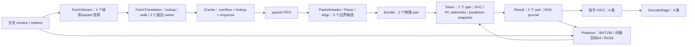

# 前端拓扑与优化记录

本轮以 BUS 第四批为基线；时序/CPI 的实测与清理记录统一放在 tmp/rv64-whole-topology-20260908。本文描述生产参数下的结构，通用模块的可选分支不等于实际流水。

| 文件 | 状态、关键边及本轮处理 |
|---|---|
| R64FetchStream.v | 取指请求和 packet 信用先预约；redirect 后旧响应仍按 owner 排空。32 项 early target 保留。 |
| R64PacketParse.v | 半字边界预解析、长度/异常映射与跨 packet 缺失信息；先计算固定候选，后选择 cursor。保留现有三候选结构。 |
| R64Align.v | 消费前缀、跨包拼接、异常字节及 successor 修复；窄选择信息与宽指令数据保持同一 owner。保留。 |
| R64Rvc.v | 编码合法性与 RVC 展开为纯组合；不能通过省略保留编码/异常来缩短路径。保留。 |
| R64Predictor.v | BHT/BTB/RAS 更新来自既定训练边沿。六个待提交 RAS 记录先计算最年轻命中 one-hot，再并行合并 payload，替代宽串行覆盖链。 |
| R64Frontend.v | Bundle/Token/Result 空闲物理槽预写 payload；valid、异常与指针按真实 admission 更新。Result 部分消费用每 pair 的 half 位选择第二物理 lane，不再搬移 410 bit。 |

信用返回和恢复：准备 payload 不创建有效指令；满槽冻结。部分消费只释放已被消费者接受的前缀。RAS 的 speculative journal 与已提交栈必须按同一恢复边界选择。ICache/翻译已接受事务不能由 CPU redirect 直接释放。

前端版本 CoreMark 已与基线 cycles、retired 及全部 26 项观察计数一致；最终时序结论以阶段报告为准。
