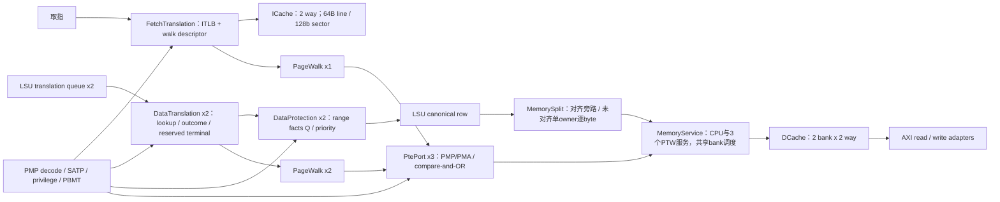

# 翻译、保护、Cache 与 LSU 服务网络

| 文件 | 物理状态/组合边与本轮选择 |
|---|---|
| R64Memory.v | 两路 D translation/protection 与三个 PTE port；LSU 在实际翻译 fire 时预约响应，因此保护末级有既定信用。保持绑定。 |
| R64Tlb.v | 16 项，VPN/ASID/global/page-size 匹配后 one-hot 合并 PA/flags。空项选择改为并行前缀；全满仍按原 next 替换；overlap/SFENCE 优先级不变。 |
| R64PageWalk.v | IDLE→READ→CHECK→UPDATE/UPDATED→RESULT；A/D 比较失败从根重读。保留当前结构，不放宽权限、失配重启或投机 store 的 A/D 授权。 |
| R64Translation.v | 生产数据支路选择 R64DataTranslation；通用兼容支路仍有独立测试。 |
| R64DataTranslation.v | lookup/outcome/terminal 分离，walk 期间 owner 保持，invalidate poison 排空，成功结果再形成 PA/last/PMA。保持。 |
| R64FetchTranslation.v | 一个 lookup、一个待启动/在途 walk、两个响应 owner，walk descriptor 在空闲时提前准备。保持。 |
| R64PmpDecode.v | CSR 的16组配置形成共享 range/permission；TOR/NAPOT 边界和 locked 规则保持。 |
| R64PmpCheck.v | 所有范围并行比对，最低重叠项决定；部分重叠仍报错。保持。 |
| R64Pma.v、R64PmaRange.v | 对完整地址范围检查实际平台窗口与 MMIO 大小限制；保持。 |
| R64FetchProtection.v | sector 内四个 word 的事实预计算→owner Q→短优先级；R64FetchPma16 为固定16B访问消除动态长加法。保持。 |
| R64DataProtection.v | PA/last 对范围形成事实Q→最低匹配；保留现有空闲槽 payload 预写与独立 valid。 |
| R64PtePort.v | 在 IDLE 预写地址、expected、OR mask 和属性；状态转移单独授权请求；SEND/WAIT/FAULT 冻结。 |
| R64ICache.v | lookup 可离开时提前读两 way 的 tag/data，取消宽输入对最终 dispatch fire 的依赖。公开 response 在复位/无效周期的原值保持；不能用修改测试掩盖变化。 |

LSU 的20项 canonical owner、转发 query、pin、完成/取消网络见 [LSU 拓扑](../lsu/TOPOLOGY.md)。MemorySplit 负责未对齐片段与序列，MemoryService 汇合三个 coherent PTE 请求和 CPU 物理请求；特殊操作仍受原排空与独占条件约束。

整机 STA 的写 bank 瓶颈对应 R64Dcache.bank10_q[255][56]，基线 D 输入由 data_write_value_w[1][56] 驱动，扇出512。后续整合实验增加每 bank 一拍 pending write；查询按 index/way/mask 转发 pending data，保持原命中和安装时机。每32行保存独立写数据副本，降低局部扇出。原 R/B 冲突握手不变；不采用“B 未完成就锁住 refill bank”的方案，该方案破坏独立 load 进度，已由原测试否决。
