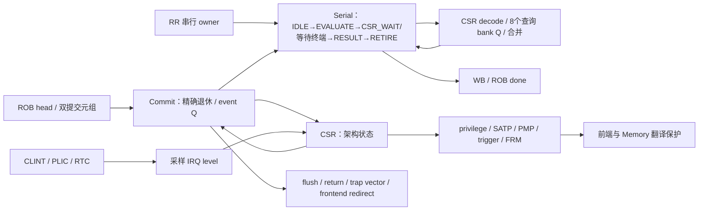

# 提交、串行与 CSR 网络

| 模块 | 关键契约与本轮决策 |
|---|---|
| R64Commit | 退休是一致的 dense prefix；head 异常/串行决定后续出生和副作用。保留现有事件寄存阶段和 scratch 只读 resume 白名单。 |
| R64Serial | CSR query 先快照，真正写入仍在同 tag 提交；FENCE 等内存排空；Tensor 已发布命令必须等真实终端。保留。 |
| R64CsrDecode | 地址独立 one-hot 预解码随串行 owner 寄存。保留。 |
| R64Csr | 8 个查询 bank、write snapshot、CSR/Trap/xRET 精确优先级；硬件中断源先采样，资格使用当前架构状态。保留。 |
| R64TrapVector | 高位预加、低位短加；Stage 版本在已有 prepare 边界寄存。保留。 |
| R64Counter、R64CounterNear | 字节局部增量与提前缓存的近回绕条件；支持软件写入与0–3增量，无新增架构拍。保留。 |
| R64Trigger | privilege/中断使能/委托共同决定触发资格，比较地址归属于原虚拟访问。保留。 |

基准 head_serial 仅30拍，缺少在本轮扩大 CSR 快速通道的 CPI 依据。Satp/PMP/FS/trigger 类状态更改不能沿用 scratch 的保留前端规则。全核时序若定位到控制广播，将优先减少无效 payload 的控制负载，不能延后取消或放松提交资格。

## 2026-10-08 当前设计单元索引

本表描述当前生产控制语义，不预选架构改法。既有段落中的“基准 head_serial 仅30拍”属于原优化记录，
不是对所有当前 workload 的统计；未取得同一当前运行的细分统计时记为 UNKNOWN。

| ID / 源码 | 状态 owner、容量与字段 | 同拍控制与跨拍事件 | 可量化事实与 UNKNOWN |
| --- | --- | --- | --- |
| CTL-01 退休授权与事件发布；`R64Commit.v` | 最多2条dense-prefix退休；单 event owner：valid/trap/interrupt/prepared各1位、PC64、tval64、cause6；retired_npc64。 | `rob_valid && rob_ready` 定义退休。head异常/空ROB中断/非白名单串行退休捕获event Q；trap先prepare一拍再发布。`full_flush = !rst_i && event_valid_q && (!event_trap_q || event_prepared_q)`，reset是抑制条件，runtime event才是flush来源。 | 单事件容量与最多双退已知；全局1ns模型中存在event Q→LSU内部违例，见下文。异常/中断/串行flush频度及各自损失周期 UNKNOWN。 |
| CTL-02 head串行 owner；`R64Serial.v` | 1个owner，state3，tag9、command/operand各64、CSR select64、ASID16、kind8、result140、retire_effect5。IDLE→EVALUATE→CSR_WAIT或外部SEND/WAIT_TERMINAL→RESULT→RETIRE。 | WB接受结果只将owner转为RETIRE；同full-tag commit才真正写CSR/执行退休副作用。kill可取消尚可撤销owner；已经发布外部命令则标dead并等待真实terminal drain。FENCE的排空判断不能由完成队列空代替全系统idle。 | 单owner与各寄存边界已知；CSR/FENCE/Tensor分别占用和阻塞周期 UNKNOWN。当前scratch只读resume白名单已启用，不能当作新优化。 |
| CTL-03 CSR查询与架构状态；`R64Csr.v`、`R64CsrDecode.v`、`R64PmpDecode.v` | CSR架构状态由单元持有；query按8×64bit bank Q快照，随后合并到read/write snapshot；select64和写mask64；PMP16×config8/address54。 | query不是退休写入。Serial保持请求与快照直到同tag commit；trap/xRET/CSR-write使用原精确优先级。权限、SATP、PMP、FS、trigger等上下文更改需原序列化/失效合同，不能套用scratch只读规则。 | 8bank和16PMP结构已知；query/commit时延分布、每类CSR次数、控制广播扇出实际全表 UNKNOWN。 |
| CTL-04 IRQ、trap target与计数；`R64Csr.v`、`R64TrapVector.v`、`R64Counter*.v`、`R64Trigger.v` | IRQ level采样4位Q；trap/return准备保存目标事实，计数器局部增量使用寄存近回绕条件；架构计数器仍为64bit。 | IRQ采样后以当前架构使能/委托/privilege确定资格；IRQ stop_birth仍保留在飞事务drain。trap target预计算在已有prepare边界，不能另加未计入恢复的隐藏拍。 | IRQ一级采样和已有prepare边界可核对；IRQ延迟分布、trigger/计数链局部PPA UNKNOWN。 |

CTL-01 与 Backend ROB 的 partial recovery 是不同 owner。`effect_allow_o = !rst_i && !event_valid_q && !head_exception`，
不因局部分支undo单独撤回head已经持有的不可逆请求许可；`stop_birth`会在recover/IRQ/event时阻止新出生，
但不因此冻结所有执行、响应drain和退休。异常/IRQ捕获检查 `lsu_irrevocable || serial_irrevocable`，
禁止在不可逆事务未完成时flush掉其身份。更改广播/添加局部寄存必须保持这些同拍授权条件。

当前 Commit、Serial 和 LSU 的这些状态是同步复位；Commit event payload有显式reset赋值，
LSU completion payload无reset清零但仍受控制更新使能影响。两者不能用一句“全核payload只清valid”概括。
真实SDC把reset作为普通输入设置0.4ns最大输入延迟；该假设是否符合芯片外部复位交付要求仍为 UNKNOWN，
不能仅凭它出现在最差路径就自行加false path。

已有 [当前基线 B 的 Q起点诊断](../../results/ai-cq-timing-20261008/PHYSICAL-COMPARISON.md)
记录 CQ payload最差slack −1.892150521ns（1ns目标、真实库映射、布局前模型），相关起点为运行时 `event_trap_q`；
[配对端点](../../results/ai-cq-timing-20261008/paired-path-diagnostic/RESULT.md) 又记录reset起点全局−2.119304419ns。
这是两种不同路径集合；忽略外部reset路径不会自动消除运行时事件路径。两者都不能直接当作最终Fmax或整程序CPI归因。
