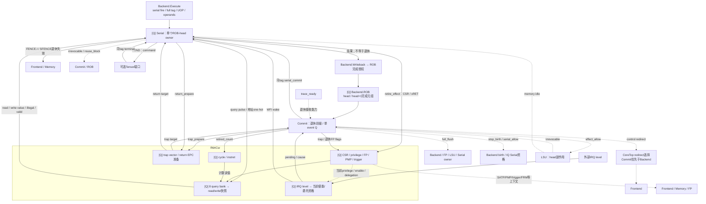

# 当前提交、串行与 CSR 结构

依据 **2026-10-09 工作区生产 RTL** 核对，入口为 [R64CoreTop](../core/R64CoreTop.v) 的
`control : R64Control` 域及其 `commit`、`serial`、`csr` 子实例。本文整理精确退休、串行 owner、CSR 查询与架构副作用，
与 [Backend 完成/恢复网络](../backend/TOPOLOGY.md)、[LSU 副作用和排空](../lsu/TOPOLOGY.md)配合阅读。
本轮职责重构的验证范围汇总在[全核拓扑](../TOPOLOGY.md)；既有历史测量放在文末。

## 1. 实际边界、配置与文件职责

控制域由 [R64Control](R64Control.v) 封闭 CSR 查询、准备和退休副作用协议。ROB 保存在 Backend；Serial 由 Backend.Execute 接收已保持的操作数，
经普通 Writeback/ROB 完成后仍保留 owner，等待 Commit 的同 tag 退休。Commit 和 CSR 分别持有事件状态与架构状态。

| 生产参数 / 边界 | 当前值与作用 |
| --- | --- |
| Control → Commit | `HEAD_SERIAL_ISSUE=1`、`HEAD_SERIAL_STOP=1`、`HEAD_EXCEPTION_STOP=1`、`HEAD_SERIAL_CLASS=1` |
| 上述 head 模式 | 使用 ROB 常驻 head 的 serial/exception 摘要及已保存的 class；未完成的 head Serial 可发射，阻止年轻 birth |
| scratch 恢复 | `SCRATCH_READ_RESUME=1`：只对4字节、零源掩码的 mscratch/sscratch CSRRS/CSRRC（含立即数形式）退休后继续；其他 Serial 保持重启策略 |
| 复位地址 | `RESET_PC` 随 CoreTop 参数，默认 `0x80000000`；初始化最后退休 NPC，供空 ROB 中断捕获 |
| 完成/退休宽度 | ROB/Commit 最多双条有序前缀；Serial 只在 ROB head 独占退休；Serial tag 为9 bit |
| CSR 查询 | 8个64-bit bank 快照，随后合并到 read/write response Q；与退休写入分离 |
| 架构保护状态 | PMP16项；单个地址 trigger；4位硬件 IRQ level 采样；64-bit cycle/instret 计数 |
| 可选外部事务 | Serial 有 Tensor SEND/WAIT_TERMINAL 接口；是否连接真实 Tensor 由系统顶层决定，不能据接口存在推断普通 SystemTop 含协处理器 |

### 1.1 文件职责索引

| 源码 | 生产职责 / 实例 |
| --- | --- |
| [R64Control.v](R64Control.v) | `CoreTop.control`；连接三个状态 owner，隐藏 CSR query/prepare/commit、退休反馈和原始 PMP；不增加流水状态 |
| [R64Commit.v](R64Commit.v) | `CoreTop.control.commit`；检查退休前缀、Serial 独占、异常/中断捕获；持有 event Q 与 retired NPC，发布 trap/full flush/redirect、birth/effect/serial 授权 |
| [R64Serial.v](R64Serial.v) | `CoreTop.control.serial`；单个 head owner 的 CSR、xRET、FENCE、SFENCE、WFI、ECALL/EBREAK及外部命令生命周期；结果完成和退休副作用分别授权 |
| [R64CsrDecode.v](R64CsrDecode.v) | `serial.decode_csr`；组合地址→64-bit one-hot，随 Serial 接收边沿保存；CSR 内的 `check_select` 只在 `R64_ASSERT` 下对照 |
| [R64Csr.v](R64Csr.v) | `CoreTop.control.csr`；特权/中断/委托/CSR/PMP/FP状态；查询快照、写租约和 trap/return 目标准备 |
| [R64TrapVector.v](R64TrapVector.v) | 生产使用 `csr.machine_vector/supervisor_vector : R64TrapVectorStage`，在既有 prepare 边沿寄存；组合 `R64TrapVector` 声明不能当作额外生产实例 |
| [R64Counter.v](R64Counter.v)、[R64CounterNear.v](R64CounterNear.v) | `csr.cycles/retired`；按字节加法，保存低位距回绕的条件；软件写入同步更新摘要，通用增量支持0～3，当前退休输入最多2 |
| [R64Trigger.v](R64Trigger.v) | `csr.trigger`；保存一个地址 trigger 的类型/权限/访问类，输出当前特权下的触发资格与地址；地址比较实际在 CoreTop 取指入口及 Memory/LSU |
| [R64PmpDecode.v](../memory/R64PmpDecode.v) | `CoreTop.control.pmp_decode` 是 Control 内与 CSR 同级的组合实例；把 CSR 的16项原始配置/地址译成范围和权限，交给取指/数据保护逻辑 |

### 1.2 主要生产实例

```text
R64CoreTop
├─ backend : R64Backend
│  ├─ rob : R64Rob
│  └─ execute : R64Execute → serial_fire / tag / operands
└─ control : R64Control
   ├─ serial : R64Serial
   │  └─ decode_csr : R64CsrDecode
   ├─ commit : R64Commit
   ├─ csr : R64Csr
   │  ├─ trigger : R64Trigger
   │  ├─ cycles : R64Counter
   │  ├─ retired : R64Counter
   │  │  ├─ g_choice[0..3].summary : R64CounterNear
   │  │  └─ writing_summary : R64CounterNear
   │  ├─ machine_vector : R64TrapVectorStage
   │  └─ supervisor_vector : R64TrapVectorStage
   └─ pmp_decode : R64PmpDecode
```

两个 Counter 都有同样的 Near helper，图中只展开一侧。
CSR 的8个 query bank、读/写 response、PMP 数组和 IRQ level 是本模块内寄存状态，不是另一级模块。
上面的层级与文件列表分开，`R64_ASSERT` 检查实例不作为真实服务容量。

## 2. 退休、完成与副作用网络

[Q] 表示状态 owner；虚线表示许可、恢复或上下文，实线表示元组、查询/结果及架构效果。
图中 CSR 查询与架构状态属于同一个 R64Csr 实例。



Serial 结果只是9源宽写回网络中的一个来源；WB 接收后进入 RETIRE，真正 CSR 写入、xRET、
FENCE.I/SFENCE 失效等效果仍由同 full-tag 的 `serial_commit` 触发。
Serial 的结果 valid 来自已寄存 owner；本拍 kill/full flush 的捕获资格由 WB 和 Serial 同边沿处理，不能单看 raw valid 判断完成成立。

## 3. 接收边沿与精确事件

| 边界 | 真实接收 / 发布条件 | owner 与顺序含义 |
| --- | --- | --- |
| Execute→Serial | `fire_i`；Execute 已结合 `ready_o`，且 tag 必须等于 ROB head | 接收时保存 command/operand/ASID/CSR select/kind；仅 IDLE 有入口信用 |
| Serial→CSR query | EVALUATE 的 CSR owner 发 `csr_query_o` | 查询只快照数据，不改变架构状态；query bank Q 后下一边沿合并 response，Serial 在 CSR_WAIT 接收 `csr_query_valid_i` |
| Serial→WB | `result_valid_o && result_ready_i` | 保存5-bit retire_effect，进入 RETIRE；保留 tag 直到真正退休 |
| ROB→Commit | `rob_valid_i & rob_ready_o & ~rob_exception_i` | lane1 与 lane0 构成前缀；`trace_ready_i` 限定实际退休；任一 Serial 禁止双退 |
| Commit→Serial | `serial_commit_o` 和 `serial_tag_o` | 匹配 held full-tag 后消费 retire_effect；CSR查询返回不能替代这个边沿 |
| CSR 架构写入 | `csr_commit` + 已快照的合法 write mask/value | 查询读、CSR写意图、真实写入分离；write mask 在 commit 或 trap/return prepare 时撤销 |
| 外部 IRQ→CSR→Commit | 先采样4位 level，再以当前 enable/delegation/privilege判资格 | pending 阻止新 birth；只在 ROB 空且无不可逆 owner 时捕获中断 |
| Serial→Tensor | SEND 的 command valid/ready，再等 WAIT_TERMINAL 同tag terminal | 外部 owner 在 SEND/WAIT 期间保持 reuse_block；错误终端形成异常，旧tag终端被消费但不得完成新owner |

**trap 有明确的捕获、准备、发布边沿。** head 异常优先于空 ROB 中断；两者都要求没有
`lsu_irrevocable || serial_irrevocable`。捕获后 event Q 保存 EPC/cause/tval；
随后 `trap_prepare_o` 使 CSR 保存委托选择与 trap-vector 计算；
`event_prepared_q` 为真后才发布 trap/full flush/redirect。
非白名单 Serial 退休直接建立非 trap event，下一拍以其 NPC 重启；scratch 白名单退休不建立 event。

`full_flush_o = !rst_i && event_valid_q && (!event_trap_q || event_prepared_q)`。
reset 用于抑制组合输出并同步清状态，不是普通运行时 flush 的原因。
CoreTop 将 Commit 的控制 redirect 与 Backend 分支 redirect 汇合，目标选择 Commit 优先；
Backend ROB 的选择性 kill/undo 是另一个恢复 owner，不能误画成 Commit event 流水的一部分。

### 3.1 授权、等待与不可撤销边界

`stop_birth` 在 event/recover/IRQ/head exception/head serial 等条件下阻止新 birth，
并经 CoreTop 抑制前端新取指；它不会冻结所有执行、已接受响应 drain 或退休。
生产 `serial_allow` 在无 reset/event 时开放，由 IQ/ROB 的 head owner 约束保证真实发射资格。

`effect_allow_o = !rst_i && !event_valid_q && !head_exception`，不因局部分支 undo 单独撤回
ROB head 已持有的不可逆请求许可。Commit 的退休在 recover 期间暂停，但已承诺请求必须继续遵守 ready/valid。

FENCE/FENCE.I/SFENCE 以及 Tensor 操作先等 `memory_idle_i`；完成队列为空不等于系统内存事务已排空。
WFI 等本地 wake，不创建外部事务；wake 由当前本地使能的 pending 产生，与全局 xIE 可分离，
CoreTop 另将平台 `!wfi_wait_i` 和原始 timer IRQ 并入 Serial wake。进入 SEND/WAIT_TERMINAL 的外部 owner 不能仅靠 CPU kill 消失；
若需清理，保持 dead/引用状态直到真实终端，旧身份复用继续受 `reuse_block` 限制。

CSR 对 privilege/status 等共享架构字段保持 trap、xRET、CSR write 的顺序优先级；
已退休 FP flags/dirty 在自身边沿累计。MIP/SIP 读值含硬件与软件 pending，RMW 写回的基值只含软件 pending，
避免把外部 IRQ 锁存成软件中断。SATP/PMP/FS/trigger 等改变上下文的操作继续使用原串行与恢复语义，
不能套用 scratch 只读保留前端的白名单。

## 4. 当前设计单元：CTL-01～CTL-04

稳定 ID 描述状态和接口责任；寄存容量、流水边界和端到端等待分别记录。UNKNOWN 表示没有本次同源测量，
不能由结构推导成 CPI 或 PPA 结果。

| ID / 源码 | 状态 owner、容量与字段 | 同拍控制与跨拍事件 | 可量化事实与 UNKNOWN |
| --- | --- | --- | --- |
| CTL-01 退休授权与事件发布；`R64Commit.v` | 最多2条dense-prefix退休；单 event owner：valid/trap/interrupt/prepared各1位、PC64、tval64、cause6；retired_npc64。 | `rob_valid && rob_ready` 定义退休。head异常/空ROB中断/非白名单串行退休捕获event Q；trap先prepare一拍再发布。`full_flush = !rst_i && event_valid_q && (!event_trap_q || event_prepared_q)`，reset是抑制条件，runtime event才是flush来源。 | 单事件容量与最多双退已知；2026-10-08历史STA存在event Q→LSU违例，见文末。异常/中断/串行flush频度及各自损失周期 UNKNOWN。 |
| CTL-02 head串行 owner；`R64Serial.v` | 1个owner，state3，tag9、command/operand各64、CSR select64、ASID16、kind8、result140、retire_effect5。IDLE→EVALUATE→CSR_WAIT或外部SEND/WAIT_TERMINAL→RESULT→RETIRE。 | WB接受结果只将owner转为RETIRE；同full-tag commit才真正写CSR/执行退休副作用。kill可取消尚可撤销owner；已经发布外部命令则标dead并等待真实terminal drain。FENCE的排空判断不能由完成队列空代替全系统idle。 | 单owner与各寄存边界已知；CSR/FENCE/Tensor分别占用和阻塞周期 UNKNOWN。当前scratch只读resume白名单已启用，不能当作新优化。 |
| CTL-03 CSR查询与架构状态；`R64Csr.v`、`R64CsrDecode.v`、`R64PmpDecode.v` | CSR架构状态由单元持有；query按8×64bit bank Q快照，随后合并到read/write snapshot；select64和写mask64；PMP16×config8/address54。 | query不是退休写入。CSR分两级Q生成查询响应，Serial保存返回的写值直到同tag commit；trap/xRET/CSR-write使用原精确优先级。权限、SATP、PMP、FS、trigger等上下文更改需原序列化/失效合同，不能套用scratch只读规则。 | 8bank和16PMP结构已知；query/commit时延分布、每类CSR次数、控制广播扇出实际全表 UNKNOWN。 |
| CTL-04 IRQ、trap target与计数；`R64Csr.v`、`R64TrapVector.v`、`R64Counter*.v`、`R64Trigger.v` | IRQ level采样4位Q；trap/return准备保存目标事实，计数器局部增量使用寄存近回绕条件；架构计数器仍为64bit。 | IRQ采样后以当前架构使能/委托/privilege确定资格；IRQ stop_birth仍保留在飞事务drain。trap target预计算在已有prepare边界，不能另加未计入恢复的隐藏拍。 | IRQ一级采样和已有prepare边界可核对；IRQ延迟分布、trigger/计数链局部PPA UNKNOWN。 |

## 5. 验证与观测入口

本节给出现有测试入口，本次没有运行或新增动态测试。

| 关注边界 | 已有测试文件 |
| --- | --- |
| 双退、事件捕获、head类别、scratch resume | [commit](../../testbench/chengyue64/modules/tb_r64_commit.sv)、[head_serial_class](../../testbench/chengyue64/modules/tb_r64_head_serial_class.sv)、[scratch_resume](../../testbench/chengyue64/modules/tb_r64_scratch_resume.sv)、[control_pipeline](../../testbench/chengyue64/modules/tb_r64_control_pipeline.sv) |
| Serial / CSR 快照与退休效果 | [serial](../../testbench/chengyue64/modules/tb_r64_serial.sv)、[csr](../../testbench/chengyue64/modules/tb_r64_csr.sv)、[issue_serial](../../testbench/chengyue64/modules/tb_r64_issue_serial.sv) |
| trap准备、向量与计数 | [trap_prepare](../../testbench/chengyue64/modules/tb_r64_trap_prepare.sv)、[trap_vector](../../testbench/chengyue64/modules/tb_r64_trap_vector.sv)、[counter](../../testbench/chengyue64/modules/tb_r64_counter.sv) |
| 地址trigger及整核特权检查 | [direct_bind_trigger](../../testbench/chengyue64/modules/tb_r64_direct_bind_trigger.sv)、[r64_core_sdtrig.S](../../testbench/chengyue64/programs/r64_core_sdtrig.S)；完整退休/CSR对齐见 [DiffTest](../../difftest/README.md) |

[验证 Makefile](../../testbench/chengyue64/Makefile)通过 `TESTS` / `run` 选择模块，默认启用 `R64_ASSERT`；
例如从工作区根执行 `make -C npc/rv64/testbench/chengyue64 run TESTS="tb_r64_commit tb_r64_serial tb_r64_csr"`。
整核和可选 Tensor 的范围见[验证平台](../../testbench/chengyue64/README.md)，不以模块入口替代系统结论。

当前未知项包括异常/中断/串行 flush 频度、每类 Serial 的占用与等待分布、IRQ响应延迟、各控制广播实际扇出及局部物理时序。
`head_serial` 等 CPI 事件定义见 [R64CpiProfile.svh](../../sim/vsrc/R64CpiProfile.svh)；事件可以重叠，不能相加为全部停顿。

## 6. 历史实验与测量边界

2026-09 原优化记录中的“基准 head_serial 仅30拍”只描述当时工作负载，不能推广为当前所有程序；
当时据此未扩大 CSR 快速通道。scratch 只读 resume 现已是生产配置，上文仅记录其当前白名单。
原全拓扑临时报告路径 `tmp/rv64-whole-topology-20260908` 现不在工作区；保留上述历史描述，不补造测量。

2026-10-08 已有[基线 B 的 Q起点诊断](../../results/ai-cq-timing-20261008/PHYSICAL-COMPARISON.md)
记录 CQ payload 最差 slack −1.892150521 ns（1 ns目标、真实库映射、布局前模型），相关起点为运行时 `event_trap_q`；
[配对端点](../../results/ai-cq-timing-20261008/paired-path-diagnostic/RESULT.md)记录 reset 起点全局 −2.119304419 ns。
这是两种不同路径集合；忽略外部 reset 路径不会自动消除运行时事件路径，两者都不是最终 Fmax 或整程序 CPI 归因。

当前 Commit、Serial 的控制状态同步复位，Commit event payload 有显式 reset 赋值；
LSU completion payload 不清零，但仍受控制更新使能影响，不能用“全核 payload 只清 valid”概括。
上述历史 STA 的 SDC 将 reset 作为普通输入并设置0.4 ns最大输入延迟；外部复位交付要求是否匹配仍为 UNKNOWN，
不能因 reset 出现在最差路径就推导为 false path。2026-10-09 本次未重新运行 STA 或改变其约束。
