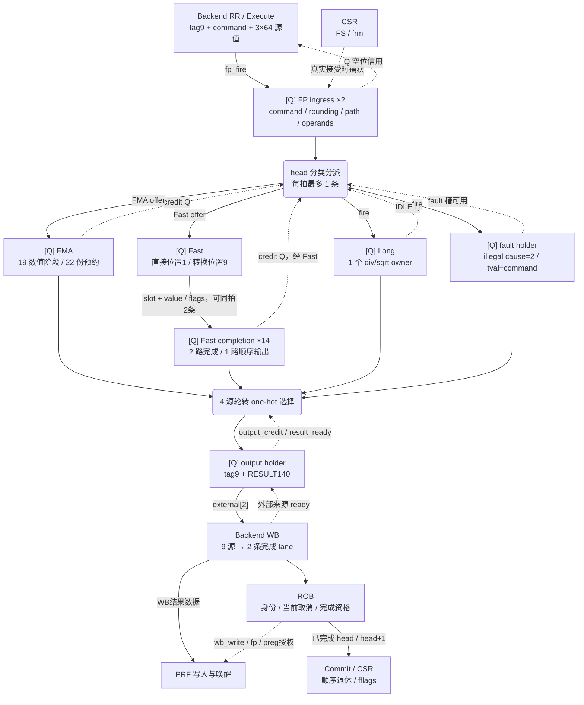
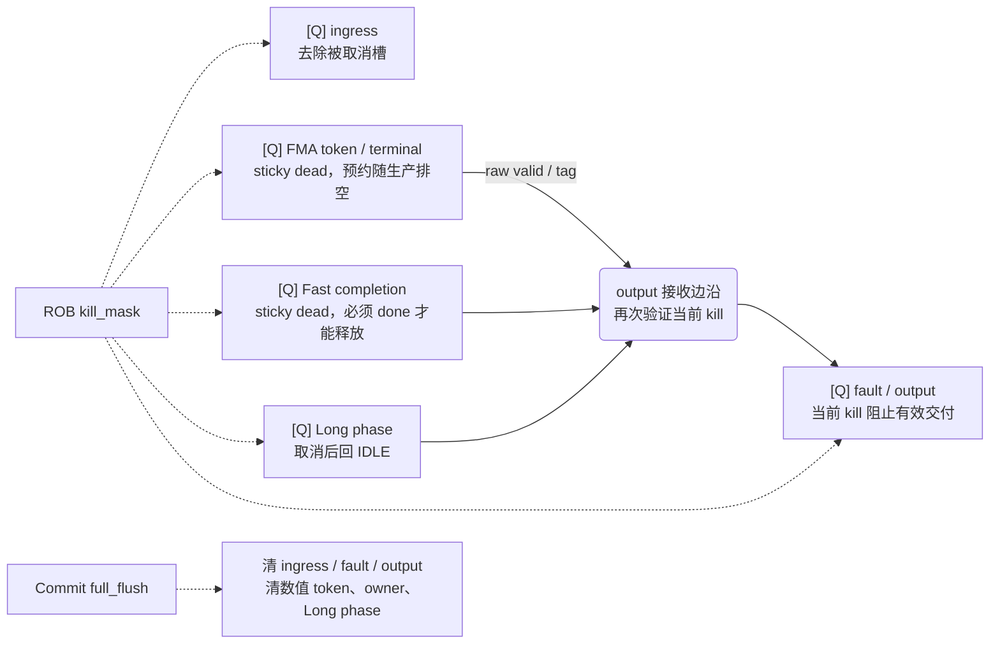

# 当前 FP 结构与网络拓扑

依据 **2026-10-09 工作区生产 RTL** 核对，入口为 [R64CoreTop.fp](../core/R64CoreTop.v)。
本文沿现有实现整理浮点执行的文件职责、实际实例、数据流、接收边沿、完成预约和取消关系；本次仅更新文档。
[全核拓扑](../TOPOLOGY.md)负责系统连接，[Backend 拓扑](../backend/TOPOLOGY.md)负责发射、PRF、写回和 ROB，
[模块清单](../MODULES.md)列源码声明。整数 ALU/MUL/DIV/CLMUL 的 owner 与执行路径见 Backend 的 BE-06/BE-07。

## 1. 实际边界与生产配置

`R64FpExecute` 是 CoreTop 下与 Backend、Memory、Serial、Commit 同级的实例。
它接收 Backend 已读取的操作数和完整 ROB tag，内部只有局部执行 owner；Rename 映射、FPR 数据、
目的寄存器身份及 ROB 完成资格仍在 Backend，架构 fflags 更新属于顺序 Commit/CSR。

| 项目 | 当前核心配置 / 含义 |
| --- | --- |
| CoreTop → FP | `Q_CREDIT_INGRESS=1`、`RAW_FAST_DISPATCH=1`、`RAW_FMA_DISPATCH=1`；三个参数的模块默认值均为 0，本文按生产实例展开 |
| 身份与输入 | tag9 = generation4 + ROB slot5；每条输入为 UOP218、3×64 bit 操作数；FP 入口保存 command32 及所需控制，不复制整个 UOP |
| 动态权限 | `fp_enabled_i = mstatus_o[14:13] != 0`；`frm_i` 来自 CSR。动态 rounding 与 FP 合法性在入口真实接受时一起捕获 |
| FP 入口 | 2 个固定槽，每拍最多接收 1 条、从 head 向一个子路径分派 1 条 |
| FMA | 19 个固定推进数值阶段，22 份总预约信用及 terminal 槽；FADD/FSUB、FMUL 与 fused 运算共用数据通路 |
| Fast | 直接操作在 token 位置 1 产生完成、转换在位置 9 产生完成；统一 14 槽完成 owner，最多同拍写入 2 个不同完成槽 |
| Long | FDIV/FSQRT 共用 1 个独占迭代 owner，响应保持到局部输出仲裁接受 |
| 局部出口 | FMA / Long / Fast / fault 四源轮转，1 个 output holder，每拍最多向 Backend 交付 1 条 |
| Backend 接口 | CoreTop 的 `external_valid/ready[2]`；汇入全核 9 源、2 条 WB lane，不是 FP 专属写回端口 |
| 返回格式 | 子路径 value64 + fflags5；FP 出口包装为 RESULT140 + tag9，含异常、cause、tval 字段 |
| 取消 | Commit `full_flush` 与 ROB `kill_mask[31:0]`；FP 没有 LSU 的 prepared-cancel 或外部事务 reuse_block 接口 |

数值级数、完成容量和出口数量是不同事实。22/14 份预约分别覆盖子路径在途与等待输出的工作，
不能与 19/10 个数值位置相加；两个 front 缓存只是 terminal/completion 的投影。
三条路径可以同时有在途工作，公共入口与出口仍各为每拍最多 1 条。

来源：[CoreTop](../core/R64CoreTop.v)、[FP Execute](R64FpExecute.v)、
[Backend 字段定义](../backend/R64Uop.vh)。

## 2. 文件职责与实际使用方

| 职责 | 源码 | 生产实例 / 边界 |
| --- | --- | --- |
| 接入、分类、非法操作返回、四源归并 | [R64FpExecute.v](R64FpExecute.v) | `R64CoreTop.fp`；持有两槽 ingress、fault/output holder 与轮转指针 |
| FMA / ADD / MUL | [R64FpFma.v](R64FpFma.v) | `fp.fma`；S/D 共用 19 阶段数据通路，特殊数控制与数值同步，最后只 rounding 一次 |
| 53×53 无符号乘积 | [R64FpProductPipe.v](R64FpProductPipe.v) | `fp.fma.product`；5 个数值阶段，14 个 partial tile，enable 由 FMA 的 live token 提供；无独立 tag/kill owner |
| 直接操作及转换 | [R64FpFast.v](R64FpFast.v) | `fp.fast`；比较、min/max、sign、class、move 与 FP/整数、S/D 转换，分别在两个时点完成 |
| 双完成入口与顺序出队 | [R64FpCompletion.v](R64FpCompletion.v) | `fp.fast.owner`；先预约 slot，完成按 slot 写入，再按本路径接收顺序输出 |
| 除法 / 平方根 | [R64FpLong.v](R64FpLong.v) | `fp.longop`；独占 phase/数值状态，取消后回到 IDLE，无外部不可取消请求 |
| 格式分解与规格化 | [R64FpOperand.v](R64FpOperand.v) | 声明 `R64FpDecompose`、`R64FpNormalize`；在 FMA/Fast/Long 各自实例化，处理 S/D、NaN boxing、subnormal 与特殊数 |
| rounding 的组合分工与 5 阶段流水 | [R64FpRoundStages.v](R64FpRoundStages.v) | 三条数值路径各有 `round : R64FpRoundPipe`；内部 range/shift/GRS/进位/pack 保持 format、rounding、flags 对齐 |
| 组合封装 | [R64FpUnpack.v](R64FpUnpack.v)、[R64FpRound.v](R64FpRound.v) | 当前 `fp` 生产实例树没有这两个 wrapper；生产分别使用 Decompose + Normalize 与 RoundPipe，不能从文件名推断新增执行级 |
| 固定推进流水的公共 owner | [R64NumericOwner.v](../backend/R64NumericOwner.v) | 源码位于 backend/，实际用于 `fp.fma.owner`；预约信用、token、terminal/front 与 sticky dead 由它维护 |
| 公共算术 helper | [R64CarryStages.v](../backend/R64CarryStages.v)、[R64ProductTree.v](../backend/R64ProductTree.v)、[R64WideAdd.v](../backend/R64WideAdd.v) | CarryPrepare/Finish 用于各路径及 rounding；ProductTree 用于 FMA product 的 partial tile；WideAdd 用于 Long exponent；同源文件的多个实例各自计算 |

公共 helper 的源文件复用不表示共享一个运行时执行端口。它们不自行分配 ROB 身份、不授权写 PRF，
也不在多个数值 owner 之间仲裁。完整文件入口见 [filelist.mk](../filelist.mk)。

## 3. 实际实例层级

以下列出生产参数下的事务 owner 和主要数值 helper；纯连线、数组、generate 寄存逻辑不另算模块。
`g_ingress_queue` 是 generate 作用域，fault/output 是 `fp` 内部状态。

```text
R64CoreTop
├─ backend : R64Backend
│  ├─ registers : R64RegRead               GPR/FPR 数据与操作数保持
│  ├─ execute : R64Execute               RR 选择与 FP 实际接收
│  └─ writeback : R64Writeback           全核九源两写回
└─ fp : R64FpExecute
   ├─ g_ingress_queue                   2 槽 Q 信用入口（generate）
   ├─ fma : R64FpFma
   │  ├─ gen_unpack[0..2].unpack : R64FpDecompose
   │  ├─ normalize_a/b/c : R64FpNormalize
   │  ├─ owner : R64NumericOwner         STAGES=19、CAPACITY=22
   │  ├─ product : R64FpProductPipe
   │  │  ├─ partial[0..13].tree : R64ProductTree
   │  │  └─ prepare / finish : R64CarryPrepare / R64CarryFinish
   │  ├─ magnitude_prepare / magnitude_finish : R64CarryPrepare / R64CarryFinish
   │  └─ round : R64FpRoundPipe
   ├─ longop : R64FpLong
   │  ├─ ua / ub : R64FpDecompose
   │  ├─ normalize_a / normalize_b : R64FpNormalize
   │  ├─ triple_prepare、digit_finish 等 : 公共 Carry helper
   │  ├─ exponent_normal / exponent_lower : R64WideAdd
   │  └─ round : R64FpRoundPipe
   └─ fast : R64FpFast
      ├─ ua / ub : R64FpDecompose
      ├─ normalize : R64FpNormalize
      ├─ owner : R64FpCompletion         CAPACITY=14
      ├─ abs/int/sign_prepare、abs/int/sign_finish : 公共 Carry helper
      ├─ int_decision : R64FpRoundDecision
      └─ round : R64FpRoundPipe
```

每个 `R64FpRoundPipe` 又包含 `range_calc`、`shift`、`select`、`direct_grs`、
`prepare`、`finish`、`pack`。数值寄存器由其 enable 推进，事务有效性属于外围 owner；
不能把 ProductPipe/RoundPipe 的寄存器当成新的独立队列。

## 4. 数据、信用与结果网络

[Q] 表示寄存状态；实线表示操作或结果，虚线表示信用、控制或授权。



分类时，FP disabled 或使用 rounding 的操作得到非法 resolved rounding（大于 4）会走 fault；
FDIV/FSQRT 走 Long，ADD/SUB/MUL/fused 走 FMA，其余已译码 FP 操作走 Fast。
`command[14:12]==7` 时使用入口当拍的 `frm`，排队期间 CSR 的后续变化不重新解释该命令。

三条数值路径各自保持结果，四源按轮转顺序合并，不维持不同子路径之间的执行接收顺序。
同一条指令的精确异常与架构顺序由 ROB/Commit 保证。Fast 的 completion 则在该子路径内部保留接收顺序，
因此后来的短操作即使先完成，也可能等待更早的转换。

## 5. 关键接收边沿与取消责任

| 边界 | 实际接受条件 / 保存内容 | 信用、取消与优先级 |
| --- | --- | --- |
| Execute → FP ingress | 上游 `fp_fire` 即 `in_fire_i`；空槽锁存 tag、command、operand、resolved rounding、path，未取消才置有效 | `in_ready=!(valid_q[0] && valid_q[1])` 只读 Q 空位，不借本拍 pop/kill；reset/full flush 清入口有效 owner。空槽预写 payload 不等于真实接受 |
| ingress → 通常分派 | `dispatch=ingress_live && path_ready[path_q] && !rst && !flush_i`，head 按路径形成 fire | 每拍最多 1 条；另一槽不会绕过被阻塞的 head，满入口释放后要等 Q 信用恢复 |
| ingress → RAW FMA/Fast | 生产 offer 用 raw 驻留 head、匹配 path 与该路径 ready；canonical dispatch 仍决定 ingress 去除 | 取消边沿可能出现额外 offer，实际 FMA/Fast owner 捕获 birth killed；reset/full flush 同时被 token 与 owner 消费，不能把 raw offer 当合法完成 |
| 数值入口 → 预约 owner | FMA/Completion `accept_w=in_valid_i && credit_q`；FMA 创建推进 token，Fast 分配 slot 并让 token 携带 slot | 先预约后生产；信用通过 Q 返回，终端 backpressure 不冻结数值流水。partial kill 不让尚会产生完成的 token 提前丢失预约 |
| 子路径 → FP output | `result_ready=selected_mask & {4{output_credit && !rst && !flush_i}}`；选择的 tag/result 在 output Q 捕获 | `output_credit=!output_live || out_ready_i` 可借同拍下游接收；创建 output valid 时再次检查所选 tag 的当前 kill，拒绝子路径的迟到 raw valid |
| FP output → Backend WB | `out_valid_o && out_ready_i`；out_valid 已含 reset/full flush 与当前 output tag 的 kill 过滤 | 活结果在反压时保持；WB grant 仅是来源端口授权，后续 ROB 再决定完成和 PRF 写入 |
| ROB → Commit/CSR | 顺序退休时才产生允许的架构 fflags 更新；非法 FP 操作带 cause=2、tval=原 command | FP 局部输出、WB 端口接受或数值 flags 本身都不是架构更新授权 |



FMA 与 Fast 的被取消工作保留 sticky dead，最终丢弃结果；Fast head 还必须等到 done，
防止未结束的生产 token 写到复用槽。Long 本地 phase 可以直接取消，不需要等待外部响应。
完整 flush 同时取消生产 token 与完成 owner，所以无需保留旧 token 对新 owner 的写入资格。
数值 payload 的时钟使能可以继续依据原 Q 状态动作；这些位的变化只有在匹配有效 owner 下才有意义。

FP 没有不可取消的 AXI 等外部事务，也没有 LSU/Serial 的 reuse_block 回传。这里的部分取消、完整清除、
数值排空与最终写回校验是不同边界。所有 helper 的 NaN boxing、subnormal、特殊数、rounding mode 和
fflags 都必须与 token 同步，不能因取消或数据路径整理而另立有效性来源。

## 6. 当前设计单元与状态 owner

以下稳定 ID 沿用原文，按 2026-10-09 当前生产参数核对；状态宽度来自 RTL 声明，不是面积估算。

| ID / 状态 owner、源码 | 当前 Q 边界 / 容量 / 宽度 | 数据推进、完成与吞吐 | 取消 / 完成责任 |
| --- | --- | --- | --- |
| FP-01 入口与分类；[R64FpExecute.v](R64FpExecute.v) `g_ingress_queue` | 2 固定槽，每槽239 bit = tag9 + command32 + source_double1 + operand192 + rounding3 + path2，另 valid/head | 每拍最多1条接受/分派；只看 Q 空位信用；动态权限/rounding 随真实接受保存，head 受目标路径 ready 阻塞 | full flush 清 owner；partial kill 按 ROB slot 去除；RAW offer 的 birth 取消由数值接收者处理 |
| FP-02 FMA 数值与预约；[R64FpFma.v](R64FpFma.v)、[R64FpProductPipe.v](R64FpProductPipe.v)、[R64NumericOwner.v](../backend/R64NumericOwner.v) | 19 个数值位置；22 份预约/terminal，terminal 每槽 tag9 + data69 + owner32 + dead4；另2个 front 缓存及 token/tag/dead 管线 | 有信用时每拍最多接收1条；decompose → normalize → product5 → scale/order/align3 → carry2 → normalize2 → round5。ADD 使用 unity product，MUL 使用同号零加数，所有操作只 rounding 一次 | partial kill 随 token/terminal 记录 dead；被取消 token 仍推进到 terminal 后释放预约。full flush 同时清生产 token 与 owner |
| FP-03 Fast 两种完成时点；[R64FpFast.v](R64FpFast.v)、[R64FpCompletion.v](R64FpCompletion.v) | 10 个 token/slot 位置；14 槽，每槽 data69 + tag9 + owner32 + dead4，另 allocated/done；2 个 front 是投影 | 直接完成由 `token_q[1] && short1_w` 产生，转换由 `token_q[9] && convert9_w` 产生，可同拍写两个不同槽；每拍最多顺序输出1条。2/10个数值阶段的生产边界不等于含仲裁的端到端延迟 | partial kill 标 dead，head 必须 done 才可丢弃；birth_killed Q 覆盖 RAW 取消边沿；full flush 清 Fast token 与 completion owner |
| FP-04 Long；[R64FpLong.v](R64FpLong.v) | 1 个 owner；phase15、tag9、owner32、birth_killed4、remainder60、digits56、divisor53、radicand112 等；响应 value64 + flags5 | IDLE 才可接受；normalize/init → div 的 triple prepare/finish 或 sqrt → digit 循环 → finish → round5 → response。特殊数可跳过迭代；响应等待 ready，不能统一写成固定延迟 | 非 IDLE 遇 kill 或 full flush 回 IDLE；payload enable 依 Q phase；raw RESPONSE valid 仍需 output 接收者拒绝同拍 kill |
| FP-05 四源输出；[R64FpExecute.v](R64FpExecute.v) | fault holder 为 tag9 + command32 + valid；output holder 为 tag9 + RESULT140 + valid；轮转指针2 bit | 四源环形年龄判断与 one-hot 合并，最多1条/拍进入 output；output credit 可借本拍下游接受，与 FP-01 的纯 Q 空位信用不同 | output_live 含当前 kill，创建有效 output 再查选中 tag；full flush 清 fault/output；fflags 架构更新由顺序 Commit 授权 |
| FP-06 公共数值 helper；[R64FpOperand.v](R64FpOperand.v)、[R64FpRoundStages.v](R64FpRoundStages.v)、[R64CarryStages.v](../backend/R64CarryStages.v) | 组合分解、规格化、进位与 rounding，以及由外围 enable 推进的局部数值 Q；不新建 ROB owner | 数据、format、rounding、special/NaN/flags 与所属 token 同拍；实例数不等于数值阶段数，多个 helper 实例不共享运行时端口 | 有效性来自 FP-02/03/04；不自行授权完成、PRF 或架构更新，正常有限数之外的格式与异常位同样属于契约 |

源码定位优先使用文件链接和 `g_ingress_queue`、`dispatch`、`fma_offer_w`、`fast_offer_w`、
`stage_live_w`、`token_q`、`complete_valid_i`、`credit_return_q`、`state_q`、
`selected_mask_w`、`output_credit` 等稳定符号；旧行号不作为接口身份。

## 7. 观测入口与验证范围

| 观测问题 | 已有信号 / 来源 | 尚无当前测量的结论 |
| --- | --- | --- |
| 入口与路径压力 | ingress valid/head、path、in_fire/ready、dispatch | 按路径的占用、满队列释放等待、head 阻塞导致其他路径闲置的工作负载统计 |
| 数值服务与本地等待 | FMA token/credit、Fast slot/done/head、Long phase、各路径 out_valid/ready | 按指令/格式/特殊数的接受 → 数值完成 → FP 输出 → ROB 完成分布；固定数值阶段不能代替退休延迟 |
| 四源归并与全核 WB | selected_mask、next_q、output_credit；[CPI_PROFILE](../../sim/vsrc/R64CpiProfile.svh) 有全局 wb_backpressure | 每源等待、四源同时就绪频度、局部和全核嵌套仲裁损失；全局任一源反压不能单独归因 FP |
| 功能与物理边界 | 以下模块向量、取消/反压、WB 与 Backend 接入用例 | 本次未运行 FP 回归、数值性能基准、综合或 STA；整数 CoreMark/Dhrystone CPI 不能代替 FP correctness 或 FP 性能结论 |

与上述边界直接相关的已有入口：

| 边界 | 用例 / 工具 | 覆盖用途与边界 |
| --- | --- | --- |
| Q 信用入口 | [tb_r64_fp_qcredit](../../testbench/chengyue64/modules/tb_r64_fp_qcredit.sv)、[tb_r64_fp_qcredit_vectors](../../testbench/chengyue64/modules/tb_r64_fp_qcredit_vectors.sv) | 两槽信用、满队列 pop/kill、同拍 birth/kill、代际复用、混合数值向量与动态 rounding；这些 TB 显式启用 Q_CREDIT，RAW 参数仍需按所运行配置核对 |
| 整体 FP 接口 | [tb_r64_fp_execute](../../testbench/chengyue64/modules/tb_r64_fp_execute.sv) | 三条数值路径/非法操作、混合流量与结果保持 |
| FMA / 乘积 | [tb_r64_fp_fma](../../testbench/chengyue64/modules/tb_r64_fp_fma.sv)、[tb_r64_fp_product](../../testbench/chengyue64/modules/tb_r64_fp_product.sv) | S/D FMA/ADD/MUL 数值与独立乘积数据通路 |
| Fast 与完成预约 | [tb_r64_fp_fast](../../testbench/chengyue64/modules/tb_r64_fp_fast.sv)、[tb_r64_fp_fast_pipeline](../../testbench/chengyue64/modules/tb_r64_fp_fast_pipeline.sv)、[tb_r64_fp_completion](../../testbench/chengyue64/modules/tb_r64_fp_completion.sv) | 直接/转换数值、混合延迟、双完成、取消后等生产结束、反压与槽复用 |
| Long | [tb_r64_fp_long](../../testbench/chengyue64/modules/tb_r64_fp_long.sv) | div/sqrt 的数值、特殊数与迭代返回 |
| 公共规格化与 rounding | [tb_r64_fp_normalize](../../testbench/chengyue64/modules/tb_r64_fp_normalize.sv)、[tb_r64_fp_round](../../testbench/chengyue64/modules/tb_r64_fp_round.sv)、[tb_r64_fp_grs](../../testbench/chengyue64/modules/tb_r64_fp_grs.sv) | 规格化、rounding、GRS；组合 wrapper 检查不等于完整事务生命周期验证 |
| WB / Backend 接入 | [tb_r64_fp_writeback](../../testbench/chengyue64/modules/tb_r64_fp_writeback.sv)、[tb_r64_backend_fp](../../testbench/chengyue64/modules/tb_r64_backend_fp.sv)、[tb_r64_rr_raw_fp_pair](../../testbench/chengyue64/modules/tb_r64_rr_raw_fp_pair.sv) | 输出捕获时的当前取消、真实 WB、Backend 接入和 FPR 读口配对 |
| 数值 oracle | [prepare_r64_fp_vectors.sh](../../testbench/chengyue64/scripts/prepare_r64_fp_vectors.sh)、[generate_r64_fp_vectors.c](../../testbench/chengyue64/generators/generate_r64_fp_vectors.c) | 使用独立 RISCV SoftFloat specialization 生成向量；不替换工作区默认 SoftFloat |

运行入口与结果边界见 [验证平台](../../testbench/chengyue64/README.md)。
本表是现有验证导航，本次源码/文档核对不追加测试 PASS、吞吐实测或时序通过结论。

## 8. 历史整理与保留的设计理由

原文 2026-10-08 部分混合了当前连接和已有优化记录。本次将仍可在 RTL 观察到的行为纳入上文，
以下理由保留为历史实现背景：

- 公共 CarryPrepare/Finish 分开局部 base/propagate/generate 与全局 carry；末端 base 合成使用 bit XOR 与块内全 1 前缀，既有数值边界保持。公共代码在整数、FP 等不同实例复用，收益仍需按具体映射路径判断。
- FP 四源返回使用并行环形年龄判断与 one-hot 宽数据合并；output 空闲时预写 payload，入口空槽预写 payload。有效 owner 和最终接受资格独立维护，预写本身不增加事务。
- FMA 固定推进和 Fast 双完成均先预约再计算；partial kill 保留 tombstone，full flush 同时清生产 token 与本地 owner。这些结构避免终端 backpressure 穿过数值计算，并防止未结束 token 写入复用槽。
- 原文对整数 ALU/MUL/DIV/CLMUL 的整理理由移由 [Backend 拓扑](../backend/TOPOLOGY.md)承接；数值阶段数与共享 helper 不构成缩拍、PPA 或性能改进的新结论。

本文没有新增历史测量值；后续数值、反压、取消、非法 rounding 和 S/D 用例应按对应 RTL/参数阅读，
不能仅凭整数基准 CPI 推断 FP 的正确性或性能。
