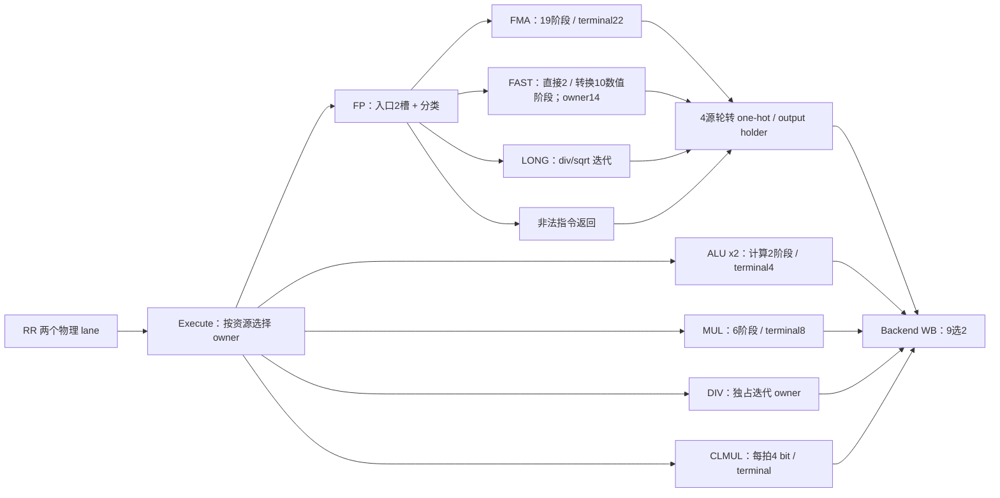

# 整数公共算术与浮点网络

| 文件组 | 数据计算与本轮决策 |
|---|---|
| backend/R64CarryStages.v、R64WideAdd.v | Prepare 生成块 base/propagate/generate，Finish 做全局前缀。末端 base 加 carry 改为 bit XOR 与块内全1前缀，保持所有拍数。服务 ALU、乘除、FP、预测地址。 |
| backend/R64Alu.v、R64Execute.v | ALU 控制在 RR 前解码，比较分 byte，分支 resolve 有预告与真实生效两层。已有独立 terminal 和 ALU 旁路，保留拍数和唤醒契约。 |
| backend/R64Multiply.v、R64ProductTree.v | Booth/CSA 归约后共享 CarryFinish；取消不提前释放已预约 terminal。保留6阶段，公共进位优化自动覆盖。 |
| backend/R64Divide.v、R64Clmul.v | DIV radix4 分 prepare/finish；CLMUL 迭代4 bit。缩拍会把宽算术重新组合，缺少关键路径证据时保留。 |
| R64FpOperand.v、R64FpUnpack.v | format/classification 与规格化；NaN boxing、subnormal 与特殊数语义保留。 |
| R64FpProductPipe.v | 53x53 tiled product，5 个数值阶段，owner 由 FMA 统一提供。 |
| R64FpFma.v | decomposition→normalize→product5→scale/order/align3→carry2→normalize2→round5。ADD/MUL 复用，单次 rounding。 |
| R64FpFast.v | 直接类结果从 token[1] 完成，转换类从 token[9] 完成；共用14槽完成 owner，队内按接收顺序输出。不能将两类都写成固定10阶段端到端延迟。 |
| R64FpLong.v | div/sqrt 独立单 owner；最终5阶段 rounding。 |
| R64FpRoundStages.v、R64FpRound.v | range/shift/GRS/局部与全局进位/pack，所有 rounding mode、fflags、特殊数保留。公共 CarryFinish 优化覆盖。 |
| R64FpCompletion.v、backend/R64NumericOwner.v | 固定数值流水的予約、token、terminal、前端缓存和 sticky cancellation。READY 不穿过数值流水。 |
| R64FpExecute.v | 四源轮转由逐项动态索引改为每源并行环形年龄判断、one-hot 合并。输出空闲时预写数据；入口空槽预写 payload；valid、kill、flush 和每源 ready 仍按原 owner 条件。 |

同拍取消仍由实际接收者检验；固定/变长数值流水的局部 tombstone 负责 partial-kill 排空，完整 flush 同时清除对应生产 token 与本地 owner。原始 Q-valid 不等于允许写 PRF。S/D 向量、非法 rounding、反压和取消回归必须一起通过，不能只看整数基准 CPI。

## 2026-10-08 当前设计单元

本节是当前源码事实；上表中“本轮决策”属于已有优化记录，不是本次新增方案或实测。
当前 `R64CoreTop.fp` 显式启用 `Q_CREDIT_INGRESS=1`、`RAW_FAST_DISPATCH=1`、`RAW_FMA_DISPATCH=1`，
完整 ROB tag9、slot5；每次执行有3×64 bit源值，FP子路径返回value64+fflags5。
整数入口/ALU/MDU见 [BE-06/BE-07](../backend/TOPOLOGY.md)，FP寄存器数据唯一真源在 Backend PRF，
fflags架构更新属于顺序Commit。以下槽容量不与数值级数相加为独立在途容量。

| ID / 状态 owner、源码 | 当前Q边界 / 容量 / 宽度 | 同拍组合、接受与跨拍依赖 | flush / partial kill / 迟到结果 |
| --- | --- | --- | --- |
| FP-01 FP入口与分类；[R64FpExecute.v](R64FpExecute.v) `g_ingress_queue` | 2固定槽Q，每槽239 bit=`tag9+command32+source_double1+operand192+rounding3+path2`，另valid/head | `in_ready=!(valid_q[0]&&valid_q[1])`只看Q空位；不借本拍dispatch/kill释放。空槽预写payload，真实in_fire创建owner并捕获动态rounding/FP合法性。head Q→path_ready选择→dispatch，每拍最多1条进入FP子路径 | fullflush清两槽owner；partial kill按tag槽号去除。RAW FMA/Fast可把取消边沿的原始驻留head作为数值offer，实际子路径owner必须记录birth取消，不能把offer误当合法完成 |
| FP-02 FMA数值流水与预约；[R64FpFma.v](R64FpFma.v)、[R64FpProductPipe.v](R64FpProductPipe.v)、[R64NumericOwner.v](../backend/R64NumericOwner.v) | 19个固定推进数值阶段；22份总预约/terminal容量；terminal每项tag9+结果69+owner32+dead组状态，另2个front缓存是副本不是额外事务容量。53×53乘积部分5阶段 | 每拍至多接收1个有credit的offer；接受先预约容量，token前移，算术各阶段依stage_live使能。范围/对齐/进位/规格化/rounding跨实际Q边界；最终value/flags进入terminal与front Q，再等待FP-05。出口反压不贯穿数值流水 | partial kill用sticky dead随token/terminal保持，取消不让仍在推进的token失去预约；同拍kill由接收者复核。fullflush一起清token和预约owner，因此无未取消的旧生产token再次写新owner |
| FP-03 Fast两种完成时点；[R64FpFast.v](R64FpFast.v)、[R64FpCompletion.v](R64FpCompletion.v) | token/slot流水10位置；completion14槽，每槽data69+tag9+owner32+dead4，以及allocated/done；2个front缓存是槽投影 | 直接操作完成输入由`token_q[1]&&short1`产生；转换由`token_q[9]&&convert9`产生，可以同拍两个不同槽完成。accept先分配slot；结果按slot写回，再按接收顺序从head每拍至多输出1条。2/10是数值生产位置，含front/仲裁的端到端延迟另测 | partial kill只标dead；head必须done后才可丢弃，不能提前复用尚有生产token的slot。fullflush同时清Fast token和completion owner。birth_killed Q覆盖RAW取消边沿offer |
| FP-04 Long div/sqrt；[R64FpLong.v](R64FpLong.v) | 独占1 owner；15-bit phase Q、tag9、owner32、birth_killed4、余数60、digits56、divisor53、radicand112等；response phase保持结果69 | `in_ready=IDLE`；接收→normalize/init→div或sqrt digit循环→finish→range/shift/local/global/pack→response。不同特殊数/格式经过的迭代次数不能用统一固定延迟代替；response待下游ready | 本地无不可取消外部事务。非IDLE遇kill或fullflush回IDLE；数值payload时钟使能依Q phase，owner控制取消。其raw out_valid是RESPONSE Q，FP-05仍拒绝同拍kill |
| FP-05 四源归并与输出holder；[R64FpExecute.v](R64FpExecute.v) `fault_*` / `output_*` / `next_q` | FMA/Long/Fast/fault共4源；fault holder为tag9+command32+valid；1个output holder为tag9+RESULT140+valid；轮转指针2 bit | path_valid→环形年龄组合选择/one-hot宽合并→output Q。`output_credit=!output_live||out_ready`，可借同拍下游接受；该ready链与FP-01的Q-only信用不同。selected source ready还受reset/flush限制。output Q作为Backend9源中的1源，最多1条/拍 | `output_live`含当前kill；创建output_valid时再次按所选tag检查kill；fullflush清fault/output owner。空槽payload预写不创建有效返回，fflags只有最终ROB/Commit授权才生效 |
| FP-06 公共组合算术与局部数值Q；[R64FpOperand.v](R64FpOperand.v)、[R64FpUnpack.v](R64FpUnpack.v)、[R64FpRoundStages.v](R64FpRoundStages.v)、[R64CarryStages.v](../backend/R64CarryStages.v) | 这些文件含被不同owner复用的分解、进位、rounding计算；实例周围Q属于FP-02/03/04或整数FU，不新建ROB事务owner | 每个数值Q的format、rounding、special/NaN/flags必须与对应数值和tag/token同拍。组合子模块数不等于stage数，也不能因共享源文件就假设共享一个运行时执行端口 | 不自行授权写PRF/提交；有效性来自外围owner。修改计算位置必须保持token和特殊数/异常flag对齐，数据宽度不能只按正常有限数路径裁剪 |

证据锚点：`R64CoreTop.v:367`；`R64FpExecute.v:29/55/63/146/154/195/207/220/275`；
`R64FpFma.v:72/80`；`R64FpFast.v:26/87/95/110/121`；`R64FpCompletion.v:27/45/59/114`；
`R64NumericOwner.v:24/43/66`；`R64FpLong.v:28/35/210/222`。

| 单元 / 观测目标 | 已有证据或可观测信号 | 当前 UNKNOWN |
| --- | --- | --- |
| FP-01入口压力 | valid_q/head、in_fire/in_ready、path_q/dispatch直接可观测；生产参数和2槽容量已核对 | 按path分类的占用/阻塞周期、等待head造成的其它子路径闲置，无当前工作负载统计 |
| FP-02/03/04服务时间 | 数值token/slot/phase、credit、done/head、out_valid/out_ready可定位；固定阶段或双完成入口为源码事实 | 按FP指令类/格式/特殊数的接受→数值完成→FP输出→ROB接收分布；理论数值阶段不能填成已测退休延迟 |
| FP-05仲裁 | Backend CPI_PROFILE的wb_backpressure只计任一源等待，不能单独归因FP；当前本地4源轮转和1输出holder已核对 | 每源等待、4源同时就绪频度、嵌套仲裁损失、output吞吐和FP造成的ROB head阻塞 |
| 功能与物理边界 | 已有S/D、rounding、反压/取消等回归入口；本节只读源码更新文档 | 本次未运行FP回归、数值基准、综合或STA；整数CoreMark/Dhrystone CPI不能证明FP的性能变化或替代FP correctness验证 |
