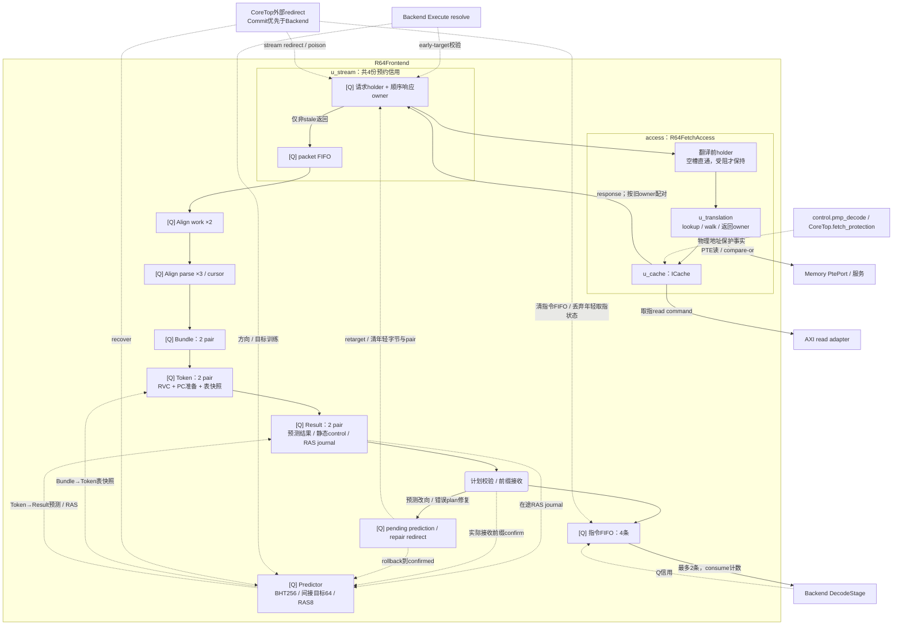

# 当前 Frontend 结构与网络拓扑

依据 **2026-10-09 工作区生产 RTL** 核对，实例入口为 [R64CoreTop.frontend](../core/R64CoreTop.v)。
本文负责取指请求、字节对齐、预测和双指令输出的实际连接；[全核拓扑](../TOPOLOGY.md)负责跨域导航，
翻译、PMP 与 ICache 内部 owner 见[存储与翻译拓扑](../memory/TOPOLOGY.md)，后续统一分配见[Backend 拓扑](../backend/TOPOLOGY.md)。
本轮提取 FetchAccess 后，相关前端定向测试通过；累计验证见[全核拓扑](../TOPOLOGY.md)。历史实验与测量说明置于文末。

## 1. 实际边界与配置

R64Frontend 负责 FetchStream、Align、Predictor 及双路 RVC/预测准备/静态译码控制之间的指令流；
`access : R64FetchAccess` 统一持有翻译前 holder、FetchTranslation 和 ICache，提供有序取指访问服务。
`frontend/` 的目录边界不等于实例边界：FetchTranslation/ICache 的源码位于 `memory/`，
静态 DecodeControl 来自 `backend/`；PMP 解码归 `CoreTop.control.pmp_decode`，
取指保护准备仍在 `CoreTop.fetch_protection`，使用同一翻译返回的 PA/privilege。

| 生产参数 / 接口 | 当前值与作用 |
| --- | --- |
| CoreTop → Frontend | `PREPARED_PROTECTION=1`；`RESET_PC` 随 CoreTop 参数，默认 `0x80000000` |
| Frontend 默认参数 | `FETCH_PTR_W=2` → Stream `DEPTH=4`；`EARLY_PREDICT=1` 同时传给 Stream 和 Align |
| Access → FetchTranslation | `DATA_PROTECTION=0`（默认）；取指 access=0、AD update=1；返回 PA/privilege 后由取指保护逻辑判定 |
| ICache 参数 | `ICACHE_SET_W=6` → 64 sets；传递 `PREPARED_PROTECTION=1`，使用外部准备的取指保护事实 |
| Predictor 默认参数 | `RAS_PTR_W=3` → RAS8；方向表256项、间接目标表64项；Stream 另有32项 early-target 表 |
| 主输出 | 每拍最多2条有序指令；每条携带 PC/raw/length、canonical33、control35、sequential NPC、预测 NPC 与异常 |
| CoreTop 接收 | `fetch_take = fetch_valid & fetch_ready`；其 popcount 成为 Frontend `consume_i`，消费者是 Backend DecodeStage |
| 运行与恢复 | `frontend.run_i = CoreTop.run_i && !stop_birth`；外部 redirect 目标在 CoreTop 先选 Commit，再选 Backend |
| 外部服务 | ICache 使用 AXI read adapter 的取指通道；I-side page walk 经 PTE 接口送往 Memory；接口 owner 不使用 ROB tag |

容量和寄存数据宽度集中在 FE-01～FE-08 表中，不能把 packet、pair、指令槽数直接相加为独立指令容量。

### 1.1 文件职责索引

| 源码 | 生产职责 / 状态归属 |
| --- | --- |
| [R64Frontend.v](R64Frontend.v) | 连接 Stream/access/对齐/预测；持有 Bundle/Token/Result pair、指令 FIFO、局部 redirect 记录和 fault barrier |
| [R64FetchAccess.v](R64FetchAccess.v) | 持有翻译前 holder，组合 FetchTranslation 与 ICache；锁存受阻请求的上下文，并持续排空已接受事务；不接受 run 冻结 |
| [R64FetchStream.v](R64FetchStream.v) | 请求预约、顺序响应 owner、packet FIFO 与 early-target 表；redirect 后仍排空已承诺请求和 stale 响应 |
| [R64Align.v](R64Align.v) | 持有2个 work、3个 parse owner 和 cursor；按消费前缀输出最多2条，负责跨 packet 拼接与计划切点修复 |
| [R64PacketParse.v](R64PacketParse.v) | R64PacketHeader、R64PacketParse 与 R64AlignPairView 均为组合 helper；并行准备各半字起点的长度/异常/缺失/计划边界，不另建指令队列 |
| [R64Rvc.v](R64Rvc.v) | 双路组合 RVC 展开与合法性判定；raw/length/fault 仍随原 owner 保留，非法编码不被展开过程隐藏 |
| [R64Predictor.v](R64Predictor.v) | R64Predictor 持有方向/目标/RAS及确认记录；R64PredictionPrepare 与 R64SumEqual 是组合算术/类别准备 helper |
| [R64FetchTranslation.v](../memory/R64FetchTranslation.v)、[R64ICache.v](../memory/R64ICache.v) | 实际实例在 Frontend.access 内；持有翻译/返回及取指缓存事务，内部职责详见 memory 域 |
| [R64DecodeControl.v](../backend/R64DecodeControl.v)、[R64CarryStages.v](../backend/R64CarryStages.v) | 静态控制在 Token→Result 边沿捕获；CarryPrepare/Finish 被前端预测计算复用，文件目录不增加 Backend 服务跳转 |

## 2. 数据、预测与返回网络

[Q] 表示寄存状态；图中的准备/选择是组合逻辑，不自动增加流水级。实线表示请求、指令或结果，虚线表示训练、确认、信用或恢复。



ICache 的响应先回到 Stream 的顺序 owner，只有非 stale 返回才进入其 packet FIFO。
access 内的翻译前 holder 是 Stream 已接受请求的保持位置，并未增加第五份 Stream 信用。
Stream 通过 req/rsp 握手依赖 access；翻译 ready、PBMT 和 ICache 内部状态的连接封装于 access。
`run_i` 关闭时停止新取指/新 Bundle 接收，不等于冻结已接受请求、翻译、缓存返回和后端消费。

Token 捕获 Bundle 对应的方向/目标表快照；后续训练不能改写已有 Token 的预测输入。
RVC 位于 Bundle→Token，静态 DecodeControl 位于 Token→Result。Result 接收推进推测 RAS，
Result→指令 FIFO 的实际接收前缀确认 RAS；这里的 confirmed 是前端接收边界，**不是 ROB 退休栈**。
查询合并2个待写记录和4个 Result journal，并行选择最年轻匹配，以避免宽串行覆盖链。

## 3. 主要生产实例

```text
R64CoreTop
├─ control : R64Control
│  └─ pmp_decode : R64PmpDecode
├─ fetch_protection : R64FetchProtectionPrepare
└─ frontend : R64Frontend
   ├─ u_stream : R64FetchStream
   ├─ access : R64FetchAccess
   │  ├─ u_translation : R64FetchTranslation
   │  │  ├─ u_tlb : R64Tlb
   │  │  └─ u_walk : R64PageWalk
   │  └─ u_cache : R64ICache
   ├─ u_align : R64Align
   │  ├─ capture_header : R64PacketHeader
   │  ├─ initial_parse : R64PacketParse
   │  └─ completion_parse : R64PacketParse
   │     └─ g_start[0..7].g_length[0..2].view : R64AlignPairView
   ├─ g_prepare[0..1].rvc : R64Rvc
   ├─ g_prepare[0..1].prepare : R64PredictionPrepare
   │  ├─ direct_prepare / return_prepare : R64CarryPrepare
   │  └─ 各目标相等检查 : R64SumEqual
   ├─ gen_encoding_control[0..1].prepare : R64DecodeControl
   └─ u_predictor : R64Predictor
      └─ g_lookup[0..1].direct_finish / return_finish : R64CarryFinish
```

两个 PacketParse 都各自生成8个起点×3种首条长度的组合 PairView，图中只展开一侧。
Bundle、Token、Result 和 instruction FIFO 是 Frontend 内的寄存数组，不是同名子模块。
`R64_ASSERT` 下的静态控制对照 helper 不属于生产数据通路。

### 3.1 接收与恢复边界

| 边界 | 接收事件 / 信用 | 取消与状态责任 |
| --- | --- | --- |
| Stream 请求→Access 入口 | `access.req_valid_i && access.req_ready_o`；holder 空才给信用 | 握手创建 Stream 响应 owner；翻译未接受时 holder 锁存 VA/特权/SATP/status/PBMT |
| Access 内翻译→ICache | `translation_v_w && translation_r_w` | 保持同一翻译返回的 PA/priv/fault；保护事实配合同一候选，不能另配新上下文 |
| ICache→Stream | `rsp_valid_i && rsp_ready_o`；必须有顺序 owner | stale 响应只释放 owner；非 stale 响应写 packet FIFO，不以 redirect 丢掉已接收事务 |
| packet→Align work→parse | `push_w` / `parse_w`；各用当前 Q 空位 | successor 可补齐前一 parse 的跨包字节/map；宽字节与异常位置保持同一 owner |
| Align→Bundle | `capture_w` 与 `capture_take_w` | 可缓存 plan-bad 记录以建立 barrier；只有合法消费前缀推进 cursor |
| Bundle→Token→Result | `token_capture_w` / `result_capture_w` | 使用各自 Q 空位，不借同拍下游释放；空槽 payload 预写不创建有效 owner |
| Result→指令 FIFO | `align_take_w`，0/1/2条 | 计划错误修复可只接收此前正确前缀；部分消费以 half 位选择余下物理 lane，不搬移410-bit payload |
| 指令 FIFO→Backend | `consume_i`，由 CoreTop 握手条数得到 | 当前 FIFO Q 空位不借当拍 Backend 消费；指令进入 DecodeStage 时尚无 ROB tag/preg |

外部 `redirect_i` 优先于本地 pending redirect；二者合成 `stream_redirect_w`，清 Align 和 Bundle/Token/Result 的年轻 owner。
本地 redirect 在原接收边沿已保留正确指令前缀，下一拍只修正后续字节流；**指令 FIFO 只由 reset/外部 redirect 清空**。
`access.cancel_i=stream_redirect_w`；Access 内 holder 在 cancel 或 TLB invalidate 时标 poison，
仍等翻译接收并完成返回；Stream 的旧 owner 标 stale 后继续排空。
Access 不接收 `run_i`，不以 redirect 清除已接受事务，也不增加新的寄存边界。
ICache invalidate 还清理 early-target/RAS 逻辑有效性；旧 journal 不得在失效后恢复旧栈。
fault barrier 在首个被指令 FIFO 接受的 fault 后阻止年轻指令继续进入，等待外部精确恢复。

## 4. 当前设计单元：FE-01～FE-08

稳定 ID 标识状态和接口责任，可跨文件讨论。宽度为指定 payload/state 的声明宽度，
不是全部控制位之和或综合面积；寄存容量不等于端到端命中、miss 或恢复延迟。

| ID / 状态 owner 与源码 | 当前寄存容量 / 数据宽度 | 同拍依赖、接受与跨拍关系 | 恢复 / 晚响应责任 |
| --- | --- | --- | --- |
| FE-01 取指流信用；`u_stream`，[R64FetchStream.v](R64FetchStream.v) | 请求 holder 1 个；owner FIFO 4 项；packet FIFO 4 项；三者共用 **4 份预约信用**，不能相加成 9 份并发容量。packet 每项 PC64、数据128、plan68、fault1、cause5、access mask8 | `reserved=owner_count_q+packet_count_q+req_valid_q`；`credit=reserved<4` 不借本拍 packet pop。请求实际 handshake 才入 owner；按 owner 次序接收响应，非 stale 响应入 packet Q | redirect 清 packet 有效占用，把尚未返回 owner 标 stale；已承诺请求仍保持并排空。`rsp_ready` 由 owner 非空决定，stale 响应不新建 packet |
| FE-02 翻译前保持；`access.if_req_*`，[R64FetchAccess.v](R64FetchAccess.v) | 1 个 holder，payload136（VA64、priv2、satp64、status5、PBMT1），另 valid/poison | 空槽时 payload 组合直通翻译；`access.req_ready_o=!rst&&!if_req_valid_q`。仅翻译受阻才把 Stream 已接受请求保存在 Q；不是每次请求固定增加一拍 | stream redirect / TLB invalidate 置 poison；占用 holder 等翻译接受后释放，不能直接丢掉 Stream 的响应 owner |
| FE-03 字节 / 边界 owner；`u_align`，[R64Align.v](R64Align.v) / [R64PacketParse.v](R64PacketParse.v) | work 2 槽，每槽273 bit+header17；parse 3 槽，每槽 data256、map288、header17、mask8、cause5+next_cause5、plan68、target63 等；cursor PC64 | packet→work Q：`work_count<2`；work→parse Q：`work_count!=0&&count<3`。PacketHeader、initial/completion parse、cursor 对应边界选择是组合逻辑；接收 successor 可补齐前槽跨包信息。每拍最多输出/消费2条指令 | redirect 丢弃本地缓存字节和解析 owner；异常字节、长度、PC、计划跳转点必须跟随同一 packet/指令身份 |
| FE-04 Bundle；Frontend `bundle_*` | 2 个 pair，每 pair 2×202 bit 指令原始记录，另 valid/plan/bad、target64/source64 | Align 组合结果→Bundle Q；capture 取决于 `run`、当前 pair 空位、align/fault barrier。空槽预写 payload 不创建 valid；不能借下游同拍 pop 信用 | `stream_redirect` 清 owner；错误 early plan 可以建立 barrier，等待修复，不允许错误边界指令入后端 |
| FE-05 Token；Frontend `token_*` + RVC / PredictionPrepare | 2 个 pair，每 pair 2×472 bit，含 canonical33、预计算/预测快照、原始记录 | Bundle Q→RVC展开/PC准备/预测表查询→Token Q；`token_capture` 用 Bundle 非空、Token Q空位及 pending/fault 状态。后续预测训练不会改变该 owner 的已捕获快照 | `stream_redirect` 清 owner；Token 接收自身不等于指令 FIFO 接收，也不等于 ROB birth |
| FE-06 Result 与预测结果 journal；Frontend `result_*` | 2 个 pair，每 pair 2×410 bit；每 pair half 位，最多4个 RAS journal 记录 | Token Q→预测/RAS组合查询→Result Q；Q空位决定接收。向指令FIFO部分消费时通过 half 位选择余下物理lane，不搬移宽 payload；RAS speculative consume 和前端 confirm 是不同边沿 | `stream_redirect` 清本地 owner；预测修复可以只接收合法前缀。journal 只作用于预测，不拥有架构状态 |
| FE-07 指令输出 FIFO；Frontend `instruction_q` | 4×398 bit，head/tail/count；每拍最多2条送 DecodeStage | Result Q→检查计划/预测目标/异常→指令 FIFO Q；`room=4-count_q`，不借本拍 Backend 消费信用。输出 payload 由 Q head 选出，`consume_i` 更新计数 | 外部 `redirect_i` 清此 FIFO；本地预测跳转仍保留当拍实际接收的正确前缀。fault barrier 阻止错误路径继续出生 |
| FE-08 预测状态；[R64Predictor.v](R64Predictor.v) + FetchStream early target | direction 256×2 bit+valid；间接 target64项×(tag16+target63)+valid；RAS8×63 bit+pointer/count；2个待写 RAS 记录+FE-06 的4个 journal；early target32项×(tag16+offset3+word1+target63)+valid | 表查询为组合，表训练在时钟边沿。Result 接收推进推测 RAS，指令FIFO接收前缀更新 confirmed；pending记录下一拍写 backing array，查询合并记录。early target 学习/修复单独保持 Q | `recover` 清 RAS 逻辑状态，局部 prediction rollback 回 confirmed 前缀。confirmed 不是退休栈；方向/目标只是预测，正确性由真实执行恢复 |

## 5. 验证与观测入口

下面列的是现有测试与观测入口，本次没有运行它们；测试名称不表示本文已取得新的 PASS。

| 关注边界 | 已有测试文件 |
| --- | --- |
| 请求信用、复位与翻译 owner | [tb_r64_fetch](../../testbench/chengyue64/modules/tb_r64_fetch.sv)、[fetch_facts_reset](../../testbench/chengyue64/modules/tb_r64_fetch_facts_reset.sv)、[frontend_ingress](../../testbench/chengyue64/modules/tb_r64_frontend_ingress.sv)、[fetch_translation_owners](../../testbench/chengyue64/modules/tb_r64_fetch_translation_owners.sv) |
| packet 边界 / 跨包 / early plan | [packet_map](../../testbench/chengyue64/modules/tb_r64_packet_map.sv)、[packet_missing](../../testbench/chengyue64/modules/tb_r64_packet_missing.sv)、[packet_headcut](../../testbench/chengyue64/modules/tb_r64_packet_headcut.sv)、[align_plan_threebank](../../testbench/chengyue64/modules/tb_r64_align_plan_threebank.sv) |
| Bundle / 训练 / RVC / 预测 | [frontend_bundle](../../testbench/chengyue64/modules/tb_r64_frontend_bundle.sv)、[frontend_training](../../testbench/chengyue64/modules/tb_r64_frontend_training.sv)、[frontend_prepared](../../testbench/chengyue64/modules/tb_r64_frontend_prepared.sv)、[rvc](../../testbench/chengyue64/modules/tb_r64_rvc.sv)、[predictor](../../testbench/chengyue64/modules/tb_r64_predictor.sv)、[predictor_local_counter](../../testbench/chengyue64/modules/tb_r64_predictor_local_counter.sv) |

测试由[验证 Makefile](../../testbench/chengyue64/Makefile)的 `TESTS` / `run` 调度，并启用 `R64_ASSERT`；
整核参考检查及使用方式见[验证平台](../../testbench/chengyue64/README.md)。
例如从工作区根可选择：`make -C npc/rv64/testbench/chengyue64 run TESTS="tb_r64_frontend_bundle tb_r64_frontend_training"`。
CPI 观察信号见 [R64CpiProfile.svh](../../sim/vsrc/R64CpiProfile.svh)。

| 观测对象 | 已有可用事实 / 观测定义 | 当前 UNKNOWN |
| --- | --- | --- |
| FE-07 空/满，FE-08 redirect | `sim/vsrc/R64CpiProfile.svh` 的 `frontend_empty` / `frontend_full` / `prediction_redirect` / `branch_redirect`；分别数输出 lane0 无效、FIFO count=4、pending prediction redirect、Backend redirect 的周期 | FE-01…06 各级满/空占比、首次断流来源、每次误预测实际恢复损失；上述事件可能重叠，不能直接求和归因 |
| FE-01…03 返回与缓存 | 有 `icache_fill` 状态周期计数；owner/stale/pop/fire 均有实际 RTL 信号可取 | TLB miss / ICache miss / 下游拥塞 / stale drain 各自导致的 fetch 缺口，尚无本轮逐事务分解 |
| FE-08 预测质量 | 有分支 redirect 总事件；方向/目标表容量及训练路径已核对 | 按 conditional/indirect/return 分类的准确率、MPKI、别名冲突率、wrong-path 字节/指令量 |
| 所有 FE 单元 | 结构边界可定位到上述 Q 和信号；历史报告保留原身份 | 本次没有重新运行仿真或 STA；不能从图中填每单元 ns 延迟、实际吞吐或 PPA 改善值 |

## 6. 历史实验与测量边界

2026-09 原优化记录以 BUS 第四批为基线。前端曾保留空槽 payload 准备、Result half 位部分消费，
以及 RAS 最年轻命中并行合并；这些理由已融入上文的当前实现说明。
当时记录 CoreMark cycles、retired 及全部26项观察计数与其基线一致，**不等于本次重新测量**。

原报告目录为 `tmp/rv64-whole-topology-20260908`；原临时报告现不在工作区，本文仅保留其已有历史描述，
不补写缺失的测量或将其当作当前性能证据。2026-10-09 本次只完成生产源码、文档结构和链接核对。
