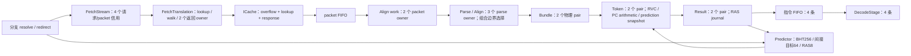

# 前端拓扑与优化记录

原优化记录以 BUS 第四批为基线；其时序/CPI 实测与清理记录位于 tmp/rv64-whole-topology-20260908，属于历史记录。2026-10-08 当前结构核对见末节；通用模块的可选分支不等于生产流水。

| 文件 | 状态、关键边及本轮处理 |
|---|---|
| R64FetchStream.v | 取指请求和 packet 信用先预约；redirect 后旧响应仍按 owner 排空。32 项 early target 保留。 |
| R64PacketParse.v | 半字边界预解析、长度/异常映射与跨 packet 缺失信息；先计算固定候选，后选择 cursor。保留现有三候选结构。 |
| R64Align.v | 消费前缀、跨包拼接、异常字节及 successor 修复；窄选择信息与宽指令数据保持同一 owner。保留。 |
| R64Rvc.v | 编码合法性与 RVC 展开为纯组合；不能通过省略保留编码/异常来缩短路径。保留。 |
| R64Predictor.v | BHT/BTB/RAS 更新来自既定训练边沿。六个待提交 RAS 记录先计算最年轻命中 one-hot，再并行合并 payload，替代宽串行覆盖链。 |
| R64Frontend.v | Bundle/Token/Result 空闲物理槽预写 payload；valid、异常与指针按真实 admission 更新。Result 部分消费用每 pair 的 half 位选择第二物理 lane，不再搬移 410 bit。 |

信用返回和恢复：准备 payload 不创建有效指令；满槽冻结。部分消费只释放已被消费者接受的前缀。RAS 的 speculative journal 与前端已确认接收前缀必须按同一恢复边界选择；这里的 confirmed 不是 ROB 退休提交栈。ICache/翻译已接受事务不能由 CPU redirect 直接释放。

上述历史前端版本 CoreMark 曾与当时基线 cycles、retired 及全部 26 项观察计数一致；该记录不等于本次重新测量。

## 2026-10-08 当前设计单元

本节以当前 `R64CoreTop.frontend` 和源代码核对，不选择候选架构。ID 标识状态和接口责任，可跨文件讨论；
`Q` 是现有时钟寄存边界，箭头之间的组合选择不自行计为一级。容量、数值流水级数和实际端到端等待分别描述。
生产参数是 `PREPARED_PROTECTION=1`、`FETCH_PTR_W=2`、`EARLY_PREDICT=1`、`ICACHE_SET_W=6`；后两项沿用 Frontend 默认值。
翻译与 ICache 内部状态另见 [存储与翻译拓扑](../memory/TOPOLOGY.md)，不能从本表推断其 miss 延迟。

| ID / 状态 owner 与源码 | 当前寄存容量 / 数据宽度 | 同拍依赖、接受与跨拍关系 | 恢复 / 晚响应责任 |
| --- | --- | --- | --- |
| FE-01 取指流信用；`u_stream`，[R64FetchStream.v](R64FetchStream.v) | 请求 holder 1 个；owner FIFO 4 项；packet FIFO 4 项；三者共用 **4 份预约信用**，不能相加成 9 份并发容量。packet 每项 PC64、数据128、plan68、fault1、cause5、access mask8 | `reserved=owner_count_q+packet_count_q+req_valid_q`；`credit=reserved<4` 不借本拍 packet pop。请求实际 handshake 才入 owner；按 owner 次序接收响应，非 stale 响应入 packet Q | redirect 清 packet 有效占用，把尚未返回 owner 标 stale；已承诺请求仍保持并排空。`rsp_ready` 由 owner 非空决定，stale 响应不新建 packet |
| FE-02 翻译前保持；Frontend `if_req_*`，[R64Frontend.v](R64Frontend.v) | 1 个 holder，payload136（VA64、priv2、satp64、status5、PBMT1），另 valid/poison | 空槽时 payload 组合直通翻译；`fetch_ready=!rst&&!if_req_valid_q`。仅翻译受阻才把 Stream 已接受请求保存在 Q；不是每次请求固定增加一拍 | stream redirect / TLB invalidate 置 poison；占用 holder 等翻译接受后释放，不能直接丢掉 Stream 的响应 owner |
| FE-03 字节 / 边界 owner；`u_align`，[R64Align.v](R64Align.v) / [R64PacketParse.v](R64PacketParse.v) | work 2 槽，每槽273 bit+header17；parse 3 槽，每槽 data256、map288、header17、mask8、cause5+next_cause5、plan68、target63 等；cursor PC64 | packet→work Q：`work_count<2`；work→parse Q：`work_count!=0&&count<3`。PacketHeader、initial/completion parse、cursor 对应边界选择是组合逻辑；接收 successor 可补齐前槽跨包信息。每拍最多输出/消费2条指令 | redirect 丢弃本地缓存字节和解析 owner；异常字节、长度、PC、计划跳转点必须跟随同一 packet/指令身份 |
| FE-04 Bundle；Frontend `bundle_*` | 2 个 pair，每 pair 2×202 bit 指令原始记录，另 valid/plan/bad、target64/source64 | Align 组合结果→Bundle Q；capture 取决于 `run`、当前 pair 空位、align/fault barrier。空槽预写 payload 不创建 valid；不能借下游同拍 pop 信用 | `stream_redirect` 清 owner；错误 early plan 可以建立 barrier，等待修复，不允许错误边界指令入后端 |
| FE-05 Token；Frontend `token_*` + RVC / PredictionPrepare | 2 个 pair，每 pair 2×472 bit，含 canonical33、预计算/预测快照、原始记录 | Bundle Q→RVC展开/PC准备/预测表查询→Token Q；`token_capture` 用 Bundle 非空、Token Q空位及 pending/fault 状态。后续预测训练不会改变该 owner 的已捕获快照 | `stream_redirect` 清 owner；Token 接收自身不等于指令 FIFO 接收，也不等于 ROB birth |
| FE-06 Result 与预测结果 journal；Frontend `result_*` | 2 个 pair，每 pair 2×410 bit；每 pair half 位，最多4个 RAS journal 记录 | Token Q→预测/RAS组合查询→Result Q；Q空位决定接收。向指令FIFO部分消费时通过 half 位选择余下物理lane，不搬移宽 payload；RAS speculative consume 和前端 confirm 是不同边沿 | `stream_redirect` 清本地 owner；预测修复可以只接收合法前缀。journal 只作用于预测，不拥有架构状态 |
| FE-07 指令输出 FIFO；Frontend `instruction_q` | 4×398 bit，head/tail/count；每拍最多2条送 DecodeStage | Result Q→检查计划/预测目标/异常→指令 FIFO Q；`room=4-count_q`，不借本拍 Backend 消费信用。输出 payload 由 Q head 选出，`consume_i` 更新计数 | 外部 `redirect_i` 清此 FIFO；本地预测跳转仍保留当拍实际接收的正确前缀。fault barrier 阻止错误路径继续出生 |
| FE-08 预测状态；[R64Predictor.v](R64Predictor.v) + FetchStream early target | direction 256×2 bit+valid；间接 target64项×(tag16+target63)+valid；RAS8×63 bit+pointer/count；2个待写 RAS 记录+FE-06 的4个 journal；early target32项×(tag16+offset3+word1+target63)+valid | 表查询为组合，表训练在时钟边沿。Result 接收推进推测 RAS，指令FIFO接收前缀更新 confirmed；pending记录下一拍写 backing array，查询合并记录。early target 学习/修复单独保持 Q | `recover` 清 RAS 逻辑状态，局部 prediction rollback 回 confirmed 前缀。confirmed 不是退休栈；方向/目标只是预测，正确性由真实执行恢复 |

证据锚点：`R64CoreTop.v:203`；`R64FetchStream.v:93/111/175/201`；`R64Align.v:43/70/84`；
`R64Frontend.v:179/296/316/617/630/769/810`；`R64Predictor.v:65/78/96/125`。
宽度列是指定 payload/state 的声明宽度，不是综合面积或所有控制 bit 的总和。

| 观测对象 | 已有可用事实 / 观测定义 | 当前 UNKNOWN |
| --- | --- | --- |
| FE-07 空/满，FE-08 redirect | `sim/vsrc/R64CpiProfile.svh` 的 `frontend_empty` / `frontend_full` / `prediction_redirect` / `branch_redirect`；分别数输出 lane0 无效、FIFO count=4、pending prediction redirect、Backend redirect 的周期 | FE-01…06 各级满/空占比、首次断流来源、每次误预测实际恢复损失；上述事件可能重叠，不能直接求和归因 |
| FE-01…03 返回与缓存 | 有 `icache_fill` 状态周期计数；owner/stale/pop/fire 均有实际 RTL 信号可取 | TLB miss / ICache miss / 下游拥塞 / stale drain 各自导致的 fetch 缺口，尚无本轮逐事务分解 |
| FE-08 预测质量 | 有分支 redirect 总事件；方向/目标表容量及训练路径已核对 | 按 conditional/indirect/return 分类的准确率、MPKI、别名冲突率、wrong-path 字节/指令量 |
| 所有 FE 单元 | 结构边界可定位到上述 Q 和信号；历史报告保留原身份 | 本次没有重新运行仿真或 STA；不能从图中填每单元 ns 延迟、实际吞吐或 PPA 改善值 |
