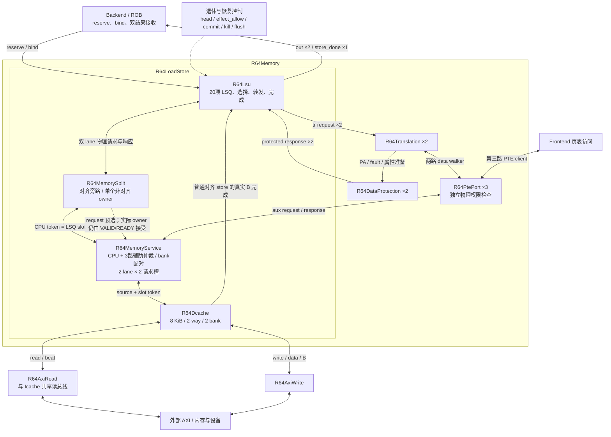
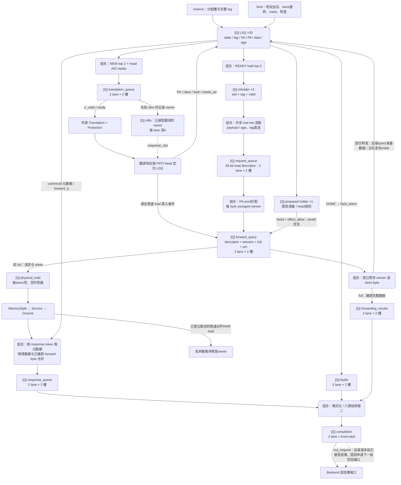
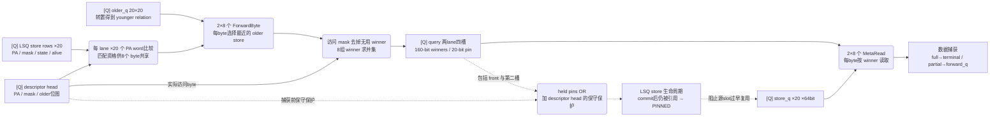
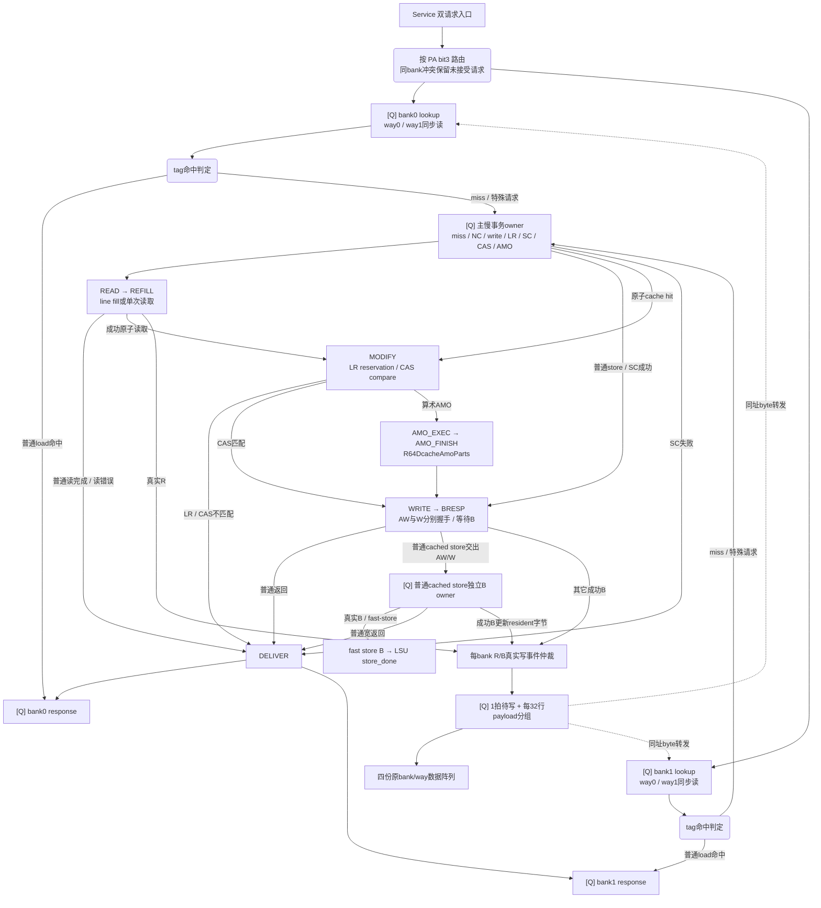
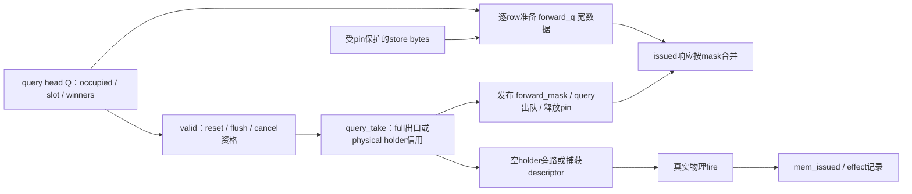

# 当前 LSU 拓扑网络

依据 2026-09-16 当前工作区的生产 RTL 整理；入口为
R64CoreTop.memory → R64Memory.unit → R64LoadStore。
本文描述模块连接、寄存边界及事务所有权，不把队列深度视为固定访问延迟。

核心配置由 [R64CoreTop.v](../core/R64CoreTop.v) 与 [R64Memory.v](../memory/R64Memory.v) 决定：
ENTRIES=20、INDEX_W=5、TAG_W=9、ROB_W=5、HEAD_AUTHORIZED_QUERY=1、
PREPARED_CANCEL=1、EARLY_STORE=1、CACHE_SET_W=6、AUX=3、SRC_W=2。
其中 EARLY_STORE、CACHE_SET_W 等未在核心覆盖的参数沿用模块默认值。

本轮 Backend 网络优化同时更新了共享 [R64LsuRequestQueue](R64LsuRequestQueue.v)：每个持有位置在原数据写入边沿登记 ROB slot one-hot，reuse 输出对有效位置的位图相或。实际覆盖 request_queue、translation_queue、forward_query、response_queue、forwarding_results、faults 六个实例；完整 tag 继续用于 owner 认证。其它持有域、真实 acquire/release 边沿及本拓扑中的访存顺序不变，同一 ROB slot 的多份引用分别受保护。

**阅读图例。** [Q] 表示真实寄存状态；“组合”表示本级不保存事务；实线表示请求或数据流，
虚线表示控制、信用或引用保护；双向边表示请求及其响应。模块层次与数据流分别绘制，
避免将旁路误认成固定流水级。

**1. 核心外围连接与物理访存拓扑**



当前 aux0 是 Frontend 页表访问，aux1/aux2 是两个数据翻译通道的页表访问。
R64LoadStore 的通用默认 AUX=4 不代表当前核心接入4个辅助客户端；当前核心没有在该入口接入 Tensor。
PTE 辅助请求经各自 R64PtePort 检查后直接进入 Service，不占 CPU LSQ，也不经过 CPU 的 MemorySplit。

Service选中辅助读时，入口可以在CPU0/CPU1之间选择读配对：CPU0缺席，或CPU0与辅助读同bank、
CPU1位于异bank且两条CPU请求和辅助请求均为普通cached读时，选择CPU1；
否则保留CPU0路径。CPU0的特殊/NC请求与辅助CAS/写不因此被越过。
该选择位于请求槽捕获前；已有效的请求槽及下游保持的offer保持原token和payload。

LoadStore 显式启用 Service.CPU_REQUEST_HINTS=1，Split 另提供 request 预选信号，
让配对和空槽数据准备不必等待 pending-split 对实际 VALID 的门控。
只要任一 CPU lane 的实际 VALID 为1，两位 request 必须与两位 VALID 完全相同；
pending split 时实际两位 VALID 均为0，Split 的输入 ready 只接受慢路径 acquire，
因此预选 ready 不能创建 CPU owner。真实 enqueue、aux 选择、轮转更新和已占用槽的 owner 仍由原条件决定。
Service 通用参数默认0。这里的严格 live 输入契约不同于 WB 的端口需求提示：
WB 可以安全消耗空 grant，Service 的实际有效输入必须对应准确的 lane 配对。
RTL 断言逐拍对照原 CPU 接受式和实际捕获的 payload，正向及错误提示测试已加入默认回归。

翻译是 LSU 的外部服务，Dcache 是物理地址缓存。LSU 对每个已接受翻译保留顺序 owner；
页表读取/compare-and-OR 则通过同一物理 Dcache，形成带寄存状态的请求/响应依赖网络。

来源：[R64Memory.v](../memory/R64Memory.v)、[R64LoadStore.v](R64LoadStore.v)、
[R64MemoryService.v](R64MemoryService.v)。

**2. 实际实例层级**

```text
R64CoreTop
└─ memory : R64Memory
   ├─ g_translation[0..1]
   │  ├─ translation : R64Translation
   │  └─ protection  : R64DataProtection
   ├─ g_pte[0..2].port : R64PtePort
   └─ unit : R64LoadStore
      ├─ lsu : R64Lsu
      │  ├─ translation_queue : R64LsuRequestQueue
      │  ├─ request_queue     : R64LsuRequestQueue   ← descriptor
      │  ├─ forward_query     : R64LsuRequestQueue   ← 最终物理请求 / winner
      │  ├─ forwarding_results : R64LsuRequestQueue ← full-forward terminal
      │  ├─ response_queue    : R64LsuRequestQueue   ← raw response
      │  ├─ faults            : R64LsuRequestQueue
      │  ├─ completion        : R64LsuCompletion
      │  ├─ R64LsuOrderSelect ×6
      │  │  └─ allocation / translation / load / fault / prepare / event
      │  ├─ R64LsuForwardByte ×16                  ← 2 lane × 8 byte
      │  ├─ R64LsuMetaRead：多处 one-hot 元数据与字节读取
      │  └─ R64WideAdd ×2                          ← backend 目录的地址加法器
      ├─ split   : R64MemorySplit
      ├─ service : R64MemoryService
      └─ cache   : R64Dcache
         └─ arithmetic_parts : R64DcacheAmoParts
```

LSQ entry 阵列、older_q、mholder、prepared holder、translation owner FIFO、
physical_hold 与 store_done 是 R64Lsu 内部寄存逻辑；full-forward 结果现在由 forwarding_results 双槽队列保存。

目录里的 R64LsuSelect.v 和 R64LsuYoungestByte.v 仍列在主线 filelist，
但当前 R64Lsu 没有实例化它们。当前选择网络使用 R64LsuOrderSelect，
逐字节 youngest 判定使用 R64LsuForwardByte；不能由“文件在目录/filelist 中”
推断它是当前实例拓扑的一部分。

**3. R64Lsu 内部请求和返回数据流**



这张图的三个关键分流点：

- 翻译响应直入：成功普通对齐 load、非 IO、无需 A/D 重走，并且对当前 owner
  没有更老 barrier/ordering owner；还需对应 lane 的 query Q 信用及入口优先级允许。
  较老普通load的属性未知时仍为barrier，同拍成功RAM响应可解除这一未知属性屏障。
  不满足直入条件的正常响应保存在 LSQ，后续进入 READY 调度。
- prepared 入口：普通 store 可以在到 head 前准备完整 payload；head 特殊请求也使用
  prepared holder。选择 owner 的同一个边沿捕获 slot、tag 和完整 payload，省去原来的后续 payload 读取拍。
  payload 由原始 one-hot 并行读取；取消只决定是否接受这次准备，被取消的替换候选不能覆盖仍有效的旧描述符。
  只有 head/effect_allow 授权后才占 query lane0，优先于普通 descriptor。
  未成为 head 的 prepared 内容可以被新就绪的更老 head 特殊请求替换；这仍只是准备。
- query 出口：full-forward 的数据进入每lane两槽的 forwarding_results。
  其他请求在 query head 驻留期间把受 pin 保护的转发字节准备到原 LSQ row；在 physical_hold 有空间时出队并发布有效 mask。物理入口可接受且
  hold为空时直接发出，否则 hold 保存完整descriptor/tag。后续只在实际握手时置 mem_issued，
  不重读已释放的source store，也不清除快照。某一出口容量用完后仍可能把背压传回query。

正常匹配路径的寄存边界是 mholder → load descriptor Q → query Q → forwarding_results 或可旁路的 physical_hold → 物理服务。
翻译直入与 prepared 直入省去前面的普通 load 调度/匹配路径。箭头不是固定“一拍”承诺；
背压、队列前方 owner、translation/cache 延迟都会改变等待时间。

completion 另输出两位写回端口需求提示。每位由该物理 lane 的 front/skid 占用或本拍 CQ 接受事件产生，
在新结果变成寄存 VALID 前申请下一拍 Backend grant。提示不传递 owner/data、不完成指令；
实际取走结果仍要求 out_valid/out_ready，受原有 kill/flush 与 ROB owner 校验约束。
CQ 输入信用来自占用 Q，不由写回 ready 反推，保持 ready 组合路径隔离。

六路来源的“至少一条/至少两条有效”直接并行计算，用于 CQ 接受数量与提前端口需求。
具体 owner、payload 与来源 pop 仍由原循环优先级选择器决定；计数不再等待 winner one-hot 的归约。
该优先级构成全序，因此两种计数等价；断言比较新计数与原 winner 数量，独立测试穷举16,384组。


本轮 descriptor 去门控的位置就是图中的 DREAD：mslot_q 仅控制 one-hot 数据/age 读取，
mtag_q 直接送 tag；最终 descriptor_s_take_w 仅控制有效发布，未再门控宽输入。
具体见 [R64Lsu.v](R64Lsu.v) 的 gen_descriptor_payload。

**4. 转发网络与 source pin 的反馈连接**



每个 query lane 保存 8×20=160 bit 的 winner one-hot；每个实际访问 byte 最多选择一个源。
多个 byte 可以来自不同 store。pin 是这些有效 byte winner 的20位并集，
整个 query 队列四个有效槽的 pin 再求并集。

descriptor 阶段尚未保存 winner，当前 source_pin_w 还对两个有效 descriptor head
所见的合格 older store 进行保守保护。第二个 descriptor 槽不是这个显式保护式的输入。
对已经 commit、尚未被任何 query 捕获为源的 store，后续可以依赖已更新的 coherent cache；
一旦保存了 winner，源数据必须保持到 query 真正捕获它。

commit 后仍被引用的 store 清 alive/effect，但进入 PINNED，保持 slot/data；
最后一个引用释放后回到 FREE。query 的 AGE_W 旁带在此实例中装的是 pin，
其 age_clear_i 恒为0；descriptor 的 AGE_W 装的是年龄关系，
由 source_birth_w 清除新分配 slot 对应的旧关系。这两个旁带同宽，但含义不同。

**5. 主要存储、容量与字段**

下表均按当前核心20项配置；同一指令会同时拥有 LSQ row 和下游 holder/队列记录，
这些容量不能相加当作“可容纳的不同指令数”。

| 存储 / 实例 | 容量 | 主要内容 | 何时释放或转移 |
| --- | --- | --- | --- |
| LSQ entry 阵列 | 20项 | slot关联的tag、VA、PA、store data、mask、状态、forward数据 | 随翻译/完成/commit/pin等生命周期事件 |
| older_q | 20×20关系位 | 每个row有哪些更老owner | reserve更新；复用slot清旧列 |
| translation_queue | 2 lane ×2槽 | 10bit请求元数据：slot5+protection4+AD1；另tag9 | 翻译请求实际接受或取消 |
| xfifo_q | 每lane4深，共8项 | 已接受翻译slot5及protection4 | 对应lane翻译响应实际接受，即使已kill |
| mholder | 每lane1项，共2项 | slot5、tag9、valid | descriptor捕获或取消；允许重新选择补入 |
| request_queue / descriptor | 2 lane ×2槽 | data93 + tag9 + older20 | query捕获或取消 |
| prepared holder | 1个候选 | slot/tag身份及完整data157 | 授权进入query、kill，或准备阶段被head候选替换 |
| forward_query | 2 lane ×2槽 | data318 + tag9 + pin20 | full结果队列接受，或物理holder/接口接受并捕获快照，或取消 |
| forwarding_results | 每lane2项，共4项 | data77 + tag9 | 六源仲裁接收或取消 |
| physical_hold | 每lane1项，共2项，空时旁路 | data157 + tag9 | 实际物理握手或取消 |
| response_queue | 2 lane ×2槽 | raw152 + tag9 | 六源仲裁接收或取消 |
| faults | 2 lane ×2槽 | VA64 + cause6 + tag9 | 六源仲裁接收或取消 |
| completion | 2 lane，每lane front+skid，共4项 | RESULT140 + tag9 | Backend接收或取消 |
| store_done terminal | 1项 | tag9、error、tval64、valid | Backend专用端口接收；错误owner可随trap清除 |
| MemorySplit | 1个原始慢路径owner | token、地址、store/gather数据、字节序号 | 完整聚合响应被LSU接受 |
| MemoryService请求槽 | 2 lane ×2槽 | 加source的请求payload | Dcache请求接受 |
| MemoryService辅助返回 | 每aux1项，当前3项 | data/error/compare + valid；busy覆盖完整请求 | 对应aux客户端接收 |
| Dcache lookup / response | 每bank1个lookup和1个response，共2+2 | 物理token、请求与返回数据 | bank命中完成或唯一慢owner排空 |
| Dcache主慢事务owner | 全局1个 | miss/refill/write/atomic状态 | 完整响应；普通cached store交出AW/W后可转交独立B owner |
| Dcache普通store B owner | 1个 | bank、way、hit、poison、store数据；bank stage保持token和mask | 真实B且对应完成信用允许 |
| Dcache待写状态 | 每bank1项，共2项 | way、word index、mask、全字数据；分组payload Q | 下一拍落阵列，期间同址查询逐byte转发 |

普通load descriptor的93bit字段：slot5 + PA64 + func8 + mask8 + AMO5 + class2 + misaligned1；不保存store data。
prepared/query/physical_hold使用通用157bit格式，在上述字段之外保留store data64；普通descriptor展开时该字段补0。
query 的318bit字段：通用descriptor157 + 8×20 winner160 + full-forward1。
query 所保存的 descriptor 中也有 store data字段；load 的转发数据仍在 query 之后按 winner 读取。

**6. Dcache 的银行与慢路径**



存储组织由 SET_W=6 得出：

| 项目 | 当前配置 |
| --- | --- |
| 容量 / 相联度 / line | 8 KiB / 2-way / 64 B |
| set | 64 |
| 每line的64bit word | 8 |
| bank选择 | PA[3] |
| set索引 / tag | PA[11:6] / PA[63:12] |
| 每个bank/way的word索引 | {PA[11:6], PA[5:4]}，8bit |
| data阵列 | bank00、bank01、bank10、bank11，各256×64bit |
| tag阵列 | 2个way，各64×52bit，另valid与LRU |
| 端口结构 | 每bank/way单同步读、单byte-enable写；tag每way双读单写 |
| 对齐load命中能力 | 两个不同bank的load可每拍接受；同bank有冲突 |
| miss/write并发 | 主read/refill owner + 普通cached store B owner；受限异bank、异set普通cached读可重叠；额外miss在bank stage等候 |
| 写策略 | write-through，普通store miss不分配；成功B后更新已驻留word |

请求 lane 与 bank 编号不是同一概念：任一入口 load lane 可进入bank0或bank1，
Dcache返回按bank输出，Service据token中的source解复用，LSU再据slot取对应元数据。

READ/REFILL期间的独立hit可以返回；同bank、同set、poison/invalidate禁止该重叠。
DELIVER仍重读另一bank的保留lookup，使它观察新refill/失效后的tag与数据。
入口ready与候选payload使用相同的overlap资格；lane0不合格而lane1可接受时，所有字段选择lane1。
LR reservation、SC最终检查、CAS/AMO排他性均在这个物理owner内维护。
普通对齐 RAM store 满足 fast_store 条件时，真实外部 B 通过独立窄端口直接反馈 LSU，
绕过 Service/Split 的宽返回队列。非对齐 store、IO、LR/SC/AMO仍走普通返回链。
所有写的真实外部结果仍由 B 决定。

整合版把逻辑写入与大阵列落盘分开：原来的真实R/B仲裁事件先进入每bank的一拍待写状态，
下一拍再按word/way/byte写原数据阵列。每组32行保存独立的64bit payload历史，
每个数据位最多驱动32行×2way；同址lookup用全局pending数据按byte覆盖阵列旧值。
因此成功B、refill install、load返回的原有边沿保持，物理阵列写延后一拍由转发补齐。
连续写使用上一拍payload落阵列，同时捕获下一拍payload；失败B不会产生待写事件。

同bank的R/B真实写事件仍以B为先，只在发生实际冲突的那一拍阻塞R；不会在等待B期间预约整个bank写口。
invalidate清valid并poison在途owner，待写数据不能重新建立valid；reset清pending valid。
这次重组针对真实STA定位到的DCache写数据512扇出路径；最终时序与CPI结论见
[全核迭代结果](../../../../tmp/rv64-whole-topology-20260908/REPORT.md)。


**7. 控制、信用与所有权网络**

| 网络 | 起点与终点 | 当前RTL的意义 |
| --- | --- | --- |
| reservation信用 | FREE Q → allocation_select → Backend reserve_ready | dispatch时分配LSQ及年龄；不借用当拍释放 |
| bind | Backend slot/tag/uop/operand → 原已保留LSQ row | in_ready_o恒为2'b11；真正写入仍检查存活、slot、完整tag、NEW和未bound；VA/store/mask/misaligned直接使用该行的接受位写入，保持lane1优先级 |
| 翻译信用 | translation_queue占用Q → translation_select；xfifo count → tr_valid | 请求队列容量与已接受翻译owner容量分开 |
| 普通load调度信用 | descriptor占用Q → mholder可用性 → load_select | 不从cache ready穿透回新load选择 |
| descriptor出队 | query信用 + probe_allowed + prepared优先级 → descriptor_pop | 只有query实际捕获才转移descriptor |
| query出队 | full时forwarding_results信用；否则physical_hold为空或旧holder实际发出 | 宽数据由驻留query预写，mask在query出队时发布；可早于物理接受 |
| 物理返回信用 | raw队列Q信用，或匹配已登记dead普通load | bypass仅限issued、对齐、非atomic/非store、RAM；当前kill不组合进入ready |
| 窄store返回信用 | store_done_q为空 → mem_store_rsp_ready → Dcache B ready | 不借Backend同拍消费信用 |
| 宽完成信用 | completion的back占用Q → 六源event grant | Backend ready不直接生成该级输入容量 |
| source pin | query全部有效槽pin OR descriptor head保守保护 → store PINNED | 控制源数据与LSQ槽何时可复用 |
| source_birth | 新reserve slot → older_q清列与descriptor age_clear | 防止旧年龄关系误指向复用后的年轻owner |
| 取消 | kill_mask / flush，或等价的prepared cancel → LSQ与可撤销队列 | 已接受外部请求继续排空；不能丢失owner |
| ROB复用保护 | LSQ + 各tagged队列/terminal的reuse OR → Backend | LSQ释放后仍在排队的完整结果也阻止旧ROB槽复用 |
| 副作用授权 | head_tag + effect_allow → prepared offer / special / A/D replay | 生产HEAD_AUTHORIZED_QUERY允许已授权query保留授权 |
| idle / drain_idle | LSQ与terminal汇总，再与Split/Service/Cache/PtePort汇总 | idle含未bind reservation；drain_idle关注已bind实际工作 |

R64LsuRequestQueue 的通用结构是两个固定存储槽/每lane，输入信用取Q态未满；
payload/tag可预写Q态空槽，in_fire才置valid。已占用槽不会被新payload覆盖。
PREPARED_CANCEL=1用预选候选与最终active得到取消，断言保持它与canonical kill_mask一致。

完成仲裁的六源编号为raw0、raw1、fault0、fault1、forward0、forward1。
实际优先级在最后一个被completion捕获的来源之后轮转；没有信用时不推进。
event_select使用循环来源关系，不使用ROB年龄。每拍最多捕获两个，最终异常顺序仍由ROB提交控制。
completion入口可以分配到空闲物理lane，已保持的输出在背压期间不迁移lane。

bind_mask 的每行已包含原有身份与接受资格。宽元数据写入直接消费本行 one-hot，
省去先汇总 bind_take 再动态译码 bind_slot 的回路。写入边沿与 reserve/bind/lane 顺序保持，
R64_ASSERT 逐拍对照原动态索引过程的全部行，包含 FS=Off 的非法 FP 访存地址处理。

LSQ状态语义：
FREE → NEW（先reserve，之后bind）→ TRANSLATING → READY；
普通load选入mholder、翻译直入query、或prepared授权进入query后均可进入MEMORY，
因此 MEMORY 不等价于“已到cache”，还须看mem_issued_q。
DONE是本地/翻译异常待捕获；普通load在有效raw response或full-forward terminal捕获时释放原LSQ。
成功副作用保留RETIRE到commit；需要源保护的已提交store再转PINNED，直到无引用。
已接受翻译/物理请求的dead owner必须等其响应，不能仅凭kill提前复用。

**8. 当前连接的边界与阅读入口**

- 20项是共享LSQ，load与store共用row；没有另一个独立深度的store buffer。
- 双lane是多个局部接口与缓存异bank命中的并行能力，store、原子和非对齐慢路径各有串行约束。
- 功能意义上的反馈环由队列或LSQ寄存器承接；拓扑图本身不证明组合环消除或STA闭合。
- barrier覆盖未bind与普通load NEW/TRANSLATING属性未知窗口；延迟IO、同拍IO反例中，
  年轻query发布与物理接受均已由1次降为0。同拍成功RAM响应仍允许双load直入。
- 本文已随query出口缓冲、转发快照、dead排空、轮转仲裁及受限hit-under-miss更新。
  本轮同源功能、CoreMark/CPI、综合和STA见
  [综合评估](../../../../tmp/rv64-lsu-network-complete-20260907/REPORT.md)。

| 后续逐模块阅读对象 | 源码入口 | 关注连接 |
| --- | --- | --- |
| reservation与entry控制 | [R64Lsu.v](R64Lsu.v) | reserve/bind、older_q、gen_owner_state |
| 选择与元数据读取 | [R64LsuOrderSelect.v](R64LsuOrderSelect.v)、[R64LsuMetaRead.v](R64LsuMetaRead.v) | candidate、one-hot、credit、元数据宽度 |
| 通用请求队列 | [R64LsuRequestQueue.v](R64LsuRequestQueue.v) | Q信用、预写、valid发布、cancel、age/pin |
| 转发 | [R64LsuForwardByte.v](R64LsuForwardByte.v)、[R64Lsu.v](R64Lsu.v) | PA match、winner Q、源读取、pin |
| 完成 | [R64LsuCompletion.v](R64LsuCompletion.v) | 六源输入、物理lane分配、front/skid、背压 |
| 非对齐拆分 | [R64MemorySplit.v](R64MemorySplit.v) | physical_idle、单owner、逐byte请求、错误offset |
| 多源物理服务 | [R64MemoryService.v](R64MemoryService.v) | round-robin、CPU/aux配对、source token、响应路由 |
| 缓存与原子 | [R64Dcache.v](R64Dcache.v)、[R64DcacheAmoParts.v](R64DcacheAmoParts.v) | bank、慢owner、B、LR/SC/CAS/AMO |

## 全核 STA 反馈后的转发与状态更新

完整 SystemTop 的 DCache 写数据瓶颈消除后，IQ32 最差端点转到 forward_q，IQ16 最差端点转到 state_q。本轮最终实现同时处理两条路径；完整测量与选择见[本轮结果](../../../../tmp/rv64-whole-topology-20260908/REPORT.md)。



新增 out_occupied_o 只导出 query head 的原始 valid Q，不含 reset/flush/kill 条件；它仅用于准备数据。其它五个请求队列不使用这个输出。对外 out_valid_o、接受条件、pop 和取消处理保持原语义。每个 LSQ row 使用静态 slot 匹配写 forward_q；query 离开后不再重读源 store。原 query_take 边沿仍发布 forward_mask，因此待准备或失效的数据不产生架构可见效果。

对应断言检查：同一 row 不被两个 query head 同时声明；physical holder 或 mem_issued 已拥有该 row 后禁止预写；已发请求的有效转发 byte 必须与原 query_take 边沿捕获的参考快照一致。定向测试另外验证 cancel/flush 在组合上压低 out_valid 时，raw occupancy 仍保持原 Q，直到时钟处理取消。

LSQ 在普通 load 被选择、成功翻译直入、或 prepared 授权时已经进入 MEMORY。物理 fire 只新增“已发出”事实；再次写 MEMORY 是冗余的。当前 state_events 去除该项，mem_issued、effect、取消排空与真实握手均保持。原全部事件的互斥断言保留，并增加“每次物理 fire 前 state 必须已是 MEMORY”的检查。这个优化没有把 MEMORY 当成已接受外部事务。


## 2026-09-16：准备与完成等待优化

prepared owner 与完整描述符同拍捕获；CQ 接受新结果时提前申请下一拍 WB 端口。
完成数量与 owner 选择并行，bind 宽元数据改为按行接受位写入。真实副作用授权、
kill/flush、来源 pin 与 AXI B 完成契约保持。完整 A/B、CPI 和同约束 STA 见
[本轮报告](../../../../tmp/rv64-cpi-timing-20260916/REPORT.md)。


## physical holder 的 query ready 化简

query 出口对满字节转发仍使用 forwarding-results 信用。
对物理请求，holder 为空时 query ready 原本已成立；holder 占用时，
仅其保存的 descriptor/tag、当前 kill、head/effect 授权和下游 ready 决定能否替换。
当前表达式显式使用 holder 自身信息，减少待进入 query 经 mem_valid 绕回自身 ready 的组合依赖。
寄存边沿、容量、实际物理 VALID 与接受条件保持；R64_ASSERT 逐拍比较原
!physical_hold_valid || mfire 公式。

