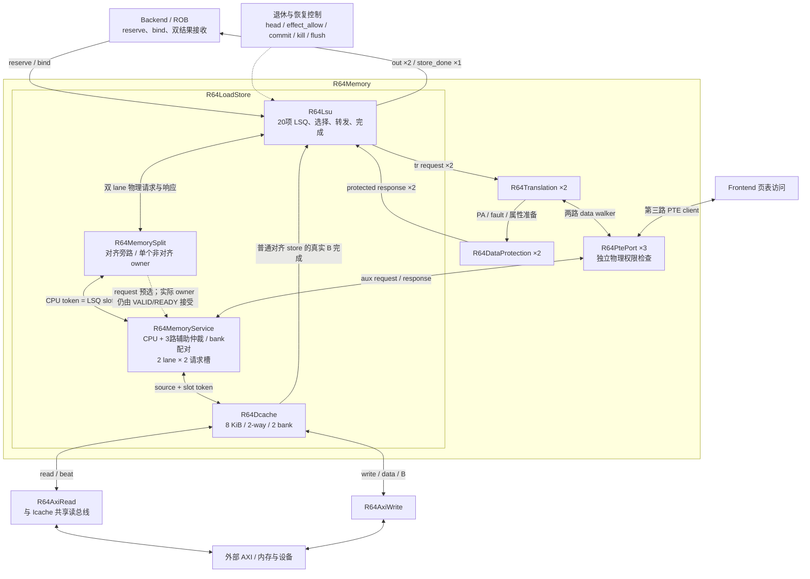
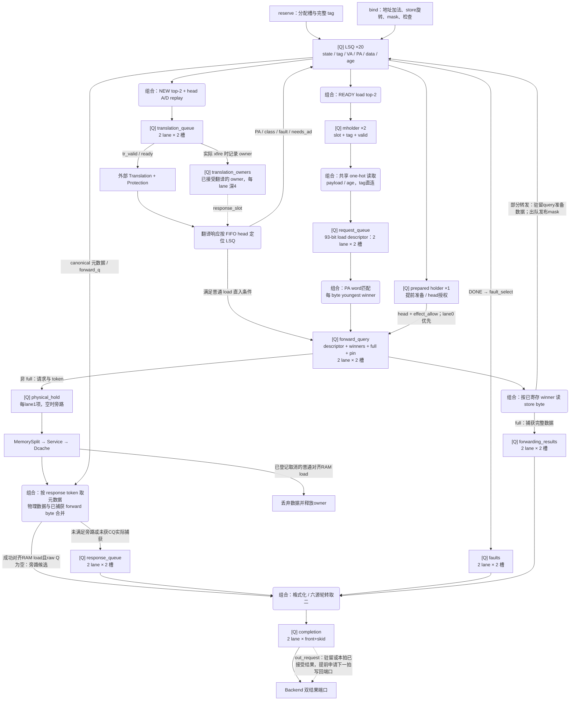
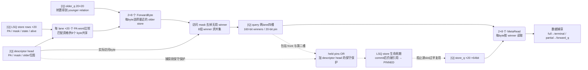
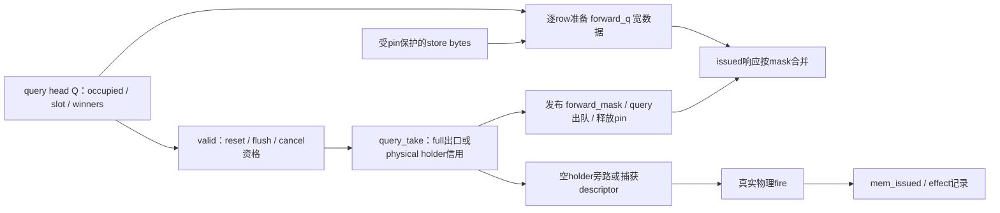
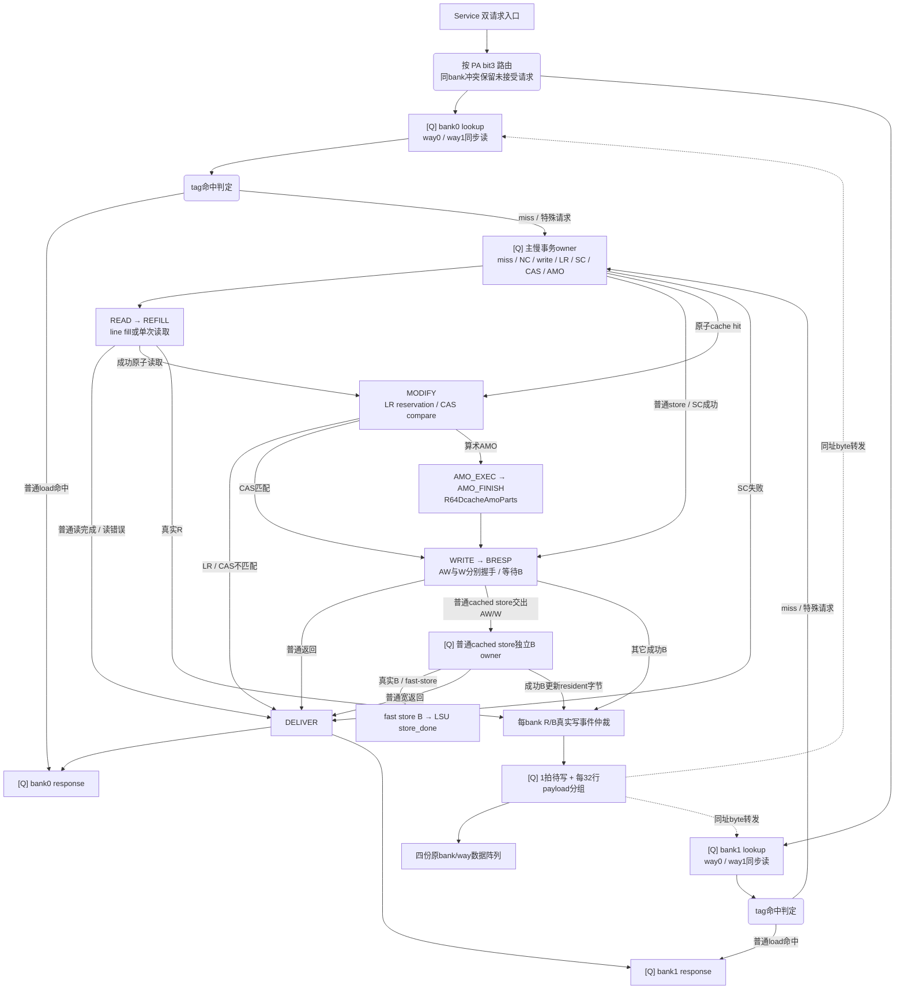

# 当前 LSU 拓扑网络

依据 **2026-10-09 工作区生产 RTL** 核对，入口为
`R64CoreTop.memory → R64Memory.unit → R64LoadStore`。
本文描述现有模块连接、寄存边界、真实接收与事务所有权，不把队列深度视为固定访问延迟。
[Memory 拓扑](../memory/TOPOLOGY.md)负责外部翻译/保护/PTE通道，
[Backend 拓扑](../backend/TOPOLOGY.md)负责原子分配、操作数绑定与完成接收。

当前实现保留第一轮基线B的普通RAM load-response bypass。
第二轮固定槽CQ、第三轮CQ确值早唤醒/供值与同拍取消发布候选均已撤回；
当前Completion仍为两条物理lane、各front+skid，共4项。历史实验统一列在文末。
本次将已接受翻译的返回 owner 账本提取为 `R64LsuTranslationOwners`；容量、寄存边沿和取消后排空语义保持。其定向验证与既有 LSU 回归见第 11 节；CPI/STA 未重测。

**阅读图例。** [Q] 表示真实寄存状态；“组合”表示本级不保存事务；实线表示请求或数据流，
虚线表示控制、信用或引用保护；双向边表示请求及其响应。模块层次与数据流分别绘制，
避免将旁路误认成固定流水级。

## 1. 实际边界与生产参数

R64LoadStore内部有LSU、Split、Service与Dcache；Translation、DataProtection、PtePort属于外层Memory，
AXI适配器属于CoreTop。LSU保存指令/顺序owner，Service保存物理请求source，
Dcache保存实际cache/AXI事务；这三种身份通过tag、slot与source token相接。

| 配置所在边界 | 当前取值 | 对拓扑的影响 |
| --- | --- | --- |
| Memory → LoadStore → LSU | `ENTRIES=20`、`INDEX_W=5`、`TAG_W=9`、`ROB_W=5` | 共享LSQ20项，5-bit slot、9-bit完整ROB tag；模块通用默认18项 |
| CoreTop → Memory → LSU | `HEAD_AUTHORIZED_QUERY=1`、`PREPARED_CANCEL=1` | head授权query及ROB候选/active取消投影；full flush仍独立生效 |
| LoadStore → LSU | `EARLY_STORE=1`（默认） | 普通store可在head前准备payload，真实副作用仍待head/effect_allow |
| LSU | `RESPONSE_BYPASS=1`（默认，LoadStore未覆盖） | 空raw时合格普通RAM成功响应可直接成为原raw完成来源，保留CQ/WB/ROB接收边界 |
| Memory → LoadStore / Service | `AUX=3`、`SRC_W=2` | aux0为I walker、aux1/2为D walker；Service→Dcache token为source2+slot5 |
| LoadStore → Service | `CPU_REQUEST_HINTS=1` | Split提供准确live请求预选；通用默认0；真实VALID/READY才建立owner |
| LoadStore → Dcache | `CACHE_SET_W=6` | 64 set、2-way、2-bank、64 B line、8 KiB；SET_W沿用默认 |
| CoreTop → AXI适配器 | Read `CLIENTS=2`、Write `B_BYPASS=1` | I/D共享读口；真实B可沿窄store完成链返回，仍受终端信用控制 |

来源：[CoreTop](../core/R64CoreTop.v)、[Memory](../memory/R64Memory.v)、[LoadStore](R64LoadStore.v)、
[LSU](R64Lsu.v)、[Service](R64MemoryService.v)、[Dcache](R64Dcache.v)。

### 1.1 文件职责与当前使用方

| 文件 | 当前职责 / 实际使用方 |
| --- | --- |
| [R64LoadStore.v](R64LoadStore.v) | Memory.unit结构入口，连接四个子模块、汇总idle/drain、直接连接Dcache窄store响应 |
| [R64Lsu.v](R64Lsu.v) | unit.lsu；reservation/bind、canonical row、顺序、翻译发出事实/响应消费、转发/物理请求与完成仲裁 |
| [R64LsuTranslationOwners.v](R64LsuTranslationOwners.v) | translation_owners；已接受翻译的双 lane 顺序 owner 账本、Q 信用与返回 slot/protection；不保存 LSQ 生死或取消策略 |
| [R64LsuOrderSelect.v](R64LsuOrderSelect.v) | LSU内6个选择器：allocation、translation、load、fault、prepare、event；最后一个按完成来源轮转，非ROB年龄 |
| [R64LsuMetaRead.v](R64LsuMetaRead.v) | LSU内多处one-hot payload/年龄/索引/字节读取；head special与A/D replay是唯一候选编码 |
| [R64LsuForwardByte.v](R64LsuForwardByte.v) | 每lane×8 byte，共16个；按older关系得到youngest store的one-hot winner |
| [R64LsuRequestQueue.v](R64LsuRequestQueue.v) | request_queue、translation_queue、forward_query、response_queue、forwarding_results、faults共6个；Q信用、payload预写、tag及slot引用 |
| [R64LsuCompletion.v](R64LsuCompletion.v) | 六源取二之后的4项完成持有；按Q空位分配物理lane，输出WB端口需求提示 |
| [R64MemorySplit.v](R64MemorySplit.v) | unit.split；对齐双lane旁路、非对齐单owner逐byte序列 |
| [R64MemoryService.v](R64MemoryService.v) | unit.service；CPU/aux选择、异bank配对、请求队列、source返回路由与每aux独立busy/response |
| [R64Dcache.v](R64Dcache.v)、[R64DcacheAmoParts.v](R64DcacheAmoParts.v) | unit.cache及arithmetic_parts；bank查找、单慢事务、独立普通store B owner、原子运算与pending write |
| [R64LsuSelect.v](R64LsuSelect.v)、[R64LsuYoungestByte.v](R64LsuYoungestByte.v) | 兼容/历史helper，仍在主filelist且有独立测试；当前R64Lsu未实例化，不能计入生产拓扑 |

## 2. 核心外围连接与物理访存拓扑


```mermaid
flowchart TB
  BE["Backend / ROB<br/>reserve、bind、双结果接收"]
  CTRL["退休与恢复控制<br/>head / effect_allow / commit / kill / flush"]
  FPTW["Frontend 页表访问"]

  subgraph MEM["R64Memory"]
    TR["R64Translation ×2"]
    PROT["R64DataProtection ×2"]
    PTE["R64PtePort ×3<br/>独立物理权限检查"]
    subgraph LS["R64LoadStore"]
      LSU["R64Lsu<br/>20项 LSQ、选择、转发、完成"]
      SPLIT["R64MemorySplit<br/>对齐旁路 / 单个非对齐 owner"]
      SERVICE["R64MemoryService<br/>CPU + 3路辅助仲裁 / bank配对<br/>2 lane × 2 请求槽"]
      DC["R64Dcache<br/>8 KiB / 2-way / 2 bank"]
    end
  end

  BE -->|"reserve / bind"| LSU
  LSU -->|"out ×2 / store_done ×1"| BE
  CTRL -.-> LSU
  LSU -->|"tr request ×2"| TR
  TR -->|"PA / fault / 属性准备"| PROT
  PROT -->|"protected response ×2"| LSU
  TR <-->|"两路 data walker"| PTE
  FPTW <-->|"第三路 PTE client"| PTE
  LSU <-->|"双 lane 物理请求与响应"| SPLIT
  SPLIT <-->|"CPU token = LSQ slot"| SERVICE
  SPLIT -.->|"request 预选；实际 owner 仍由 VALID/READY 接受"| SERVICE
  PTE <-->|"aux request / response"| SERVICE
  SERVICE <-->|"source + slot token"| DC
  DC -->|"普通对齐 store 的真实 B 完成"| LSU

  RD["R64AxiRead<br/>与 Icache 共享读总线"]
  WR["R64AxiWrite"]
  AXI["外部 AXI / 内存与设备"]
  DC <-->|"read / beat"| RD
  DC <-->|"write / data / B"| WR
  RD <--> AXI
  WR <--> AXI
```

当前 aux0 是 Frontend 页表访问，aux1/aux2 是两个数据翻译通道的页表访问。
R64LoadStore 的通用默认 AUX=4 不代表当前核心接入4个辅助客户端；当前核心没有在该入口接入 Tensor。
PTE 辅助请求经各自 R64PtePort 检查后直接进入 Service，不占 CPU LSQ，也不经过 CPU 的 MemorySplit。

Service选中辅助读时，入口可以在CPU0/CPU1之间选择读配对：CPU0缺席，或CPU0与辅助读同bank、
CPU1位于异bank且两条CPU请求和辅助请求均为普通cached读时，选择CPU1；
否则保留CPU0路径。CPU0的特殊/NC请求与辅助CAS/写不因此被越过。
该选择位于请求槽捕获前；已有效的请求槽及下游保持的offer保持原token和payload。

LoadStore 显式启用 Service.CPU_REQUEST_HINTS=1，Split 另提供 request 预选信号，
让配对和空槽数据准备不必等待 pending-split 对实际 VALID 的门控。
只要任一 CPU lane 的实际 VALID 为1，两位 request 必须与两位 VALID 完全相同；
pending split 时实际两位 VALID 均为0，Split 的输入 ready 只接受慢路径 acquire，
因此预选 ready 不能创建 CPU owner。真实 enqueue、aux 选择、轮转更新和已占用槽的 owner 仍由原条件决定。
Service 通用参数默认0。这里的严格 live 输入契约不同于 WB 的端口需求提示：
WB 可以安全消耗空 grant，Service 的实际有效输入必须对应准确的 lane 配对。
RTL 断言逐拍对照原 CPU 接受式和实际捕获的 payload，正向及错误提示测试已加入默认回归。

翻译是 LSU 的外部服务，Dcache 是物理地址缓存。LSU 对每个已接受翻译保留顺序 owner；
页表读取/compare-and-OR 则通过同一物理 Dcache，形成带寄存状态的请求/响应依赖网络。

来源：[R64Memory.v](../memory/R64Memory.v)、[R64LoadStore.v](R64LoadStore.v)、
[R64MemoryService.v](R64MemoryService.v)。

## 3. 实际实例层级

```text
R64CoreTop
└─ memory : R64Memory
   ├─ g_translation[0..1]
   │  ├─ translation : R64Translation
   │  │  └─ g_data.unit : R64DataTranslation
   │  │     ├─ u_tlb : R64Tlb
   │  │     └─ u_walk : R64PageWalk
   │  └─ protection  : R64DataProtection
   ├─ g_pte[0..2].port : R64PtePort
   └─ unit : R64LoadStore
      ├─ lsu : R64Lsu
      │  ├─ translation_queue : R64LsuRequestQueue
      │  ├─ translation_owners : R64LsuTranslationOwners ← 已接受翻译的返回归属
      │  ├─ request_queue     : R64LsuRequestQueue   ← descriptor
      │  ├─ forward_query     : R64LsuRequestQueue   ← 最终物理请求 / winner
      │  ├─ forwarding_results : R64LsuRequestQueue ← full-forward terminal
      │  ├─ response_queue    : R64LsuRequestQueue   ← raw response
      │  ├─ faults            : R64LsuRequestQueue
      │  ├─ completion        : R64LsuCompletion
      │  ├─ R64LsuOrderSelect ×6
      │  │  └─ allocation / translation / load / fault / prepare / event
      │  ├─ R64LsuForwardByte ×16                  ← 2 lane × 8 byte
      │  ├─ R64LsuMetaRead：多处 one-hot 元数据与字节读取
      │  └─ R64WideAdd ×2                          ← backend 目录的地址加法器
      ├─ split   : R64MemorySplit
      ├─ service : R64MemoryService
      └─ cache   : R64Dcache
         └─ arithmetic_parts : R64DcacheAmoParts
```

LSQ entry 阵列、older_q、mholder、prepared holder、physical_hold 与 store_done 是 R64Lsu 内部寄存逻辑；
已接受翻译的 owner FIFO 由 translation_owners 保存，full-forward 结果由 forwarding_results 双槽队列保存。

目录里的 R64LsuSelect.v 和 R64LsuYoungestByte.v 仍列在主线 filelist，
但当前 R64Lsu 没有实例化它们。当前选择网络使用 R64LsuOrderSelect，
逐字节 youngest 判定使用 R64LsuForwardByte；不能由“文件在目录/filelist 中”
推断它是当前实例拓扑的一部分。

## 4. R64Lsu 内部请求和返回数据流


```mermaid
flowchart TB
  RES["reserve：分配槽与完整 tag"]
  BIND["bind：地址加法、store旋转、mask、检查"]
  LSQ["[Q] LSQ ×20<br/>state / tag / VA / PA / data / age"]
  XSEL("组合：NEW top-2 + head A/D replay")
  XQ["[Q] translation_queue<br/>2 lane × 2 槽"]
  XF["[Q] translation_owners<br/>已接受翻译的 owner，每 lane 深4"]
  TR["外部 Translation + Protection"]
  RX("翻译响应按 FIFO head 定位 LSQ")

  LSEL("组合：READY load top-2")
  MH["[Q] mholder ×2<br/>slot + tag + valid"]
  DREAD("组合：共享 one-hot 读取<br/>payload / age，tag直连")
  DQ["[Q] request_queue<br/>93-bit load descriptor：2 lane × 2 槽"]
  MATCH("组合：PA word匹配<br/>每 byte youngest winner")
  PRE["[Q] prepared holder ×1<br/>提前准备 / head授权"]
  QQ["[Q] forward_query<br/>descriptor + winners + full + pin<br/>2 lane × 2 槽"]
  READBYTE("组合：按已寄存 winner 读 store byte")
  FT["[Q] forwarding_results<br/>2 lane × 2 槽"]
  HOLD["[Q] physical_hold<br/>每lane1项，空时旁路"]
  PHYS["MemorySplit → Service → Dcache"]
  MERGE("组合：按 response token 取元数据<br/>物理数据与已捕获 forward byte 合并")
  RAW["[Q] response_queue<br/>2 lane × 2 槽"]
  FQ["[Q] faults<br/>2 lane × 2 槽"]
  EVT("组合：格式化 / 六源轮转取二")
  CQ["[Q] completion<br/>2 lane × front+skid"]
  WB["Backend 双结果端口"]

  RES --> LSQ
  BIND --> LSQ
  LSQ --> XSEL --> XQ
  XQ -->|"tr_valid / ready"| TR
  XQ -->|"实际 xfire 时记录 owner"| XF
  TR --> RX
  XF -.->|"response_slot"| RX
  RX -->|"PA / class / fault / needs_ad"| LSQ
  RX -->|"满足普通 load 直入条件"| QQ
  LSQ --> LSEL --> MH --> DREAD --> DQ --> MATCH --> QQ
  LSQ --> PRE
  PRE -->|"head + effect_allow；lane0 优先"| QQ
  QQ --> READBYTE
  QQ -->|"非 full：请求与 token"| HOLD --> PHYS
  READBYTE -->|"full：捕获完整数据"| FT
  READBYTE -->|"部分转发：驻留query准备数据；出队发布mask"| LSQ
  PHYS --> MERGE
  PHYS -->|"已登记取消的普通对齐RAM load"| DRAIN["丢弃数据并释放owner"]
  LSQ -->|"canonical 元数据 / forward_q"| MERGE
  MERGE -->|"未满足旁路或未获CQ实际捕获"| RAW
  MERGE -->|"成功对齐RAM load且raw Q为空：旁路候选"| EVT
  LSQ -->|"DONE → fault_select"| FQ
  RAW --> EVT
  FQ --> EVT
  FT --> EVT
  EVT --> CQ --> WB
  CQ -.->|"out_request：驻留或本拍已接受结果，提前申请下一拍写回端口"| WB
```

这张图的四个关键分流点：

- 翻译响应直入：成功普通对齐 load、非 IO、无需 A/D 重走，并且对当前 owner
  没有更老 barrier/ordering owner；还需对应 lane 的 query Q 信用及入口优先级允许。
  较老普通load的属性未知时仍为barrier，同拍成功RAM响应可解除这一未知属性屏障。
  不满足直入条件的正常响应保存在 LSQ，后续进入 READY 调度。
- prepared 入口：普通 store 可以在到 head 前准备完整 payload；head 特殊请求也使用
  prepared holder。选择 owner 的同一个边沿捕获 slot、tag 和完整 payload，省去原来的后续 payload 读取拍。
  payload 由原始 one-hot 并行读取；取消只决定是否接受这次准备，被取消的替换候选不能覆盖仍有效的旧描述符。
  只有 head/effect_allow 授权后才占 query lane0，优先于普通 descriptor。
  未成为 head 的 prepared 内容可以被新就绪的更老 head 特殊请求替换；这仍只是准备。
- query 出口：full-forward 的数据进入每lane两槽的 forwarding_results。
  其他请求在 query head 驻留期间把受 pin 保护的转发字节准备到原 LSQ row；在 physical_hold 有空间时出队并发布有效 mask。物理入口可接受且
  hold为空时直接发出，否则 hold 保存完整descriptor/tag。后续只在实际握手时置 mem_issued，
  不重读已释放的source store，也不清除快照。某一出口容量用完后仍可能把背压传回query。

- 物理响应入口：RESPONSE_BYPASS=1 时，成功、对齐、非 store/atomic/side-effect 且 class<2 的
  普通 RAM load，在该 lane 的 raw Q 真正为空时可作为原 raw 来源参与六源轮转。
  只有 CQ 本拍实际捕获该事件，才抑制这次 raw enqueue；未获 grant 或 CQ 无信用仍进原 raw Q。
  使用不含 kill 的 out_occupied_o 判断是否空，不能让被杀旧 head 与新响应交换 payload。
  外部 ready、raw 的寄存信用、mem_end 与上游 owner 释放边沿不变；完整 tag 在接受边沿
  从 LSQ 转交 raw 或 CQ，reuse 投影保持覆盖。错误、IO、atomic 和非对齐请求保留原路径。

正常匹配路径的寄存边界是 mholder → load descriptor Q → query Q → forwarding_results 或可旁路的 physical_hold → 物理服务。
翻译直入与 prepared 直入省去前面的普通 load 调度/匹配路径。箭头不是固定“一拍”承诺；
背压、队列前方 owner、translation/cache 延迟都会改变等待时间。

completion 另输出两位写回端口需求提示。每位由该物理 lane 的 front/skid 占用或本拍 CQ 接受事件产生，
在新结果变成寄存 VALID 前申请下一拍 Backend grant。提示不传递 owner/data、不完成指令；
实际取走结果仍要求 out_valid/out_ready，受原有 kill/flush 与 ROB owner 校验约束。
CQ 输入信用来自占用 Q，不由写回 ready 反推，保持 ready 组合路径隔离。

六路来源的“至少一条/至少两条有效”直接并行计算，用于 CQ 接受数量与提前端口需求。
具体 owner、payload 与来源 pop 仍由原循环优先级选择器决定；计数不再等待 winner one-hot 的归约。
该优先级构成全序，因此两种计数等价；断言比较新计数与原 winner 数量，独立测试穷举16,384组。


descriptor 宽输入准备对应图中的 DREAD：mslot_q 仅控制 one-hot 数据/age 读取，
mtag_q 直接送 tag；最终 descriptor_s_take_w 仅控制有效发布，未再门控宽输入。
具体见 [R64Lsu.v](R64Lsu.v) 的 gen_descriptor_payload。

## 5. 转发网络与 source pin 的反馈连接


```mermaid
flowchart LR
  D["[Q] descriptor head<br/>PA / mask / older位图"]
  S["[Q] LSQ store rows ×20<br/>PA / mask / state / alive"]
  REL["[Q] older_q 20×20<br/>转置得到 younger relation"]
  M("每 lane ×20 个 PA word比较<br/>匹配资格供8个 byte共享")
  Y("2×8 个 ForwardByte<br/>每byte选择最近的 older store")
  USED("访问 mask 去掉无用 winner<br/>8组 winner 求并集")
  Q["[Q] query 两lane四槽<br/>160-bit winners / 20-bit pin"]
  DAT["[Q] store_q ×20 ×64bit"]
  BR("2×8 个 MetaRead<br/>每byte按 winner 读取")
  CAP["数据捕获<br/>full→terminal / partial→forward_q"]
  P("held pins OR<br/>加 descriptor head 的保守保护")
  ST["LSQ store 生命周期<br/>commit后仍被引用 → PINNED"]

  D --> M
  S --> M
  M --> Y
  REL --> Y
  Y --> USED
  D -->|"实际访问byte"| USED
  USED --> Q
  Q --> BR
  DAT --> BR --> CAP
  Q -.->|"包括 front 与第二槽"| P
  D -.->|"捕获前保守保护"| P
  P -.-> ST
  ST -.->|"阻止源slot过早复用"| DAT
```

每个 query lane 保存 8×20=160 bit 的 winner one-hot；每个实际访问 byte 最多选择一个源。
多个 byte 可以来自不同 store。pin 是这些有效 byte winner 的20位并集，
整个 query 队列四个有效槽的 pin 再求并集。

descriptor 阶段尚未保存 winner，当前 source_pin_w 还对两个有效 descriptor head
所见的合格 older store 进行保守保护。第二个 descriptor 槽不是这个显式保护式的输入。
对已经 commit、尚未被任何 query 捕获为源的 store，后续可以依赖已更新的 coherent cache；
一旦保存了 winner，源数据必须保持到 query 真正捕获它。

commit 后仍被引用的 store 清 alive/effect，但进入 PINNED，保持 slot/data；
最后一个引用释放后回到 FREE。query 的 AGE_W 旁带在此实例中装的是 pin，
其 age_clear_i 恒为0；descriptor 的 AGE_W 装的是年龄关系，
由 source_birth_w 清除新分配 slot 对应的旧关系。这两个旁带同宽，但含义不同。

### 5.1 转发快照与实际物理fire


```mermaid
flowchart LR
  QQ["query head Q：occupied / slot / winners"] --> P["逐row准备 forward_q 宽数据"]
  STORE["受pin保护的store bytes"] --> P
  QQ --> V["valid：reset / flush / cancel资格"]
  V --> T["query_take：full出口或physical holder信用"]
  T --> MASK["发布 forward_mask / query出队 / 释放pin"]
  P --> MERGE["issued响应按mask合并"]
  MASK --> MERGE
  T --> HOLD["空holder旁路或捕获descriptor"]
  HOLD --> FIRE["真实物理fire"]
  FIRE --> ISS["mem_issued / effect记录"]
```

out_occupied_o 导出 head 的原始 valid Q，不含 reset/flush/kill 条件。query 使用它准备数据；
response_queue 也使用它判断 raw lane 是否真正为空，决定能否提供直接进入 CQ 的候选。
其它四个请求队列不使用这个输出。对外 out_valid_o、接受条件、pop 和取消处理保持原语义。每个 LSQ row 使用静态 slot 匹配写 forward_q；query 离开后不再重读源 store。原 query_take 边沿仍发布 forward_mask，因此待准备或失效的数据不产生架构可见效果。

对应断言检查：同一 row 不被两个 query head 同时声明；physical holder 或 mem_issued 已拥有该 row 后禁止预写；已发请求的有效转发 byte 必须与原 query_take 边沿捕获的参考快照一致。定向测试另外验证 cancel/flush 在组合上压低 out_valid 时，raw occupancy 仍保持原 Q，直到时钟处理取消。

LSQ 在普通 load 被选择、成功翻译直入、或 prepared 授权时已经进入 MEMORY。物理 fire 只新增“已发出”事实；再次写 MEMORY 是冗余的。当前 state_events 去除该项，mem_issued、effect、取消排空与真实握手均保持。原全部事件的互斥断言保留，并增加“每次物理 fire 前 state 必须已是 MEMORY”的检查。这个优化没有把 MEMORY 当成已接受外部事务。


## 6. 主要存储、容量与字段

下表均按当前核心20项配置；同一指令会同时拥有 LSQ row 和下游 holder/队列记录，
这些容量不能相加当作“可容纳的不同指令数”。

| 存储 / 实例 | 容量 | 主要内容 | 何时释放或转移 |
| --- | --- | --- | --- |
| LSQ entry 阵列 | 20项 | slot关联的tag、VA、PA、store data、mask、状态、forward数据 | 随翻译/完成/commit/pin等生命周期事件 |
| older_q | 20×20关系位 | 每个row有哪些更老owner | reserve更新；复用slot清旧列 |
| translation_queue | 2 lane ×2槽 | 10bit请求元数据：slot5+protection4+AD1；另tag9 | 翻译请求实际接受或取消 |
| translation_owners | 每lane4深，共8项 | 已接受翻译slot5及protection4；每lane head2、tail2、count3 | 对应lane翻译响应实际接受，即使已kill |
| mholder | 每lane1项，共2项 | slot5、tag9、valid | descriptor捕获或取消；允许重新选择补入 |
| request_queue / descriptor | 2 lane ×2槽 | data93 + tag9 + older20 | query捕获或取消 |
| prepared holder | 1个候选 | slot/tag身份及完整data157 | 授权进入query、kill，或准备阶段被head候选替换 |
| forward_query | 2 lane ×2槽 | data318 + tag9 + pin20 | full结果队列接受，或物理holder/接口接受并捕获快照，或取消 |
| forwarding_results | 每lane2项，共4项 | data77 + tag9 | 六源仲裁接收或取消 |
| physical_hold | 每lane1项，共2项，空时旁路 | data157 + tag9 | 实际物理握手或取消 |
| response_queue | 2 lane ×2槽 | raw152 + tag9 | 六源仲裁接收或取消 |
| faults | 2 lane ×2槽 | VA64 + cause6 + tag9 | 六源仲裁接收或取消 |
| completion | 2 lane，每lane front+skid，共4项 | RESULT140 + tag9 | Backend接收或取消 |
| store_done terminal | 1项 | tag9、error、tval64、valid | Backend专用端口接收；错误owner可随trap清除 |
| MemorySplit | 1个原始慢路径owner | token、地址、store/gather数据、字节序号 | 完整聚合响应被LSU接受 |
| MemoryService请求槽 | 2 lane ×2槽 | 加source的请求payload | Dcache请求接受 |
| MemoryService辅助返回 | 每aux1项，当前3项 | data/error/compare + valid；busy覆盖完整请求 | 对应aux客户端接收 |
| Dcache lookup / response | 每bank1个lookup和1个response，共2+2 | 物理token、请求与返回数据 | bank命中完成或唯一慢owner排空 |
| Dcache主慢事务owner | 全局1个 | miss/refill/write/atomic状态 | 完整响应；普通cached store交出AW/W后可转交独立B owner |
| Dcache普通store B owner | 1个 | bank、way、hit、poison、store数据；bank stage保持token和mask | 真实B且对应完成信用允许 |
| Dcache待写状态 | 每bank1项，共2项 | way、word index、mask、全字数据；分组payload Q | 下一拍落阵列，期间同址查询逐byte转发 |

普通load descriptor的93bit字段：slot5 + PA64 + func8 + mask8 + AMO5 + class2 + misaligned1；不保存store data。
prepared/query/physical_hold使用通用157bit格式，在上述字段之外保留store data64；普通descriptor展开时该字段补0。
query 的318bit字段：通用descriptor157 + 8×20 winner160 + full-forward1。
query 所保存的 descriptor 中也有 store data字段；load 的转发数据仍在 query 之后按 winner 读取。

## 7. Dcache 的银行与慢路径


```mermaid
flowchart TB
  IN["Service 双请求入口"]
  ROUTE("按 PA bit3 路由<br/>同bank冲突保留未接受请求")
  B0["[Q] bank0 lookup<br/>way0 / way1同步读"]
  B1["[Q] bank1 lookup<br/>way0 / way1同步读"]
  H0("tag命中判定")
  H1("tag命中判定")
  O0["[Q] bank0 response"]
  O1["[Q] bank1 response"]
  SLOW["[Q] 主慢事务owner<br/>miss / NC / write / LR / SC / CAS / AMO"]
  RD["READ → REFILL<br/>line fill或单次读取"]
  MOD["MODIFY<br/>LR reservation / CAS compare"]
  AMO["AMO_EXEC → AMO_FINISH<br/>R64DcacheAmoParts"]
  WR["WRITE → BRESP<br/>AW与W分别握手 / 等待B"]
  DEL["DELIVER"]
  FAST["fast store B → LSU store_done"]
  SB["[Q] 普通cached store独立B owner"]
  WP["每bank R/B真实写事件仲裁"]
  PEND["[Q] 1拍待写 + 每32行payload分组"]
  ARRAY["四份原bank/way数据阵列"]

  IN --> ROUTE
  ROUTE --> B0 --> H0 -->|"普通load命中"| O0
  ROUTE --> B1 --> H1 -->|"普通load命中"| O1
  H0 -->|"miss / 特殊请求"| SLOW
  H1 -->|"miss / 特殊请求"| SLOW
  SLOW --> RD
  SLOW -->|"普通store / SC成功"| WR
  SLOW -->|"原子cache hit"| MOD
  SLOW -->|"SC失败"| DEL
  RD -->|"普通读完成 / 读错误"| DEL
  RD -->|"成功原子读取"| MOD
  MOD -->|"LR / CAS不匹配"| DEL
  MOD -->|"CAS匹配"| WR
  MOD -->|"算术AMO"| AMO --> WR
  WR -->|"普通返回"| DEL
  WR -->|"普通cached store交出AW/W"| SB
  SB -->|"真实B / fast-store"| FAST
  SB -->|"普通宽返回"| DEL
  RD -->|"真实R"| WP
  SB -->|"成功B更新resident字节"| WP
  WR -->|"其它成功B"| WP
  WP --> PEND --> ARRAY
  PEND -. "同址byte转发" .-> B0
  PEND -. "同址byte转发" .-> B1
  DEL --> O0
  DEL --> O1
```

存储组织由 SET_W=6 得出：

| 项目 | 当前配置 |
| --- | --- |
| 容量 / 相联度 / line | 8 KiB / 2-way / 64 B |
| set | 64 |
| 每line的64bit word | 8 |
| bank选择 | PA[3] |
| set索引 / tag | PA[11:6] / PA[63:12] |
| 每个bank/way的word索引 | {PA[11:6], PA[5:4]}，8bit |
| data阵列 | bank00、bank01、bank10、bank11，各256×64bit |
| tag阵列 | 2个way，各64×52bit，另valid与LRU |
| 端口结构 | 每bank/way单同步读、单byte-enable写；tag每way双读单写 |
| 对齐load命中能力 | 两个不同bank的load可每拍接受；同bank有冲突 |
| miss/write并发 | 主read/refill owner + 普通cached store B owner；受限异bank、异set普通cached读可重叠；额外miss在bank stage等候 |
| 写策略 | write-through，普通store miss不分配；成功B后更新已驻留word |

请求 lane 与 bank 编号不是同一概念：任一入口 load lane 可进入bank0或bank1，
Dcache返回按bank输出，Service据token中的source解复用，LSU再据slot取对应元数据。

READ/REFILL期间的独立hit可以返回；同bank、同set、poison/invalidate禁止该重叠。
DELIVER仍重读另一bank的保留lookup，使它观察新refill/失效后的tag与数据。
入口ready与候选payload使用相同的overlap资格；lane0不合格而lane1可接受时，所有字段选择lane1。
LR reservation、SC最终检查、CAS/AMO排他性均在这个物理owner内维护。
普通对齐 RAM store 满足 fast_store 条件时，真实外部 B 通过独立窄端口直接反馈 LSU，
绕过 Service/Split 的宽返回队列。非对齐 store、IO、LR/SC/AMO仍走普通返回链。
所有写的真实外部结果仍由 B 决定。

整合版把逻辑写入与大阵列落盘分开：原来的真实R/B仲裁事件先进入每bank的一拍待写状态，
下一拍再按word/way/byte写原数据阵列。每组32行保存独立的64bit payload历史，
每个数据位最多驱动32行×2way；同址lookup用全局pending数据按byte覆盖阵列旧值。
因此成功B、refill install、load返回的原有边沿保持，物理阵列写延后一拍由转发补齐。
连续写使用上一拍payload落阵列，同时捕获下一拍payload；失败B不会产生待写事件。

同bank的R/B真实写事件仍以B为先，只在发生实际冲突的那一拍阻塞R；不会在等待B期间预约整个bank写口。
invalidate清valid并poison在途owner，待写数据不能重新建立valid；reset清pending valid。
该结构源于历史STA定位到的Dcache写数据512扇出路径；测量范围与缺失历史报告在文末说明。


## 8. 控制、信用与所有权网络

| 网络 | 起点与终点 | 当前RTL的意义 |
| --- | --- | --- |
| reservation信用 | FREE Q → allocation_select → Backend reserve_ready | birth时分配LSQ及年龄；不借用当拍释放。reserve_fire=birth与MEM类别的交集，lane0非MEM时可只有lane1 reserve |
| bind | Backend slot/tag/uop/operand → 原已保留LSQ row | in_ready_o恒为2'b11；真正写入仍检查存活、slot、完整tag、NEW和未bound；VA/store/mask/misaligned直接使用该行的接受位写入，保持lane1优先级 |
| 翻译信用 | translation_queue占用Q → translation_select；translation_owners count → tr_valid | 请求队列容量与已接受翻译owner容量分开；full时pop不借同拍信用 |
| 普通load调度信用 | descriptor占用Q → mholder可用性 → load_select | 不从cache ready穿透回新load选择 |
| descriptor出队 | query信用 + probe_allowed + prepared优先级 → descriptor_pop | 只有query实际捕获才转移descriptor |
| query出队 | full时forwarding_results信用；否则physical_hold为空或旧holder实际发出 | 宽数据由驻留query预写，mask在query出队时发布；可早于物理接受 |
| 物理返回信用 | raw队列Q信用，或匹配已登记dead普通load | bypass仅限issued、对齐、非atomic/非store、RAM；当前kill不组合进入ready |
| 窄store返回信用 | store_done_q为空 → mem_store_rsp_ready → Dcache B ready | 不借Backend同拍消费信用 |
| 宽完成信用 | completion的back占用Q → 六源event grant | Backend ready不直接生成该级输入容量 |
| source pin | query全部有效槽pin OR descriptor head保守保护 → store PINNED | 控制源数据与LSQ槽何时可复用 |
| source_birth | 新reserve slot → older_q清列与descriptor age_clear | 防止旧年龄关系误指向复用后的年轻owner |
| 取消 | kill_mask / flush，或等价的prepared cancel → LSQ与可撤销队列 | 已接受外部请求继续排空；不能丢失owner |
| ROB复用保护 | LSQ + 各tagged队列/terminal的reuse OR → Backend | LSQ释放后仍在排队的完整结果也阻止旧ROB槽复用 |
| 副作用授权 | head_tag + effect_allow → prepared offer / special / A/D replay | 生产HEAD_AUTHORIZED_QUERY允许已授权query保留授权 |
| idle / drain_idle | LSQ与terminal汇总，再与Split/Service/Cache/PtePort汇总 | idle含未bind reservation；drain_idle关注已bind实际工作 |

共享R64LsuRequestQueue的6个实例在数据写入边沿同时登记ROB slot one-hot；
reuse把所有有效位置的位图相或，完整tag仍负责身份匹配，同slot的多份引用分别保护。
R64LsuRequestQueue 的通用结构是两个固定存储槽/每lane，输入信用取Q态未满；
payload/tag可预写Q态空槽，in_fire才置valid。已占用槽不会被新payload覆盖。
PREPARED_CANCEL=1用预选候选与最终active得到取消，断言保持它与canonical kill_mask一致。

完成仲裁的六源编号为raw0、raw1、fault0、fault1、forward0、forward1。
实际优先级在最后一个被completion捕获的来源之后轮转；没有信用时不推进。
event_select使用循环来源关系，不使用ROB年龄。每拍最多捕获两个，最终异常顺序仍由ROB提交控制。
completion入口可以分配到空闲物理lane，已保持的输出在背压期间不迁移lane。

bind_mask 的每行已包含原有身份与接受资格。宽元数据写入直接消费本行 one-hot，
省去先汇总 bind_take 再动态译码 bind_slot 的回路。写入边沿与 reserve/bind/lane 顺序保持，
R64_ASSERT 逐拍对照原动态索引过程的全部行，包含 FS=Off 的非法 FP 访存地址处理。

query 出口对满字节转发仍使用 forwarding-results 信用。
对物理请求，holder 为空时 query ready 原本已成立；holder 占用时，
仅其保存的 descriptor/tag、当前 kill、head/effect 授权和下游 ready 决定能否替换。
当前表达式显式使用 holder 自身信息，减少待进入 query 经 mem_valid 绕回自身 ready 的组合依赖。
寄存边沿、容量、实际物理 VALID 与接受条件保持；R64_ASSERT 逐拍比较原
!physical_hold_valid || mfire 公式。

LSQ状态语义：
FREE → NEW（先reserve，之后bind）→ TRANSLATING → READY；
普通load选入mholder、翻译直入query、或prepared授权进入query后均可进入MEMORY，
因此 MEMORY 不等价于“已到cache”，还须看mem_issued_q。
DONE是本地/翻译异常待捕获；普通load在有效物理响应转存raw/CQ，或full-forward terminal捕获时释放原LSQ。
成功副作用保留RETIRE到commit；需要源保护的已提交store再转PINNED，直到无引用。
已接受翻译/物理请求的dead owner必须等其响应，不能仅凭kill提前复用。

`translation_owners` 仅在 `xfire_w = tr_valid_o && tr_ready_i` 时捕获 slot/protection，
每 lane 的信用只看 `count_q < 4`；返回 ready 为 `!rst_i && count_q != 0`。
响应实际接受时弹出同 lane 的队头，push/pop 同拍保持 count 并各自前移指针。
该模块没有 kill/flush 端口，取消不抹去已接受事务。canonical `tr_issued_q`、row 存活、
响应有效性判定和 ROB/LSQ 复用保护仍由 R64Lsu 维护，slot 在返回排空前不可复用。
提取前后均为 8×(INDEX_W+4)+14 bit 状态；生产 INDEX_W=5 时共 86 bit，未增加流水级。

## 9. 阅读与性能解释边界

- 20项是共享LSQ，load与store共用row；没有另一个独立深度的store buffer。
- 双lane是多个局部接口与缓存异bank命中的并行能力，store、原子和非对齐慢路径各有串行约束。
- 功能意义上的反馈环由队列或LSQ寄存器承接；拓扑图本身不证明组合环消除或STA闭合。
- barrier覆盖未bind与普通load NEW/TRANSLATING属性未知窗口；延迟IO、同拍IO反例中，
  年轻query发布与物理接受均已由1次降为0。同拍成功RAM响应仍允许双load直入。
- 本文按生产RTL核对query出口缓冲、转发快照、dead排空、轮转仲裁及受限hit-under-miss；历史测量见文末。

## 10. 当前设计单元与状态 owner

以下 ID 标记可独立讨论的状态与组合网络，不等同于 Verilog 文件、可独立改动的权限或固定流水级。
同一模块可以包含多个单元；表中宽度是所列字段宽度，不是综合后的总触发器位数。
当前生产版本保留普通load响应旁路；第二、三轮CQ候选已撤回，不能把归档拓扑当作当前结构。下文“未知（UNKNOWN）”表示没有当前版本的对应测量，不表示数值为零。

| ID / 对应源码 | 状态 owner、容量与真实寄存边界 | 同拍网络、握手与取消语义 | 可量化事实与待测量项 |
| --- | --- | --- | --- |
| LSU-01 canonical LSQ；`R64Lsu.v` 的 `gen_owner_state`、`older_q` | 20 row；每 row 完整 tag9，VA/PA/store/forward 各64，state3、mask8、forward_mask8 等；年龄20×20。reserve 边沿获得 slot；bind 在同 slot/full-tag 条件下登记 operand。 | FREE Q 产生分配信用；最多双 reserve/bind。kill 清存活不代表所有 owner 立即释放：已发翻译、物理访问或 pin 仍须完成原生命周期。`effect_q`/`mem_issued_q` 是实际握手后的事实。 | 20 row 与双入口为静态能力；逐状态占用分布、满表阻塞、由哪类 head 导致无法退休的周期分解 UNKNOWN。 |
| LSU-02 翻译请求与返回 owner；`R64Lsu.v`、`R64LsuRequestQueue.v`、`R64LsuTranslationOwners.v` | translation_queue 为2 lane×2槽，data10+tag9；translation_owners 每 lane 深4，slot5+protection4，加head/tail/count共86bit。发给 MEM-01 的真实 `tr_valid && tr_ready` 登记返回 owner。 | 选择、请求queue信用、已接受owner余量是不同边界。返回按原 lane FIFO head 找 canonical row；已 kill 也接收并 drain 翻译返回，不能提前复用被引用的 slot；full时不借同拍pop信用。 | outstanding 上限8个owner记录不等于8个 walker；提取未新增状态或流水级；翻译命中/缺失/阻塞占比及往返延迟 UNKNOWN。 |
| LSU-03 普通 load descriptor；`R64Lsu.v` 的 `mholder`、`gen_descriptor_payload` | 两个 slot5/tag9 holder → request_queue 2×2槽，data93+tag9+age20。组合读取 row 形成 descriptor，实际入队边沿转移 owner。 | 信用由队列 Q 占用产生；宽 payload one-hot 准备与 valid 接受分开已经存在。kill/flush 抑制有效发布。descriptor 的年龄与 query pin 同为20位但语义不同。 | 每拍至多2个 descriptor；选择等待、descriptor→query 等待、被 older unknown store 阻塞比例 UNKNOWN。 |
| LSU-04 store/特殊访问准备；`R64Lsu.v` 的 `prepared_*` | 单个 prepared owner，slot5+tag9+data157 与独立 valid。普通 store 可提前准备；head 特殊请求可替换尚未发布的准备项。 | payload 捕获不等于副作用授权；须 head+`effect_allow` 后进入 query lane0。取消的替换不能覆盖有效旧 payload；副作用已发出后按真实终端保持 owner。 | 提前准备已开启 `EARLY_STORE=1`、`HEAD_AUTHORIZED_QUERY=1`；store 地址与数据可用时差、准备命中率、head 等待 B 的归因周期 UNKNOWN。 |
| LSU-05 转发资格、winner/pin；`R64Lsu.v`、`R64LsuForwardByte.v`、`R64LsuMetaRead.v` | query 为2×2槽，每项 data318（desc157+winner160+full1）+tag9+pin20。每 lane 8 byte×20候选 one-hot winner 在 query 边沿保存。 | word match、youngest 选择是组合；query 后按已保存 winner 读源 store。query pin 与 descriptor head 保守 pin 阻止源 slot/data 过早释放；已 commit 但被 pin 的 store 保持 PINNED。 | 2×8×20是结构宽度，不能等同实际门级延迟；全/部分/零转发比例、pin 寿命、CAM/fanout/PPA 分摊 UNKNOWN。 |
| LSU-06 full-forward、物理 offer 与 raw；`R64Lsu.v` 的 `forwarding_results`、`physical_hold_*`、`response_queue` | full-forward 2×2槽：data77+tag9；physical_hold 每 lane1项：data157+tag9，空时旁路；raw 2×2槽：data152+tag9。 | physical VALID/READY 接受才登记 `mem_issued`；hold 对背压保存 owner/payload。部分转发先捕获快照再发物理请求。已 kill 的普通 RAM 返回 drain；未获完成旁路捕获的有效响应进入 raw。 | RESPONSE_BYPASS=1 已存在，空 raw 判断使用未受 kill 遮蔽的 Q 占用；raw 满、hold 等待、response→消费者 issue 分布 UNKNOWN。 |
| LSU-07 故障与六源完成选择；`R64Lsu.v` 的 `faults`、`event_select` | fault队列2×2槽：VA64+cause6+tag9；raw×2、fault×2、full-forward×2共6源取2；`event_before_q[5:0]` 保存轮转历史，bit5按现有更新式恒0。 | 格式化/资格/仲裁/宽结果 mux 是同拍组合；只有 CQ 实际捕获才弹出来源与前移轮转。`event_before_q` 已直接同步 reset；当前 CQ 输入要求 dense prefix，不接受仅第二项的 `2'b10`。 | 六取二与 R=140 已知；每源等待、取消命中频度及仲裁饥饿界实际分布 UNKNOWN。历史reset→event_before路径及Q起点证据见文末物理对照，不能由静态路径推断动态丢失周期。 |
| LSU-08 完成持有与写回需求；`R64LsuCompletion.v` | 当前为2条物理 lane，每 lane front+skid，总4项，每项 result140+tag9；front/back有效各2位、turn1位。front 被消费/取消时 skid 搬到 front。 | 信用取 `~back_q` 加 reset/flush 门控，不借用当拍 out_ready；输出 valid 当拍检查 kill/flush。`out_request` 可提前申请 WB 端口，但实际 `out_valid && out_ready` 才交付。背压 head 不跨 lane 迁移。 | payload/tag 已无 reset 清零；同步 reset 分支、front_remove（ready/flush/kill）仍进入 payload 更新/保持选择。局部输入改善不能当作 CQ→WB 不退化的证据。占用/等待分布 UNKNOWN。 |
| LSU-09 普通 store 完成；`R64Lsu.v` 的 `store_done_*` | 独立1项 terminal：tag9+error1+tval64+valid1，接收 DC 真正 B 结果后送 ROB 专用 store_done 端口；不走 LSU-07/08。 | 成功不可逆 owner 保留到退休；错误保留精确异常。完整 tag 认证；commit/flush 与外部 effect 的互斥仍由真实控制合同保证。不能把 enqueue/AW/W 当作成功 B。 | 单终端容量已知；store_done→ROB/retire 延迟与占用瓶颈 UNKNOWN。 |
| LSU-10 非对齐序列；`R64MemorySplit.v` | 1个慢 owner：state2、token5、address/store/gather 各64、step/last各3等；IDLE→SEND→WAIT→DONE。对齐路径不在这里强加寄存拍。 | 对齐请求可双 lane 旁路；未对齐按 byte 顺序发出并聚合响应。输入预选 request 仅准备 Service 选择；真实 VALID/READY 才建立 owner，pending split 不得借提示创建新 CPU owner。 | 1慢 owner；与错误终止相关的分片数及额外周期 UNKNOWN。 |
| LSU-11 CPU/PTW 物理服务；`R64MemoryService.v` | 请求2 lane×2槽，payload219=212+token5+source2；aux3路各1个 busy owner/返回 holder，返回data64+error+compare。 | CPU/aux 组合配对与bank判定→请求槽Q→Dcache；token的source负责回包分流。真实 enqueue 才更新 owner/轮转，空槽可预写。没有通过 ROB kill 撤销已接受 PTE/CPU物理请求的端口。 | 最大双 request 接受不等于所有组合都双发；CPU/PTW仲裁等待、same-bank冲突、返回队头阻塞 UNKNOWN。 |
| LSU-12 Dcache lookup/慢事务/写阵列；`R64Dcache.v` | 见第7节：8KiB、2way、2bank，各 bank 1 lookup+1 response；主慢 owner1+普通cached store B owner1；每bank1项pending write。对 Service token 为7位（slot5+source2）。 | 命中、慢 owner、store B、R/B 写口与 pending 数据转发是不同边界。成功 B 后更新驻留字节，失败不写；invalidate poison不能撤销 AXI。pending write 是已有一拍结构，不是新候选。 | 原始阵列位数/容量已知；实际每类hit/miss延迟、miss并发受限损失、分bank冲突、宏/SRAM替换后的PPA UNKNOWN。 |

当前共享队列 `R64LsuRequestQueue` 已使用 Q 空槽 payload 预写、独立 valid 发布以及 ROB slot one-hot 引用保护，
不能把它与已回退的固定槽 **Completion** 实验混为一谈。取消网络仍必须覆盖 full-tag 存续与 ROB slot 复用；
单纯增加全局 epoch 并未自动替代 partial kill、pin 或已接受事务的 drain。

## 11. 现有验证入口与观察边界

| 边界 | 现有用例 | 关注点 |
| --- | --- | --- |
| reservation / bind | [tb_r64_lsu_reserve](../../testbench/chengyue64/modules/tb_r64_lsu_reserve.sv)、[tb_r64_lsu_direct_bind](../../testbench/chengyue64/modules/tb_r64_lsu_direct_bind.sv) | birth占槽、延后operand绑定、物理lane与slot/tag资格 |
| 排序 / query / pin | [tb_r64_lsu_order_select](../../testbench/chengyue64/modules/tb_r64_lsu_order_select.sv)、[tb_r64_lsu_owner_bypass](../../testbench/chengyue64/modules/tb_r64_lsu_owner_bypass.sv)、[tb_r64_lsu_query_pin](../../testbench/chengyue64/modules/tb_r64_lsu_query_pin.sv) | older关系、未知属性屏障、翻译直入、源slot复用 |
| 翻译返回 owner | [tb_r64_lsu_translation_owners](../../testbench/chengyue64/modules/tb_r64_lsu_translation_owners.sv)、[tb_r64_lsu](../../testbench/chengyue64/modules/tb_r64_lsu.sv) | Q信用、empty不旁路返回、双lane独立、slot/protection顺序与环回、取消后排空与canonical reuse保护 |
| 请求队列 / descriptor | [tb_r64_lsu_request_queue](../../testbench/chengyue64/modules/tb_r64_lsu_request_queue.sv)、[tb_r64_lsu_descriptor_payload](../../testbench/chengyue64/modules/tb_r64_lsu_descriptor_payload.sv) | Q信用、有效发布、payload保持、引用和取消 |
| CQ / WB需求 / bypass | [tb_r64_lsu_completion](../../testbench/chengyue64/modules/tb_r64_lsu_completion.sv)、[tb_r64_lsu_wb_request](../../testbench/chengyue64/modules/tb_r64_lsu_wb_request.sv)、[tb_r64_lsu_event_count](../../testbench/chengyue64/modules/tb_r64_lsu_event_count.sv)、[response_bypass用例片段](../../testbench/chengyue64/modules/tb_r64_lsu_response_bypass.svh) | front/skid、端口预测与真实捕获、六源数量、空raw旁路反例；bypass片段由tb_r64_lsu包含 |
| LSU与物理服务 | [tb_r64_lsu](../../testbench/chengyue64/modules/tb_r64_lsu.sv)、[tb_r64_lsu_network](../../testbench/chengyue64/modules/tb_r64_lsu_network.sv)、[tb_r64_lsu_coupled](../../testbench/chengyue64/modules/tb_r64_lsu_coupled.sv) | drain/错误/背压、转发与真实Service/Dcache、窄store完成 |
| 非对齐 / CPU与PTE配对 | [tb_r64_lsu_misaligned](../../testbench/chengyue64/modules/tb_r64_lsu_misaligned.sv)、[tb_r64_memory_service](../../testbench/chengyue64/modules/tb_r64_memory_service.sv)、[tb_r64_lsu_memory](../../testbench/chengyue64/modules/tb_r64_lsu_memory.sv) | 分片错误offset、部分store可见、辅助source、coherent compare-and-OR |
| Cache并发 / pending write | [tb_r64_dcache](../../testbench/chengyue64/modules/tb_r64_dcache.sv)、[tb_r64_dcache_overlap](../../testbench/chengyue64/modules/tb_r64_dcache_overlap.sv)、[tb_r64_dcache_split_owner](../../testbench/chengyue64/modules/tb_r64_dcache_split_owner.sv)、[tb_r64_dcache_write_buffer](../../testbench/chengyue64/modules/tb_r64_dcache_write_buffer.sv) | 异bank hit-under-miss、独立B owner、R/B真实写冲突、延后一拍写入及转发 |

运行方式见[验证平台](../../testbench/chengyue64/README.md)。LOAD_PROFILE实现位于
[R64LoadCompletionProfile.svh](../../sim/vsrc/R64LoadCompletionProfile.svh)，记录部分普通load响应→CQ→ROB的
逐tag延迟；它不能单独归因所有head等待，也不替代消费者issue或退休损失测量。
本次提取已通过 `tb_r64_lsu_translation_owners`、`tb_r64_lsu`、
`tb_r64_lsu_owner_bypass` 与 `tb_r64_lsu_descriptor_payload`（Icarus、`R64_ASSERT`）。
其中 tb_r64_lsu 覆盖已取消翻译在返回前仍阻止复用；owner_bypass 覆盖双翻译返回、
A/D 重走与 full-query。未运行的用例不能据此宣称通过，以上结果也不构成 CPI/STA 结论。

## 12. 历史实现与测量

- 2026-09-07的CPU/PTE配对、未知IO屏障、descriptor/pin及物理holder取舍保存在
  [设计记录](README.md)。原临时报告 `tmp/rv64-lsu-network-complete-20260907/REPORT.md`
  当前缺失，尚未找到results迁移副本，不能作为可打开的验证入口。
- 2026-09-08整核STA反馈推动Dcache pending write、逐row forward预写及LSQ冗余MEMORY事件删除。
  原 `tmp/rv64-whole-topology-20260908/REPORT.md` 当前缺失；结构仍按本文与生产RTL核对，
  不据旧报告名宣称当前频率达标。
- [2026-09-16 CPI/时序报告](../../results/rv64-cpi-timing-20260916/REPORT.md)记录prepared owner/payload同拍捕获、
  bind逐row写入、CQ提前WB端口需求与接受数量并行计算。
- [2026-10-08第一轮结果](../../ai/tests/2026-10-08-load-response-bypass/RESULT.md)记录保留的普通load空raw旁路。
  相对于当轮基线，空CQ依赖链response→CQ与response→WB各少1拍；完整CoreMark10/Dhrystone10000
  总周期分别减少2.958743%/2.063613%。绝对值与CQ组合路径代价列于下方采样摘录。
- [第二轮结果](../../ai/tests/2026-10-08-round2-architecture/RESULT.md)与
  [第三轮结果](../../ai/tests/2026-10-08-round3-cq-value/RESULT.md)记录已撤回的固定槽CQ及CQ确值供值/取消发布候选。
  [物理对照](../../results/ai-cq-timing-20261008/PHYSICAL-COMPARISON.md)属于各自冻结配置；
  不能把候选的CQ早唤醒画到当前Backend，也不能将2026-10-09文档核对视为新的CPI/STA采样。

2026-10-08保留版本的动态采样来自 [round1 结果](../../ai/tests/2026-10-08-load-response-bypass/RESULT.md)：
定向空 CQ load链 response→CQ=0拍、response→WB=2拍；这不是通用 load-to-use 延迟，也未观测消费者 issue。
保留版本在当轮第二轮对照中作为B，CoreMark10 为8,968,518 cycles/3,218,537 commits，
Dhrystone10000 为14,267,505 cycles/4,260,670 commits。
[第二轮物理对照](../../results/ai-cq-timing-20261008/PHYSICAL-COMPARISON.md) 中 B 的
CQ payload Q起点最差 slack 为−1.892150521 ns、raw控制为−1.749530077 ns，均是同一1ns布局前模型的路径集结果。
[端点对照](../../results/ai-cq-timing-20261008/paired-path-diagnostic/RESULT.md) 保存 reset→flush→kill→完成/接受状态的映射。
这些测量不能折算为每个单元的独立面积、可达频率或程序周期贡献；尚缺的分项均保持 UNKNOWN。
