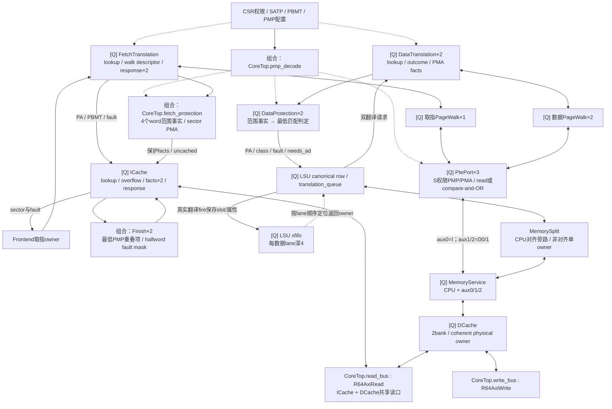

# 当前翻译、保护与取指 Cache 拓扑

依据 **2026-10-09 工作区生产 RTL** 核对。本文负责 `memory/` 目录的实际使用方、
翻译与保护 owner、页表物理服务及 ICache；[LSU 拓扑](../lsu/TOPOLOGY.md)负责
LSQ、转发、Split、Service 和 DCache，[前端拓扑](../frontend/TOPOLOGY.md)负责取指调度与返回归属，
[全核拓扑](../TOPOLOGY.md)负责系统连接。本次仅整理文档，未新增仿真或 PPA 结论。

## 1. 实际边界与生产参数

`memory/` 是源码目录，`R64CoreTop.memory` 是数据访存实例。ITLB、取指 walker 与
ICache 实际在 Frontend 内；共享 PMP decode 和取指保护事实准备在 CoreTop 内。
三个 walker 的物理 PTE 访问统一进入 Memory 中的 PtePort，再共享 CPU 的物理 DCache。

| 集成边界 | 当前取值 / 容量 | 对拓扑的影响 |
| --- | --- | --- |
| CoreTop → Frontend / ICache | `PREPARED_PROTECTION=1`；ICache `SET_W=6` | CoreTop 准备取指保护事实，ICache 保存事实并完成优先级判定；8 KiB、2-way、64 B line、16 B sector |
| Frontend → FetchTranslation | `DATA_PROTECTION=0`（默认） | 独立取指 lookup / walk descriptor / 两项响应，不能当作通用数据翻译器 |
| CoreTop → Memory | `HEAD_AUTHORIZED_QUERY=1`、`PREPARED_CANCEL=1` | 数据 LSU 使用 head 授权 query 与 ROB prepared cancel |
| Memory → Translation ×2 | `DATA_PROTECTION=1`、`RESERVED_TERMINAL=1` | 实际选择 `g_data.unit : R64DataTranslation`；通用147-bit overflow holder在此关闭 |
| Memory → DataProtection ×2 | `PMA_PREPARED=1`、`rsp_ready_i=1` | 复用翻译端 PMA 事实；LSU 从真实翻译 fire 起保留终端接收信用 |
| 三套 TLB / walker | ITLB×1、DTLB×2，各 TLB 默认16项，各 walker 单 owner | 双数据通道与取指通道独立翻译；不等于8个 xfifo owner同时做 page walk |
| Memory → PtePort / LoadStore | 3个PTE端口，`AUX=3`、`SRC_W=2`、LSQ20 | aux0=取指，aux1/2=数据lane0/1；不经过CPU LSQ/Split，当前没有Tensor客户端 |
| CoreTop → PmpDecode | 16组 PMP CSR 配置与地址 | 组合产生16组 active、56-bit lower/upper 与4-bit permission，供取指/数据/PTE共用 |

参数与接线真源：[CoreTop](../core/R64CoreTop.v)、[Frontend](../frontend/R64Frontend.v)、
[Memory](R64Memory.v)、[Translation](R64Translation.v)、[LoadStore](../lsu/R64LoadStore.v)。

### 1.1 文件职责与实际使用方

| 文件 | 生产实例 / 职责 |
| --- | --- |
| [R64Memory.v](R64Memory.v) | CoreTop.memory；连接两套数据翻译/保护、三个PTE端口与LoadStore，并导出完成、排空与reuse |
| [R64Translation.v](R64Translation.v)、[R64DataTranslation.v](R64DataTranslation.v) | 两套 `translation.g_data.unit`；前者选择实现，后者保存lookup/outcome、权限与walk上下文；`g_basic`只在兼容配置生效 |
| [R64FetchTranslation.v](R64FetchTranslation.v) | Frontend.u_translation；取指翻译专用owner与响应队列 |
| [R64Tlb.v](R64Tlb.v)、[R64PageWalk.v](R64PageWalk.v) | 各翻译实例下的 `u_tlb/u_walk`；VPN/ASID/page-size匹配、Sv39遍历与A/D比较更新 |
| [R64PmpDecode.v](R64PmpDecode.v) | CoreTop.pmp_decode；共享PMP范围/权限组合译码，无事务owner |
| [R64PmpCheck.v](R64PmpCheck.v) | 生产PtePort.protection；并行范围事实与最低重叠项判定；数据保护及prepared取指保护有各自分段实现 |
| [R64Pma.v](R64Pma.v)、[R64PmaRange.v](R64PmaRange.v) | PtePort.attributes及DataTranslation.outcome_attributes；按平台窗口检查完整地址范围与访问大小 |
| [R64DataProtection.v](R64DataProtection.v) | Memory.g_translation[0..1].protection；范围/权限事实Q，再做最低匹配优先级 |
| [R64FetchProtection.v](R64FetchProtection.v) | 同文件含4个声明。生产使用CoreTop的Prepare（内含FetchPma16）及ICache内Finish×2；legacy `R64FetchProtection`不在当前核心实例化 |
| [R64PtePort.v](R64PtePort.v) | Memory.g_pte[0..2].port；以S权限检查8 B PTE读/compare-and-OR，保留服务owner到真实终端 |
| [R64ICache.v](R64ICache.v) | Frontend.u_cache；物理sector lookup、保护事实持有、单refill owner、响应背压与invalidate poison |

## 2. 真实实例层级

```text
R64CoreTop
├─ pmp_decode : R64PmpDecode
├─ fetch_protection : R64FetchProtectionPrepare
│  └─ pma : R64FetchPma16
├─ frontend : R64Frontend
│  ├─ u_translation : R64FetchTranslation
│  │  ├─ u_tlb : R64Tlb
│  │  └─ u_walk : R64PageWalk
│  └─ u_cache : R64ICache
│     └─ g_protection_finish.g_slot[0..1].finish : R64FetchProtectionFinish
└─ memory : R64Memory
   ├─ g_translation[0..1]
   │  ├─ translation : R64Translation
   │  │  └─ g_data.unit : R64DataTranslation
   │  │     ├─ outcome_attributes : R64PmaRange
   │  │     ├─ u_tlb : R64Tlb
   │  │     └─ u_walk : R64PageWalk
   │  └─ protection : R64DataProtection
   ├─ g_pte[0..2].port : R64PtePort
   │  ├─ protection : R64PmpCheck
   │  └─ attributes : R64Pma
   │     └─ classify : R64PmaRange
   └─ unit : R64LoadStore
      ├─ lsu : R64Lsu
      ├─ split : R64MemorySplit
      ├─ service : R64MemoryService
      └─ cache : R64Dcache
```

这里列出目录相关的主实例与关键辅助实例；组合generate比较网络不单列为流水级。
`R64FetchProtection` legacy实现、`R64Translation.g_basic`以及DataTranslation通用overflow
不应与当前生产路径相加计数。

## 3. 请求、保护与物理服务网络

图中 [Q] 表示真实寄存状态，实线表示请求/结果，虚线表示配置、信用或取消影响。



PTE访问与普通CPU访问共享DCache，因而A/D compare-and-OR可观察同一份物理数据。
PtePort不会再经过CPU翻译，CPU侧也不能把PTE返回当作自己的LSQ结果；Service使用source+slot token
区分返回。ICache只共享AXI读适配器，不直接访问DCache的数据阵列。

## 4. 关键接收边界与信用

| 边界 | 建立owner / 实际接受 | 保持、信用与释放 |
| --- | --- | --- |
| LSU → 数据Translation | `tr_valid && tr_ready` | 同边沿写xfifo；LSU按响应lane的FIFO head关联slot与protection。kill后的已发翻译仍消费返回 |
| DataTranslation lookup → outcome | `lookup_fire_w` | lookup保存VA/SATP/有效权限，outcome保存页表/权限事实与walk身份；outcome忙时lookup保持 |
| 数据Translation → Protection | `raw_valid && raw_ready` | 当前Protection下游固定ready，reserved terminal保证无overflow；断言检查每次protected valid都有LSU owner及相同access/size |
| Protection → LSU | `protected_valid`与已预约终端信用 | 完整PA/last、PMP、PMA/PBMT和翻译fault均属于同一owner；正常结果更新canonical row，fault后续进入LSU完成通道 |
| Frontend → FetchTranslation | `req_valid && req_ready` | `reserved_q<3`与lookup/walk/response的Q状态控制接收；两项response队列不代表两个walker |
| FetchTranslation → ICache | 翻译响应与cache请求共同fire | ICache保存75-bit请求payload及130-bit保护facts；空overflow信用不借本拍hit/ready，facts固定槽跟随lookup/overflow身份 |
| PageWalk → PtePort | `req_valid && req_ready` | IDLE可预写payload，真实fire进入SEND或FAULT；SEND/WAIT/FAULT冻结该owner |
| PtePort → Service → DCache | 每级真实VALID/READY | Service添加source；拒绝的PTE本地返回error；已接受物理请求不可因CPU redirect清除 |
| ICache → AXI read | command真实握手，随后逐beat握手 | 单refill owner保持到真实R终端；cached line为8个64-bit beat，uncached sector为2个beat；响应背压独立持有 |

数据有效权限由 `MPRV ? MPP : privilege` 的生产条件确定：仅当前M模式且MPRV=1时使用MPP。
Sv39且有效权限非M时启用数据翻译；非对齐跨页检查使用同一有效翻译资格。
普通store可先以 `ad_update=0` 探测PA/权限，需A/D更新时待ROB head和effect_allow授权后重走；
提前计算或准备不产生提交授权。

## 5. 失效、权限与外部排空

TLB按VPN、ASID、global、page-size和NAPOT等字段匹配。fill会处理重叠条目；SFENCE选择性失效保持
vaddr/asid/global语义。空项使用并行前缀选择，全满仍按next替换。PMP依据最低重叠条目决定权限，
部分覆盖仍拒绝；PMA检查完整访问范围及实际平台窗口，不能以首字节命中代替完整访问检查。

PageWalk使用IDLE→READ→CHECK→UPDATE/UPDATED→RESULT。A/D更新携带expected PTE与OR mask，
compare失败从根重读；PTE物理错误、权限错误和页表格式错误按原owner形成对应fault。
TLB invalidate会poison旧翻译上下文、阻止旧walk结果fill，已经接受的walk/PTE请求仍完成排空。
数据Translation的 `req_poison_i` 在Memory中固定为0，数据ROB kill由LSU保留owner并丢弃返回处理；
Translation/PtePort没有借kill即时撤销物理事务的接口。

取指redirect的响应归属由Frontend管理，ICache没有redirect或ROB kill端口。
当前ICache invalidate来自Serial的FENCE.I等控制或DMA通知；数据Memory的cache invalidate来自DMA，
TLB invalidate是另一组独立信号。ICache invalidate清tag有效并poison在途填充；旧AXI响应仍必须接收，
不能由取消lookup推断总线事务也消失。

`Memory.idle_o` 汇总完整LSU owner、Split/Service/Cache及三个PtePort idle；
`drain_idle_o` 改用LSU的已绑定工作排空状态，并汇总相同物理服务。
CoreTop把后者接到Serial的memory_idle，避免年轻未绑定reservation阻塞head Serial。
ROB reuse与成功store不可逆状态来自LSU；它们的释放边界见[LSU控制网络](../lsu/TOPOLOGY.md)。

## 6. 当前设计单元与状态 owner

以下保留 MEM-01～07 稳定ID；容量与字段是源码事实，不代表固定延迟或独立面积。
LSU/Split/Service/DCache的状态在[LSU-01～12](../lsu/TOPOLOGY.md)定义，避免重复计算。

| ID / 源码 | 状态与容量 | 同拍/跨拍、信用与取消边界 | 已知量与 UNKNOWN |
| --- | --- | --- | --- |
| MEM-01 数据翻译；`R64Memory.v`、`R64Translation.v`、`R64DataTranslation.v` | 实际2套 DataTranslation，每套1个 lookup owner+1个 outcome owner（FACTS/WAIT_WALK/RETURN）；VA64、root44、ASID16、PA64、last65 等；outcome 保存 walk 身份。 | lookup Q→TLB/权限事实组合→outcome Q→保护。集成明确 `DATA_PROTECTION=1, RESERVED_TERMINAL=1`；通用模块的147位 overflow holder在此被常量关闭。LSU发翻译时预留终端信用，不能额外计一个 overflow 容量。invalidate poison后排空已有 walk，LSU按原 owner接收返回。 | 2套通道与边界已知；裸地址/TLB命中/miss各延迟和等待分布 UNKNOWN。xfifo深4并不提供4个独立 walker。 |
| MEM-02 TLB；`R64Tlb.v` | 当前 ITLB及两套DTLB各16项；每项VPN27/PPN44/ASID16/level2/PBMT2/flags8及valid/global/NAPOT；next替换指针4位。 | lookup 是从已保存上下文到并行匹配/one-hot合并的组合网络；fill与SFENCE在时钟边沿更新。重叠项和ASID/global约束继续生效，不能用多个命中OR当作多级页表投机。 | 项数、比较字段已知；工作集命中率、冲突率、fill/SFENCE频度、TLB局部关键弧 UNKNOWN。 |
| MEM-03 PageWalk；`R64PageWalk.v` | 取指1套+数据2套，每套1个 state3 owner；VA39、PTE64、root44、PTE地址/PA各56、level2等。IDLE→READ→CHECK→UPDATE/UPDATED→RESULT。 | 物理PTE请求经 MEM-06/LSU-11/12；在途请求先真实返回再推进。A/D更新用expected64+ORmask64比较更新，失败重读；数据store A/D授权不能在投机准备时提前取得。 | 3套单owner walker 已知；页表级数分布、A/D重试和CPU/PTW互相阻塞周期 UNKNOWN。 |
| MEM-04 数据保护；`R64DataProtection.v`、`R64PmpDecode.v`、`R64PmaRange.v` | 2套，每套1个valid holder；PA64、class2、cause5、protection4、overlap16/deny16及资格位；共享16组PMP range/permission来自CSR。 | PA/last范围事实组合→事实Q→最低匹配优先级组合。核心选 `PMA_PREPARED=1`，下游 `rsp_ready=1` 依据LSU预留owner信用。权限/完整范围/跨窗错误与数据在同一 owner上，不能脱离上下文单独提前valid。 | 16项PMP范围与一组事实Q已知；保护命中分布、PMP/PMA各自关键路径、独立面积 UNKNOWN。 |
| MEM-05 取指翻译与保护；`R64FetchTranslation.v`、`R64FetchProtection.v` | 1个lookup、1个待启动/在途walk descriptor，2×75bit响应与reserved/count；CoreTop组合准备4个word的130-bit保护事实，由MEM-07的ICache两槽Q保持后由Finish判定，facts不重复计容量。 | 接受前预约响应位置，walk与lookup可有不同owner；redirect/poison处理沿原owner，真实PTE请求需drain。上下文变化不能复用旧权限结果；不把两响应槽解释为两路并行walk。 | owner/响应容量已知；redirect丢弃比例、ITLB miss前端停顿、翻译与取指重叠程度 UNKNOWN。 |
| MEM-06 coherent PTE port；`R64PtePort.v` | 3套各1个owner；state2（IDLE/SEND/WAIT/FAULT）、address56、expected64、mask64、compare/cache位。 | IDLE可预写payload；真实req fire后冻结，PMP/PMA/对齐错误进入FAULT；否则经Service/Cached CAS后原请求者实际接受才释放。无branch kill端口，不能对已接受物理访问直接清owner。 | 3个端口、每端口1个live事务；各路等待、错误及compare失败计数 UNKNOWN。 |
| MEM-07 ICache；`R64ICache.v` | 8KiB/2way/64Bline，64set；每way256×128数据+64×52tag；lookup Q、response Q、单 refill FSM与128bit fill result，另1项75-bit overflow及2×130-bit保护事实槽。 | 16B sector lookup提前同步读tag/data；SEND→FILL真R接受更新，8×64bit line refill；uncached取指2×64bit。invalidate/poison与响应owner关联，不能取消已发AXI。寄存槽为同一owner的不同阶段/缓冲，不能简单相加为独立miss容量。 | 容量与单 refill owner已知；hit latency分布、供给空泡、预取有效率（当前无对应测量）、独立STA/PPA UNKNOWN。 |

## 7. 现有验证入口与观察边界

| 边界 | 现有用例 | 用途 |
| --- | --- | --- |
| TLB / walk | [tb_r64_tlb](../../testbench/chengyue64/modules/tb_r64_tlb.sv)、[tb_r64_pagewalk](../../testbench/chengyue64/modules/tb_r64_pagewalk.sv) | 页大小、ASID/global、失效、walk权限与A/D |
| 数据翻译 / poison | [tb_r64_translation](../../testbench/chengyue64/modules/tb_r64_translation.sv)、[tb_r64_translation_equiv](../../testbench/chengyue64/modules/tb_r64_translation_equiv.sv)、[tb_r64_translation_poison](../../testbench/chengyue64/modules/tb_r64_translation_poison.sv) | 通用/数据配置、分段等价与失效后返回 |
| 取指翻译 / 保护owner | [tb_r64_fetch_translation](../../testbench/chengyue64/modules/tb_r64_fetch_translation.sv)、[tb_r64_fetch_translation_owners](../../testbench/chengyue64/modules/tb_r64_fetch_translation_owners.sv)、[tb_r64_fetch_protection_owner](../../testbench/chengyue64/modules/tb_r64_fetch_protection_owner.sv) | lookup/walk/响应归属，ICache facts固定槽持有 |
| PMP/PMA / PTE | [tb_r64_protection](../../testbench/chengyue64/modules/tb_r64_protection.sv)、[tb_r64_pte_port](../../testbench/chengyue64/modules/tb_r64_pte_port.sv) | 完整范围、最低匹配、S权限和错误终端 |
| ICache / coherent服务 | [tb_r64_icache](../../testbench/chengyue64/modules/tb_r64_icache.sv)、[tb_r64_lsu_memory](../../testbench/chengyue64/modules/tb_r64_lsu_memory.sv)、[tb_r64_memory_service](../../testbench/chengyue64/modules/tb_r64_memory_service.sv) | refill/背压/失效，以及PTE与CPU共享物理服务 |

运行方式见[验证平台](../../testbench/chengyue64/README.md)；这些是现有用例入口，本次没有重跑。
TLB miss率、page-walk重试分布、CPU/PTW仲裁等待、ICache供给空泡和各单元独立面积仍需对应配置测量。
结构检查与文档链接检查不能代替动态功能、DiffTest、综合或STA。

## 8. 历史结构取舍与测量

- 早期整核STA曾定位到DCache `bank10_q[255][56]` 写数据512扇出。当前已采用每bank一拍pending write、
  每32行payload副本与同址逐byte转发；该结构及R/B冲突边界统一见[LSU缓存拓扑](../lsu/TOPOLOGY.md)。
  等待B期间锁住整个refill bank的候选曾因阻碍独立load进度而撤回，不属于当前设计。
- [2026-10-08 基线B物理对照](../../results/ai-cq-timing-20261008/PHYSICAL-COMPARISON.md)保存整核周期与
  布局前STA，未拆出MEM-01～07的独立周期损失或面积。本页2026-10-09更新只核对源码与文档。
