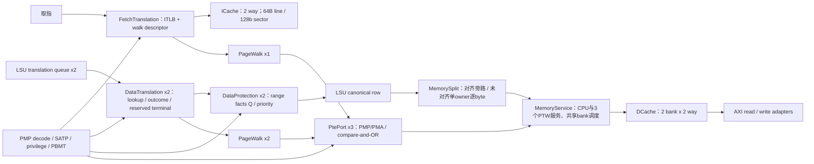

# 翻译、保护、Cache 与 LSU 服务网络

| 文件 | 物理状态/组合边与本轮选择 |
|---|---|
| R64Memory.v | 两路 D translation/protection 与三个 PTE port；LSU 在实际翻译 fire 时预约响应，因此保护末级有既定信用。保持绑定。 |
| R64Tlb.v | 16 项，VPN/ASID/global/page-size 匹配后 one-hot 合并 PA/flags。空项选择改为并行前缀；全满仍按原 next 替换；overlap/SFENCE 优先级不变。 |
| R64PageWalk.v | IDLE→READ→CHECK→UPDATE/UPDATED→RESULT；A/D 比较失败从根重读。保留当前结构，不放宽权限、失配重启或投机 store 的 A/D 授权。 |
| R64Translation.v | 生产数据支路选择 R64DataTranslation；通用兼容支路仍有独立测试。 |
| R64DataTranslation.v | lookup/outcome/terminal 分离，walk 期间 owner 保持，invalidate poison 排空，成功结果再形成 PA/last/PMA。保持。 |
| R64FetchTranslation.v | 一个 lookup、一个待启动/在途 walk、两个响应 owner，walk descriptor 在空闲时提前准备。保持。 |
| R64PmpDecode.v | CSR 的16组配置形成共享 range/permission；TOR/NAPOT 边界和 locked 规则保持。 |
| R64PmpCheck.v | 所有范围并行比对，最低重叠项决定；部分重叠仍报错。保持。 |
| R64Pma.v、R64PmaRange.v | 对完整地址范围检查实际平台窗口与 MMIO 大小限制；保持。 |
| R64FetchProtection.v | sector 内四个 word 的事实预计算→owner Q→短优先级；R64FetchPma16 为固定16B访问消除动态长加法。保持。 |
| R64DataProtection.v | PA/last 对范围形成事实Q→最低匹配；保留现有空闲槽 payload 预写与独立 valid。 |
| R64PtePort.v | 在 IDLE 预写地址、expected、OR mask 和属性；状态转移单独授权请求；SEND/WAIT/FAULT 冻结。 |
| R64ICache.v | lookup 可离开时提前读两 way 的 tag/data，取消宽输入对最终 dispatch fire 的依赖。公开 response 在复位/无效周期的原值保持；不能用修改测试掩盖变化。 |

LSU 的20项 canonical owner、转发 query、pin、完成/取消网络见 [LSU 拓扑](../lsu/TOPOLOGY.md)。MemorySplit 负责未对齐片段与序列，MemoryService 汇合三个 coherent PTE 请求和 CPU 物理请求；特殊操作仍受原排空与独占条件约束。

整机 STA 的写 bank 瓶颈对应 R64Dcache.bank10_q[255][56]，基线 D 输入由 data_write_value_w[1][56] 驱动，扇出512。当前实现已有每 bank 一拍 pending write；查询按 index/way/mask 转发 pending data，保持原命中和安装时机。每32行保存独立写数据副本，降低局部扇出。原 R/B 冲突握手不变；不采用“B 未完成就锁住 refill bank”的方案，该方案破坏独立 load 进度，已由原测试否决。

## 2026-10-08 当前设计单元索引

ID 对应实际状态 owner 与寄存边界，不假定每个文件都是一级流水。宽度列出关键字段；
结构容量与最小组合/寄存距离是 RTL 事实，程序中的延迟分布、吞吐利用率和独立 PPA 若未测量则标为 UNKNOWN。
LSU、Split、Service、Dcache 的实际单元在 [LSU-01～12](../lsu/TOPOLOGY.md) 中定义，避免同一状态被重复计算。

| ID / 源码 | 状态与容量 | 同拍/跨拍、信用与取消边界 | 已知量与 UNKNOWN |
| --- | --- | --- | --- |
| MEM-01 数据翻译；`R64Memory.v`、`R64Translation.v`、`R64DataTranslation.v` | 实际2套 DataTranslation，每套1个 lookup owner+1个 outcome owner（FACTS/WAIT_WALK/RETURN）；VA64、root44、ASID16、PA64、last65 等；outcome 保存 walk 身份。 | lookup Q→TLB/权限事实组合→outcome Q→保护。集成明确 `DATA_PROTECTION=1, RESERVED_TERMINAL=1`；通用模块的147位 overflow holder在此被常量关闭。LSU发翻译时预留终端信用，不能额外计一个 overflow 容量。invalidate poison后排空已有 walk，LSU按原 owner接收返回。 | 2套通道与边界已知；裸地址/TLB命中/miss各延迟和等待分布 UNKNOWN。xfifo深4并不提供4个独立 walker。 |
| MEM-02 TLB；`R64Tlb.v` | 当前 ITLB及两套DTLB各16项；每项VPN27/PPN44/ASID16/level2/PBMT2/flags8及valid/global/NAPOT；next替换指针4位。 | lookup 是从已保存上下文到并行匹配/one-hot合并的组合网络；fill与SFENCE在时钟边沿更新。重叠项和ASID/global约束继续生效，不能用多个命中OR当作多级页表投机。 | 项数、比较字段已知；工作集命中率、冲突率、fill/SFENCE频度、TLB局部关键弧 UNKNOWN。 |
| MEM-03 PageWalk；`R64PageWalk.v` | 取指1套+数据2套，每套1个 state3 owner；VA39、PTE64、root44、PTE地址/PA各56、level2等。IDLE→READ→CHECK→UPDATE/UPDATED→RESULT。 | 物理PTE请求经 MEM-06/LSU-11/12；在途请求先真实返回再推进。A/D更新用expected64+ORmask64比较更新，失败重读；数据store A/D授权不能在投机准备时提前取得。 | 3套单owner walker 已知；页表级数分布、A/D重试和CPU/PTW互相阻塞周期 UNKNOWN。 |
| MEM-04 数据保护；`R64DataProtection.v`、`R64PmpDecode.v`、`R64PmpCheck.v`、`R64Pma*.v` | 2套，每套1个valid holder；PA64、class2、cause5、protection4、overlap16/deny16及资格位；共享16组PMP range/permission来自CSR。 | PA/last范围事实组合→事实Q→最低匹配优先级组合。核心选 `PMA_PREPARED=1`，后端 `rsp_ready=1` 来源于LSU预留 owner信用。权限/完整范围/跨窗错误与数据在同一 owner上，不能脱离上下文单独提前valid。 | 16项PMP范围与一组事实Q已知；保护命中分布、PMP/PMA各自关键路径、独立面积 UNKNOWN。 |
| MEM-05 取指翻译与保护；`R64FetchTranslation.v`、`R64FetchProtection.v` | 1个 lookup、1个待启动/在途 walk descriptor，2×75bit响应记录与reserved/count；16B sector保护准备4个word事实。 | 接受前预约响应位置，walk与lookup可有不同owner；redirect/poison处理沿原owner，真实PTE请求需drain。上下文变化不能复用旧权限结果；不把两响应槽解释为两路并行walk。 | owner/响应容量已知；redirect丢弃比例、ITLB miss前端停顿、翻译与取指重叠程度 UNKNOWN。 |
| MEM-06 coherent PTE port；`R64PtePort.v` | 3套各1个owner；state2（IDLE/SEND/WAIT/FAULT）、address56、expected64、mask64、compare/cache位。 | IDLE可预写payload；真实req fire后冻结，PMP/PMA/对齐错误进入FAULT；否则经Service/Cached CAS后原请求者实际接受才释放。无branch kill端口，不能对已接受物理访问直接清owner。 | 3个端口、每端口1个live事务；各路等待、错误及compare失败计数 UNKNOWN。 |
| MEM-07 ICache；`R64ICache.v` | 8KiB/2way/64Bline，64set；每way256×128数据+64×52tag；lookup Q、response Q、单 refill FSM与128bit fill result，另overflow/保护事实寄存槽。 | 16B sector lookup提前同步读tag/data；SEND→FILL真R接受更新，8×64bit line refill；uncached取指2×64bit。invalidate/poison与响应owner关联，不能取消已发AXI。寄存槽为同一owner的不同阶段/缓冲，不能简单相加为独立miss容量。 | 容量与单 refill owner已知；hit latency分布、供给空泡、预取有效率（当前无对应测量）、独立STA/PPA UNKNOWN。 |

以上状态使用时钟上升沿同步更新；复位有效抑制新请求、清有效状态。不能把同步 D 路径自动归为异步 reset-pin
recovery/removal 检查，也不能用正常模式排除 reset 来屏蔽 runtime invalidate、flush 或权限变化。
当前已有事实Q、空闲payload预写、terminal信用预约、cache pending write；架构提案须引用对应 ID 的现有边界，
明确改变的 owner/信用/容量/拍数，不能将这些已有结构列为新增收益。

本页没有新运行仿真/综合。历史“本轮”“整合实验”段落是原实验说明；当前结构以本表与所链接生产 RTL 为准。
整核周期和布局前STA见 [第二轮基线 B 对照](../../results/ai-cq-timing-20261008/PHYSICAL-COMPARISON.md)，
它们没有拆出 MEM-01～07 的独立周期损失或面积，不能按模块图估算为测量值。
