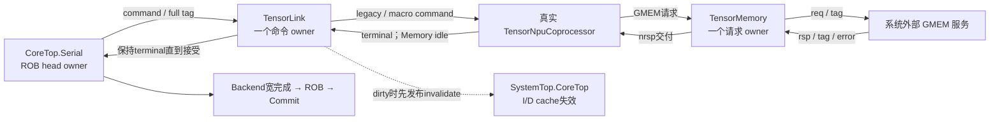

# 当前平台目录与系统接入

依据 **2026-10-09 生产 RTL** 整理。默认系统是 `R64SystemTop`，可选 Tensor 系统是
`R64TensorSystemTop`。本目录包含系统装配、AXI Fabric、设备桥和 Tensor 边界；
[BUS 拓扑](../bus/TOPOLOGY.md)是地址图、读写 owner、信用及设备副作用的详细真源，
本页负责文件归属、系统层级和可选接入，避免重复维护同一张地址表。

## 1. 源码与生产范围

| 文件 | 职责 | 默认 / 可选 |
| --- | --- | --- |
| [R64SystemTop.v](R64SystemTop.v) | CoreTop 与 AxiPlatform，连接 AXI、time/IRQ、trace、syscon 和 Tensor command/terminal 引脚 | 默认系统顶层 |
| [R64AxiPlatform.v](R64AxiPlatform.v) | Fabric、CLINT、PLIC、UART、RTC、syscon、错误端点及四组 ext 接线 | 默认系统 |
| [R64PlatformMap.vh](R64PlatformMap.vh) | 16 端口编号、BASE/MASK、memory/executable 属性与真实内存读组掩码 | 平台地址真源；基础宏来自 include/define.v |
| [R64AxiFabric.v](R64AxiFabric.v) | AXI4 burst 转真实单拍访问，保持 ID/拍数/错误与返回次序 | 默认系统 |
| [R64AxiReadService.v](R64AxiReadService.v) | 两读服务组的 plan/launch/return；共享 Fabric 事务表 | Fabric 子实例 |
| [R64AxiRegisterPort.v](R64AxiRegisterPort.v)、[R64AxiRtc.v](R64AxiRtc.v) | 分别捕获读/AW/W 并产生本地访问；RTC 时间/闹钟及 IRQ | 当前寄存器桥仅用于 RTC |
| [R64TensorMemory.v](R64TensorMemory.v) | 一个带完整 CPU tag 的 GMEM 请求/响应 owner；原始低字节窗口数据 | 列入默认 filelist，但默认 SystemTop 未实例化 |
| [R64TensorLink.v](R64TensorLink.v) | 单条 Serial owner 的 command/terminal、描述符、真实 NPU 与 GMEM 桥、DMA 失效发布 | 可选 Tensor |
| [R64TensorSystemTop.v](R64TensorSystemTop.v) | SystemTop + TensorLink，并额外导出独立 GMEM 接口 | 可选系统顶层 |

默认清单见 [filelist.mk](../filelist.mk)；[tensor-filelist.mk](../tensor-filelist.mk)补充
TensorLink、TensorSystemTop 和实际 NPU 数值模块。清单包含某个 module 不代表默认系统有该实例。
仿真封装、DPI 和外部内存模型位于 [sim](../../sim/README.md)，不属于这里的可综合实例。

## 2. 实际系统层级与接口

```text
R64SystemTop
├─ core : R64CoreTop
│  ├─ read_bus : R64AxiRead
│  ├─ write_bus : R64AxiWrite
│  └─ frontend / backend / fp / serial / commit / csr / memory / protection
└─ platform : R64AxiPlatform
   ├─ fabric : R64AxiFabric
   │  └─ gen_read_service[0..1].group : R64AxiReadService
   ├─ clint / plic / syscon / uart：bus/ 目录的真实外设
   ├─ rtc : R64AxiRtc → port : R64AxiRegisterPort
   └─ g_external 接线 / g_unimplemented[].g_error.error

R64TensorSystemTop（可选）
├─ system : R64SystemTop（以上同一层级）
└─ tensor : R64TensorLink
   ├─ u_memory : R64TensorMemory
   └─ u_npu : TensorNpuCoprocessor（npu/version_0820）
```

上树的 CPU 内部行是职责缩略，完整实例见各域拓扑；没有名为 `protection` 的统一封装。
核侧读写为4-bit ID、64-bit地址/数据、8-bit LEN；CPU 必须接收真实 RID/RLAST/BID。

| 平台边界 | 当前接口 / 归属 |
| --- | --- |
| CoreTop ↔ AxiPlatform | 一组 AR/R 及 AW/W/B；4 个读事务槽、2 个写事务槽属于 Fabric，上游核实际只使用两个读 ID 和一个写 ID |
| ext[0..3] ↔ 外部端点 | `EXTERNAL_SLAVE_MAP` 固定为 PSRAM(11)、SDRAM(13)、legacy MMIO(12)、virtio(4)；四组64-bit单拍接口 |
| Platform → CoreTop | CLINT time/software/timer IRQ、PLIC M/S external IRQ、timer_wait；这些是旁带状态，独立于 R/B |
| UART / syscon → 系统边界 | UART TX 在 Platform 再寄存一次发布；syscon 等设备本地 B 接受后产生事件；这两者不是退休日志 |
| CoreTop → trace/trap | 退休与 trap 观察引脚；`trace_ready_i` 可反压退休，不改变已接受外部事务的责任 |
| SystemTop Tensor 引脚 | Serial command/terminal 与 dma_invalidate；默认系统将引脚交给接入者，可选 TensorSystemTop 连接真实 TensorLink |

地址窗和错误端点清单见 [BUS 第6节](../bus/TOPOLOGY.md)。memory 属性位不意味着端点已实现；
MROM/flash/chiplink memory 仍可能是错误端点。Fabric 将合法 burst 展开为 LEN+1 个真实单拍事务，
返回全部 R 拍或聚合子写错误后的一个 B；当前 CPU 写入为单拍 write-through，没有多拍 cache writeback。

## 3. 可选 Tensor 的事务生命周期



GMEM 是独立请求/响应接口，不经过当前 CPU Fabric，也不是第二个 AXI master。TensorSystemTop
要求外部集成者为 GMEM 和 ext 内存提供一致的物理存储视图；RTL 顶层本身没有把两组端口接成共享 RAM。
请求数据是地址起始的低字节窗口，不能按 AXI lane-positioned 数据解释。

| 状态 owner | 容量与关键字段 | 接收 / 释放边界 |
| --- | --- | --- |
| TensorLink 命令 | 一个 owner；full tag9、command64、operand64、pair、class8、结果错误及 dirty | `cmd_valid_i && cmd_ready_o` 在 IDLE 捕获；CHECK 后配置命令可直接终结，执行命令经 LEGACY/MACRO → WAIT_NPU |
| TensorLink 描述符 | 30×64-bit descriptor、EMPTY/BUILD/RESIDENT/POISON、expected6 | 按顺序配置后才 RESIDENT；macro 完成后清状态。它是配置数据，不是30个在途命令 |
| TensorMemory | 一个 owner；tag9、addr64、data64、strb8、write/error | IDLE 接 nreq → SEND 持有 req → WAIT 接 rsp → RESULT 持有 nrsp；NPU 接收 nrsp 后才释放 |
| TensorLink 终端 | 继续使用同一命令 tag/error/code | NPU terminal 仅在 WAIT_NPU 且 Memory idle 时接受，并校验身份；有写入则 INVALIDATE 一拍后 TERMINAL，直到 Serial 接收 |
| NPU local memory | `LMEM_BYTES=4096`（Link 默认） | 由实际 NPU 管理；不能把桥的一个 GMEM owner 等同于全部内部数值流水容量 |

Serial 在发出 Tensor command 前等待 Memory 的 `drain_idle_o`；命令发出后由 Link/NPU 排空其 GMEM 请求。
`write_admitted_o` 在 NPU 写请求被 TensorMemory 接收且 strb 非零时置 dirty；
INVALIDATE 是 I/D cache 失效发布脉冲，没有 cache-ack 握手，也不触发 TLB 失效。
Link 交付 terminal 不等于 CPU 已退休：成功 terminal 后，Serial 保持不可撤销状态直到退休；
错误 terminal 进入带异常的宽完成（cause 24），外部 owner 排空后由 Commit 精确处理。

桥没有 branch kill/full_flush 端口。已开始的 GMEM 请求必须等待真实响应；错误 tag 会设置协议错误，
在启用 `R64_ASSERT` 时触发断言。全系统 reset 与运行时指令取消不能混用。
当前接入关闭可选 host portals/functional DPI 路径，算术由真实 NPU 执行。

## 4. 复位、背压与设备副作用

Platform 用寄存的 `device_reset_q` 分发设备复位；Fabric 同时隔离复位断言和恢复边界上的
物理请求/响应。syscon 还接收 `rst_i || device_reset_q`，UART 字节发布状态在两者任一有效时清除。
CPU 的 redirect/full_flush 不复位 Fabric；已经接受的 AR/AW/W 继续排空。

读与 AW/W 可以独立反压，设备本地副作用具有各自时刻：PLIC 在捕获 claim 选择后执行 gateway 更新，
RTC TIME_LOW 本地读取时快照 HIGH，UART 读取可弹出 FIFO，syscon 事件等待本地 B 接受。
[BUS 拓扑](../bus/TOPOLOGY.md)记录这些边沿，不能用“收到地址”或“CPU 退休”统一替代。

仿真中的 virtio/设备模型行为见 [sim/README](../../sim/README.md)；
当前系统回归的 ext 端点由 C++ 模型响应，不是旧 `AxiDpiSlave.sv` 实例。
旧单拍 DPI 模型对 WSTRB 的限制不能直接当作当前 Fabric 或当前宿主的能力说明。

## 5. 验证入口与范围

- [tb_r64_fabric](../../testbench/chengyue64/modules/tb_r64_fabric.sv)、
  [tb_r64_fabric_devices](../../testbench/chengyue64/modules/tb_r64_fabric_devices.sv)：
  Fabric 协议/错误/设备访问，更多分组和续拍用例见 BUS。
- [tb_r64_platform_reset](../../testbench/chengyue64/modules/tb_r64_platform_reset.sv)、
  [tb_r64_rtc](../../testbench/chengyue64/modules/tb_r64_rtc.sv)：平台发布/复位与 RTC 状态。
- [tb_r64_tensor_memory](../../testbench/chengyue64/modules/tb_r64_tensor_memory.sv)、
  [tb_r64_tensor](../../testbench/chengyue64/modules/tb_r64_tensor.sv)、
  [整核 Tensor 程序](../../testbench/chengyue64/programs/r64_core_tensor.S)：
  GMEM owner、真实 NPU 接入与完整系统程序；Makefile 另有错误响应 tag 的负向入口。

构建、`core-test`、`tensor-test` 和测试身份见[验证平台](../../testbench/chengyue64/README.md)。
本次仅更新文档，没有重跑上述用例；局部协议验证不代表完整 NPU 工作负载、系统或 PPA 通过。

## 6. 早期切片记录（历史）

以下保留原文的早期 Fabric 切片统计；它们不是 2026-10-09 当前源码的新测量。
旧 NpcAxiBus/AxiCrossbar 的比较对象也不是当前生产实例。

`tb_r64_fabric.sv` 固定 LFSR seed `0x514aa731`，随机独立 master/slave 反压，验证外部输入到输出隔离、所有 payload hold、逐 ID 和逐拍数据/错误、写地址和 W 归属，以及拒绝请求零设备副作用：

- 96 个读事务、336 个 R 拍；64 个写事务、227 个 W 拍。
- 合法请求实际产生 184 个 Lite 读和 133 个 Lite 写；非法请求数量与响应分别计入上游，绝不伪称设备完成。
- 855 周期；271 次 RID 切换；91 周期读/写出口重叠；最多 6 个 live owner；AW 先到 96 次、W 先到 83 次（同拍两项都计入）。
- R 反压 100 周期、W 入口反压 413 周期。
- `+bad-last` 非零退出且精确触发 “fabric WLAST disagrees with accepted AWLEN”。
- Verilator `--lint-only -Wall -DR64_ASSERT` 无警告。

`tb_r64_fabric_devices.sv` 实例化真实 `bus/AxiClint.v`，验证 64-bit mtimecmp 写后读、32-bit 高/低字 lane、MSIP、被禁止 fetch/burst 无副作用。10 个读请求、6 个写请求中实际外设读 7 次、写 5 次，全部通过。因此旧 AM “CLINT 64 位写后 LD 0”没有在这条新 fabric + 原 CLINT 的完整握手边界复现；不能据旧症状断言 CLINT 存储坏了。CLINT 源码仍忽略 ARSIZE/AWSIZE 并将未知 offset 读零返回 OKAY，外设访问合法性需由完整平台测试判断。

原记录给出的日志路径（未作为本次复验入口）：`build/rebuild/platform/fabric.log`、`bad-last.log`、`devices.log`。这些是 fabric/外设边界证据，不是完整核心/ISA/PPA PASS。

按同样 64-bit address、16 endpoints 静态数源码有效字段（不包括断言）：
旧 crossbar 地址字段 34×64=2176 bit（16 read +16 write +2 AW 入口），新 fabric 地址字段 8×64=512 bit（4 read +2 write +2 入口）。
旧 data 字段 20×64=1280 bit（16 write +2 W 入口 +2 R 完成），新 data 字段 4×64=256 bit（2 W FIFO +2 R FIFO）。
这只是宽状态复杂度减少，不是映射面积结果；旧核仅支持 single beat，新 fabric 支持实际 burst，两者功能身份不同，不能把周期直接当成 A/B CPI 收益。该早期切片没有综合/STA 证据，也未证明 2 ns 时序；后续整核测量应从当前架构/发布入口读取。上述位数和周期不能作为当前集成版本的新结论。
